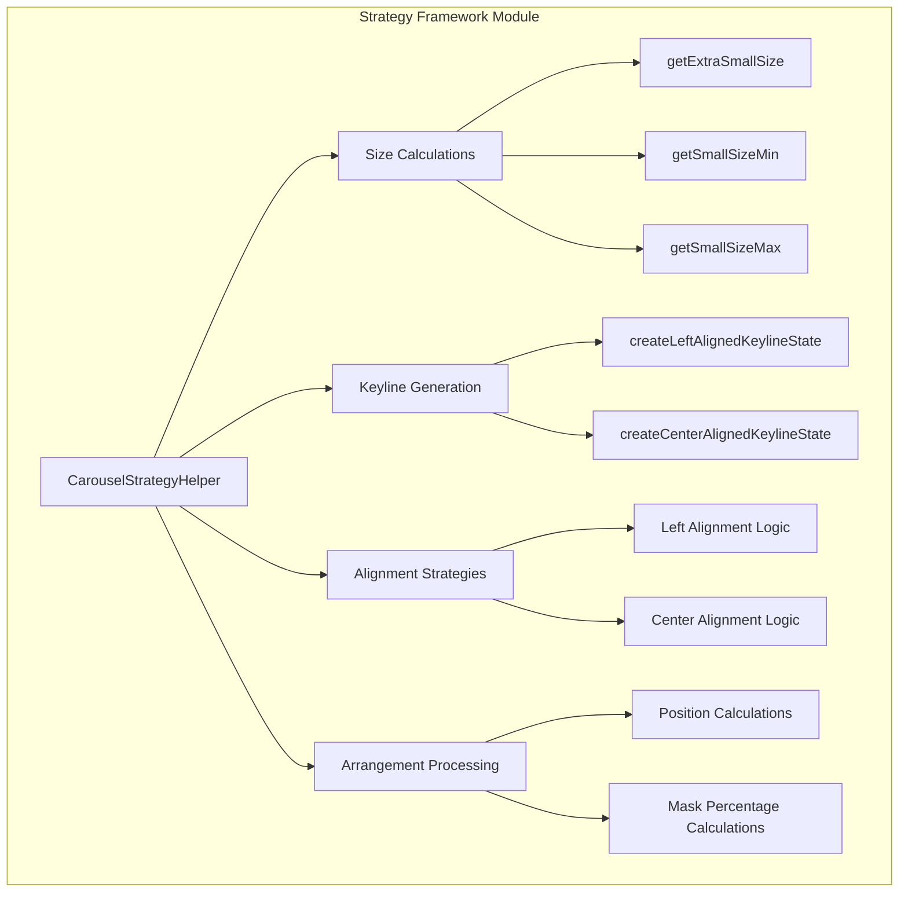
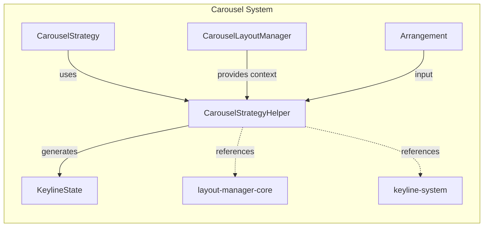
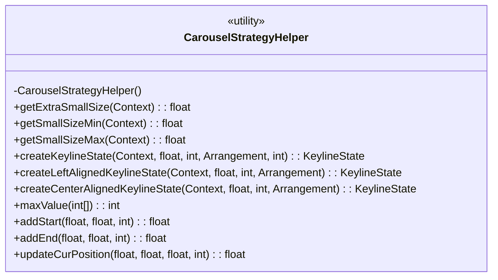
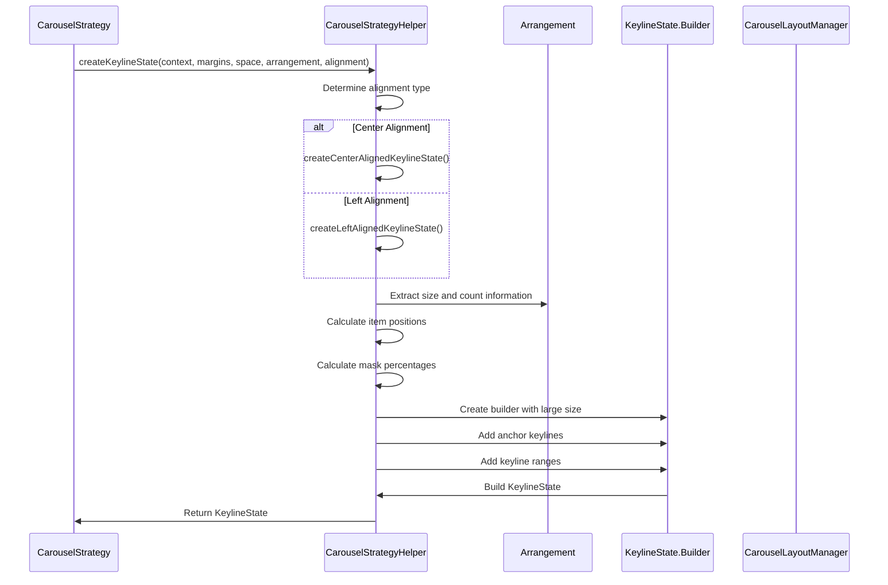
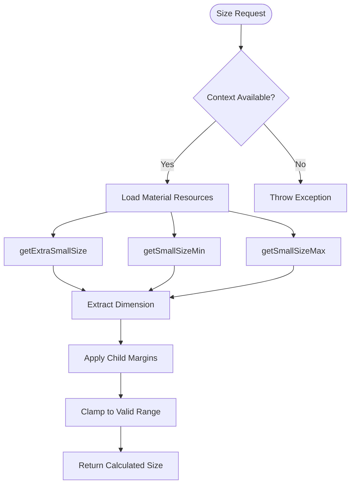
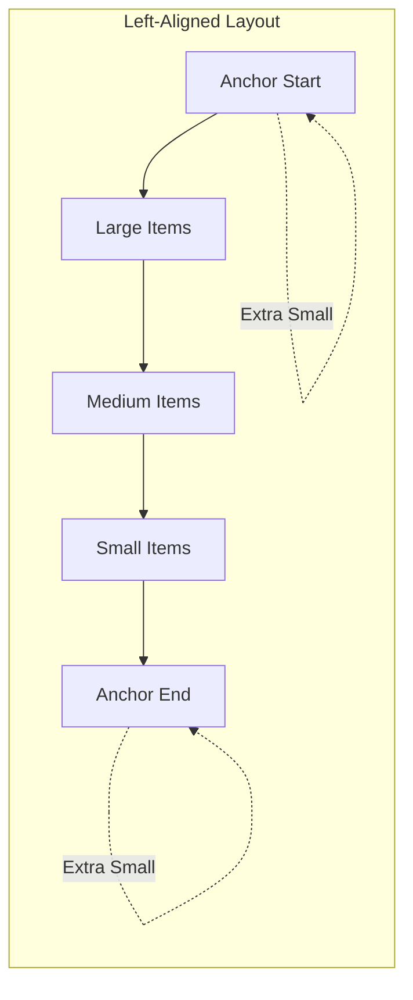
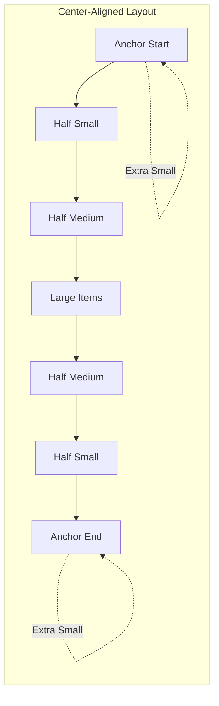
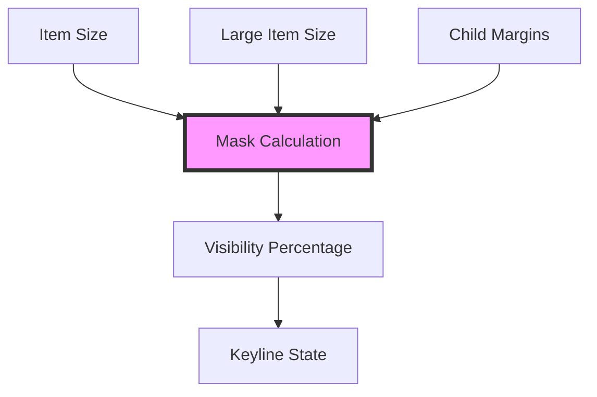
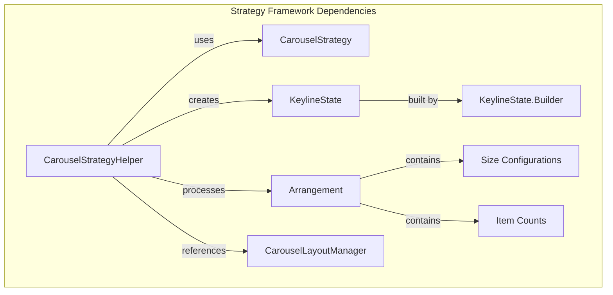

# Strategy Framework Module Documentation

## Introduction

The strategy-framework module is a core component of the Material Design Carousel system that provides mathematical and algorithmic utilities for calculating item positioning, sizing, and layout arrangements. This module serves as the computational engine behind carousel layouts, handling complex keyline calculations and arrangement strategies that enable smooth, responsive carousel experiences.

## Module Overview

The strategy-framework module contains the `CarouselStrategyHelper` class, which provides essential utility methods for implementing carousel strategies. It acts as a bridge between high-level carousel requirements and low-level layout calculations, ensuring consistent behavior across different carousel configurations and screen sizes.

## Core Architecture

### Component Structure



### System Integration



## Key Components

### CarouselStrategyHelper

The `CarouselStrategyHelper` class is a utility class that provides essential methods for carousel strategy implementations. It cannot be instantiated (private constructor) and contains only static utility methods.

#### Key Responsibilities:
- **Size Management**: Calculate item sizes based on device dimensions and Material Design specifications
- **Keyline Generation**: Create keyline states for different alignment configurations
- **Position Calculation**: Compute precise positioning for carousel items
- **Mask Calculation**: Determine visibility masks for items at different positions

#### Core Methods:



## Data Flow Architecture

### Keyline State Generation Process



### Size Calculation Flow



## Alignment Strategies

### Left-Aligned Layout

The left-aligned strategy positions items starting from the left edge of the available space, creating a traditional horizontal scroll layout.



### Center-Aligned Layout

The center-aligned strategy creates a symmetric layout with the focal item in the center, providing a more balanced visual experience.



## Mathematical Operations

### Position Calculation

The strategy framework uses precise mathematical operations to calculate item positions:

1. **Start Position**: `start + itemSize / 2F`
2. **End Position**: `startKeylinePos + (max(0, count - 1) * itemSize)`
3. **Next Position**: `lastEndKeyline + itemSize / 2F`

### Mask Percentage Calculation

Mask percentages determine item visibility based on their position and size relative to the focal item:



## Integration with Carousel System

### Dependency Relationships



### Resource Dependencies

The strategy framework relies on Material Design dimension resources:
- `m3_carousel_gone_size`: Size for completely hidden items
- `m3_carousel_small_item_size_min`: Minimum size for small items
- `m3_carousel_small_item_size_max`: Maximum size for small items

## Usage Patterns

### Basic Keyline Generation

```java
// Example usage pattern (conceptual)
KeylineState keylineState = CarouselStrategyHelper.createKeylineState(
    context,
    childMargins,
    availableSpace,
    arrangement,
    CarouselLayoutManager.ALIGNMENT_CENTER
);
```

### Size Calculation

```java
// Get Material Design specified sizes
float extraSmallSize = CarouselStrategyHelper.getExtraSmallSize(context);
float smallSizeMin = CarouselStrategyHelper.getSmallSizeMin(context);
float smallSizeMax = CarouselStrategyHelper.getSmallSizeMax(context);
```

## Performance Considerations

### Optimization Strategies

1. **Static Utility Methods**: All methods are static to avoid object instantiation overhead
2. **Efficient Calculations**: Mathematical operations are optimized for performance
3. **Resource Caching**: Dimension values are loaded once per context
4. **Minimal Object Creation**: Reuses calculation results where possible

### Memory Management

- No instance variables (static utility class)
- Temporary objects are scoped to method execution
- KeylineState.Builder pattern allows efficient object construction

## Error Handling

### Input Validation

The strategy framework performs implicit validation through:
- `@NonNull` annotations for required parameters
- Resource existence validation (throws if resources not found)
- Mathematical bounds checking (min/max operations)

### Edge Cases

- Empty arrangements (count = 0)
- Insufficient available space
- Invalid alignment values
- Missing dimension resources

## Extension Points

### Custom Alignment Strategies

Developers can extend the framework by:
1. Implementing custom alignment logic similar to left/center alignment
2. Creating new arrangement patterns
3. Adding specialized size calculation methods

### Integration with Custom Strategies

The helper methods can be used by custom `CarouselStrategy` implementations to ensure consistency with Material Design specifications.

## Related Documentation

- [layout-manager-core](layout-manager-core.md) - Carousel layout management
- [keyline-system](keyline-system.md) - Keyline state management
- [carousel-overview](carousel.md) - General carousel documentation

## Summary

The strategy-framework module provides the mathematical foundation for Material Design carousel layouts. Through its utility methods and calculation algorithms, it enables consistent, responsive, and visually appealing carousel experiences across different devices and configurations. The module's design emphasizes performance, accuracy, and adherence to Material Design principles while providing flexibility for various carousel implementations.