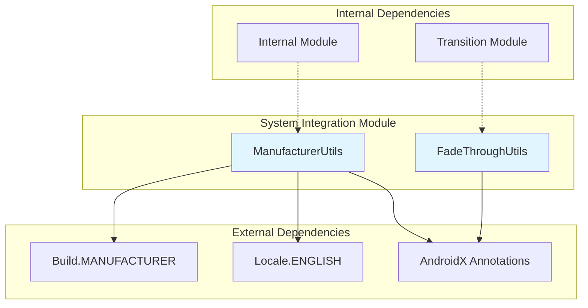
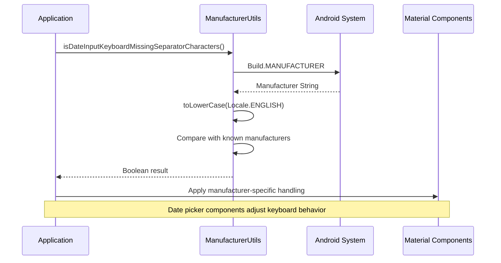
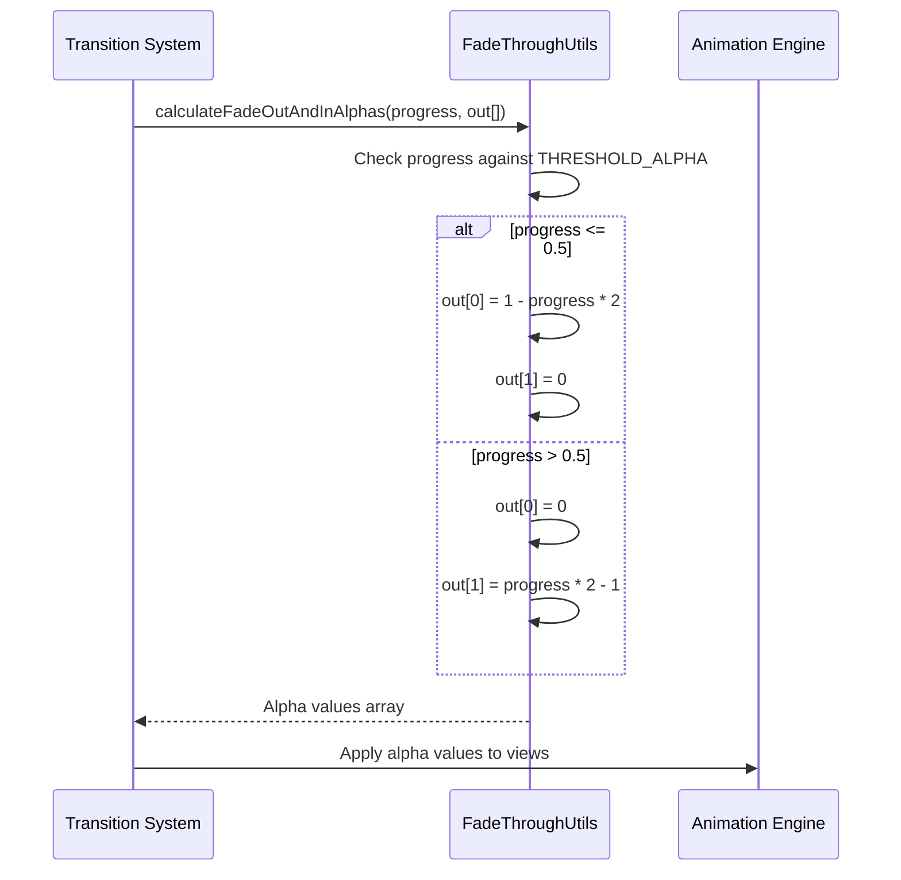
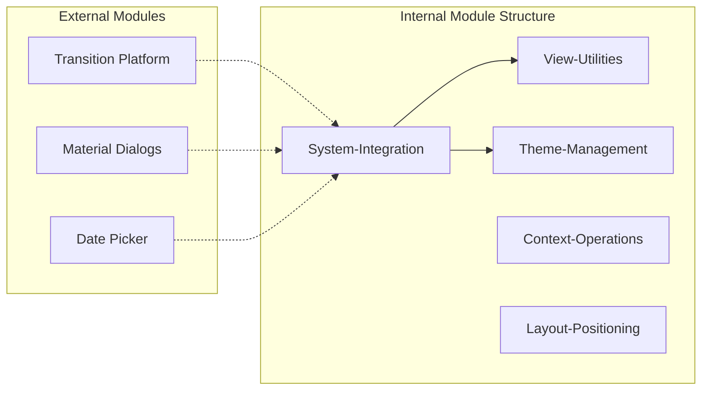
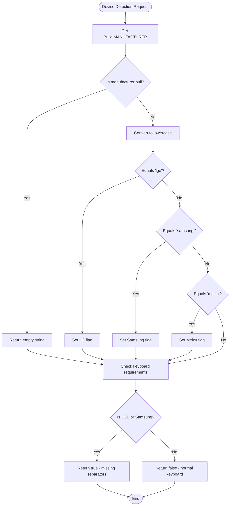

# System Integration Module Documentation

## Introduction

The system-integration module is a critical component of the Material Design Components library that provides essential utilities for handling device-specific behaviors and system-level animations. This module serves as a bridge between the Material Design components and the underlying Android system, ensuring consistent behavior across different device manufacturers and Android versions.

The module specializes in two primary areas:
1. **Device Manufacturer Detection** - Identifying device manufacturers for manufacturer-specific handling
2. **Animation Utilities** - Providing system-level animation calculations and utilities

## Architecture Overview

## Core Components

### ManufacturerUtils

The `ManufacturerUtils` class provides device manufacturer detection capabilities, enabling the Material Design library to apply manufacturer-specific workarounds and optimizations.

**Key Features:**
- Detects specific device manufacturers (Meizu, LG, Samsung)
- Provides manufacturer-specific keyboard handling for date inputs
- Uses Android's Build.MANUFACTURER property for detection
- Case-insensitive manufacturer name comparison

**Supported Manufacturers:**
- **Meizu**: Chinese smartphone manufacturer
- **LG (LGE)**: South Korean electronics company
- **Samsung**: South Korean multinational conglomerate

**Critical Functionality:**
The `isDateInputKeyboardMissingSeparatorCharacters()` method identifies devices where date input keyboards may be missing separator characters like "/", which is crucial for date picker components to function correctly.

### FadeThroughUtils

The `FadeThroughUtils` class provides mathematical calculations for fade-through animations, a specific type of transition animation used in Material Design.

**Key Features:**
- Calculates alpha values for fade-through transitions
- Uses a threshold-based approach (0.5f threshold)
- Provides smooth transition between fade-out and fade-in states
- Optimized for performance with static calculations

**Animation Algorithm:**
- Progress ≤ 0.5: Fade-out element (alpha = 1 - progress × 2), fade-in element (alpha = 0)
- Progress > 0.5: Fade-out element (alpha = 0), fade-in element (alpha = progress × 2 - 1)

## Data Flow and Component Interactions

## Integration with Other Modules

### Internal Module Dependencies
The system-integration module is part of the larger `internal` module structure, providing essential utilities that other internal components depend on:

### Cross-Module Usage Patterns

1. **Date Picker Integration**: The [date-picker module](date-picker.md) utilizes `ManufacturerUtils` to handle keyboard separator character issues on specific devices
2. **Transition System**: The [transition module](transition.md) leverages `FadeThroughUtils` for smooth fade-through animations
3. **Theme Management**: Works with [theme module](theme.md) to ensure consistent behavior across different manufacturer implementations

## Process Flow for Device Detection

## Performance Considerations

### ManufacturerUtils
- **Caching**: Manufacturer detection is performed on-demand without caching, as Build.MANUFACTURER is a system constant
- **String Operations**: Uses efficient string comparison with pre-computed lowercase constants
- **Memory Efficiency**: Static methods prevent unnecessary object instantiation

### FadeThroughUtils
- **Static Calculations**: All calculations are static with no object creation
- **Array Reuse**: Uses provided output array to avoid memory allocation
- **Threshold Optimization**: Single comparison operation for determining animation state

## Error Handling and Edge Cases

### Manufacturer Detection Edge Cases
- **Null Manufacturer**: Gracefully handles null Build.MANUFACTURER by returning empty string
- **Case Sensitivity**: Normalizes manufacturer strings to lowercase for consistent comparison
- **Unknown Manufacturers**: Safely returns false for unlisted manufacturers

### Animation Calculation Safety
- **Progress Bounds**: Accepts progress values from 0.0 to 1.0 with @FloatRange annotation
- **Array Bounds**: Assumes provided array has at least 2 elements for alpha values
- **Mathematical Stability**: Calculations prevent division by zero and overflow conditions

## Security and Privacy Considerations

The system-integration module accesses device manufacturer information through Android's public APIs:
- **Build.MANUFACTURER**: Public system property with no sensitive information
- **No Personal Data**: Does not access or store any personally identifiable information
- **Library Scope**: Restricted to library group usage with `@RestrictTo(Scope.LIBRARY_GROUP)`

## Future Enhancements

Potential areas for expansion:
1. **Additional Manufacturer Support**: Extending detection to other major manufacturers
2. **Enhanced Animation Utilities**: Adding more transition calculation utilities
3. **System Capability Detection**: Expanding beyond manufacturer to device capability detection
4. **Performance Metrics**: Adding timing and performance measurement utilities

## References

- [Internal Module Documentation](internal.md) - Parent module containing system-integration
- [Transition Module Documentation](transition.md) - Utilizes FadeThroughUtils for animations
- [Date Picker Module Documentation](date-picker.md) - Uses ManufacturerUtils for device-specific handling
- [Theme Module Documentation](theme.md) - Coordinates with system-integration for consistent theming