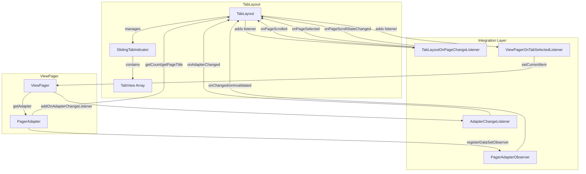
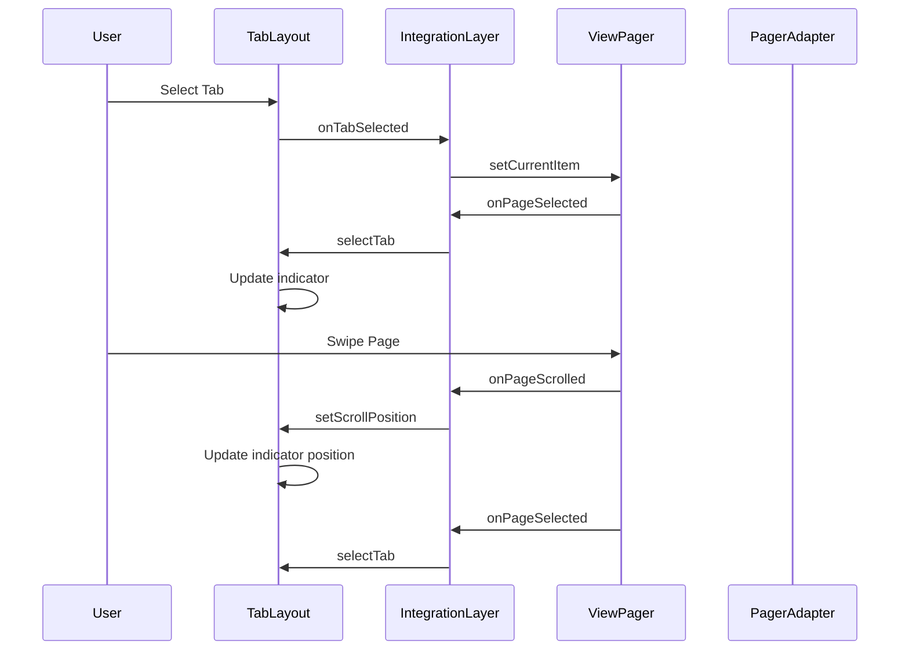
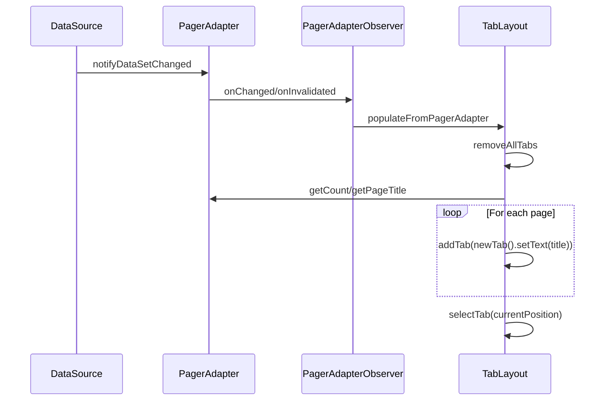

# Tab Integration Module Documentation

## Overview

The tab-integration module provides the core functionality for synchronizing TabLayout with ViewPager components in Android applications. This module enables seamless integration between tab navigation and page swiping, creating a cohesive user experience where tab selection and page navigation are automatically synchronized.

## Purpose and Core Functionality

The primary purpose of the tab-integration module is to establish bidirectional communication between TabLayout and ViewPager components. It handles:

- **Automatic Tab Population**: Creates tabs based on ViewPager adapter data
- **Synchronized Navigation**: Keeps tab selection and page position in sync
- **Scroll State Management**: Handles scrolling animations and state transitions
- **Data Change Monitoring**: Responds to adapter data changes and updates tabs accordingly

## Architecture

### Core Components

The module consists of four main integration components:

#### 1. TabLayoutOnPageChangeListener
- **Purpose**: Listens to ViewPager page changes and updates TabLayout accordingly
- **Key Responsibilities**:
  - Monitors page scroll events and updates tab indicator position
  - Handles page selection events to update active tab
  - Manages scroll state transitions (idle, dragging, settling)
  - Prevents redundant updates during animation sequences

#### 2. ViewPagerOnTabSelectedListener
- **Purpose**: Listens to TabLayout tab selections and updates ViewPager accordingly
- **Key Responsibilities**:
  - Sets ViewPager's current item when a tab is selected
  - Provides simple unidirectional synchronization from tabs to pages

#### 3. PagerAdapterObserver
- **Purpose**: Monitors changes in the ViewPager's adapter data
- **Key Responsibilities**:
  - Watches for data set changes using Android's DataSetObserver pattern
  - Triggers tab repopulation when adapter data changes
  - Ensures tabs remain synchronized with underlying data

#### 4. AdapterChangeListener
- **Purpose**: Monitors when the ViewPager's adapter is replaced
- **Key Responsibilities**:
  - Detects when a new adapter is set on the ViewPager
  - Manages the transition between different adapters
  - Controls auto-refresh behavior during adapter changes

### Architecture Diagram



## Data Flow

### Synchronization Flow



### Data Change Flow



## Component Interactions

### TabLayout ↔ ViewPager Integration

The integration establishes a bidirectional relationship where:

1. **ViewPager → TabLayout**: Page changes automatically update tab selection and indicator position
2. **TabLayout → ViewPager**: Tab selections automatically navigate to corresponding pages
3. **State Management**: Scroll states are synchronized to prevent conflicts during animations

### Adapter Integration

The module integrates with the ViewPager's PagerAdapter to:

- Extract page titles for tab labels using `getPageTitle()`
- Monitor adapter changes through DataSetObserver pattern
- Handle adapter replacements gracefully
- Support dynamic content updates

### Animation Coordination

The integration layer coordinates animations between:

- **Tab Indicator Animation**: Smooth transitions when changing tabs
- **ViewPager Page Transitions**: Coordinated with tab indicator movement
- **Scroll Position Updates**: Synchronized scrolling during user interactions

## Key Features

### 1. Automatic Setup
```java
// Simple one-line setup
tabLayout.setupWithViewPager(viewPager);
```

### 2. Manual Control
```java
// Fine-grained control over synchronization
tabLayout.setupWithViewPager(viewPager, autoRefresh);
```

### 3. State Management
- Handles complex scroll state transitions
- Prevents race conditions during animations
- Manages indicator positioning during user interactions

### 4. Data Synchronization
- Automatic tab population from adapter
- Responsive to data changes
- Graceful handling of adapter replacements

## Integration with Other Modules

### Dependencies
- **[tabs](tabs.md)**: Core TabLayout functionality
- **[badge](badge.md)**: Badge support for tab items
- **[animation](animation.md)**: Animation utilities for smooth transitions

### Related Components
- **TabLayout**: The main tab container that uses these integration components
- **ViewPager**: The page container that TabLayout synchronizes with
- **PagerAdapter**: Provides data and titles for tab generation

## Usage Patterns

### Basic Integration
```java
TabLayout tabLayout = findViewById(R.id.tab_layout);
ViewPager viewPager = findViewById(R.id.view_pager);

// Setup adapter
viewPager.setAdapter(new MyPagerAdapter(getSupportFragmentManager()));

// Link TabLayout with ViewPager
tabLayout.setupWithViewPager(viewPager);
```

### Advanced Integration
```java
// Setup with custom auto-refresh behavior
tabLayout.setupWithViewPager(viewPager, true);

// Add custom tab selection listeners
tabLayout.addOnTabSelectedListener(new TabLayout.OnTabSelectedListener() {
    @Override
    public void onTabSelected(TabLayout.Tab tab) {
        // Custom behavior when tab is selected
    }
    
    @Override
    public void onTabUnselected(TabLayout.Tab tab) {
        // Custom behavior when tab is unselected
    }
    
    @Override
    public void onTabReselected(TabLayout.Tab tab) {
        // Custom behavior when tab is reselected
    }
});
```

## Performance Considerations

### Memory Management
- Uses WeakReference to prevent memory leaks
- Properly cleans up listeners on detachment
- Efficient tab view recycling

### Animation Performance
- Coordinates animations to prevent conflicts
- Uses hardware acceleration when available
- Optimizes scroll position calculations

### Data Efficiency
- Only updates when necessary
- Batches updates during adapter changes
- Minimizes layout passes during synchronization

## Error Handling

### Common Issues
1. **Null Adapter**: Gracefully handles ViewPager without adapter
2. **Invalid Positions**: Validates tab and page positions
3. **Concurrent Modifications**: Synchronizes access to shared state
4. **Memory Leaks**: Uses weak references and proper cleanup

### Best Practices
1. Always set ViewPager adapter before calling `setupWithViewPager()`
2. Use appropriate auto-refresh settings based on data volatility
3. Remove custom listeners when no longer needed
4. Consider using `ViewPager2` for better performance

## Future Considerations

### ViewPager2 Integration
- Future versions should support ViewPager2 integration
- Migration path from ViewPager to ViewPager2
- Enhanced animation capabilities

### Enhanced Animation
- More sophisticated indicator animations
- Custom transition effects
- Gesture-driven animations

### Accessibility
- Improved screen reader support
- Better focus management
- Enhanced navigation for accessibility services