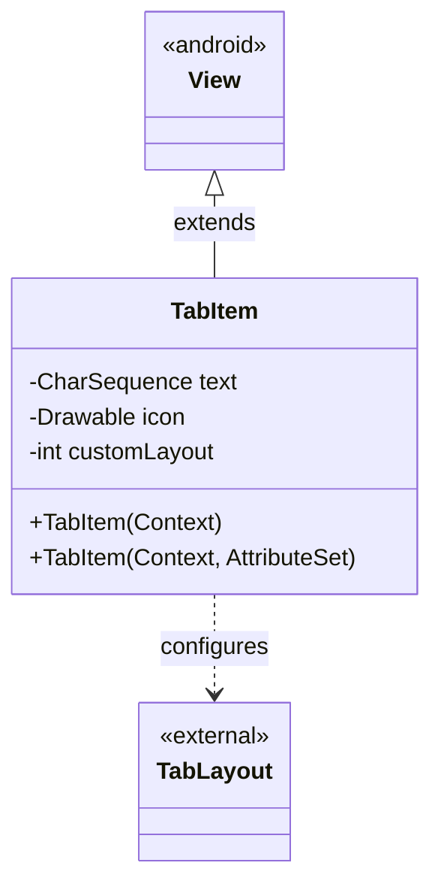
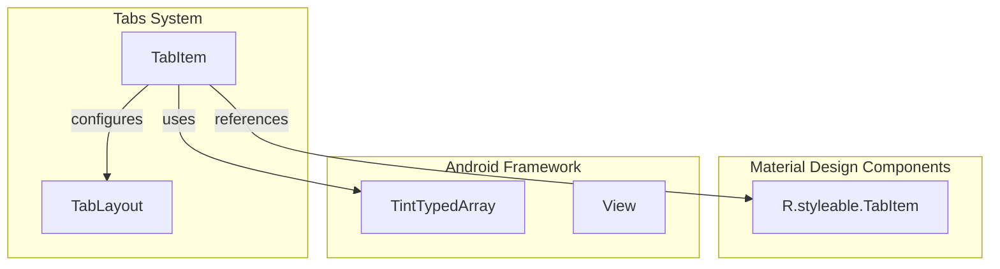
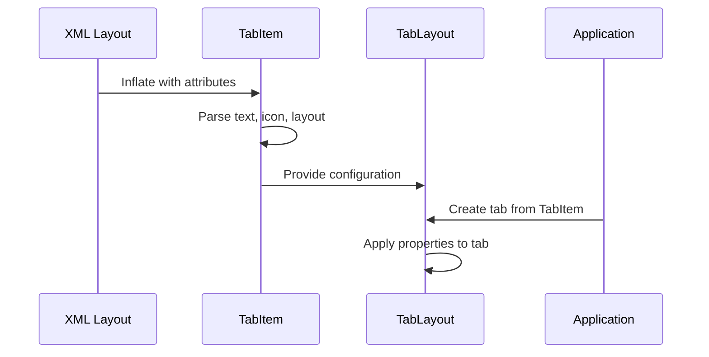
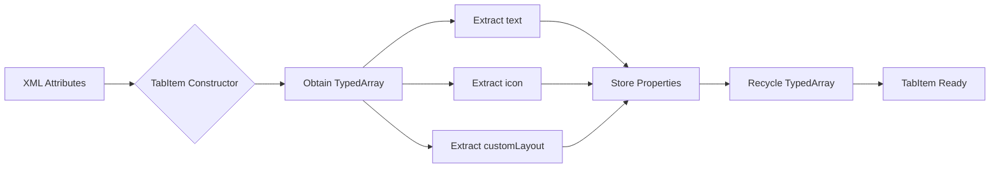

# Tab Item Core Module Documentation

## Introduction

The tab-item-core module provides the foundational `TabItem` component for the Material Design Tabs system. This module serves as a declarative configuration mechanism for individual tabs within a `TabLayout`, enabling developers to define tab properties through XML layout files rather than programmatic configuration.

## Core Component

### TabItem

The `TabItem` class is a special view component that acts as a configuration placeholder for individual tabs in a `TabLayout`. Despite extending `View`, it is not actually rendered in the UI hierarchy but serves as a data container for tab properties.

#### Key Features
- **Declarative Configuration**: Define tab properties through XML attributes
- **Property Container**: Stores text, icon, and custom layout references
- **Integration Bridge**: Connects XML declarations to `TabLayout` tab creation
- **Resource Management**: Handles attribute parsing and resource resolution

#### Properties
- `text`: CharSequence - The text label for the tab
- `icon`: Drawable - The icon displayed on the tab
- `customLayout`: int - Resource ID for custom tab layout

## Architecture

### Component Structure



### Module Dependencies



## Data Flow

### Tab Creation Process



### Attribute Processing Flow



## Integration with Tabs System

### Relationship with TabLayout

The `TabItem` component works in conjunction with [tab-layout-core](tab-layout-core.md) to provide a complete tab implementation:

- **Configuration Source**: `TabItem` provides the configuration data
- **Tab Creation**: `TabLayout` consumes `TabItem` configurations to create actual tabs
- **ViewPager Integration**: Works with [tab-integration](tab-integration.md) for ViewPager synchronization

### Usage Pattern

```xml
<com.google.android.material.tabs.TabLayout
    android:layout_width="match_parent"
    android:layout_height="wrap_content">
    
    <com.google.android.material.tabs.TabItem
        android:layout_width="wrap_content"
        android:layout_height="wrap_content"
        android:text="Tab 1"
        android:icon="@drawable/ic_tab1" />
    
    <com.google.android.material.tabs.TabItem
        android:layout_width="wrap_content"
        android:layout_height="wrap_content"
        android:text="Tab 2"
        android:layout="@layout/custom_tab" />
        
</com.google.android.material.tabs.TabLayout>
```

## Component Lifecycle

### Initialization Process

1. **XML Inflation**: Layout inflater creates `TabItem` instances
2. **Attribute Parsing**: Constructor extracts properties from XML attributes
3. **Resource Resolution**: Icons and layouts are resolved to resource IDs
4. **Property Storage**: Values are stored in public final fields
5. **TabLayout Integration**: `TabLayout` reads properties during tab creation

### Memory Management

- **Lightweight Objects**: Minimal memory footprint as configuration containers
- **Resource Cleanup**: TypedArray is properly recycled after use
- **Final Fields**: Immutable properties ensure thread safety

## Design Considerations

### Architectural Decisions

- **View Extension**: Extends `View` to participate in layout inflation system
- **Configuration-Only**: Does not render UI, purely for data holding
- **Public Fields**: Direct field access for performance and simplicity
- **Resource-Based**: Leverages Android's resource system for localization

### Performance Characteristics

- **Fast Initialization**: Minimal processing during construction
- **Zero Rendering Overhead**: No drawing operations performed
- **Efficient Memory Usage**: Small object size with essential properties only

## Related Modules

- [tab-layout-core](tab-layout-core.md) - Core TabLayout functionality and tab management
- [tab-view-internals](tab-view-internals.md) - Internal tab view implementations
- [tab-integration](tab-integration.md) - ViewPager integration and synchronization

## API Reference

### Constructors

#### TabItem(Context context)
Creates a new TabItem with default properties.

**Parameters:**
- `context`: The context for resource access

#### TabItem(Context context, AttributeSet attrs)
Creates a new TabItem with properties from XML attributes.

**Parameters:**
- `context`: The context for resource access
- `attrs`: XML attributes containing tab configuration

### XML Attributes

| Attribute | Type | Description |
|-----------|------|-------------|
| `android:text` | string | Tab label text |
| `android:icon` | drawable | Tab icon drawable |
| `android:layout` | layout | Custom tab layout resource |

## Best Practices

### Usage Guidelines

1. **XML Declaration**: Always define TabItems in XML for maintainability
2. **Resource References**: Use resource references for text and icons
3. **Custom Layouts**: Leverage custom layouts for complex tab designs
4. **Consistency**: Maintain consistent styling across all tabs

### Common Patterns

```xml
<!-- Simple text tab -->
<com.google.android.material.tabs.TabItem
    android:layout_width="wrap_content"
    android:layout_height="wrap_content"
    android:text="@string/tab_title" />

<!-- Icon with text -->
<com.google.android.material.tabs.TabItem
    android:layout_width="wrap_content"
    android:layout_height="wrap_content"
    android:text="@string/tab_title"
    android:icon="@drawable/tab_icon" />

<!-- Custom layout -->
<com.google.android.material.tabs.TabItem
    android:layout_width="wrap_content"
    android:layout_height="wrap_content"
    android:layout="@layout/custom_tab_layout" />
```

## Migration Notes

### Future Considerations

The code includes TODO comments indicating planned changes:
- **Final Class**: Class will be made final after widget migration
- **Package-Private Fields**: Fields will be made package-private for encapsulation

These changes will improve API stability and encapsulation while maintaining backward compatibility.