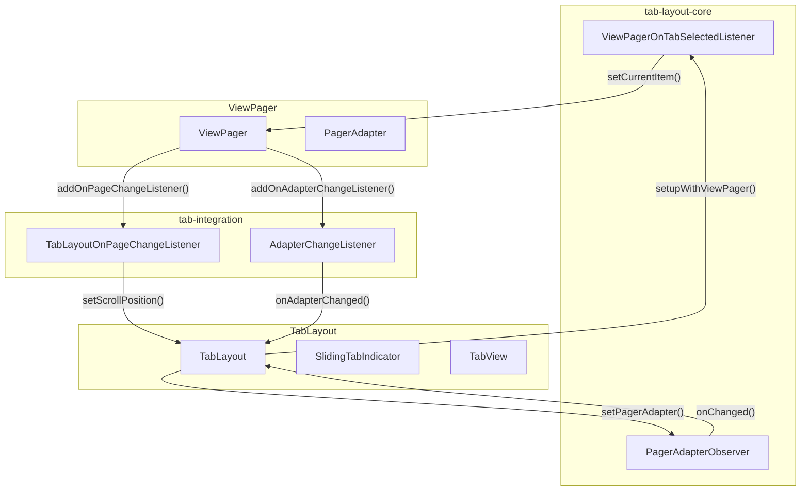
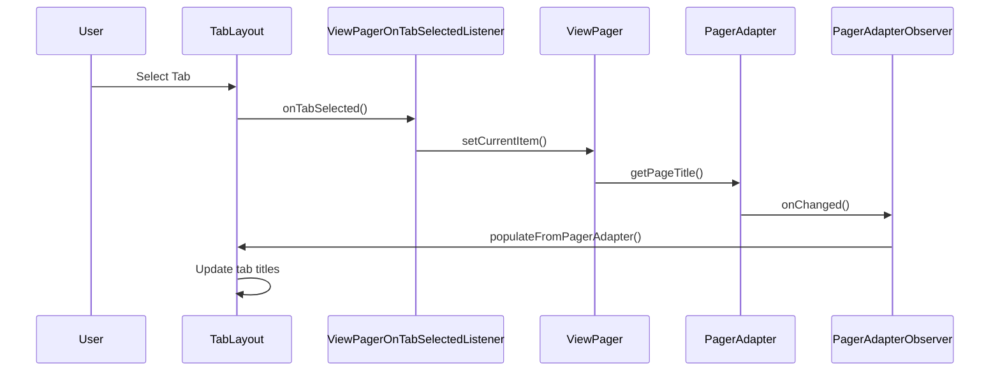

# Tab Layout Core Module Documentation

## Overview

The tab-layout-core module provides the fundamental components for implementing Material Design tab layouts in Android applications. This module contains the core integration classes that enable seamless synchronization between TabLayout and ViewPager components, forming the backbone of tab-based navigation systems.

## Module Purpose

The tab-layout-core module serves as the integration layer between visual tab components and content paging systems. It provides:

- **ViewPager Integration**: Automatic synchronization between tab selection and page changes
- **Data Observation**: Real-time monitoring of adapter data changes
- **Event Coordination**: Bidirectional communication between tabs and content
- **State Management**: Consistent state maintenance across tab and page transitions

## Core Components

### 1. ViewPagerOnTabSelectedListener

**Purpose**: Bridges tab selection events to ViewPager page changes

**Key Responsibilities**:
- Monitors tab selection events within TabLayout
- Automatically updates ViewPager's current item when tabs are selected
- Provides seamless navigation synchronization
- Maintains loose coupling between tab and page components

**Integration Flow**:
```
Tab Selection → ViewPagerOnTabSelectedListener → ViewPager.setCurrentItem()
```

### 2. PagerAdapterObserver

**Purpose**: Monitors data changes in ViewPager adapters

**Key Responsibilities**:
- Observes adapter dataset changes via DataSetObserver pattern
- Triggers tab layout updates when underlying data changes
- Maintains consistency between tab count and page count
- Handles dynamic content addition/removal scenarios

**Observation Pattern**:
```
Adapter Data Change → PagerAdapterObserver → TabLayout.populateFromPagerAdapter()
```

## Architecture

### Component Relationships



### Data Flow Architecture



## Integration Patterns

### 1. Bidirectional Synchronization

The module enables two-way synchronization between tabs and pages:

- **Tab → Page**: User tab selection automatically updates ViewPager position
- **Page → Tab**: ViewPager scrolling automatically updates tab selection and indicator position

### 2. Adapter Change Handling

When ViewPager adapters change, the module ensures:
- Tab count matches new adapter item count
- Tab titles are updated from adapter page titles
- Selected tab position is maintained or adjusted appropriately

### 3. Data Consistency

The observer pattern ensures that any changes to the underlying data model are immediately reflected in the tab layout, maintaining UI consistency.

## Dependencies

### Internal Dependencies

- **tab-item-core**: Provides TabItem components that can be integrated with the layout
- **tab-view-internals**: Utilizes TabView and SlidingTabIndicator for visual representation
- **tab-integration**: Works in conjunction with TabLayoutOnPageChangeListener for complete synchronization

### External Dependencies

- **ViewPager**: AndroidX ViewPager component for content paging
- **PagerAdapter**: Base adapter class for providing page data
- **DataSetObserver**: Android framework class for observing data changes

## Usage Patterns

### Basic Integration

```java
TabLayout tabLayout = findViewById(R.id.tab_layout);
ViewPager viewPager = findViewById(R.id.view_pager);

// Automatic setup with core components
tabLayout.setupWithViewPager(viewPager);
```

### Manual Integration

```java
// Create core components
ViewPagerOnTabSelectedListener tabListener = 
    new ViewPagerOnTabSelectedListener(viewPager);
PagerAdapterObserver adapterObserver = new PagerAdapterObserver();

// Register listeners
tabLayout.addOnTabSelectedListener(tabListener);
viewPager.getAdapter().registerDataSetObserver(adapterObserver);
```

## State Management

### Tab-Page State Synchronization

The module maintains consistent state across tab and page components:

1. **Selection State**: Current tab selection matches current ViewPager page
2. **Data State**: Tab titles and count reflect adapter data
3. **Visual State**: Tab indicator position corresponds to page scroll position

### Error Handling

- **Null Safety**: Components handle null ViewPager or adapter gracefully
- **State Validation**: Prevents invalid tab positions or adapter states
- **Resource Cleanup**: Properly removes listeners and observers when components are destroyed

## Performance Considerations

### Memory Management

- **Weak References**: ViewPagerOnTabSelectedListener uses weak references to prevent memory leaks
- **Observer Lifecycle**: Proper registration/unregistration of data observers
- **Resource Pooling**: Tab view recycling through object pools

### Animation Coordination

- **Indicator Synchronization**: Smooth animation coordination between tab indicator and page scrolling
- **Scroll State Management**: Efficient handling of scroll states to prevent unnecessary updates

## Extension Points

### Custom Listeners

Developers can extend the core functionality by:

1. **Extending ViewPagerOnTabSelectedListener**: Add custom behavior to tab selection events
2. **Implementing Custom Observers**: Create specialized data change observers
3. **Combining with Other Modules**: Integrate with badge, animation, or theming systems

### Integration with Other Modules

The core components work seamlessly with:
- **[badge](badge.md)**: For adding notification badges to tabs
- **[animation](animation.md)**: For custom tab transition animations
- **[theme](theme.md)**: For consistent styling across tab layouts

## Best Practices

### 1. Automatic vs Manual Setup

- Use `setupWithViewPager()` for standard integrations
- Implement manual setup for custom synchronization behavior

### 2. Lifecycle Management

- Always clean up listeners in `onDestroy()`
- Use appropriate lifecycle-aware components when possible

### 3. Performance Optimization

- Avoid frequent adapter data changes
- Use appropriate tab modes (fixed vs scrollable) based on content
- Implement efficient page title generation in adapters

## Troubleshooting

### Common Issues

1. **Tabs Not Updating**: Ensure PagerAdapterObserver is properly registered
2. **Selection Not Synchronized**: Verify ViewPagerOnTabSelectedListener is added
3. **Memory Leaks**: Check proper listener removal in component lifecycle

### Debug Strategies

- Monitor DataSetObserver callbacks for adapter changes
- Log tab selection and page change events
- Verify listener registration and removal timing

## Related Documentation

- [Tab Integration](tab-integration.md) - Complete integration patterns and advanced usage
- [Tab Item Core](tab-item-core.md) - Individual tab item components
- [Tab View Internals](tab-view-internals.md) - Visual tab representation components
- [ViewPager Documentation](https://developer.android.com/reference/androidx/viewpager/widget/ViewPager) - AndroidX ViewPager reference