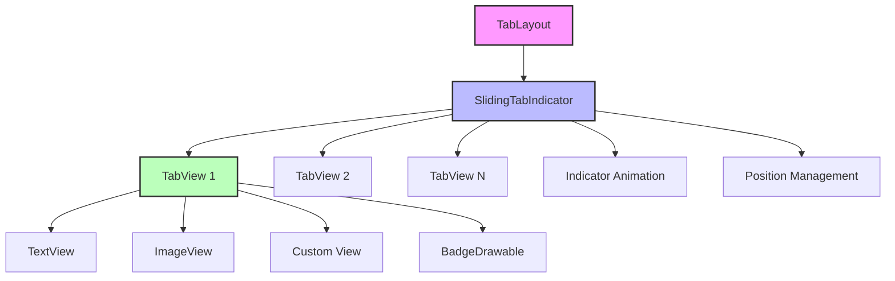
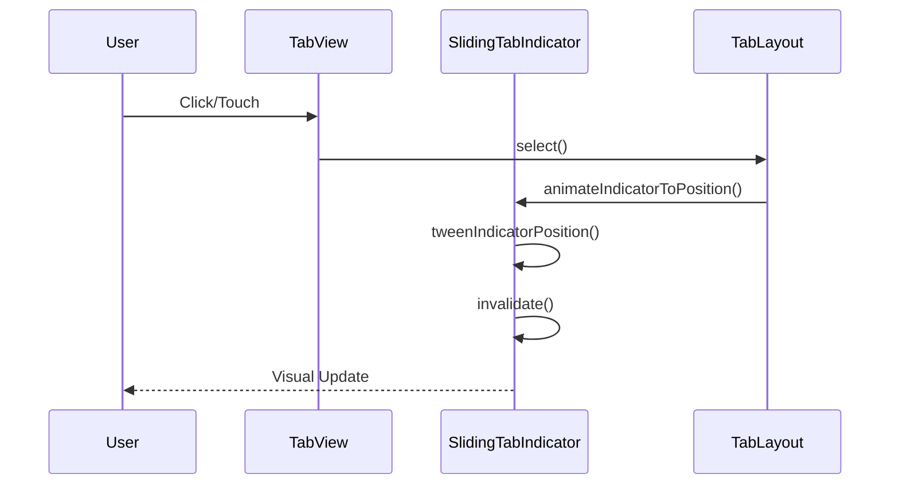
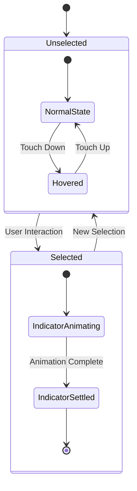

# Tab View Internals Module Documentation

## Introduction

The `tab-view-internals` module provides the core internal components for rendering and managing individual tab views within the Material Design TabLayout system. This module contains the fundamental building blocks that handle tab visualization, selection indicators, and user interaction at the individual tab level.

## Module Overview

The tab-view-internals module is a specialized submodule within the larger tabs module hierarchy, focusing specifically on the internal view components that make up individual tabs and their selection indicators. It works in conjunction with other tab-related modules to provide a complete tab navigation solution.

## Core Components

### 1. TabView Class

**Component**: `lib.java.com.google.android.material.tabs.TabLayout.TabView`

The `TabView` class is the fundamental component that represents an individual tab within the TabLayout. It extends `LinearLayout` and serves as the container for tab content including icons, text labels, and custom views.

#### Key Responsibilities:
- **Content Rendering**: Manages the display of tab icons, text labels, and custom views
- **Selection State**: Handles visual representation of selected/unselected states
- **Badge Integration**: Provides support for badge drawables on tabs
- **Accessibility**: Implements accessibility features for screen readers
- **Touch Interaction**: Handles user touch events and click behaviors

#### Architecture Features:
```java
public final class TabView extends LinearLayout {
    private Tab tab;
    private TextView textView;
    private ImageView iconView;
    @Nullable private View badgeAnchorView;
    @Nullable private BadgeDrawable badgeDrawable;
    // ... additional components
}
```

#### Visual Structure:
- **Icon Management**: Handles icon display with proper tinting and visibility
- **Text Rendering**: Manages text labels with support for different text appearances
- **Custom Views**: Supports fully custom tab layouts
- **Orientation Support**: Handles both horizontal and vertical label/icon arrangements
- **Background Drawing**: Manages tab background drawables and ripple effects

### 2. SlidingTabIndicator Class

**Component**: `lib.java.com.google.android.material.tabs.TabLayout.SlidingTabIndicator`

The `SlidingTabIndicator` class is responsible for rendering and animating the tab selection indicator. It extends `LinearLayout` and contains all the individual `TabView` instances.

#### Key Responsibilities:
- **Indicator Animation**: Manages smooth transitions of the selection indicator
- **Position Tracking**: Tracks current indicator position during animations
- **Drawing Operations**: Handles custom drawing of the selection indicator
- **Layout Management**: Manages the arrangement of child TabView components

#### Animation System:
```java
class SlidingTabIndicator extends LinearLayout {
    ValueAnimator indicatorAnimator;
    private int indicatorPosition = -1;
    
    void animateIndicatorToPosition(final int position, int duration) {
        // Animation logic for smooth indicator transitions
    }
    
    private void tweenIndicatorPosition(View startTitle, View endTitle, float fraction) {
        // Interpolation logic for indicator movement
    }
}
```

#### Indicator Features:
- **Multiple Animation Modes**: Supports linear, elastic, and fade animations
- **Gravity Support**: Handles different indicator positions (top, center, bottom, stretch)
- **Custom Drawables**: Supports custom indicator drawables with proper bounds management
- **Performance Optimization**: Efficient invalidation and redraw mechanisms

## Architecture and Design Patterns

### Component Relationships



### Data Flow Architecture



### State Management



## Integration with Other Modules

### Dependencies

The tab-view-internals module integrates with several other Material Design components:

#### Badge System Integration
- **BadgeDrawable**: Integrates with the [badge module](badge.md) for displaying notification counts
- **BadgeUtils**: Utilizes utility functions for badge positioning and attachment

#### Theme and Styling
- **MaterialThemeOverlay**: Applies proper theming and styling
- **ColorStateList**: Manages color states for different tab conditions
- **RippleUtils**: Handles ripple effect creation and management

#### Accessibility Support
- **AccessibilityNodeInfo**: Provides comprehensive accessibility information
- **TooltipCompat**: Manages tooltip display for enhanced usability

### Related Modules

- **[tab-layout-core](tab-layout-core.md)**: Contains the main TabLayout class and core functionality
- **[tab-item-core](tab-item-core.md)**: Provides TabItem components for XML-based tab definition
- **[tab-integration](tab-integration.md)**: Handles ViewPager integration and synchronization

## Key Features and Capabilities

### 1. Flexible Content Support

The TabView supports multiple content types:
- **Icon-only tabs**: Display only icons without text
- **Text-only tabs**: Display only text labels
- **Icon + Text tabs**: Combined icon and text display
- **Custom views**: Full custom layout support

### 2. Advanced Animation System

The SlidingTabIndicator provides sophisticated animation capabilities:
- **Linear interpolation**: Smooth, constant-speed transitions
- **Elastic animations**: Spring-like effects for more dynamic feel
- **Fade transitions**: Cross-fade effects for indicator changes
- **Custom interpolators**: Support for custom animation curves

### 3. Badge Integration

Comprehensive badge support includes:
- **Dynamic positioning**: Automatic badge positioning based on content
- **Anchor management**: Proper attachment to text or icon elements
- **Visibility control**: Show/hide badges based on application state
- **Accessibility**: Proper accessibility descriptions for badge content

### 4. Accessibility Features

Full accessibility support ensures:
- **Screen reader compatibility**: Proper content descriptions and roles
- **Keyboard navigation**: Support for keyboard-based tab selection
- **High contrast support**: Proper color contrast ratios
- **Touch target sizing**: Adequate touch target dimensions

## Performance Considerations

### Memory Management
- **View Recycling**: Implements view pooling for TabView instances
- **Drawable Management**: Proper drawable state management and cleanup
- **Animation Optimization**: Efficient animation frame rates and interpolation

### Rendering Performance
- **Selective Invalidation**: Only redraw necessary components
- **Hardware Acceleration**: Leverages hardware acceleration when available
- **Background Drawing**: Optimized background drawing pipeline

### Layout Performance
- **Efficient Measurement**: Optimized measure passes for complex tab content
- **Layout Caching**: Caches layout calculations where possible
- **Gravity Optimization**: Efficient gravity-based layout calculations

## Usage Patterns

### Basic Tab Creation
```java
TabLayout tabLayout = findViewById(R.id.tab_layout);
TabLayout.Tab tab = tabLayout.newTab();
tab.setText("Tab Title");
tab.setIcon(R.drawable.tab_icon);
tabLayout.addTab(tab);
```

### Custom Tab Views
```java
TabLayout.Tab tab = tabLayout.newTab();
tab.setCustomView(R.layout.custom_tab_layout);
tabLayout.addTab(tab);
```

### Badge Integration
```java
TabLayout.Tab tab = tabLayout.newTab();
BadgeDrawable badge = tab.getOrCreateBadge();
badge.setNumber(5);
tabLayout.addTab(tab);
```

## Best Practices

### 1. View Recycling
Always utilize the built-in view pooling mechanisms to minimize memory allocation during tab creation and destruction.

### 2. Animation Performance
Choose appropriate animation modes based on your use case - linear for simple transitions, elastic for more dynamic feel, fade for subtle changes.

### 3. Accessibility
Ensure all tabs have proper content descriptions and consider the impact of custom views on accessibility features.

### 4. Badge Usage
Use badges judiciously to avoid visual clutter and ensure they don't interfere with tab content readability.

## Troubleshooting

### Common Issues

1. **Indicator Not Animating**: Check that animation duration is set and indicator bounds are properly configured
2. **Badge Positioning**: Ensure proper anchor view selection for badge attachment
3. **Custom View Layout**: Verify custom view layouts don't interfere with tab selection behavior
4. **Performance Issues**: Monitor view recycling and animation frame rates for smooth performance

### Debug Techniques
- Enable layout bounds visualization to understand component positioning
- Use accessibility services to verify proper content descriptions
- Monitor memory usage during tab creation/destruction cycles
- Profile animation performance using system tools

## Future Considerations

The tab-view-internals module is designed to be extensible and maintainable. Future enhancements may include:
- Additional animation modes and interpolators
- Enhanced badge positioning algorithms
- Improved accessibility features
- Performance optimizations for large tab sets
- Support for new Material Design guidelines

This module provides the foundation for robust, accessible, and performant tab navigation within the Material Design system.