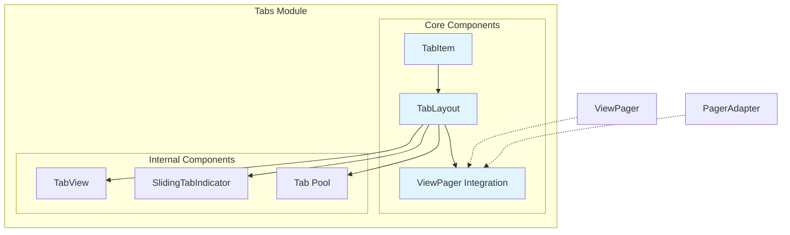
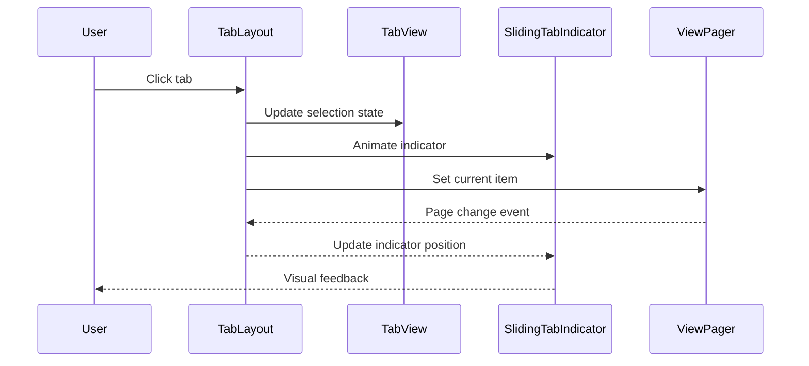

# Tabs Module Documentation

## Overview

The Tabs module provides a comprehensive tab-based navigation system for Android applications using Material Design principles. It enables developers to create horizontal tab layouts that can be used for content organization and navigation within an app.

## Purpose and Core Functionality

The Tabs module serves as a fundamental navigation component that:
- Provides horizontal tab layouts for content switching
- Integrates seamlessly with ViewPager for swipeable content
- Supports various display modes (fixed, scrollable, auto)
- Offers extensive customization options for appearance and behavior
- Implements Material Design guidelines for tab interactions

## Architecture Overview

### Component Structure



### Data Flow



## Core Components

### TabItem
A declarative component that allows defining tab properties in XML layouts. It serves as a configuration object for creating tabs with text, icons, and custom layouts.

**Key Features:**
- XML-based tab definition
- Support for text, icons, and custom layouts
- Content description for accessibility

**Detailed Documentation:** [TabItem Core Components](tab-item-core.md)

### TabLayout
The main container that manages and displays tabs. It extends HorizontalScrollView and provides the primary interface for tab management.

**Key Features:**
- Horizontal scrolling for tab overflow
- Multiple display modes (fixed, scrollable, auto)
- ViewPager integration
- Tab selection animations
- Badge support
- Accessibility features

**Detailed Documentation:** [TabLayout Core Components](tab-layout-core.md)

### TabView Internals
Internal components responsible for rendering individual tabs and the selection indicator.

**Components:**
- `TabView`: Individual tab representation
- `SlidingTabIndicator`: Manages selection indicator animation and positioning

**Detailed Documentation:** [TabView Internals](tab-view-internals.md)

### ViewPager Integration
Seamless integration with ViewPager for creating swipeable tab interfaces.

**Components:**
- `ViewPagerOnTabSelectedListener`: Handles tab selection events
- `PagerAdapterObserver`: Monitors adapter changes
- `TabLayoutOnPageChangeListener`: Synchronizes with ViewPager scroll state

**Detailed Documentation:** [ViewPager Integration](tab-integration.md)

## Module Structure

```
tabs/
├── TabItem.java              # Declarative tab definition
├── TabLayout.java            # Main tab container and manager
└── Integration Components    # ViewPager synchronization
    ├── ViewPagerOnTabSelectedListener
    ├── PagerAdapterObserver
    └── TabLayoutOnPageChangeListener
```

## Key Features

### Display Modes
- **MODE_FIXED**: All tabs displayed concurrently with equal width
- **MODE_SCROLLABLE**: Subset of tabs visible with horizontal scrolling
- **MODE_AUTO**: Dynamic behavior based on available space

### Customization Options
- Tab text appearance and colors
- Icon tinting and positioning
- Selection indicator appearance and animation
- Background and ripple effects
- Label visibility modes

### Animation Support
- Linear indicator animation
- Elastic indicator animation  
- Fade transition effects
- Customizable animation duration and interpolators

### Accessibility
- Full accessibility support with screen readers
- Content descriptions
- Keyboard navigation
- Touch target sizing

## Integration with Other Modules

The Tabs module integrates with several other Material Design components:

- **[ViewPager](viewpager.md)**: For swipeable content synchronization
- **[Badge](badge.md)**: For displaying notification counts on tabs
- **[Ripple](ripple.md)**: For touch feedback effects
- **[Theme](theme.md)**: For consistent styling and theming

## Usage Examples

### Basic Tab Layout
```xml
<com.google.android.material.tabs.TabLayout
    android:layout_width="match_parent"
    android:layout_height="wrap_content">
    
    <com.google.android.material.tabs.TabItem
        android:text="Tab 1" />
    <com.google.android.material.tabs.TabItem
        android:text="Tab 2" />
    <com.google.android.material.tabs.TabItem
        android:text="Tab 3" />
</com.google.android.material.tabs.TabLayout>
```

### Programmatic Tab Creation
```java
TabLayout tabLayout = findViewById(R.id.tab_layout);
tabLayout.addTab(tabLayout.newTab().setText("Tab 1"));
tabLayout.addTab(tabLayout.newTab().setText("Tab 2"));
tabLayout.addTab(tabLayout.newTab().setText("Tab 3"));
```

### ViewPager Integration
```java
TabLayout tabLayout = findViewById(R.id.tab_layout);
ViewPager viewPager = findViewById(R.id.view_pager);
tabLayout.setupWithViewPager(viewPager);
```

## Performance Considerations

- Tab view recycling through object pools
- Efficient scroll position calculations
- Optimized drawing operations
- Memory-efficient badge management

## Best Practices

1. **Tab Count**: Limit tabs to 5-7 items for optimal user experience
2. **Text Length**: Keep tab labels concise and scannable
3. **Icon Usage**: Use recognizable icons to supplement text labels
4. **ViewPager Integration**: Always link TabLayout with ViewPager for swipeable content
5. **Accessibility**: Provide content descriptions for screen readers
6. **Performance**: Use MODE_SCROLLABLE for large numbers of tabs

## Related Documentation

- [Material Design Tabs Guidelines](https://material.io/components/tabs)
- [ViewPager Integration Guide](viewpager.md)
- [Badge System Documentation](badge.md)
- [Theming and Styling Guide](theme.md)