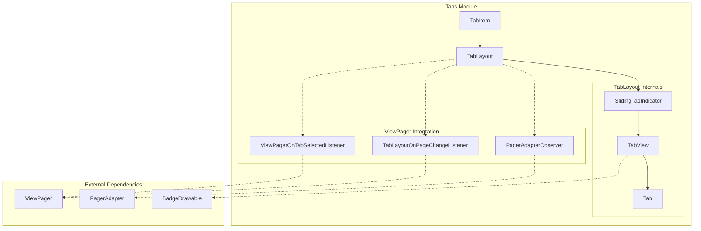
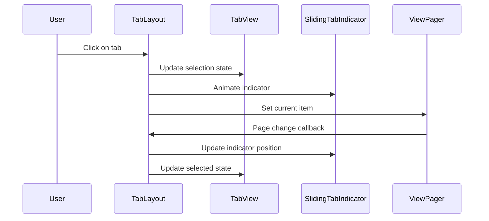
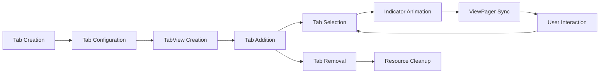

# Tabs Module Documentation

## Overview

The Tabs module provides a comprehensive tab-based navigation system for Android applications, implementing Material Design principles. It offers flexible tab layouts with support for various display modes, animations, and integration with ViewPager for seamless content switching.

## Architecture

The Tabs module is built around two core components that work together to provide a complete tab navigation solution:

### Core Components

1. **TabLayout** - The main container that manages tab display and interaction
2. **TabItem** - Individual tab definition for XML-based tab creation

### Architecture Diagram


```mermaid
graph TB
    subgraph "Tabs Module"
        TL[TabLayout]
        TI[TabItem]
        
        subgraph "TabLayout Internals"
            STI[SlidingTabIndicator]
            TV[TabView]
            T[Tab]
        end
        
        subgraph "ViewPager Integration"
            TLPCL[TabLayoutOnPageChangeListener]
            VPOTSL[ViewPagerOnTabSelectedListener]
            PAO[PagerAdapterObserver]
        end
    end
    
    subgraph "External Dependencies"
        VP[ViewPager]
        PA[PagerAdapter]
        BD[BadgeDrawable]
    end
    
    TL --> STI
    STI --> TV
    TV --> T
    
    TL -.-> TLPCL
    TL -.-> VPOTSL
    TL -.-> PAO
    
    TLPCL -.-> VP
    VPOTSL -.-> VP
    PAO -.-> PA
    
    TV -.-> BD
    
    TI -.-> TL
```

## Key Features

### Display Modes
- **Fixed Mode (MODE_FIXED)**: All tabs displayed concurrently with equal width
- **Scrollable Mode (MODE_SCROLLABLE)**: Tabs can scroll horizontally for longer labels
- **Auto Mode (MODE_AUTO)**: Automatically switches between fixed and scrollable based on content width

### Tab Types
- **Text Tabs**: Simple text-based navigation
- **Icon Tabs**: Icon-only navigation
- **Text and Icon Tabs**: Combined text and icon display
- **Custom View Tabs**: Fully customizable tab content

### Animation Support
- **Linear Animation**: Smooth linear indicator movement
- **Elastic Animation**: Stretching effect during transitions
- **Fade Animation**: Fade in/out transitions

### Integration Capabilities
- **ViewPager Integration**: Seamless synchronization with ViewPager
- **Badge Support**: Built-in badge display on tabs
- **Accessibility**: Full accessibility support with content descriptions

## Core Components

### TabLayout
The main container class that extends HorizontalScrollView and serves as the primary interface for the tabs system. Key responsibilities include:

- **Tab Management**: Creating, adding, removing, and selecting tabs
- **Layout Control**: Managing display modes (fixed, scrollable, auto) and gravity settings
- **Indicator Animation**: Controlling the selection indicator's position and animation
- **ViewPager Integration**: Synchronizing with ViewPager for seamless content switching
- **Event Handling**: Managing tab selection listeners and callbacks

### TabItem
A special View subclass used exclusively in XML layouts to declare tab properties. It acts as a configuration object that:

- **XML Declaration**: Allows tabs to be defined in layout XML files
- **Property Setting**: Configures text, icon, and custom layout for tabs
- **Integration Bridge**: Connects XML declarations to programmatic tab creation

### TabLayout.PagerAdapterObserver
An internal DataSetObserver that monitors changes to the ViewPager's adapter:

- **Change Detection**: Watches for adapter data changes
- **Automatic Updates**: Triggers tab repopulation when adapter changes
- **Synchronization**: Maintains consistency between tabs and ViewPager content

### TabLayout.ViewPagerOnTabSelectedListener
A specialized listener that bridges tab selection events to ViewPager navigation:

- **Tab-to-Page Mapping**: Automatically sets ViewPager current item when tab is selected
- **Bidirectional Sync**: Works with TabLayoutOnPageChangeListener for complete integration
- **Event Translation**: Converts tab selection events to ViewPager page changes

## Internal Architecture

### Data Flow Architecture


```mermaid
sequenceDiagram
    participant User
    participant TabLayout
    participant TabView
    participant SlidingTabIndicator
    participant ViewPager
    
    User->>TabLayout: Click on tab
    TabLayout->>TabView: Update selection state
    TabLayout->>SlidingTabIndicator: Animate indicator
    TabLayout->>ViewPager: Set current item
    ViewPager->>TabLayout: Page change callback
    TabLayout->>SlidingTabIndicator: Update indicator position
    TabLayout->>TabView: Update selected state
```

### Tab Lifecycle


```mermaid
graph LR
    A[Tab Creation] --> B[Tab Configuration]
    B --> C[TabView Creation]
    C --> D[Tab Addition]
    D --> E[Tab Selection]
    E --> F[Indicator Animation]
    F --> G[ViewPager Sync]
    
    G --> H[User Interaction]
    H --> E
    
    D --> I[Tab Removal]
    I --> J[Resource Cleanup]
```

### Memory Management

The Tabs module implements several memory optimization strategies:

- **Tab Pooling**: Reuses Tab instances through object pooling to reduce garbage collection
- **View Recycling**: TabView instances are recycled to minimize view creation overhead
- **Weak References**: Uses weak references for ViewPager integration to prevent memory leaks
- **Efficient Measurements**: Optimized measurement cycles to reduce layout passes

### State Management

The module maintains several types of state:

- **Tab State**: Individual tab properties (text, icon, selection state, custom views)
- **Layout State**: Current mode, gravity, indicator position, and animation state
- **Integration State**: ViewPager synchronization and adapter monitoring
- **Visual State**: Colors, dimensions, and appearance properties

## Usage Patterns

### Basic XML Usage
```xml
<com.google.android.material.tabs.TabLayout
    android:layout_width="match_parent"
    android:layout_height="wrap_content">
    
    <com.google.android.material.tabs.TabItem
        android:text="Tab 1"
        android:icon="@drawable/ic_tab1" />
        
    <com.google.android.material.tabs.TabItem
        android:text="Tab 2" />
        
</com.google.android.material.tabs.TabLayout>
```

### Programmatic Usage
```java
TabLayout tabLayout = findViewById(R.id.tab_layout);
tabLayout.addTab(tabLayout.newTab().setText("Tab 1"));
tabLayout.addTab(tabLayout.newTab().setText("Tab 2"));
```

### ViewPager Integration
```java
TabLayout tabLayout = findViewById(R.id.tab_layout);
ViewPager viewPager = findViewById(R.id.view_pager);
tabLayout.setupWithViewPager(viewPager);
```

## API Reference

### TabLayout Key Methods

#### Tab Management
- `newTab()`: Creates a new Tab instance
- `addTab(Tab tab)`: Adds a tab to the layout
- `removeTab(Tab tab)`: Removes a specific tab
- `removeTabAt(int position)`: Removes tab at specified position
- `selectTab(Tab tab)`: Selects the specified tab
- `getTabAt(int index)`: Returns tab at specified index
- `getSelectedTabPosition()`: Returns position of currently selected tab

#### Configuration Methods
- `setTabMode(int mode)`: Sets display mode (MODE_FIXED, MODE_SCROLLABLE, MODE_AUTO)
- `setTabGravity(int gravity)`: Sets tab gravity (GRAVITY_FILL, GRAVITY_CENTER, GRAVITY_START)
- `setSelectedTabIndicatorColor(int color)`: Sets indicator color
- `setTabTextColors(ColorStateList colors)`: Sets tab text colors
- `setTabIconTint(ColorStateList tint)`: Sets tab icon tint

#### ViewPager Integration
- `setupWithViewPager(ViewPager viewPager)`: Links TabLayout with ViewPager
- `setTabsFromPagerAdapter(PagerAdapter adapter)`: Populates tabs from adapter

### TabItem Properties

#### XML Attributes
- `android:text`: Sets tab text
- `android:icon`: Sets tab icon
- `android:layout`: Sets custom layout for tab

### Tab Key Methods

#### Property Setters
- `setText(CharSequence text)`: Sets tab text
- `setIcon(Drawable icon)`: Sets tab icon
- `setCustomView(View view)`: Sets custom view for tab
- `setContentDescription(CharSequence contentDesc)`: Sets accessibility description
- `setTag(Object tag)`: Sets arbitrary data object

#### State Methods
- `select()`: Selects this tab
- `isSelected()`: Returns selection state
- `getPosition()`: Returns tab position
- `getOrCreateBadge()`: Returns or creates badge drawable
- `removeBadge()`: Removes badge from tab

### Listener Interfaces

#### OnTabSelectedListener
- `onTabSelected(Tab tab)`: Called when tab becomes selected
- `onTabUnselected(Tab tab)`: Called when tab becomes unselected
- `onTabReselected(Tab tab)`: Called when already selected tab is reselected

## Advanced Features

### Custom Indicator Animations

The Tabs module supports three indicator animation modes:

#### Linear Animation (Default)
```java
tabLayout.setTabIndicatorAnimationMode(TabLayout.INDICATOR_ANIMATION_MODE_LINEAR);
```
Provides smooth, linear movement of the selection indicator between tabs.

#### Elastic Animation
```java
tabLayout.setTabIndicatorAnimationMode(TabLayout.INDICATOR_ANIMATION_MODE_ELASTIC);
```
Creates a stretching effect where the indicator appears to grow and shrink during transitions.

#### Fade Animation
```java
tabLayout.setTabIndicatorAnimationMode(TabLayout.INDICATOR_ANIMATION_MODE_FADE);
```
Fades the indicator out from the current position and fades it in at the new position.

### Custom Tab Views

For complete customization, you can provide custom views for tabs:

```java
Tab tab = tabLayout.newTab();
tab.setCustomView(R.layout.custom_tab_layout);
tabLayout.addTab(tab);
```

Custom views should include:
- TextView with ID `android.R.id.text1` for automatic text updates
- ImageView with ID `android.R.id.icon` for automatic icon updates

### Badge Integration

Tabs support badge display for notifications:

```java
Tab tab = tabLayout.getTabAt(0);
BadgeDrawable badge = tab.getOrCreateBadge();
badge.setNumber(5); // Set notification count
badge.setVisible(true);
```

### Accessibility Features

The module provides comprehensive accessibility support:

- **Content Descriptions**: Automatic content descriptions from tab text
- **Screen Reader Support**: Proper accessibility node information
- **Keyboard Navigation**: Full keyboard accessibility support
- **Touch Targets**: Appropriate minimum touch target sizes

### RTL (Right-to-Left) Support

Full RTL support is built-in:

- **Layout Direction**: Automatically respects layout direction
- **Scroll Behavior**: Proper scrolling behavior in RTL layouts
- **Indicator Animation**: Correct indicator movement in RTL mode

## Dependencies

The Tabs module integrates with several other Material Design components based on the module tree structure:

- **[Badge Module](badge.md)**: For displaying badges on tabs (BadgeState component)
- **[Theme Module](theme.md)**: For consistent theming and styling (MaterialThemeOverlay component)
- **[Internal Utilities](internal.md)**: For layout and measurement utilities (ViewUtils, ThemeEnforcement components)
- **[Resources Module](resources.md)**: For material resources and text appearance handling
- **[Motion Utilities](common-utils.md)**: For animation timing and interpolation

## Styling and Theming

The module supports extensive customization through attributes:

- **Tab Appearance**: Text color, size, and appearance
- **Indicator Styling**: Color, height, gravity, and animation
- **Background and Ripple Effects**: Custom backgrounds and ripple colors
- **Layout Properties**: Padding, margins, and content insets

## Performance Considerations

- **View Recycling**: Tab views are recycled to minimize memory usage
- **Efficient Animations**: Hardware-accelerated indicator animations
- **Lazy Loading**: Tab content is loaded on demand
- **Optimized Measurements**: Efficient layout calculations for large tab counts

## Accessibility

The module provides comprehensive accessibility support:

- **Content Descriptions**: Automatic and custom content descriptions
- **Screen Reader Support**: Proper accessibility node information
- **Keyboard Navigation**: Full keyboard accessibility
- **Touch Targets**: Appropriate touch target sizes

## Best Practices

1. **Tab Count**: Limit tabs to 5-7 items for optimal user experience
2. **Label Length**: Keep tab labels concise for better display
3. **Icon Consistency**: Use consistent icon styles across tabs
4. **Content Organization**: Group related content under appropriate tabs
5. **Performance**: Use ViewPager for content-heavy applications

## Related Documentation

- [Badge Module](badge.md) - For badge functionality
- [Theme Module](theme.md) - For theming and styling
- [Animation Utilities](common-utils.md) - For animation support
- [Internal Utilities](internal.md) - For system integration

## Troubleshooting

### Common Issues and Solutions

#### Tabs Not Displaying
**Issue**: Tabs are created but not visible
**Solution**: Ensure TabLayout has appropriate width/height and tabs are added after layout is complete

#### ViewPager Integration Not Working
**Issue**: Tabs don't sync with ViewPager
**Solution**: Call `setupWithViewPager()` after both TabLayout and ViewPager are initialized and have adapters set

#### Indicator Animation Issues
**Issue**: Indicator doesn't animate or animates incorrectly
**Solution**: Check that indicator height is set and animation mode is properly configured

#### Custom Views Not Updating
**Issue**: Custom tab views don't reflect text/icon changes
**Solution**: Ensure custom views use correct IDs (`android.R.id.text1` for text, `android.R.id.icon` for icons)

#### RTL Layout Issues
**Issue**: Tabs display incorrectly in RTL layouts
**Solution**: Verify layout direction is properly set and TabLayout width is appropriate

### Performance Optimization

#### Large Tab Counts
- Use `MODE_SCROLLABLE` for better performance with many tabs
- Consider implementing tab virtualization for very large datasets
- Optimize custom view layouts to reduce measurement overhead

#### Memory Management
- Remove unused tab listeners to prevent memory leaks
- Clear tab references when destroying activities/fragments
- Use appropriate tab pool sizes for your use case

### Best Practices Summary

1. **Tab Count**: Limit to 5-7 tabs for optimal user experience
2. **Label Length**: Keep labels concise to prevent truncation
3. **Icon Consistency**: Use consistent icon styles and sizes
4. **Content Organization**: Group related content logically
5. **Performance**: Use ViewPager for content-heavy applications
6. **Accessibility**: Always provide content descriptions for icons
7. **Testing**: Test with various screen sizes and orientations
8. **RTL Support**: Test RTL layouts if supporting international users