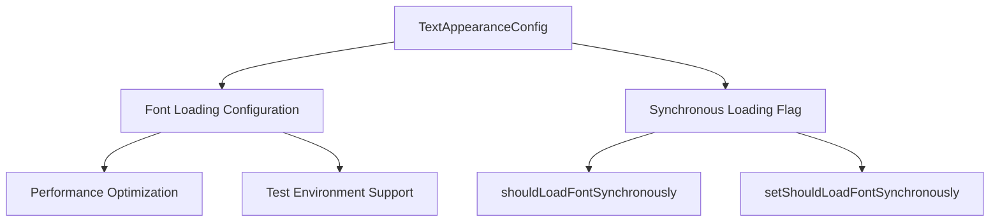
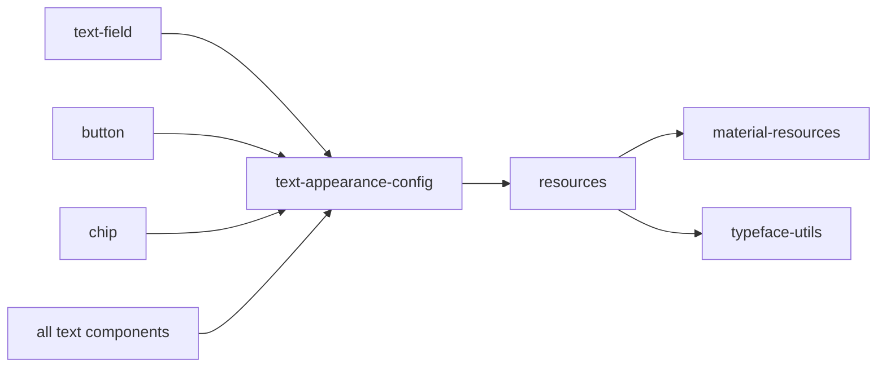
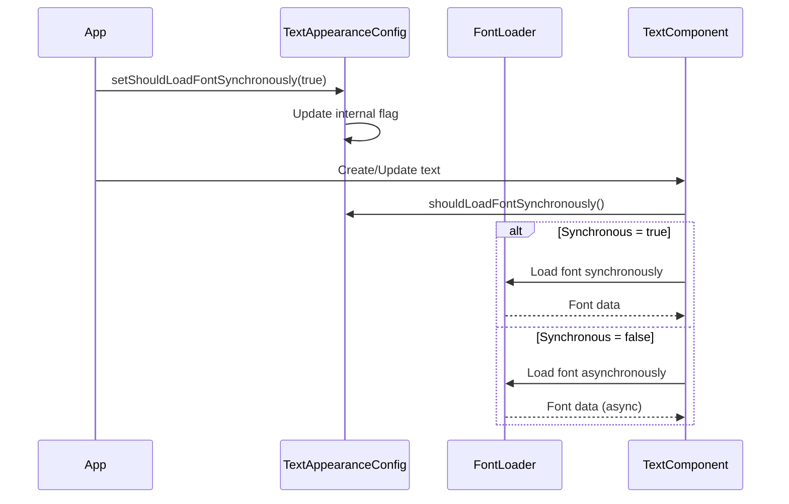
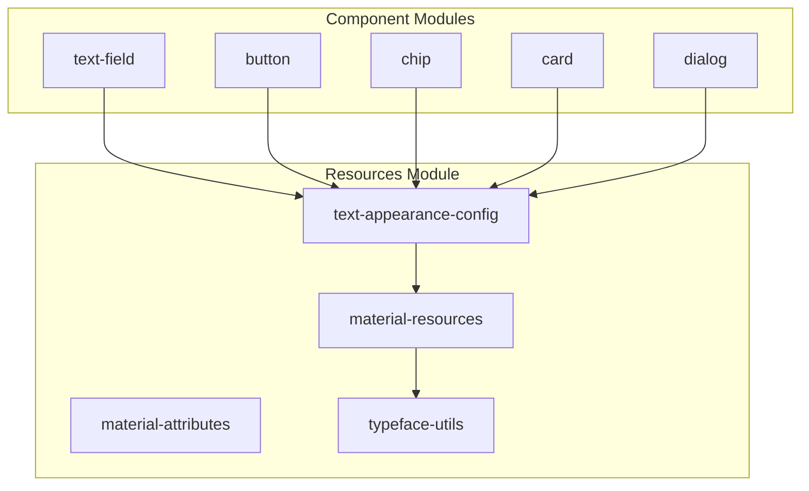
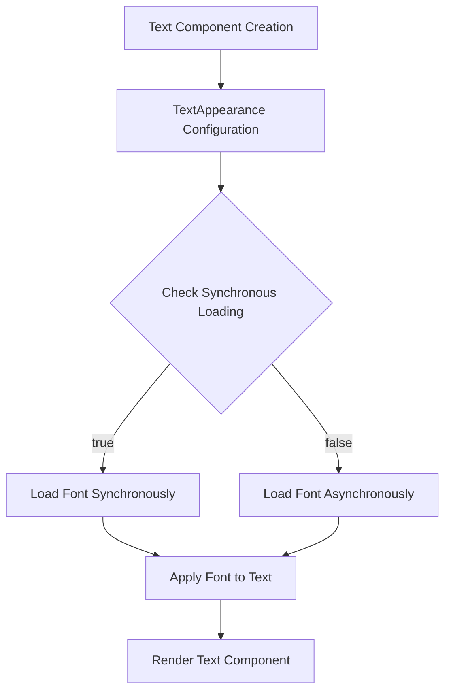

# Text Appearance Configuration Module

## Introduction

The text-appearance-config module provides configuration utilities for managing text appearance behavior in Material Design components. This module is part of the broader Material Design Components (MDC) library and specifically handles font loading synchronization settings for text appearance components.

## Module Overview

The text-appearance-config module is a utility-focused component within the Material Design resources system. It provides a centralized configuration mechanism for controlling how font resources are loaded across Material Design text components, ensuring consistent behavior and performance optimization.

## Core Architecture

### Component Structure



### Module Dependencies



## Core Components

### TextAppearanceConfig

The `TextAppearanceConfig` class serves as the primary configuration utility for text appearance behavior across Material Design components.

**Key Features:**
- Global font loading synchronization control
- Thread-safe configuration management
- Backward compatibility maintenance
- Test environment optimization

**Class Declaration:**
```java
@Deprecated
public class TextAppearanceConfig
```

**Note:** This class is deprecated as of the current version since TextAppearance now handles font caching internally.

## Configuration Management

### Synchronous Font Loading

The module provides a boolean flag to control whether font resources should be loaded synchronously or asynchronously.



### Configuration Methods

#### setShouldLoadFontSynchronously(boolean flag)
- **Purpose**: Controls font loading behavior
- **Default**: `false` (asynchronous loading)
- **Use Case**: Set to `true` in test environments to prevent flakiness
- **Thread Safety**: Thread-safe implementation

#### shouldLoadFontSynchronously()
- **Purpose**: Retrieves current font loading configuration
- **Return**: Current synchronous loading flag state
- **Usage**: Called internally by text components

## Integration with Material Design System

### Resource Module Relationships



### Text Appearance Flow



## Usage Patterns

### Production Environment
In production environments, the default asynchronous font loading ensures smooth UI performance and prevents ANR (Application Not Responding) errors.

### Testing Environment
For emulator and instrumentation tests, synchronous loading is recommended to ensure deterministic behavior and prevent test flakiness.

```java
// Test setup
@Before
public void setup() {
    TextAppearanceConfig.setShouldLoadFontSynchronously(true);
}

@After
public void teardown() {
    TextAppearanceConfig.setShouldLoadFontSynchronously(false);
}
```

## Performance Considerations

### Asynchronous Loading (Default)
- **Advantages**: Prevents UI blocking, better user experience
- **Disadvantages**: Potential brief text rendering delays
- **Use Case**: Production applications

### Synchronous Loading
- **Advantages**: Deterministic behavior, immediate font availability
- **Disadvantages**: May cause UI blocking for large fonts
- **Use Case**: Testing environments, critical UI components

## Deprecation Notice

As noted in the class documentation, `TextAppearanceConfig` is deprecated because modern TextAppearance implementations now handle font caching internally. This means:

1. **Automatic Optimization**: TextAppearance automatically checks if fonts are already cached
2. **Reduced Configuration**: No manual configuration required for optimal performance
3. **Backward Compatibility**: Existing code continues to function but migration is recommended

## Migration Path

For applications currently using `TextAppearanceConfig`:

1. **Remove Configuration Calls**: Eliminate calls to `setShouldLoadFontSynchronously()`
2. **Rely on Internal Caching**: Trust TextAppearance's internal font caching mechanism
3. **Update Test Strategies**: Use alternative methods for test stability if needed

## Related Documentation

- [material-resources.md](material-resources.md) - Core resource management
- [typeface-utils.md](typeface-utils.md) - Font and typeface utilities
- [text-field.md](text-field.md) - Text field components that utilize text appearance
- [button.md](button.md) - Button components with text styling
- [theme.md](theme.md) - Material Design theming system

## Best Practices

1. **Avoid Deprecated APIs**: Plan migration away from TextAppearanceConfig
2. **Test Environment Setup**: Use synchronous loading only when necessary for test stability
3. **Monitor Performance**: Observe font loading behavior in production
4. **Consistent Configuration**: Apply configuration changes consistently across the application
5. **Documentation**: Document any custom font loading behavior for team reference