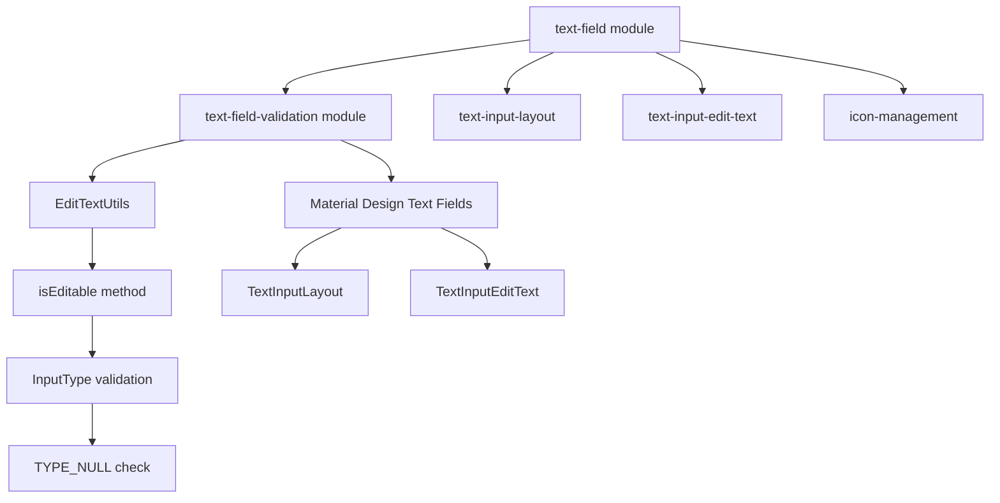
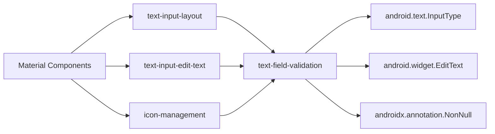
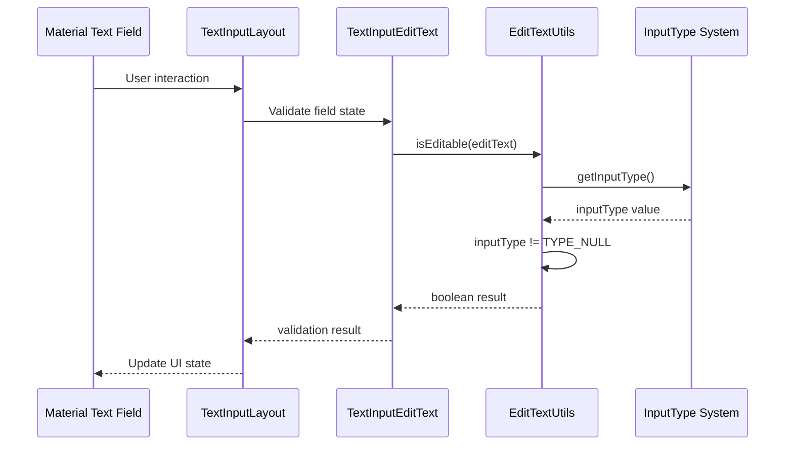

# Text Field Validation Module

## Introduction

The text-field-validation module provides essential validation utilities for text input fields in Material Design components. This module is a critical subcomponent of the broader text-field module, offering core functionality to determine the editability state of text input fields. The module's primary purpose is to provide reliable validation mechanisms that ensure text fields behave correctly based on their input type configuration.

## Core Functionality

The module centers around the `EditTextUtils` utility class, which provides a single, focused method for validating whether an EditText widget is editable based on its input type configuration. This validation is fundamental to the proper functioning of Material Design text fields, ensuring that user interactions and UI states are correctly managed.

## Architecture

### Component Structure



### Module Dependencies



## Core Components

### EditTextUtils Class

The `EditTextUtils` class serves as a utility provider for EditText validation operations. This class is designed with the following characteristics:

- **Singleton Pattern**: Private constructor prevents instantiation, promoting static utility usage
- **Static Methods**: All functionality is exposed through static methods for easy access
- **Null Safety**: Utilizes `@NonNull` annotations to ensure type safety
- **Focused Scope**: Single responsibility principle with one core validation method

#### Key Method: isEditable

```java
static boolean isEditable(@NonNull EditText editText)
```

**Purpose**: Determines whether an EditText widget is editable based on its input type configuration.

**Parameters**:
- `editText`: The EditText instance to validate (annotated with `@NonNull`)

**Returns**: `boolean` - `true` if the EditText is editable, `false` otherwise

**Validation Logic**: The method checks if the EditText's input type is not equal to `InputType.TYPE_NULL`. This approach provides a reliable way to determine editability because:

- `TYPE_NULL` indicates that the input field is not intended for text input
- Any other input type (text, number, email, etc.) implies the field is editable
- This aligns with Android's input type system design

## Data Flow



## Integration with Material Components

The text-field-validation module integrates seamlessly with other Material Design components:

### TextInputLayout Integration
The validation utilities are used by `TextInputLayout` to determine appropriate error states, hint behaviors, and interaction patterns based on whether the contained EditText is actually editable.

### TextInputEditText Integration
`TextInputEditText` components leverage the validation to ensure proper behavior when configured with different input types, maintaining consistency with Material Design specifications.

### Icon Management Integration
The icon management subsystem uses validation results to determine when to show/hide interaction icons based on field editability.

## Usage Patterns

### Basic Validation
```java
EditText editText = findViewById(R.id.edit_text);
boolean isEditable = EditTextUtils.isEditable(editText);
```

### Conditional UI Updates
```java
if (EditTextUtils.isEditable(editText)) {
    // Enable editing features
    editText.setFocusable(true);
    editText.setClickable(true);
} else {
    // Disable editing features
    editText.setFocusable(false);
    editText.setClickable(false);
}
```

## Error Handling and Edge Cases

The module handles several edge cases through its design:

- **Null Safety**: The `@NonNull` annotation ensures compile-time null safety
- **Input Type Variations**: Handles all Android input types correctly
- **Performance**: Static method design ensures minimal overhead
- **Thread Safety**: Stateless design makes it inherently thread-safe

## Relationship to Other Modules

### Parent Module: text-field
The text-field-validation module is an integral part of the text-field module, providing essential validation capabilities that other submodules depend on.

### Related Modules
- **[text-input-layout](text-input-layout.md)**: Uses validation for managing field states and error handling
- **[text-input-edit-text](text-input-edit-text.md)**: Relies on validation for proper edit behavior
- **[icon-management](icon-management.md)**: Utilizes validation results for icon state management

### System Integration
The module works within the broader Material Design system:
- **[theme](theme.md)**: Validation respects theme-based input configurations
- **[resources](resources.md)**: Input type configurations may reference resource-defined styles
- **[internal](internal.md)**: Uses internal utilities for system integration

## Best Practices

### When to Use
- Validate EditText editability before enabling editing features
- Check field states before processing user input
- Determine appropriate UI states based on editability

### Performance Considerations
- The static method design ensures minimal performance overhead
- Input type checking is a lightweight operation
- No object instantiation required

### Maintenance Guidelines
- The module's focused scope makes it stable and low-maintenance
- Changes to Android's InputType system would require updates
- Annotation-based null safety should be maintained

## Future Considerations

The module's design allows for potential extensions:
- Additional validation methods for specific input types
- Enhanced error reporting capabilities
- Integration with accessibility services
- Support for custom input type validation

## Conclusion

The text-field-validation module provides a crucial foundation for Material Design text field functionality. Its focused scope, reliable validation logic, and seamless integration with other components make it an essential part of the Material Components library. The module's design principles of simplicity, reliability, and performance ensure it will continue to serve as a stable foundation for text field validation in Android applications.