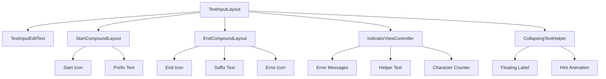

# Text Field Module Documentation

## Overview

The text-field module is a core component of the Material Design Components library for Android, providing enhanced text input functionality with floating labels, validation, and various visual styles. It implements Material Design text field specifications with support for filled, outlined, and legacy text field appearances.

## Architecture

The text-field module follows a hierarchical architecture with `TextInputLayout` as the main container that wraps an `EditText` or `TextInputEditText`. The module is organized into several key components that work together to provide a comprehensive text input solution.



## Core Components

### TextInputLayout
The main container class that wraps an EditText to provide Material Design text field functionality. It manages the overall state, appearance, and behavior of the text field.

### TextInputEditText
A specialized EditText designed to work with TextInputLayout, providing enhanced accessibility support and proper hint handling.

### Supporting Components
- **EditTextUtils**: Utility functions for EditText operations
- **IconHelper**: Manages icon-related functionality including tinting, click handling, and accessibility

## Key Features

### Visual Styles
- **Filled Text Fields**: Solid background color with rounded corners
- **Outlined Text Fields**: Transparent background with outlined border
- **Legacy Text Fields**: Traditional underline-only appearance

### Interactive Elements
- **Floating Labels**: Hints that animate above the input when focused
- **Start/End Icons**: Actionable icons positioned at the start or end of the field
- **Prefix/Suffix Text**: Static text elements for context (e.g., currency symbols)

### Validation and Feedback
- **Error Messages**: Dynamic error display with customizable styling
- **Helper Text**: Contextual information below the input
- **Character Counter**: Real-time character count with overflow indication

### Advanced Features
- **Password Toggle**: Built-in password visibility toggle functionality
- **Dropdown Menu**: Support for AutoCompleteTextView with dropdown indicators
- **Placeholder Text**: Temporary text shown when field is empty
- **Custom End Icons**: Support for custom icon modes and behaviors

## Sub-modules

The text-field module is organized into several specialized sub-modules:

### [text-input-layout](text-input-layout.md)
The main container component that orchestrates all text field functionality, managing layout, state, and coordination between sub-components.

### [text-input-edit-text](text-input-edit-text.md)
The specialized EditText implementation designed to work seamlessly with TextInputLayout, providing enhanced accessibility and hint management.

### [icon-management](icon-management.md)
Comprehensive icon handling system for start icons, end icons, and error icons, including tinting, click handling, and accessibility features.

### [text-field-validation](text-field-validation.md)
Validation and feedback system including error messages, helper text, and character counting functionality.

## Integration with Other Modules

The text-field module integrates with several other Material Design Components:

- **[shape](shape.md)**: Uses shape appearance models for customizable corner radii and backgrounds
- **[color](color.md)**: Leverages color harmonization and theming for consistent visual appearance
- **[theme](theme.md)**: Integrates with Material theme system for consistent styling
- **[internal](internal.md)**: Utilizes internal utilities for view management and theming

## Usage Patterns

### Basic Implementation
```xml
<com.google.android.material.textfield.TextInputLayout
    android:layout_width="match_parent"
    android:layout_height="wrap_content"
    android:hint="@string/label">
    
    <com.google.android.material.textfield.TextInputEditText
        android:layout_width="match_parent"
        android:layout_height="wrap_content"/>
        
</com.google.android.material.textfield.TextInputLayout>
```

### Advanced Configuration
```xml
<com.google.android.material.textfield.TextInputLayout
    android:layout_width="match_parent"
    android:layout_height="wrap_content"
    android:hint="@string/label"
    app:endIconMode="password_toggle"
    app:counterEnabled="true"
    app:counterMaxLength="20"
    app:errorEnabled="true"
    app:helperText="Helper text"
    app:startIconDrawable="@drawable/ic_person">
    
    <com.google.android.material.textfield.TextInputEditText
        android:layout_width="match_parent"
        android:layout_height="wrap_content"
        android:inputType="textPassword"/>
        
</com.google.android.material.textfield.TextInputLayout>
```

## Design Considerations

### Accessibility
- Full screen reader support with proper content descriptions
- Keyboard navigation support
- High contrast mode compatibility
- Proper focus management

### Performance
- Efficient text measurement and layout calculations
- Optimized animation systems for smooth hint transitions
- Minimal memory footprint through view recycling

### Customization
- Extensive theming support through Material Design tokens
- Programmatic API for runtime configuration
- Support for custom validation logic and error handling

## Best Practices

1. **Always use TextInputEditText** as the child of TextInputLayout for proper functionality
2. **Set hints on TextInputLayout** rather than the EditText for proper floating label behavior
3. **Use appropriate input types** to leverage built-in keyboard optimizations
4. **Implement proper validation** using the built-in error handling system
5. **Consider accessibility** by providing content descriptions for icons and clear error messages

## Related Documentation

- [Material Design Text Fields Guidelines](https://material.io/components/text-fields)
- [Component Developer Guidance](https://github.com/material-components/material-components-android/blob/master/docs/components/TextField.md)
- [Android EditText Documentation](https://developer.android.com/reference/android/widget/EditText)