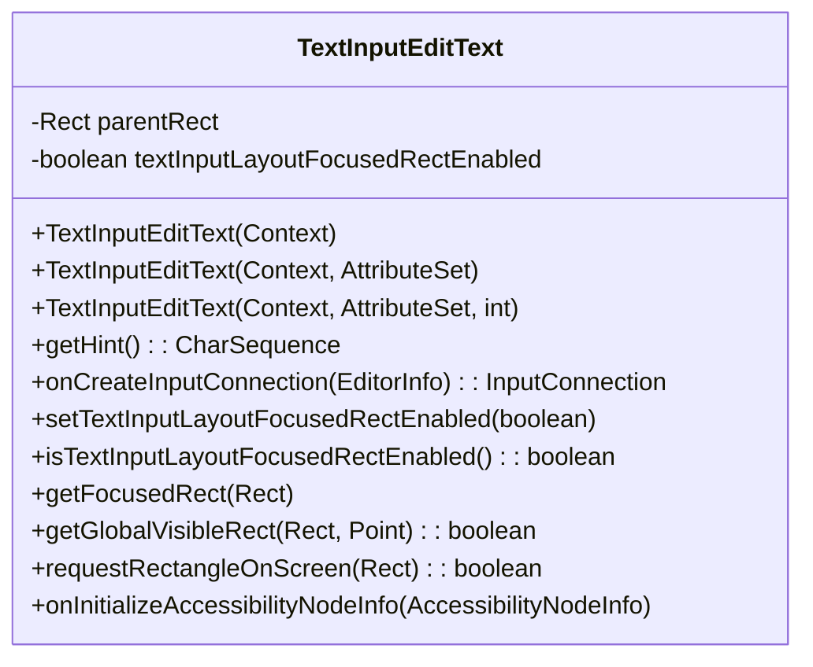
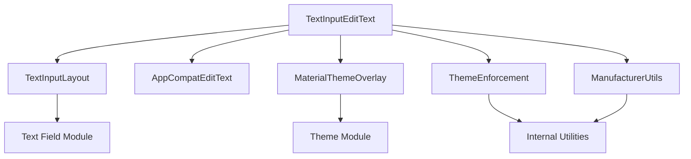
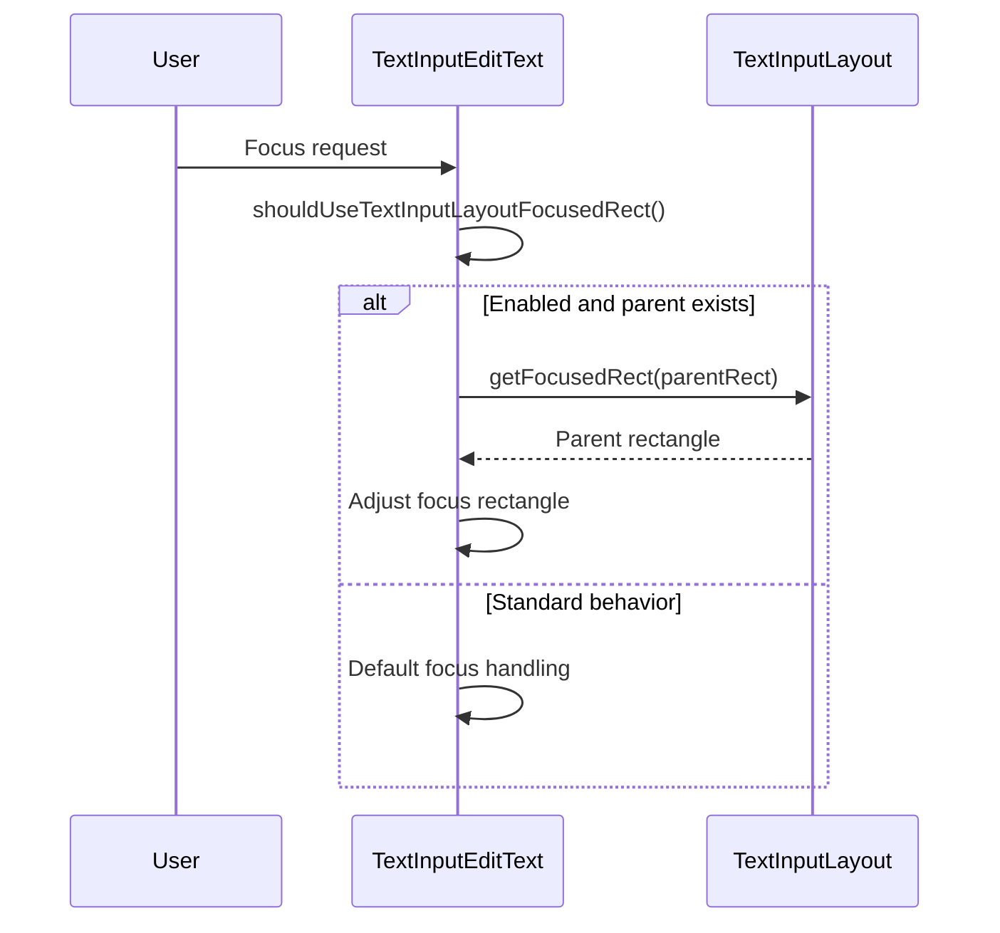
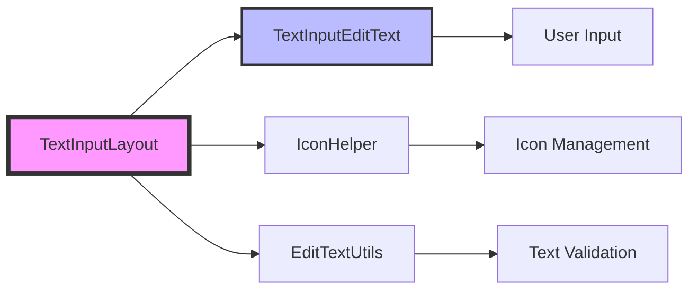
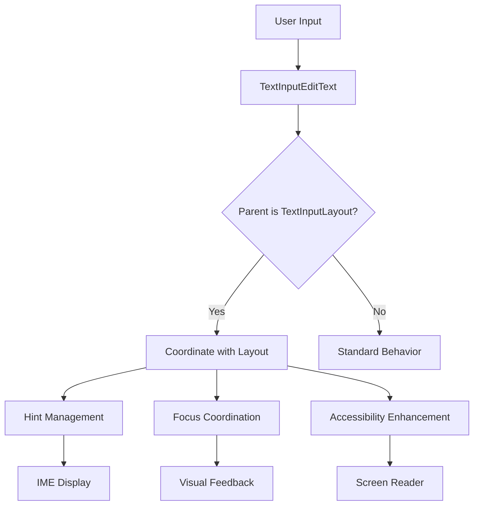
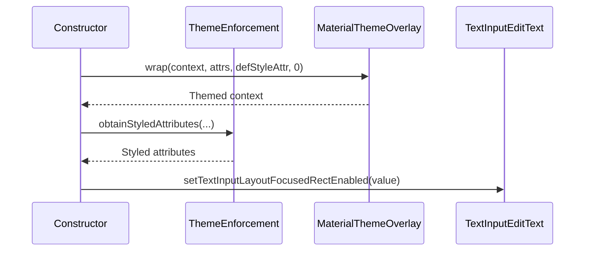
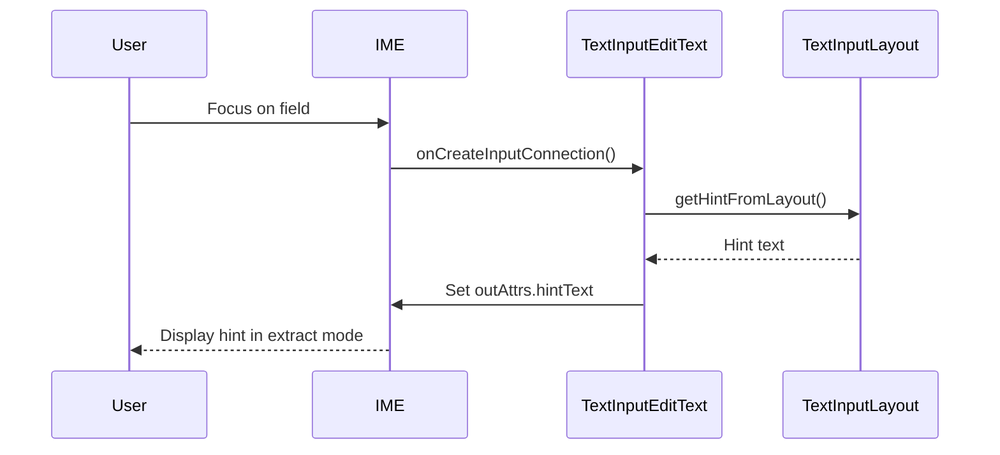

# Text Input Edit Text Module

## Overview

The Text Input Edit Text module provides a specialized EditText component designed specifically for use within Material Design text fields. It extends AppCompatEditText to provide enhanced functionality when used as a child of TextInputLayout, including improved accessibility support, IME hint display, and focused rectangle coordination.

## Purpose and Core Functionality

TextInputEditText serves as the primary text input component within Material Design's text field system. It addresses specific requirements that standard EditText components cannot fulfill when used inside TextInputLayout containers:

- **IME Integration**: Displays hints in extract mode for better user experience
- **Accessibility Enhancement**: Provides proper accessibility announcements and labeling
- **Layout Coordination**: Synchronizes focus behavior and visual rectangles with parent TextInputLayout
- **Device Compatibility**: Includes workarounds for manufacturer-specific issues (e.g., Meizu devices)

## Architecture and Component Structure

### Core Component



### Module Dependencies



## Key Features and Behaviors

### 1. Hint Management

TextInputEditText implements sophisticated hint handling that coordinates with its parent TextInputLayout:

- **Dynamic Hint Retrieval**: When TextInputLayout provides the hint, the edit text retrieves it dynamically from the parent
- **IME Hint Display**: Ensures hints are properly displayed in extract mode by setting the EditorInfo hint text
- **Accessibility Labeling**: Combines input text and hint text for proper screen reader announcements

### 2. Focus Rectangle Coordination

The component provides advanced focus management that can delegate focus rectangle handling to the parent TextInputLayout:



### 3. Accessibility Support

Enhanced accessibility features ensure proper interaction with assistive technologies:

- **Node Info Text**: Combines input text and hint for comprehensive announcements
- **API Compatibility**: Special handling for Android versions below API 23
- **Screen Reader Support**: Proper labeling and description for accessibility services

### 4. Device Compatibility

Includes specific workarounds for device manufacturer issues:

- **Meizu Device Fix**: Forces hint layout creation to prevent crashes
- **Global Rectangle Calculation**: Proper offset handling for scroll positions

## Integration with Text Field System



## Usage Patterns

### Basic Implementation

```java
TextInputLayout textInputLayout = findViewById(R.id.text_input_layout);
TextInputEditText editText = new TextInputEditText(textInputLayout.getContext());
textInputLayout.addView(editText);
```

### Focus Rectangle Delegation

```java
editText.setTextInputLayoutFocusedRectEnabled(true);
// Focus rectangles will now be handled by the parent TextInputLayout
```

## Data Flow Architecture



## Component Relationships

### Parent Module Dependencies

- **[Text Field Module](text-field.md)**: TextInputEditText is designed to work exclusively within TextInputLayout containers
- **[Theme Module](theme.md)**: Utilizes MaterialThemeOverlay for consistent theming
- **[Internal Utilities](internal.md)**: Leverages ThemeEnforcement and ManufacturerUtils for compatibility

### Child Component Context

TextInputEditText operates as part of the larger text field ecosystem:

- **TextInputLayout**: Parent container that manages overall text field behavior
- **IconHelper**: Handles icon display within the text field
- **EditTextUtils**: Provides text validation and manipulation utilities

## Process Flows

### Initialization Flow



### Runtime Interaction Flow



## Configuration Options

### XML Attributes

- `textInputLayoutFocusedRectEnabled`: Boolean attribute to enable focus rectangle delegation to parent TextInputLayout

### Programmatic Configuration

- `setTextInputLayoutFocusedRectEnabled(boolean)`: Enable/disable focus rectangle coordination
- `isTextInputLayoutFocusedRectEnabled()`: Check current focus rectangle delegation state

## Best Practices

1. **Context Usage**: Always use TextInputLayout's context when programmatically creating TextInputEditText
2. **Focus Management**: Enable focused rectangle delegation for consistent visual behavior
3. **Accessibility**: Leverage built-in accessibility features for better user experience
4. **Device Testing**: Test on various devices due to manufacturer-specific implementations

## Related Documentation

- [Text Field Module](text-field.md) - Complete text field system documentation
- [Theme Module](theme.md) - Material Design theming system
- [Internal Utilities](internal.md) - Compatibility and utility functions