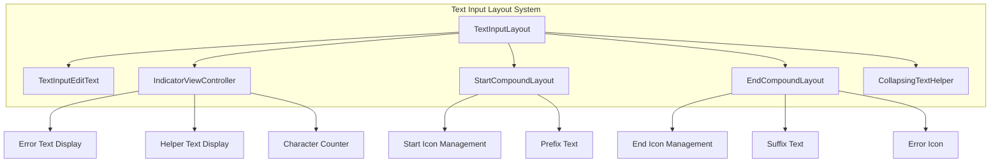
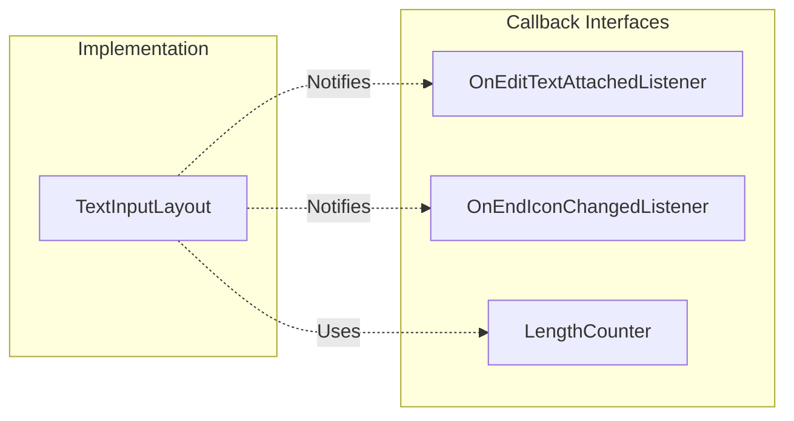
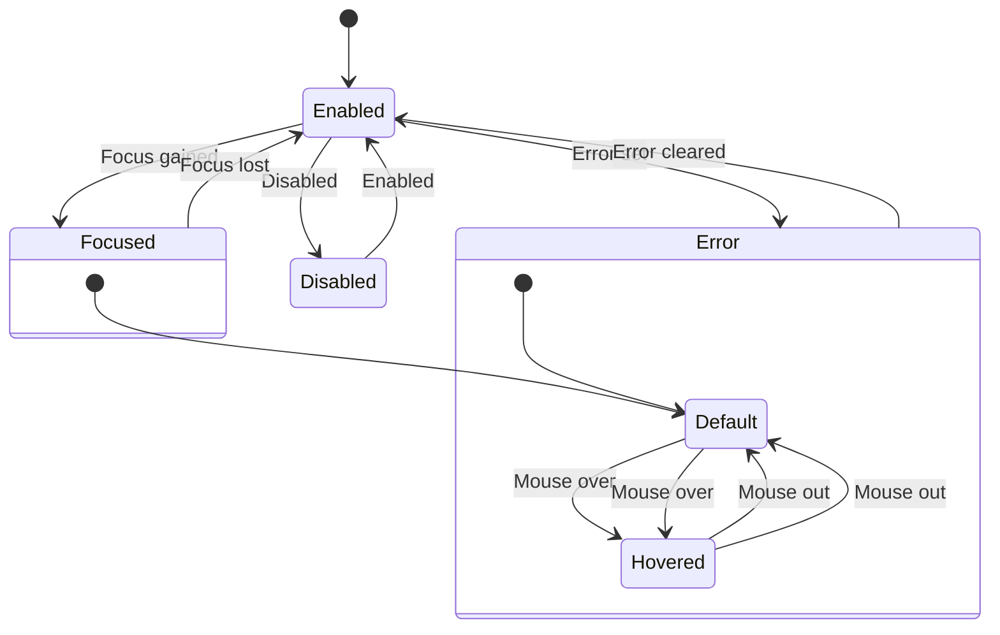
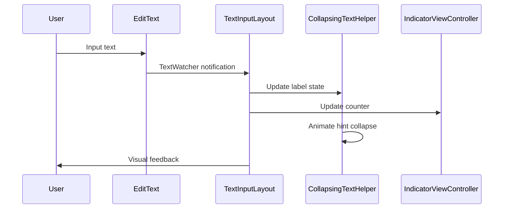
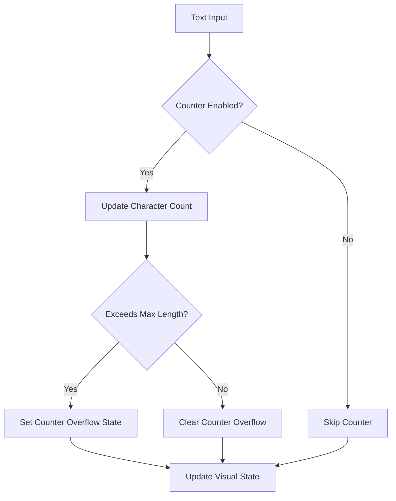
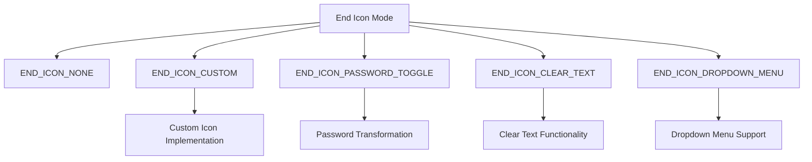

# Text Input Layout Module

## Overview

The Text Input Layout module provides a comprehensive text field component system for Android applications, implementing Material Design text field specifications. It offers enhanced text input functionality with floating labels, validation, and various visual styles including outlined, filled, and legacy text fields.

## Purpose and Core Functionality

The TextInputLayout serves as a wrapper around EditText components, providing:

- **Floating Label Animation**: Hints that animate from placeholder position to floating label
- **Input Validation**: Error and helper text display with visual feedback
- **Multiple Visual Styles**: Outlined, filled, and legacy text field appearances
- **Icon Integration**: Start and end icon support with customizable behaviors
- **Character Counting**: Built-in character counter with overflow detection
- **Accessibility**: Comprehensive accessibility support for screen readers
- **State Management**: Visual state changes based on focus, error, and content states

## Architecture and Component Relationships

### Core Components



### Key Interfaces and Callbacks



## Component Details

### TextInputLayout
The main container class that orchestrates all text field functionality. It extends LinearLayout and manages the overall text field state, including:

- **Box Background Modes**: Supports three distinct visual styles
  - `BOX_BACKGROUND_NONE`: Legacy underline style
  - `BOX_BACKGROUND_FILLED`: Filled background with underline
  - `BOX_BACKGROUND_OUTLINE`: Outlined box with floating label

- **State Management**: Handles focus, error, hover, and disabled states
- **Animation Control**: Manages hint expansion/collapse animations
- **Accessibility**: Provides comprehensive accessibility support

### Layout Components

#### StartCompoundLayout
Manages the start-side elements of the text field:
- Start icon display and interaction
- Prefix text positioning and styling
- Start dummy drawable management for text alignment

#### EndCompoundLayout
Handles the end-side elements:
- End icon modes (custom, password toggle, clear text, dropdown)
- Suffix text positioning and styling
- Error icon display
- End dummy drawable management

#### IndicatorViewController
Manages text indicators below the input field:
- Error message display with animation
- Helper text presentation
- Character counter with overflow detection
- Text appearance and color management

### Visual States and Styling



## Data Flow and Processing

### Text Input Flow


### Validation Flow


## Integration with Material Design System

### Theme Integration
The TextInputLayout integrates with the Material Design theme system through:
- Color attribute resolution from current theme
- Shape appearance model for rounded corners
- Elevation and shadow effects
- Motion specifications for animations

### Dependencies
- **Material Colors**: Uses [color.md](color.md) for color state management
- **Shape System**: Integrates with [shape.md](shape.md) for corner radius and styling
- **Animation**: Utilizes [animation.md](animation.md) for hint transitions
- **Theme Management**: Works with [theme.md](theme.md) for consistent styling

## End Icon System

### End Icon Modes


### End Icon Behavior
Each end icon mode provides specific functionality:
- **Password Toggle**: Switches between password visibility states
- **Clear Text**: Removes all text when clicked
- **Dropdown Menu**: Shows/hides autocomplete dropdown
- **Custom**: User-defined icon with custom click behavior

## Accessibility Features

### Screen Reader Support
- Comprehensive content descriptions for icons
- Proper hint text announcement
- Error state communication
- Character counter descriptions
- Label and helper text relationships

### Keyboard Navigation
- Full keyboard accessibility support
- Proper focus management
- Tab order optimization
- Action button keyboard activation

## Performance Considerations

### Optimization Strategies
- **View Recycling**: Efficient view state management
- **Animation Optimization**: Hardware-accelerated transitions
- **Text Measurement Caching**: Reduced layout calculations
- **State Batch Updates**: Minimized redraw operations

### Memory Management
- Drawable resource recycling
- Listener cleanup on view detachment
- Animation resource disposal
- State object optimization

## Usage Patterns

### Basic Implementation
```xml
<com.google.android.material.textfield.TextInputLayout
    android:layout_width="match_parent"
    android:layout_height="wrap_content"
    android:hint="@string/form_username"
    app:endIconMode="clear_text">
    
    <com.google.android.material.textfield.TextInputEditText
        android:layout_width="match_parent"
        android:layout_height="wrap_content"/>
        
</com.google.android.material.textfield.TextInputLayout>
```

### Advanced Configuration
- Custom end icon implementations
- Complex validation logic
- Themed styling integration
- Animation customization

## Error Handling and Validation

### Error State Management
The TextInputLayout provides comprehensive error handling through:
- Visual error indicators
- Error text display with animation
- Error icon presentation
- Accessibility error announcements
- State persistence across configuration changes

### Validation Integration
- Character counter validation
- Custom validation logic support
- Error message customization
- Helper text for guidance
- Content description for accessibility

This module represents a complete text input solution that balances functionality, accessibility, and visual design according to Material Design principles while providing extensive customization options for diverse application needs.