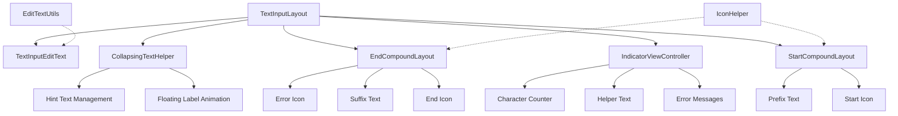
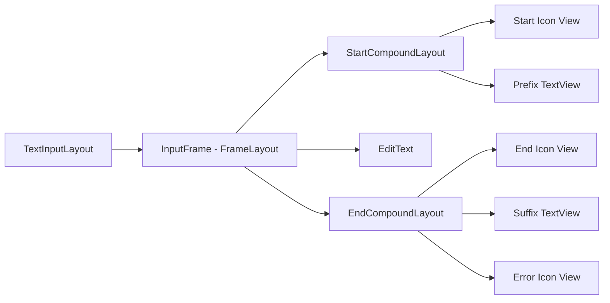
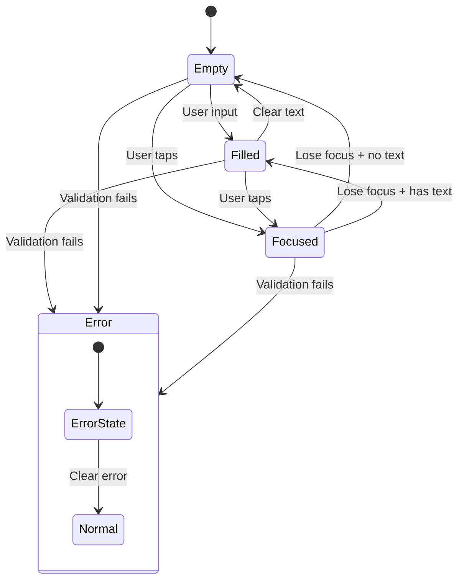

# TextField Module Documentation

## Overview

The TextField module provides Material Design text input components for Android applications. It implements the Material Design text field specification with support for various input types, validation, and visual enhancements. The module is built around the core `TextInputLayout` component which wraps standard Android `EditText` widgets to provide Material Design styling and functionality.

## Architecture



## Core Components

### TextInputLayout
The main container component that wraps an EditText to provide Material Design text field functionality. It manages:
- Floating label animations
- Error state handling
- Helper text display
- Character counting
- Box background styling (filled, outlined, or none)
- Start and end icon management
- Prefix and suffix text

### TextInputEditText
A specialized EditText designed to work with TextInputLayout. It provides:
- Enhanced accessibility support
- Proper hint handling for IME
- Integration with TextInputLayout's features
- Support for focused rectangle management

### Supporting Components

#### EditTextUtils
Utility class providing helper methods for EditText operations:
- `isEditable()` - Checks if an EditText is editable based on its input type

#### IconHelper
Manages icon-related functionality for text fields:
- Icon click handling and accessibility
- Icon tinting and styling
- Tooltip management
- Ripple effect setup
- Scale type conversion

## Features

### Text Field Variants
1. **Filled Text Fields** - Text fields with a filled background
2. **Outlined Text Fields** - Text fields with an outline border
3. **Standard Text Fields** - Text fields with no background (underline only)

### Interactive Elements
- **Start Icons** - Icons displayed at the start of the text field
- **End Icons** - Icons displayed at the end with various modes:
  - Password toggle
  - Clear text
  - Dropdown menu
  - Custom icons
- **Prefix/Suffix Text** - Static text displayed before or after the input

### Validation and Feedback
- **Error Messages** - Display validation errors below the text field
- **Helper Text** - Display helpful information below the text field
- **Character Counter** - Show current/max character count
- **Color State Changes** - Visual feedback for different states (focused, error, disabled)

### Accessibility
- Full screen reader support
- Proper content descriptions for icons
- Accessibility announcements for errors and helper text
- IME hint support for extract mode

## Integration with Other Modules

The TextField module integrates with several other Material Design components:

- **[Shape Module](shape.md)**: Uses `ShapeAppearanceModel` for customizable box backgrounds
- **[Color Module](color.md)**: Leverages Material color theming for consistent styling
- **[Animation Module](transition.md)**: Uses transition animations for hint expansion/collapse
- **[Theme Module](theme.md)**: Integrates with Material theming system

## Usage Examples

### Basic Text Field
```xml
<com.google.android.material.textfield.TextInputLayout
    android:layout_width="match_parent"
    android:layout_height="wrap_content"
    android:hint="Username">
    
    <com.google.android.material.textfield.TextInputEditText
        android:layout_width="match_parent"
        android:layout_height="wrap_content"/>
        
</com.google.android.material.textfield.TextInputLayout>
```

### Outlined Text Field with Validation
```xml
<com.google.android.material.textfield.TextInputLayout
    android:layout_width="match_parent"
    android:layout_height="wrap_content"
    android:hint="Email"
    app:boxBackgroundMode="outline"
    app:errorEnabled="true"
    app:helperTextEnabled="true"
    app:helperText="Enter your email address">
    
    <com.google.android.material.textfield.TextInputEditText
        android:layout_width="match_parent"
        android:layout_height="wrap_content"
        android:inputType="textEmailAddress"/>
        
</com.google.android.material.textfield.TextInputLayout>
```

### Password Field with Toggle
```xml
<com.google.android.material.textfield.TextInputLayout
    android:layout_width="match_parent"
    android:layout_height="wrap_content"
    android:hint="Password"
    app:endIconMode="password_toggle">
    
    <com.google.android.material.textfield.TextInputEditText
        android:layout_width="match_parent"
        android:layout_height="wrap_content"
        android:inputType="textPassword"/>
        
</com.google.android.material.textfield.TextInputLayout>
```

## Implementation Details

### State Management
The TextInputLayout manages complex state transitions between:
- Empty/filled states
- Focused/unfocused states
- Error/normal states
- Enabled/disabled states

### Animation System
- Hint expansion/collapse animations using `CollapsingTextHelper`
- Smooth transitions between text field states
- Configurable animation durations and interpolators

### Performance Considerations
- Efficient text measurement and layout
- Optimized drawable state management
- Minimal allocations during text changes

## Key Implementation Patterns

### Layout Architecture
The TextInputLayout uses a sophisticated internal layout structure:



### State Management Flow


### Text Measurement and Layout
The module implements sophisticated text measurement to handle:
- Multi-line hint text with proper line spacing
- Dynamic placeholder text positioning
- Icon sizing and positioning relative to text
- Cutout calculations for outlined text fields

### Animation System
Animations are handled through the `CollapsingTextHelper` which manages:
- Hint text expansion/collapse with proper interpolation
- Color transitions between states
- Cutout animations for outlined fields
- Placeholder fade in/out effects

## Performance Optimizations

### Text Change Handling
- Efficient text length counting with customizable counters
- Batch updates for multiple property changes
- Lazy initialization of optional components

### Drawable Management
- State-based drawable updates to minimize allocations
- Proper drawable mutation to avoid state conflicts
- Efficient color filter application

### Layout Optimizations
- Smart measurement caching for text dimensions
- Conditional layout updates based on actual changes
- Efficient cutout recalculation

## Accessibility Implementation

### Screen Reader Support
- Proper content descriptions for all interactive elements
- Accessibility announcements for state changes
- Label-for relationships between components
- Live regions for dynamic content updates

### Keyboard Navigation
- Proper focus management between EditText and icon views
- Tab order optimization
- Focus indicators for custom icon buttons

## Error Handling and Validation

### Error State Management
- Automatic error display based on validation rules
- Error icon integration with existing end icons
- Color state propagation to all relevant components
- Accessibility announcements for error states

### Validation Integration
- Support for custom length counters
- Integration with form validation systems
- Real-time validation feedback
- Error message content description support

## Customization and Theming

### Material Theming Integration
- Automatic color extraction from theme attributes
- Shape appearance model integration for customizable corners
- Typography theming support
- Elevation and shadow theming

### Custom Icon Support
- Drawable tinting with theme-aware color state lists
- Custom click handling for start and end icons
- Icon state management (checkable, visible, activated)
- Content description and tooltip support

## Related Documentation

- [TextInputLayout API Reference](https://developer.android.com/reference/com/google/android/material/textfield/TextInputLayout)
- [Material Design Text Fields Guidelines](https://material.io/components/text-fields)
- [TextInputEditText API Reference](https://developer.android.com/reference/com/google/android/material/textfield/TextInputEditText)
- [Material Theming Guide](https://material.io/design/material-theming/overview.html)