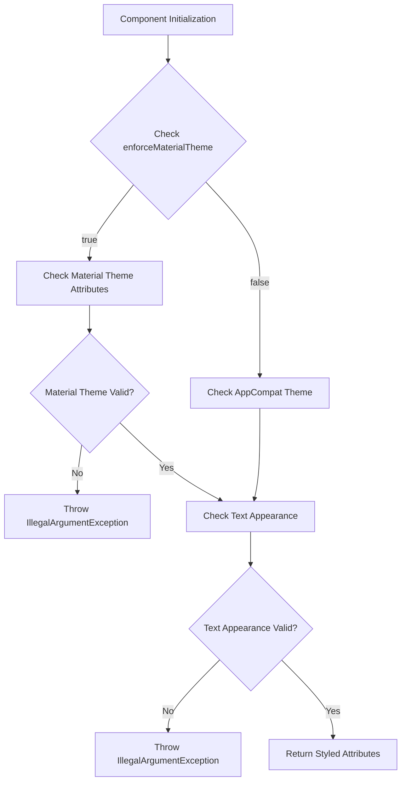
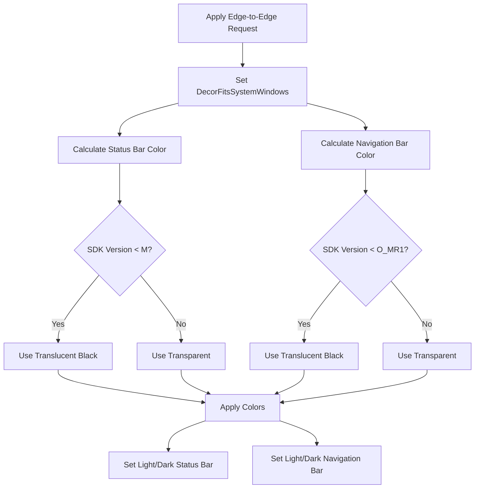
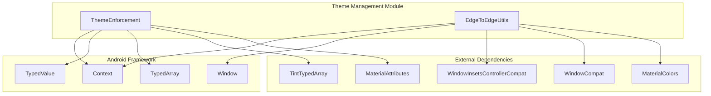
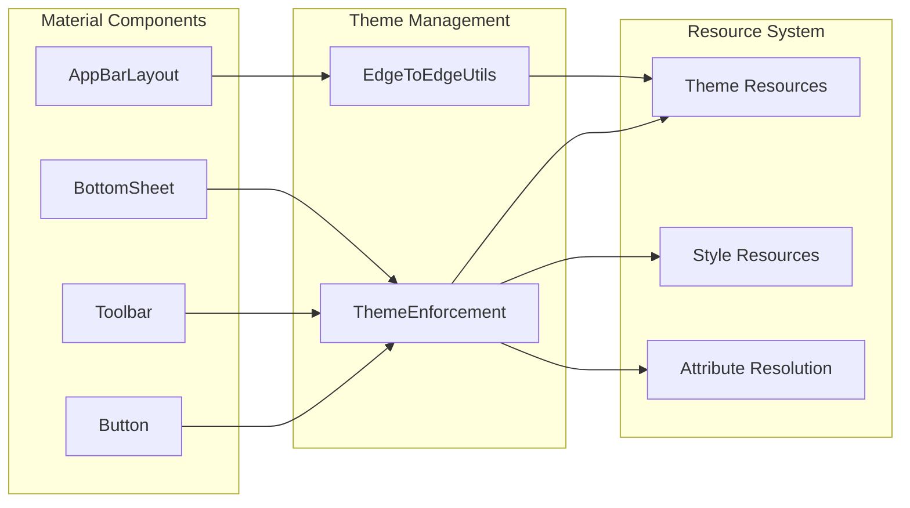
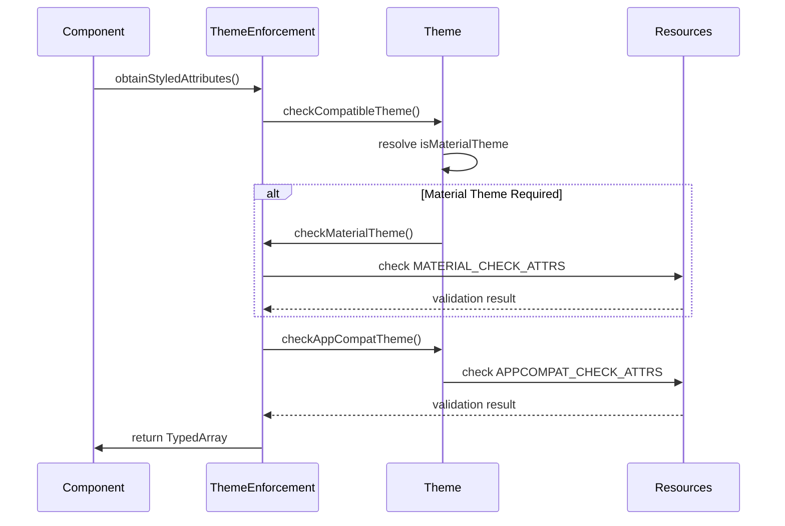
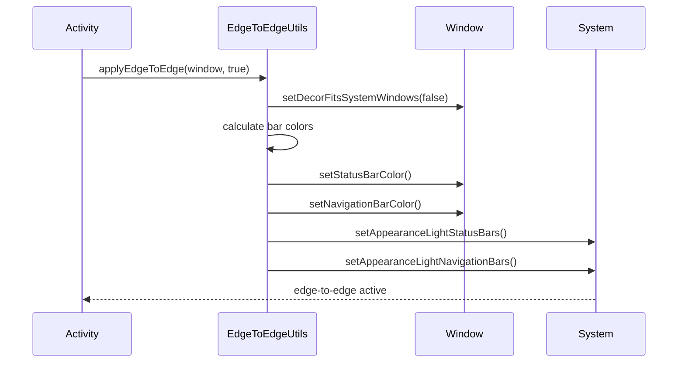
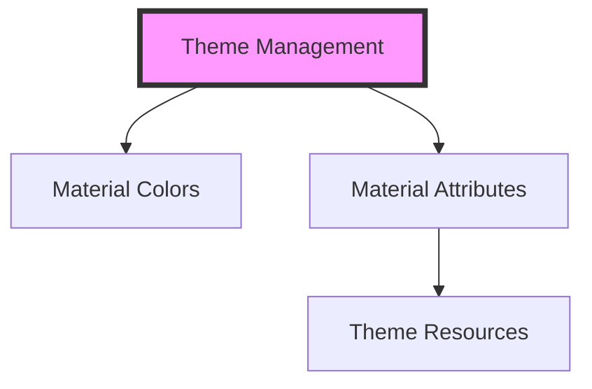

# Theme Management Module Documentation

## Introduction

The theme-management module is a critical internal component of the Material Design Components library that provides essential utilities for theme enforcement and edge-to-edge display management. This module ensures consistent theming across all Material components and enables modern Android UI patterns like edge-to-edge layouts.

## Module Overview

The theme-management module consists of two primary components:

1. **ThemeEnforcement** - Validates and enforces theme compatibility
2. **EdgeToEdgeUtils** - Manages edge-to-edge display configurations

These components work together to ensure that Material Design components render correctly with appropriate themes and take full advantage of modern Android display capabilities.

## Core Components

### ThemeEnforcement

The `ThemeEnforcement` class provides comprehensive theme validation and enforcement capabilities for Material Design components. It ensures that applications use compatible themes and properly configured text appearances.

#### Key Features:
- **Theme Compatibility Checking**: Validates AppCompat and Material theme inheritance
- **Text Appearance Enforcement**: Ensures proper text styling configuration
- **Flexible Attribute Retrieval**: Provides safe methods for obtaining styled attributes
- **Material Design Compliance**: Enforces Material Design theme requirements

#### Core Methods:

```java
// Primary attribute retrieval with theme enforcement
public static TypedArray obtainStyledAttributes(Context, AttributeSet, int[], int, int, int...)

// Tint-aware attribute retrieval (legacy support)
public static TintTypedArray obtainTintedStyledAttributes(Context, AttributeSet, int[], int, int, int...)

// Theme validation methods
public static void checkAppCompatTheme(Context)
public static void checkMaterialTheme(Context)
public static boolean isAppCompatTheme(Context)
public static boolean isMaterialTheme(Context)
public static boolean isMaterial3Theme(Context)
```

#### Theme Validation Process:



### EdgeToEdgeUtils

The `EdgeToEdgeUtils` class provides utilities for implementing edge-to-edge display patterns, allowing applications to draw content behind system bars for a more immersive user experience.

#### Key Features:
- **Edge-to-Edge Mode Management**: Enables/disables edge-to-edge display
- **System Bar Color Control**: Manages status and navigation bar colors
- **Light/Dark Theme Adaptation**: Adjusts system bar foreground colors
- **Version-Specific Handling**: Provides appropriate behavior across Android versions

#### Core Methods:

```java
// Primary edge-to-edge application
public static void applyEdgeToEdge(Window, boolean)
public static void applyEdgeToEdge(Window, boolean, Integer, Integer)

// System bar color management
public static void setLightStatusBar(Window, boolean)
public static void setLightNavigationBar(Window, boolean)
public static void setStatusBarColor(Window, int)
public static void setNavigationBarColor(Window, int)
```

#### Edge-to-Edge Implementation Flow:



## Architecture

### Component Relationships



### Module Integration



## Usage Patterns

### Theme Enforcement

Components use `ThemeEnforcement` to ensure proper theme inheritance:

```java
// Example component initialization
TypedArray a = ThemeEnforcement.obtainStyledAttributes(
    context,
    attrs,
    R.styleable.MaterialButton,
    defStyleAttr,
    defStyleRes,
    R.styleable.MaterialButton_android_textAppearance
);
```

### Edge-to-Edge Implementation

Activities apply edge-to-edge mode for immersive experiences:

```java
// Enable edge-to-edge display
EdgeToEdgeUtils.applyEdgeToEdge(window, true);

// Enable with custom background colors
EdgeToEdgeUtils.applyEdgeToEdge(
    window,
    true,
    backgroundColor,
    navigationBackgroundColor
);
```

## Data Flow

### Theme Resolution Process



### Edge-to-Edge Configuration



## Error Handling

### Theme Validation Errors

The module implements strict validation with descriptive error messages:

- **Material Theme Missing**: "The style on this component requires your app theme to be Theme.MaterialComponents (or a descendant)."
- **Text Appearance Missing**: "This component requires that you specify a valid TextAppearance attribute."
- **AppCompat Theme Missing**: "The style on this component requires your app theme to be Theme.AppCompat (or a descendant)."

### Version Compatibility

Edge-to-edge functionality adapts to Android version capabilities:

- **Pre-Marshmallow**: Uses translucent black bars for light content
- **Pre-Oreo MR1**: Uses translucent black navigation bars
- **Modern Versions**: Uses transparent bars with proper contrast control

## Performance Considerations

### Theme Enforcement
- **Caching**: Theme attributes are resolved once per component initialization
- **Early Validation**: Fail-fast approach prevents runtime theme issues
- **Minimal Overhead**: Validation occurs only during view creation

### Edge-to-Edge Operations
- **Lazy Evaluation**: Bar colors calculated only when edge-to-edge is enabled
- **Version Optimization**: Uses most efficient APIs for each Android version
- **Color Caching**: Background colors resolved once per application

## Integration with Other Modules

### Related Modules

- **[color.md](color.md)**: Provides color utilities used by EdgeToEdgeUtils for contrast calculations
- **[resources.md](resources.md)**: Supplies MaterialAttributes for theme validation
- **[internal.md](internal.md)**: Contains other internal utilities that complement theme management

### Dependency Chain



## Best Practices

### Theme Configuration
1. **Always inherit from Theme.MaterialComponents** for Material Design apps
2. **Use ThemeEnforcement** in custom components to ensure compatibility
3. **Validate themes during development** to catch issues early
4. **Provide proper text appearances** for all text content

### Edge-to-Edge Implementation
1. **Apply edge-to-edge in Activity.onCreate()** before setContentView()
2. **Consider background colors** when enabling edge-to-edge
3. **Test on multiple Android versions** for consistent behavior
4. **Handle window insets** properly in your layouts

## Version History

- **Initial Release**: Basic theme enforcement for Material Design components
- **Edge-to-Edge Support**: Added utilities for modern Android display patterns
- **Material 3 Compatibility**: Enhanced theme detection for Material You
- **Performance Optimizations**: Improved attribute resolution and caching

## Conclusion

The theme-management module provides essential infrastructure for Material Design theming and modern Android UI patterns. By enforcing theme compatibility and enabling edge-to-edge displays, it ensures consistent, high-quality user experiences across all Material Design applications. The module's internal-only access restriction maintains API stability while providing powerful capabilities to the Material Components library.