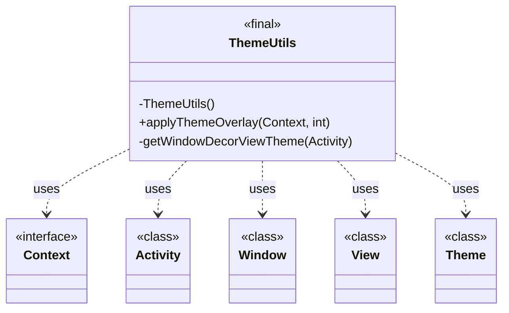
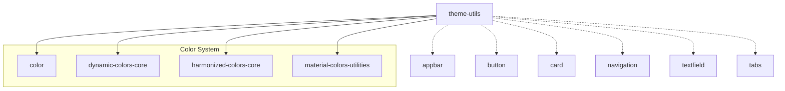
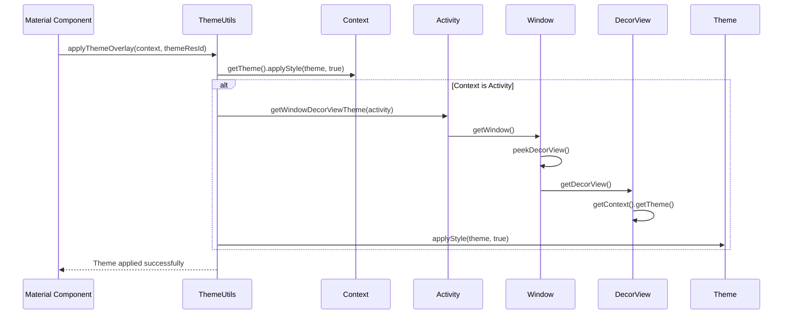

# Theme Utils Module Documentation

## Introduction

The theme-utils module provides essential utility functionality for applying theme overlays in Material Design Components. It serves as a bridge between the color system and the broader theming infrastructure, ensuring consistent theme application across different contexts and components.

## Core Functionality

### ThemeUtils Class

The `ThemeUtils` class is the primary component of this module, offering utility methods for theme management. Key features include:

- **Theme Overlay Application**: Applies theme overlays to contexts and activities
- **Window Decor View Theming**: Ensures theme consistency across window decorations
- **Force Dark Compatibility**: Uses `applyStyle()` instead of `setTheme()` to avoid Force Dark issues

## Architecture

### Component Structure



### Module Dependencies



## Data Flow

### Theme Application Process



## Integration Points

### Color System Integration

The theme-utils module works closely with other color-related modules:

- **[Dynamic Colors](dynamic-colors-core.md)**: Applies dynamic color themes
- **[Harmonized Colors](harmonized-colors-core.md)**: Ensures color harmony in theme overlays
- **[Material Colors](material-colors-utilities.md)**: Provides color utilities for theme construction

### Component Integration

ThemeUtils is utilized across various Material Design components:

- **[AppBar](appbar.md)**: For theming collapsing toolbars and app bars
- **[Button](button.md)**: Applying theme overlays to button states
- **[Navigation](navigation.md)**: Theming navigation components
- **[TextField](textfield.md)**: Input field theming
- **[Tabs](tabs.md)**: Tab indicator and background theming

## Usage Patterns

### Basic Theme Application

```java
// Apply a theme overlay to a context
ThemeUtils.applyThemeOverlay(context, R.style.ThemeOverlay_Material3_Dark);
```

### Activity-Specific Theming

```java
// When called from an Activity, automatically applies to window decor
if (context instanceof Activity) {
    ThemeUtils.applyThemeOverlay(context, themeResId);
    // Theme is applied to both context and window decor view
}
```

## Technical Considerations

### Force Dark Issue Resolution

The module addresses Android's Force Dark feature by using `applyStyle()` instead of `setTheme()`. This ensures:

- Consistent theming across different Android versions
- Prevention of unwanted dark mode transformations
- Proper theme inheritance

### Window Decor View Handling

The implementation carefully handles window decoration views by:

- Using `peekDecorView()` to avoid window locking
- Checking for null values at each step
- Ensuring theme consistency across the entire activity window

## Best Practices

1. **Always use ThemeUtils** for theme overlay application instead of direct theme manipulation
2. **Check context type** to leverage automatic window decor theming
3. **Handle theme resources** properly to avoid resource conflicts
4. **Test across different Android versions** due to Force Dark behavior variations

## Future Considerations

According to the TODO comment in the source code, this class is planned to be moved to an internal folder, which will involve resolving cyclic dependencies between color and internal folders. This suggests:

- Potential API changes in future versions
- Possible relocation to a different package structure
- Enhanced internal organization of the Material Design Components library

## Related Documentation

- [Color System Overview](color.md)
- [Dynamic Colors](dynamic-colors-core.md)
- [Harmonized Colors](harmonized-colors-core.md)
- [Material Colors Utilities](material-colors-utilities.md)
- [AppBar Theming](appbar.md)
- [Button Theming](button.md)