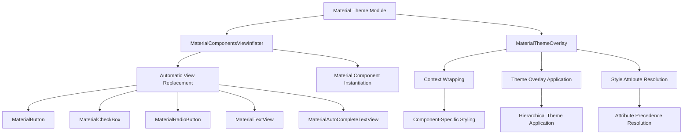
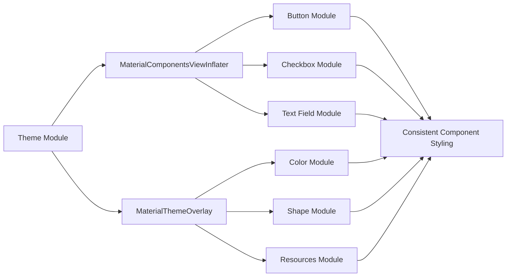
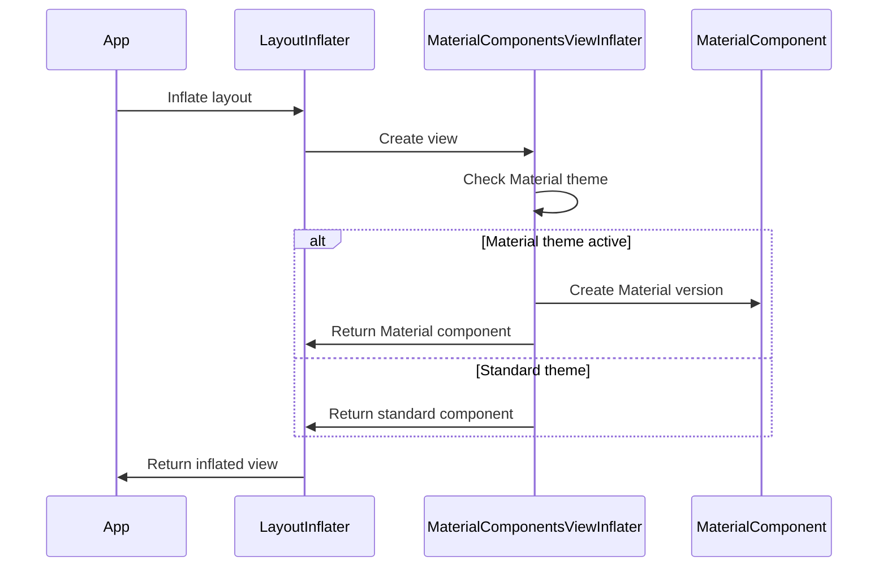
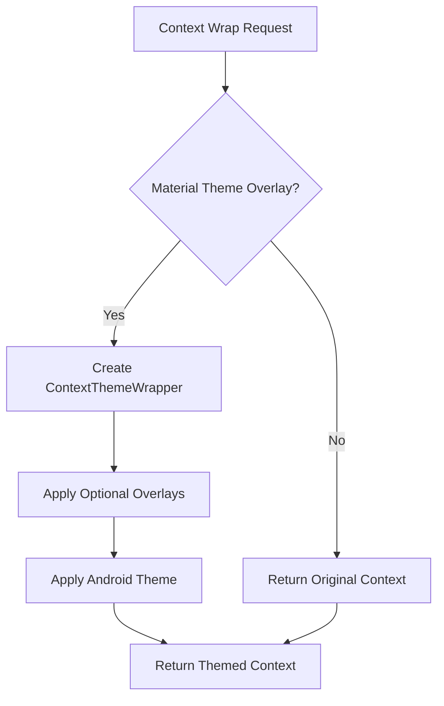

# Material Theme Module

## Overview

The Material Theme module is a core component of the Material Design Components library that provides systematic theming capabilities for Android applications. This module enables consistent visual styling across all Material components by implementing automatic view inflation and theme overlay mechanisms.

## Purpose

The theme module serves as the foundation for Material Design theming by:
- Automatically replacing standard Android views with Material Design equivalents during layout inflation
- Providing a flexible theme overlay system for contextual styling
- Ensuring consistent application of Material Design principles across the entire application

## Architecture



## Core Components

### MaterialComponentsViewInflater

The `MaterialComponentsViewInflater` class extends `AppCompatViewInflater` to automatically replace standard Android views with their Material Design counterparts during layout inflation. This ensures that applications using Material themes automatically benefit from enhanced Material components without requiring manual view replacements in XML layouts.

**Key Features:**
- Seamless view replacement during inflation
- Maintains backward compatibility with existing layouts
- Supports all standard Material component types

**Supported View Replacements:**
- `AppCompatButton` → `MaterialButton`
- `AppCompatCheckBox` → `MaterialCheckBox`
- `AppCompatRadioButton` → `MaterialRadioButton`
- `AppCompatTextView` → `MaterialTextView`
- `AppCompatAutoCompleteTextView` → `MaterialAutoCompleteTextView`

### MaterialThemeOverlay

The `MaterialThemeOverlay` utility provides a sophisticated system for applying theme overlays to specific contexts, enabling fine-grained control over component styling while maintaining theme consistency.

**Key Capabilities:**
- Context wrapping with theme overlays
- Support for multiple overlay attributes
- Hierarchical theme application with proper precedence
- Integration with both Android and Material theme attributes

## Integration with Other Modules

The theme module serves as the foundation for all other Material Design components, providing the theming infrastructure that enables consistent visual design across the entire component library. The `MaterialComponentsViewInflater` directly instantiates components from various modules:

### Direct Component Dependencies

The theme module automatically creates instances of:
- **MaterialButton** - From the button module, providing enhanced button styling
- **MaterialCheckBox** - From the checkbox module, offering consistent checkbox theming
- **MaterialRadioButton** - From the radio button module (implied from component structure)
- **MaterialTextView** - From the text display components, ensuring consistent typography
- **MaterialAutoCompleteTextView** - From the text field module, supporting themed input controls

### Theming Integration Points

The `MaterialThemeOverlay` system provides contextual theming for:
- **[Color Module](color.md)**: Integrates with dynamic color and harmonization features through theme attributes
- **[Shape Module](shape.md)**: Applies shape appearance models through overlay themes
- **[Typography Systems](resources.md)**: Coordinates with text appearance configurations
- **[Elevation and Shadow Systems](common-utils.md)**: Maintains consistent elevation theming

### Cross-Module Theming Flow



## Usage Patterns

### Automatic View Inflation

Applications using Material themes automatically benefit from the `MaterialComponentsViewInflater` when they extend `Theme.MaterialComponents` or its variants. This enables seamless replacement of standard views with Material equivalents.

### Manual Theme Overlay Application

Developers can manually apply theme overlays for specific components or sections:

```java
Context themedContext = MaterialThemeOverlay.wrap(context, attrs, defStyleAttr, defStyleRes);
```

### Component-Specific Styling

The overlay system supports component-specific styling through optional attributes, enabling reusable style combinations without creating numerous theme variants.

## Design Principles

The theme module embodies several key Material Design principles:

1. **Consistency**: Ensures uniform visual appearance across all components
2. **Flexibility**: Provides granular control over styling through overlays
3. **Efficiency**: Minimizes resource usage through intelligent context wrapping
4. **Compatibility**: Maintains backward compatibility with existing Android themes

## Technical Implementation

### View Inflation Process

The `MaterialComponentsViewInflater` intercepts the standard Android view creation process to automatically substitute Material components:



### Theme Overlay Resolution Algorithm

The `MaterialThemeOverlay.wrap()` method implements a sophisticated attribute resolution system:



**Attribute Precedence Order:**
1. **Android theme attributes** (`android:theme`) - Highest precedence
2. **AppCompat theme attributes** (`app:theme`)
3. **Material theme overlay** (`materialThemeOverlay`)
4. **Optional overlay attributes** - Lowest precedence

This hierarchy ensures that explicitly set themes take precedence while maintaining Material Design consistency across the application.

### Context Wrapping Strategy

The theme overlay system employs intelligent context wrapping to minimize memory overhead:

- **Context Reuse**: Avoids creating duplicate ContextThemeWrapper instances when the same overlay is already applied
- **Layered Application**: Supports multiple overlay levels for complex theming scenarios
- **Resource Optimization**: Only applies overlays when necessary, reducing theme attribute lookups

### Integration with Material Design System

The theme module coordinates with the broader Material Design system through:

- **Theme Attribute Resolution**: Integrates with the Material Design token system for consistent color, typography, and shape attributes
- **Component Factory Pattern**: Uses the view inflater as a factory for creating properly themed component instances
- **Context Propagation**: Ensures that themed contexts are properly propagated to child views and components

## Benefits

- **Reduced Development Time**: Automatic view replacement eliminates manual XML updates
- **Consistent Design**: Ensures all components follow Material Design guidelines
- **Flexible Theming**: Supports complex theming scenarios through overlays
- **Performance Optimized**: Efficient context wrapping minimizes memory overhead
- **Backward Compatible**: Works with existing Android applications and themes

## Future Considerations

The theme module is designed to evolve with Material Design specifications, providing a stable foundation for future component additions and theming enhancements while maintaining compatibility with existing implementations.