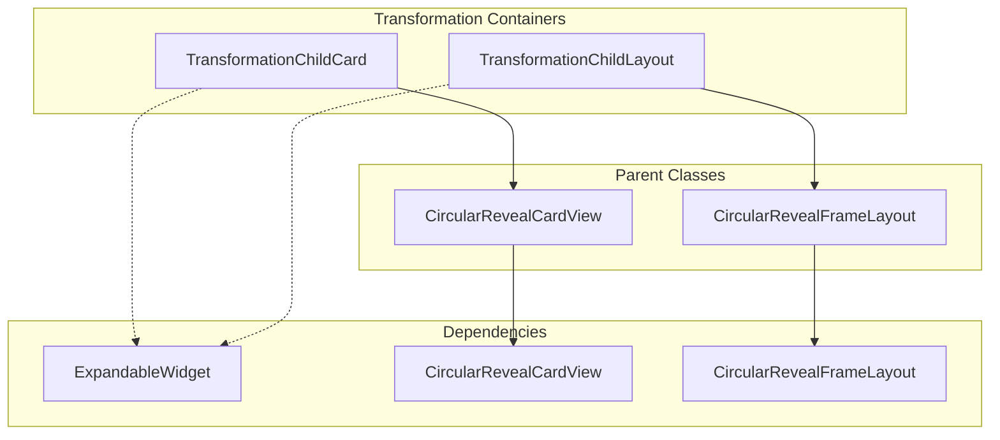
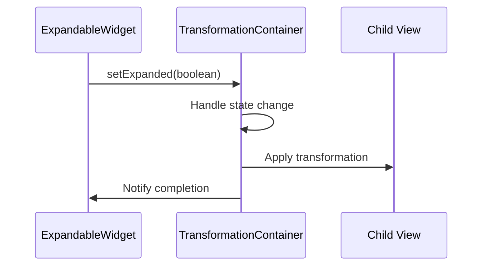

# Transformation Containers Module

## Introduction

The transformation-containers module provides specialized container layouts designed to facilitate Material Design transformation animations between expandable widgets and their expanded states. This module is part of the broader transformation system that enables smooth, coordinated animations between different UI states.

## Module Overview

The transformation-containers module contains deprecated container components that were used to wrap views participating in Material Design transformation patterns. These containers provided the necessary infrastructure for views to react to `ExpandableWidget` state changes and transform between collapsed and expanded states.

## Core Components

### TransformationChildCard

`TransformationChildCard` is a specialized `CircularRevealCardView` that serves as a container for views participating in transformation animations. It extends the functionality of `CircularRevealCardView` to support Material Design transformation patterns.

**Key Features:**
- Extends `CircularRevealCardView` for circular reveal animations
- Supports shadow rendering on pre-Lollipop devices
- Designed to contain exactly one child view
- Reacts to `ExpandableWidget` state changes
- Enables transformation of an expandable widget into itself

**Usage Context:**
This component was primarily used when shadow support was required on pre-Lollipop Android versions, providing backward compatibility for transformation animations.

### TransformationChildLayout

`TransformationChildLayout` is a `CircularRevealFrameLayout` wrapper that provides similar transformation capabilities as `TransformationChildCard` but without the card-specific styling and shadow support.

**Key Features:**
- Extends `CircularRevealFrameLayout` for circular reveal animations
- Designed to contain exactly one child view
- Reacts to `ExpandableWidget` state changes
- Lighter alternative to `TransformationChildCard`
- No built-in shadow support

**Usage Context:**
Used when shadow support was not required or when a lighter container was preferred for performance reasons.

## Architecture

### Component Relationships



### Data Flow



## Integration with Material Design System

### Relationship to Other Modules

The transformation-containers module integrates with several other Material Design components:

- **[circular-reveal](circular-reveal.md)**: Both containers extend circular reveal components (`CircularRevealCardView` and `CircularRevealFrameLayout`)
- **[transformation](transformation.md)**: Part of the broader transformation system that includes behavior classes
- **[transition](transition.md)**: Modern replacement using `MaterialContainerTransform`

### Migration Path

Both `TransformationChildCard` and `TransformationChildLayout` are deprecated in favor of the modern transition system:

```java
// Old approach (deprecated)
TransformationChildCard container = new TransformationChildCard(context);

// New approach (recommended)
MaterialContainerTransform transform = new MaterialContainerTransform();
```

## Implementation Details

### Container Requirements

Both transformation containers share common requirements:

1. **Single Child Constraint**: Each container must contain exactly one child view
2. **ExpandableWidget Integration**: Containers react to `ExpandableWidget` state changes
3. **Circular Reveal Support**: Built on circular reveal infrastructure for smooth animations

### Performance Considerations

- **TransformationChildCard**: Heavier due to card styling and shadow support
- **TransformationChildLayout**: Lighter weight, better for performance-critical scenarios
- **Pre-Lollipop Support**: Card variant specifically addresses shadow limitations on older Android versions

## Usage Patterns

### Basic Setup

```xml
<!-- Using TransformationChildCard -->
<com.google.android.material.transformation.TransformationChildCard
    android:layout_width="match_parent"
    android:layout_height="wrap_content">
    
    <!-- Single child view here -->
    
</com.google.android.material.transformation.TransformationChildCard>

<!-- Using TransformationChildLayout -->
<com.google.android.material.transformation.TransformationChildLayout
    android:layout_width="match_parent"
    android:layout_height="wrap_content">
    
    <!-- Single child view here -->
    
</com.google.android.material.transformation.TransformationChildLayout>
```

### Programmatic Usage

```java
// Create transformation container
TransformationChildCard container = new TransformationChildCard(context);

// Add single child view
View childView = createChildView();
container.addView(childView);

// Container automatically handles ExpandableWidget transformations
```

## Deprecation Notice

⚠️ **Important**: Both `TransformationChildCard` and `TransformationChildLayout` are deprecated. Google recommends migrating to the modern transition system using `MaterialContainerTransform` from the [transition](transition.md) module.

### Migration Benefits

- **Better Performance**: Modern transition system is more optimized
- **Enhanced Features**: Additional animation capabilities and customization options
- **Future Support**: Active development and maintenance
- **Consistency**: Aligns with current Material Design guidelines

## Best Practices

1. **Migration Priority**: Plan migration to `MaterialContainerTransform` for new development
2. **Container Selection**: Use `TransformationChildCard` only when pre-Lollipop shadow support is required
3. **Single Child Enforcement**: Ensure containers contain exactly one child view
4. **Testing**: Verify transformation behavior across different Android versions

## Related Documentation

- [Circular Reveal Module](circular-reveal.md) - Underlying infrastructure for circular animations
- [Transformation Module](transformation.md) - Broader transformation system including behaviors
- [Transition Module](transition.md) - Modern replacement using MaterialContainerTransform
- [ExpandableWidget](expandable.md) - Interface for expandable components (if available)