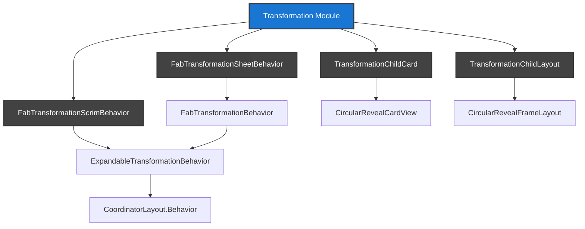
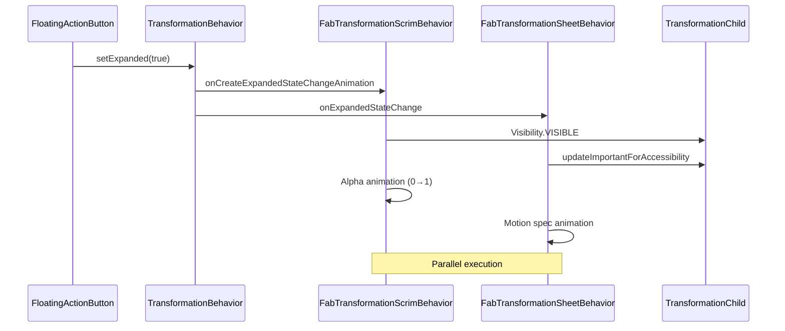

# Material Design Transformation Module

## Overview

The transformation module provides components for creating smooth, animated transitions between UI elements, particularly for expanding and collapsing floating action buttons (FABs) into other UI components. This module is part of the Material Design Components library and implements the Material Design motion guidelines for container transformations.

## Purpose

The transformation module enables:
- **Container Transformations**: Smooth morphing animations between FABs and other UI elements
- **Scrim Animations**: Background overlay effects during transformations
- **Sheet Transformations**: Expanding FABs into material sheets
- **Accessibility Management**: Proper handling of accessibility during animations

## Architecture



## Core Components

### 1. FabTransformationScrimBehavior
**File**: `FabTransformationScrimBehavior.java`

Manages scrim (background overlay) animations during FAB transformations. Controls the fade-in/fade-out animation of background overlays when FABs expand or collapse.

**Key Features**:
- Alpha-based fade animations
- Configurable timing (75ms delay, 150ms duration for expand; 0ms delay, 150ms duration for collapse)
- Touch event handling for scrim interaction
- Automatic visibility management

**Usage**: Attach to a scrim view that should appear/disappear during FAB transformations.

**Detailed Documentation**: See [fab-transformation-behaviors.md](fab-transformation-behaviors.md) for comprehensive behavior implementation details.

### 2. FabTransformationSheetBehavior
**File**: `FabTransformationSheetBehavior.java`

Handles the transformation of FABs into material sheets. Manages the complete animation sequence and accessibility during the transformation process.

**Key Features**:
- Motion spec-based animations using resource files
- Accessibility importance management for sibling views
- Positioning control with gravity settings
- Integration with CoordinatorLayout

**Usage**: Attach to sheet views that should expand from FABs.

**Detailed Documentation**: See [fab-transformation-behaviors.md](fab-transformation-behaviors.md) for comprehensive behavior implementation details.

### 3. TransformationChildCard
**File**: `TransformationChildCard.java`

A CardView-based container for transformation targets, providing circular reveal capabilities with shadow support for pre-Lollipop devices.

**Key Features**:
- Extends CircularRevealCardView
- Shadow support on pre-Lollipop devices
- Single child constraint
- Integration with ExpandableWidget

**Usage**: Use when shadow support is needed on older Android versions.

**Detailed Documentation**: See [transformation-containers.md](transformation-containers.md) for comprehensive container implementation details.

### 4. TransformationChildLayout
**File**: `TransformationChildLayout.java`

A FrameLayout-based container for transformation targets, providing circular reveal capabilities without built-in shadow support.

**Key Features**:
- Extends CircularRevealFrameLayout
- Lightweight alternative to TransformationChildCard
- Single child constraint
- Integration with ExpandableWidget

**Usage**: Use when shadow support is not required or handled elsewhere.

**Detailed Documentation**: See [transformation-containers.md](transformation-containers.md) for comprehensive container implementation details.

## Data Flow



## Dependencies

The transformation module depends on several other Material Design Components:

- **[Animation Module](animation.md)**: For timing and interpolation utilities
- **[Floating Action Button Module](fab.md)**: For FAB integration and expansion states
- **[Circular Reveal Module](circular-reveal.md)**: For reveal animations
- **[Coordinator Layout](appbar.md)**: For behavior-based layout management
- **[Expandable Widget](expandable.md)**: For expansion state management

## Usage Patterns

### Basic FAB to Sheet Transformation

```xml
<CoordinatorLayout>
    <FloatingActionButton
        android:id="@+id/fab"
        android:layout_width="wrap_content"
        android:layout_height="wrap_content"
        app:layout_anchor="@id/sheet" />
    
    <LinearLayout
        android:id="@+id/sheet"
        android:layout_width="match_parent"
        android:layout_height="wrap_content"
        app:layout_behavior="com.google.android.material.transformation.FabTransformationSheetBehavior">
        <!-- Sheet content -->
    </LinearLayout>
    
    <View
        android:id="@+id/scrim"
        android:layout_width="match_parent"
        android:layout_height="match_parent"
        android:background="#80000000"
        android:visibility="invisible"
        app:layout_behavior="com.google.android.material.transformation.FabTransformationScrimBehavior" />
</CoordinatorLayout>
```

### Using Transformation Containers

```xml
<com.google.android.material.transformation.TransformationChildCard
    android:layout_width="match_parent"
    android:layout_height="wrap_content">
    
    <!-- Single child view that will be revealed -->
    <TextView
        android:layout_width="match_parent"
        android:layout_height="wrap_content"
        android:text="Transformed content" />
        
</com.google.android.material.transformation.TransformationChildCard>
```

## Migration Notice

**Important**: This module is deprecated. Google recommends migrating to the [Transition Module](transition.md) and using `MaterialContainerTransform` instead, which provides:
- Better performance
- More flexible animations
- Improved accessibility support
- Consistent with Material Design 3

## Best Practices

1. **Performance**: Use `TransformationChildLayout` instead of `TransformationChildCard` when shadow support is not needed
2. **Accessibility**: The module automatically manages accessibility during transformations, but test with screen readers
3. **Timing**: Default timing values follow Material Design guidelines, but can be customized
4. **Testing**: Test transformations on various screen sizes and configurations
5. **Migration**: Plan migration to `MaterialContainerTransform` for new implementations

## Related Documentation

- [Floating Action Button Module](fab.md) - For FAB implementation details
- [Transition Module](transition.md) - For modern transformation alternatives
- [Animation Module](animation.md) - For animation utilities and timing
- [Circular Reveal Module](circular-reveal.md) - For reveal animation mechanisms