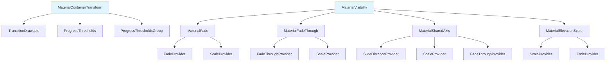

# Material Design Transition Module

## Overview

The Material Design Transition module provides a comprehensive set of animation and transition components that enable smooth, meaningful motion between UI states. This module implements Material Design's motion principles, offering sophisticated transition effects that enhance user experience through visual continuity and spatial relationships.

## Purpose

The transition module serves as the foundation for creating fluid, purposeful animations in Android applications. It provides:

- **Container Transformations**: Morphing between different container shapes and sizes
- **Elevation-based Transitions**: Scaling effects that emphasize elevation changes
- **Fade Animations**: Smooth opacity transitions with various fade modes
- **Shared Axis Motion**: Coordinated movement along X, Y, and Z axes
- **Visibility Transitions**: Comprehensive show/hide animations with multiple animation providers

## Architecture



## Core Components

### MaterialContainerTransform
The flagship component that transforms one container to another through morphing animations. It supports:
- Shape morphing between different container geometries
- Customizable fade modes (IN, OUT, CROSS, THROUGH)
- Fit modes for content scaling (AUTO, WIDTH, HEIGHT)
- Progress thresholds for fine-grained animation control
- Elevation shadow rendering
- Theme-based animation properties

### MaterialVisibility
Abstract base class for all visibility-based transitions, providing:
- Primary and secondary animator provider architecture
- Theme integration for duration and easing
- Support for additional animator providers
- Standardized appear/disappear animation patterns

### Specialized Transition Types

#### MaterialFade
Combines fade and scale animations for smooth appearance/disappearance with a default start scale of 0.8f.

#### MaterialFadeThrough
Provides fade in/out with scale effects, using a default start scale of 0.92f for subtle entrance animations.

#### MaterialSharedAxis
Enables shared motion along X, Y, or Z axes with coordinated slide/scale and fade effects.

#### MaterialElevationScale
Emphasizes elevation changes through scaling animations, useful for exit/reenter transitions.

## Sub-modules

### [Container Transform System](container-transform-system.md)
Handles the core container transformation logic including shape morphing, bounds calculation, and drawing operations. This system provides the foundation for morphing animations between different container shapes and sizes.

### [Visibility Transition Framework](visibility-transition-framework.md)
Provides the base architecture for all visibility-based transitions with theme integration and animator provider management. This framework standardizes how appear/disappear animations are structured and executed.

### [Animation Providers](animation-providers.md)
Specialized components that provide specific animation effects:
- **FadeProvider**: Opacity-based animations
- **ScaleProvider**: Size-based transformations
- **SlideDistanceProvider**: Position-based movements
- **FadeThroughProvider**: Cross-fade animations

Each provider can be combined and customized to create complex transition effects.

## Integration with Other Modules

The transition module integrates with several other Material Design components:

- **[Shape Module](shape.md)**: Utilizes `ShapeAppearanceModel` for container shape definitions
- **[Animation Module](animation.md)**: Leverages `AnimationUtils` for standardized interpolators
- **[Theme System](theme.md)**: Respects theme attributes for motion properties

## Key Features

### Theme Integration
All transitions support theme-based configuration through Material Design motion attributes:
- `motionDurationLong1`, `motionDurationLong2`, `motionDurationMedium4`, `motionDurationShort3`
- `motionEasingEmphasizedInterpolator`, `motionEasingEmphasizedDecelerateInterpolator`, `motionEasingEmphasizedAccelerateInterpolator`
- `motionPath` for custom motion paths

### Progress Thresholds
Fine-grained control over animation timing through progress thresholds:
- **Fade Thresholds**: Control when fade animations begin and end
- **Scale Thresholds**: Manage scaling animation timing
- **Scale Mask Thresholds**: Control container dimension morphing
- **Shape Mask Thresholds**: Manage shape transformation timing

### Performance Optimization
- Hardware acceleration support for elevation shadows (API 28+)
- Efficient drawable caching and reuse
- Optimized path calculations for motion animations
- Memory-conscious animation lifecycle management

## Usage Patterns

### Basic Container Transform
```java
MaterialContainerTransform transform = new MaterialContainerTransform();
transform.setStartView(startView);
transform.setEndView(endView);
transform.setContainerColor(containerColor);
```

### Themed Transition
```java
MaterialFade fade = new MaterialFade();
// Automatically loads duration and interpolator from theme
```

### Custom Progress Thresholds
```java
ProgressThresholds fadeThresholds = new ProgressThresholds(0.2f, 0.8f);
transform.setFadeProgressThresholds(fadeThresholds);
```

## Best Practices

1. **Use Theme Values**: Leverage theme attributes for consistent motion across your app
2. **Test on Multiple Devices**: Ensure animations perform well on various screen sizes and API levels
3. **Consider Accessibility**: Provide options to disable or reduce motion for accessibility
4. **Optimize for Performance**: Use appropriate drawing view IDs to limit animation bounds
5. **Handle Configuration Changes**: Properly manage transition state during configuration changes

## Related Documentation

- [Shape Module Documentation](shape.md) - For shape appearance configuration
- [Animation Module Documentation](animation.md) - For animation utilities and interpolators
- [Theme System Documentation](theme.md) - For motion theme attributes