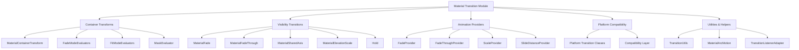

# Material Transition Module

## Overview

The Material Transition module provides a comprehensive set of animation and transition components for implementing Material Design motion patterns in Android applications. This module enables smooth, meaningful transitions between UI states, supporting the Material Design principles of motion that enhance user understanding and create visual continuity.

## Architecture

The transition module is organized into several key sub-modules that work together to provide a complete transition system:


```mermaid
graph TD
    A[Material Transition Module] --> B[Container Transforms]
    A --> C[Visibility Transitions]
    A --> D[Animation Providers]
    A --> E[Platform Compatibility]
    A --> F[Utilities & Helpers]
    
    B --> B1[MaterialContainerTransform]
    B --> B2[FadeModeEvaluators]
    B --> B3[FitModeEvaluators]
    B --> B4[MaskEvaluator]
    
    C --> C1[MaterialFade]
    C --> C2[MaterialFadeThrough]
    C --> C3[MaterialSharedAxis]
    C --> C4[MaterialElevationScale]
    C --> C5[Hold]
    
    D --> D1[FadeProvider]
    D --> D2[FadeThroughProvider]
    D --> D3[ScaleProvider]
    D --> D4[SlideDistanceProvider]
    
    E --> E1[Platform Transition Classes]
    E --> E2[Compatibility Layer]
    
    F --> F1[TransitionUtils]
    F --> F2[MaterialArcMotion]
    F --> F3[TransitionListenerAdapter]
```

## Core Functionality

### Container Transforms
Container transforms morph between two views or containers, creating a seamless transition that maintains visual continuity. This is particularly useful for transitioning between different screens or expanding/collapsing UI elements.

### Visibility Transitions  
Visibility transitions handle the appearance and disappearance of UI elements with various animation patterns including fade, slide, and scale effects.

### Animation Providers
Low-level animation components that provide specific animation behaviors like fading, scaling, and sliding that can be composed together.

## Sub-modules

### [Container Transforms](container-transforms.md)
Detailed documentation for container transformation components including MaterialContainerTransform, fade mode evaluators, fit mode evaluators, and masking systems.

### [Visibility Transitions](visibility-transitions.md)
Comprehensive guide to visibility-based transitions including fade, slide, scale, and axis-based motion patterns.

### [Animation Providers](animation-providers.md)
Low-level animation components that provide specific animation behaviors like fading, scaling, and sliding.

### [Platform Compatibility](platform-compatibility.md)
Platform-specific implementations and compatibility layer for ensuring consistent behavior across different Android API levels.

### [Utilities & Helpers](utilities-helpers.md)
Utility classes and helper components including transition utilities, motion paths, and listener adapters.

## Key Features

### Theme Integration
The transition module deeply integrates with Material Design themes, automatically loading:
- Motion durations from theme attributes
- Easing interpolators from theme definitions
- Path motions from theme configurations

### Customizable Animation Patterns
- **Fade Modes**: IN, OUT, CROSS, THROUGH
- **Fit Modes**: AUTO, WIDTH, HEIGHT for content scaling
- **Transition Directions**: AUTO, ENTER, RETURN
- **Progress Thresholds**: Fine-grained control over animation timing

### Performance Optimizations
- Hardware-accelerated drawing where available
- Efficient shape interpolation
- Optimized shadow rendering
- Memory-conscious animation handling

## Usage Patterns

### Basic Container Transform
```java
MaterialContainerTransform transform = new MaterialContainerTransform();
transform.setStartView(startView);
transform.setEndView(endView);
transform.setFadeMode(MaterialContainerTransform.FADE_MODE_THROUGH);
```

### Visibility Transition
```java
MaterialFade fade = new MaterialFade();
fade.setDuration(300);
fade.setInterpolator(AnimationUtils.FAST_OUT_SLOW_IN_INTERPOLATOR);
```

### Custom Animation Provider
```java
ScaleProvider scaleProvider = new ScaleProvider(true);
scaleProvider.setIncomingStartScale(0.8f);
scaleProvider.setIncomingEndScale(1.0f);
```

## Integration with Other Modules

The transition module works closely with:
- **[Shape Module](shape.md)**: For container shape transformations
- **[Animation Module](animation.md)**: For timing and interpolation utilities
- **[Theme Module](theme.md)**: For theme-based motion values
- **[Motion Module](motion.md)**: For advanced motion patterns

## Best Practices

1. **Use Theme Values**: Leverage theme attributes for consistent motion timing
2. **Choose Appropriate Transitions**: Select transitions that match the semantic meaning
3. **Consider Performance**: Use hardware acceleration and optimize complex animations
4. **Test Across Devices**: Ensure consistent behavior across different API levels
5. **Provide Alternatives**: Consider users with reduced motion preferences

## API Compatibility

The module provides both standard AndroidX Transition APIs and platform-specific implementations for Android Lollipop (API 21) and above, ensuring broad compatibility while taking advantage of newer platform features when available.