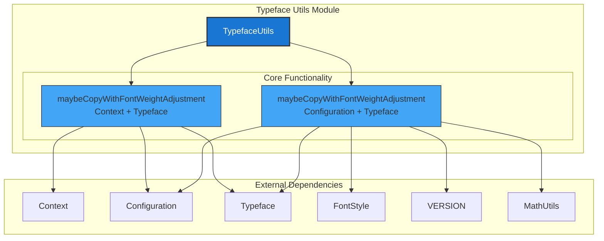
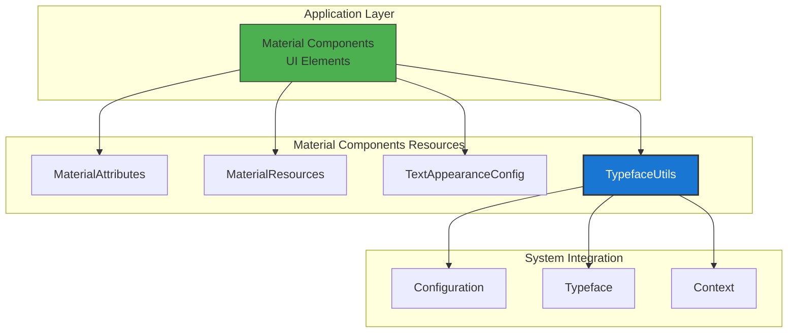
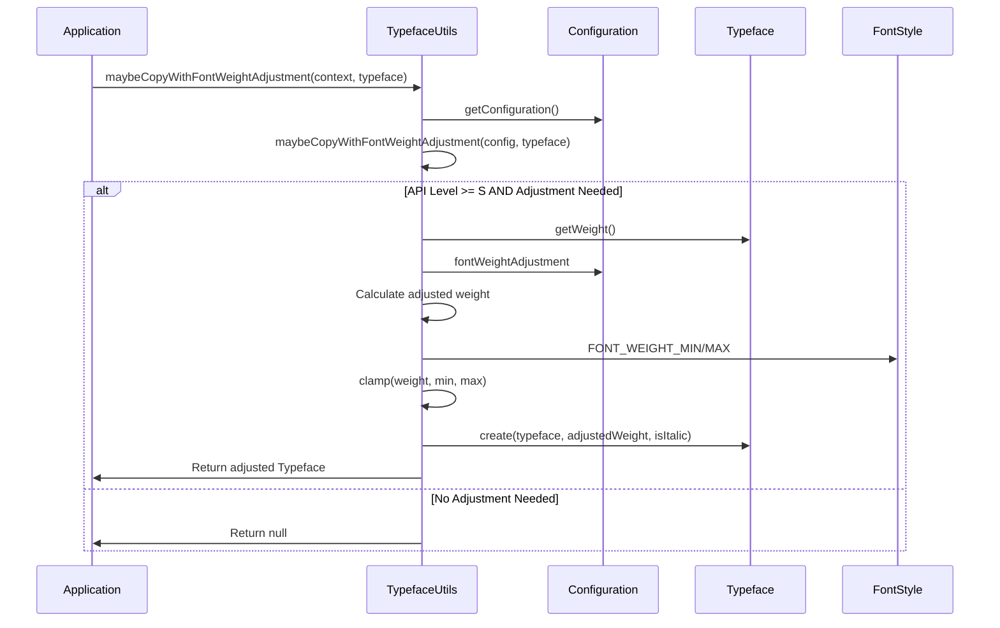
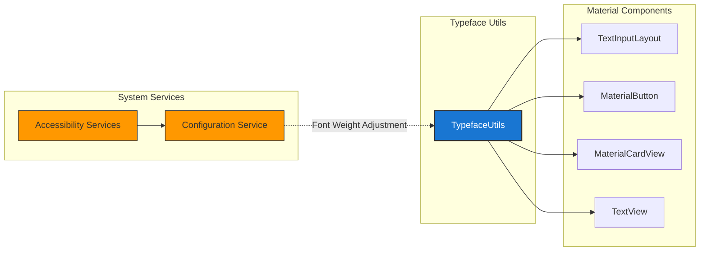

# Typeface Utils Module

The typeface-utils module provides utility functionality for working with Typeface objects in Android applications, specifically handling font weight adjustments based on system configuration. This module is part of the Material Components for Android library and offers a centralized way to manage typeface modifications while respecting user accessibility preferences.

## Overview

The typeface-utils module serves as a specialized utility provider within the Material Components resources system. It focuses on a critical aspect of typography management: automatically adjusting font weights based on system-level font weight preferences. This functionality is essential for creating accessible applications that respect user preferences for bolder or lighter text across the entire Android system.

The module's primary responsibility is to clone existing Typeface objects with adjusted font weights when the system configuration indicates that such adjustments are needed. This ensures that applications built with Material Components automatically adapt to user accessibility settings without requiring manual intervention from developers.

## Architecture

### Component Structure

### Module Position in System

## Core Components

### TypefaceUtils Class

The `TypefaceUtils` class is a utility class that provides static methods for working with Typeface objects. It is annotated with `@RestrictTo(Scope.LIBRARY_GROUP)`, indicating that it is intended for internal use within the Material Components library and should not be accessed directly by external applications.

#### Key Characteristics:
- **Singleton Pattern**: Private constructor prevents instantiation
- **Static Methods**: All functionality exposed through static methods
- **Null Safety**: Comprehensive null checking and safe return values
- **Version Awareness**: Respects Android API level differences
- **Accessibility Focus**: Designed to support system accessibility preferences

#### Core Methods:

1. **`maybeCopyWithFontWeightAdjustment(Context, Typeface)`**
   - Entry point that extracts configuration from context
   - Delegates to the configuration-based method
   - Provides convenient API for typical use cases

2. **`maybeCopyWithFontWeightAdjustment(Configuration, Typeface)`**
   - Core implementation that performs the actual adjustment
   - Checks API level and configuration settings
   - Applies weight adjustments within safe bounds
   - Returns null when no adjustment is needed

## Data Flow

### Font Weight Adjustment Process

### Integration Points

## Key Features

### Accessibility Support
The module automatically detects when users have enabled system-wide font weight adjustments through accessibility settings. This ensures that applications respect user preferences for bolder text without requiring manual configuration.

### Version Compatibility
The functionality is only activated on Android API level 31 (Android 12) and above, where the `fontWeightAdjustment` configuration property is available. On older versions, the module gracefully returns null, ensuring backward compatibility.

### Safe Weight Bounds
All font weight adjustments are constrained within the valid range defined by `FontStyle.FONT_WEIGHT_MIN` and `FontStyle.FONT_WEIGHT_MAX`, preventing invalid typeface creation.

### Efficient Resource Usage
The module only creates new Typeface objects when adjustments are actually needed. If no adjustment is required or if the system doesn't support the feature, it returns null, allowing the calling code to continue using the original typeface.

## Usage Patterns

### Typical Integration
Material Components throughout the library use TypefaceUtils to ensure consistent behavior. When a component needs to display text, it can optionally apply font weight adjustments:

1. Component receives a Typeface (either explicitly set or from theme)
2. Component calls `TypefaceUtils.maybeCopyWithFontWeightAdjustment()`
3. If a non-null result is returned, the adjusted typeface is used
4. If null is returned, the original typeface is used

### Error Handling
The module is designed with defensive programming principles:
- Null inputs are handled gracefully
- Invalid configurations are ignored
- API level differences are respected
- Weight calculations are bounds-checked

## Dependencies

### Internal Dependencies
- **Material Resources Module**: Part of the broader resources system
- **Common Utilities**: Uses `MathUtils` for clamping operations

### External Dependencies
- **Android Framework**: `Configuration`, `Typeface`, `FontStyle`
- **Android Build**: `VERSION` and `VERSION_CODES` for API level detection
- **Support Library**: `MathUtils` from androidx.core

### Related Modules
- **[material-attributes](material-attributes.md)**: Provides attribute resolution
- **[material-resources](material-resources.md)**: General resource utilities
- **[text-appearance-config](text-appearance-config.md)**: Text appearance management

## Performance Considerations

### Memory Efficiency
- No instance creation (static utility class)
- Minimal object allocation (only when adjustment is needed)
- Null return pattern avoids unnecessary typeface creation

### Processing Efficiency
- Early exit conditions for unsupported configurations
- Simple arithmetic operations for weight calculation
- Direct API usage without intermediate processing

### Caching Strategy
The module itself doesn't implement caching, relying on the Android framework's Typeface caching mechanisms. This ensures that frequently used adjusted typefaces are efficiently managed at the system level.

## Future Considerations

### Potential Enhancements
- Support for additional font variations (width, slant)
- Integration with variable fonts
- Expanded accessibility feature support
- Performance metrics and monitoring

### Compatibility Notes
As Android evolves, the module may need updates to support new font-related APIs and accessibility features while maintaining backward compatibility with existing applications.

## Conclusion

The typeface-utils module represents a focused, well-designed utility that addresses a specific but important aspect of accessibility in Material Components. Its simple API hides complex interactions with system configuration and ensures that applications automatically respect user preferences for font weight adjustments. By providing this functionality as a centralized utility, the Material Components library ensures consistent behavior across all components while maintaining the flexibility needed for diverse application requirements.