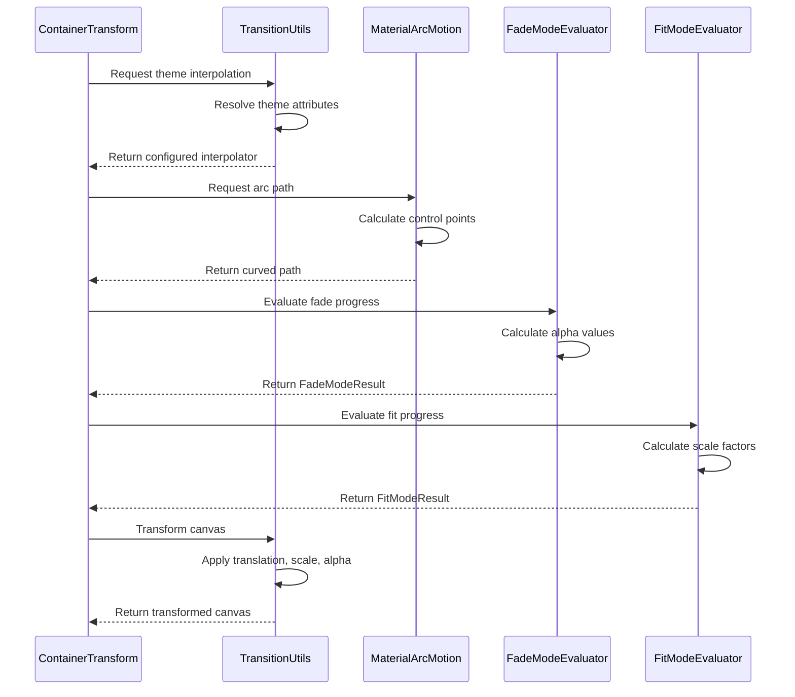
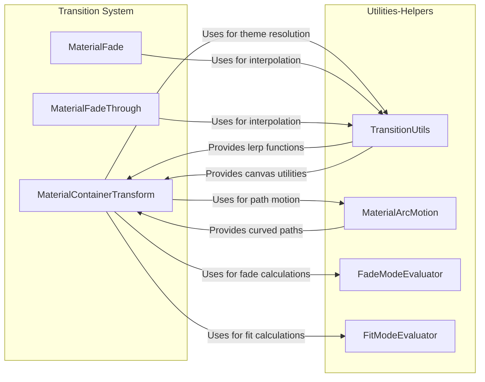
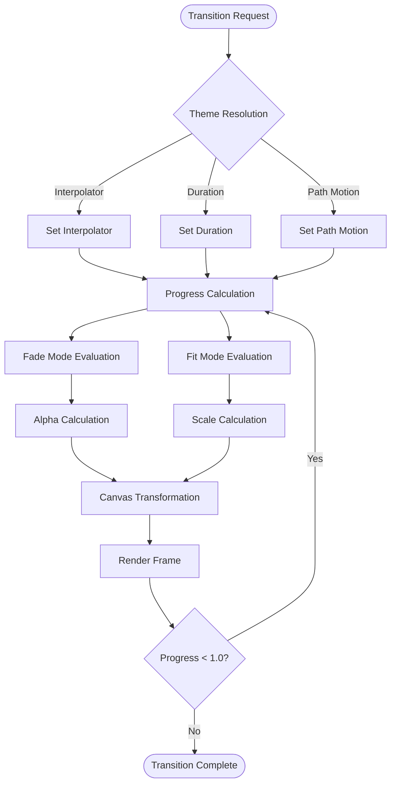

# Utilities-Helpers Module Documentation

## Introduction

The utilities-helpers module provides essential utility functions and helper classes for the Material Design Components transition system. This module serves as the foundation for complex transition calculations, path motions, and interpolation operations that power Material Design's sophisticated animation system.

## Module Overview

The utilities-helpers module contains low-level utility classes that support the broader transition system by providing:
- Mathematical interpolation functions for smooth animations
- Path motion calculations for curved transitions
- Shape transformation utilities
- Canvas drawing helpers
- View hierarchy navigation utilities
- Theme attribute resolution for transitions

## Core Components

### TransitionUtils Class

**Purpose**: Central utility class providing comprehensive transition support functions

The primary utility class providing comprehensive helper functions for transition operations.

**Key Capabilities:**
- Theme attribute resolution for interpolators, durations, and path motions
- Mathematical interpolation functions (lerp) for various data types
- Shape appearance model transformations
- Canvas transformation and drawing utilities
- View hierarchy navigation and bounds calculations
- Transition set manipulation helpers

**Core Methods:**
- `maybeApplyThemeInterpolator()`: Applies theme-based interpolators to transitions
- `maybeApplyThemeDuration()`: Sets transition durations from theme attributes
- `maybeApplyThemePath()`: Configures path motions from theme settings
- `lerp()`: Multiple overloads for linear interpolation of floats, integers, and shapes
- `transform()`: Canvas transformation with translation, scaling, and alpha
- `findDescendantOrAncestorById()`: View hierarchy navigation utility

**Advanced Features**:
- **Shape Significance Detection**: `isShapeAppearanceSignificant()` determines when shapes affect visual appearance
- **Corner Size Transformation**: `transformCornerSizes()` with custom `CornerSizeBinaryOperator`
- **Canvas Optimization**: `transform()` method with early exit for transparent operations
- **View Navigation**: Robust `findDescendantOrAncestorById()` with ancestor traversal
- **Bounds Calculation**: Multiple utility methods for different coordinate systems

### MaterialArcMotion Class

**Purpose**: Implements curved path motion for Material Design transitions

A specialized PathMotion implementation that creates dramatic curved animation paths.

**Features:**
- Extends PathMotion for use with MaterialContainerTransform
- Creates quadratic Bezier curves for smooth arc motions
- Automatically calculates control points based on start/end positions
- Provides more dramatic curves than standard ArcMotion

**Path Generation Logic**:
- When moving downward: Control point uses start X, end Y coordinates
- When moving upward: Control point uses end X, start Y coordinates
- Creates a more dramatic curve than standard ArcMotion

**Implementation Details**:
- Uses `Path.quadTo()` for smooth quadratic curves
- Control point calculation: `new PointF(endX, startY)` or `new PointF(startX, endY)`
- Optimized for Material Design motion principles

### TransitionListenerAdapter Class

**Purpose**: Provides a base implementation of TransitionListener with empty method stubs

An abstract adapter class that provides empty implementations of TransitionListener methods.

**Benefits:**
- Simplifies transition listener implementation by providing default empty methods
- Allows developers to override only the methods they need
- Reduces boilerplate code in transition implementations
- Supports all standard transition lifecycle events

**Lifecycle Methods** (all with empty implementations):
- `onTransitionStart()`: Called when transition begins
- `onTransitionEnd()`: Called when transition completes
- `onTransitionCancel()`: Called when transition is cancelled
- `onTransitionPause()`: Called when transition is paused
- `onTransitionResume()`: Called when transition is resumed

**Usage Pattern**:
```java
new TransitionListenerAdapter() {
    @Override
    public void onTransitionEnd(Transition transition) {
        // Only override needed methods
        // Other methods use empty implementations
    }
}

### FadeModeEvaluator Interface

**Purpose**: Defines the contract for calculating fade animation parameters during transitions

Defines the contract for calculating fade mode results during transitions.

**Responsibilities:**
- Evaluates start and end view alpha values based on progress
- Determines which view should appear on top during transition
- Handles fade timing and threshold calculations
- Enables custom fade behavior implementations

**Method Signature**:
```java
FadeModeResult evaluate(float progress, float fadeStartFraction, float fadeEndFraction, float threshold)
```

**Parameters**:
- `progress`: Current transition progress (0.0 to 1.0)
- `fadeStartFraction`: When fade effect begins
- `fadeEndFraction`: When fade effect ends
- `threshold`: Transition threshold value

**Return Value**: `FadeModeResult` containing alpha values and layering information

### FadeModeResult Class

**Purpose**: Encapsulates the results of fade mode evaluation

A data class that encapsulates the results of fade mode calculations.

**Properties:**
- `startAlpha`: Alpha value for the start view (0-255)
- `endAlpha`: Alpha value for the end view (0-255)
- `endOnTop`: Boolean indicating if end view should be drawn on top

**Factory Methods**:
- `startOnTop(int startAlpha, int endAlpha)`: Creates result with start view in foreground
- `endOnTop(int startAlpha, int endAlpha)`: Creates result with end view in foreground

**Usage Pattern**:
```java
// Create fade result with end view on top
FadeModeResult result = FadeModeResult.endOnTop(255, 128);
// Use in transition calculations
int startAlpha = result.startAlpha;
int endAlpha = result.endAlpha;
boolean isEndOnTop = result.endOnTop;
```

### FitModeEvaluator Interface

**Purpose**: Defines the contract for calculating size and scale parameters during container transforms

Defines the contract for calculating fit mode results during container transforms.

**Responsibilities:**
- Calculates view scaling factors based on progress
- Determines current view dimensions during transition
- Handles masking decisions for reveal effects
- Manages bounds calculations for fitting operations

**Key Method**:
```java
FitModeResult evaluate(float progress, float scaleStartFraction, float scaleEndFraction, 
                      float startWidth, float startHeight, float endWidth, float endHeight)
```

**Additional Methods**:
- `shouldMaskStartBounds()`: Determines if start view should be masked for reveal effect
- `applyMask()`: Updates mask bounds to create reveal effect

**Fitting Strategies**:
- **Width-based fitting**: Scale to match width, mask height differences
- **Height-based fitting**: Scale to match height, mask width differences
- **Automatic fitting**: Choose optimal strategy based on aspect ratios

### FitModeResult Class

**Purpose**: Encapsulates the results of fit mode evaluation

A data class that encapsulates the results of fit mode calculations.

**Properties:**
- `startScale`: Scaling factor for the start view
- `endScale`: Scaling factor for the end view
- `currentStartWidth/Height`: Current dimensions of start view
- `currentEndWidth/Height`: Current dimensions of end view

**Constructor**:
```java
FitModeResult(float startScale, float endScale, float currentStartWidth, float currentStartHeight, 
              float currentEndWidth, float currentEndHeight)
```

**Usage in Transitions**:
- Provides calculated dimensions for smooth scaling animations
- Enables proper aspect ratio maintenance during container transforms
- Supports reveal effects through masking operations
- Facilitates coordinate transformations during transitions

### CornerSizeBinaryOperator Interface

**Purpose**: Defines operations for combining two corner sizes during shape transformations

**Method Signature**:
```java
@NonNull CornerSize apply(@NonNull CornerSize cornerSize1, @NonNull CornerSize cornerSize2)
```

**Usage in Shape Transformations**:
- Used by `transformCornerSizes()` to combine corner sizes from two different shapes
- Enables custom corner interpolation logic
- Supports complex shape morphing animations

**Example Implementation**:
```java
new CornerSizeBinaryOperator() {
    @Override
    public CornerSize apply(CornerSize cornerSize1, CornerSize cornerSize2) {
        // Custom logic for combining corner sizes
        float combinedSize = (cornerSize1.getCornerSize(bounds) + cornerSize2.getCornerSize(bounds)) / 2;
        return new AbsoluteCornerSize(combinedSize);
    }
}

## Architecture

```mermaid
graph TB
    subgraph "Utilities-Helpers Module"
        TU[TransitionUtils]
        MAM[MaterialArcMotion]
        TLA[TransitionListenerAdapter]
        FME[FadeModeEvaluator Interface]
        FMR[FadeModeResult]
        FIME[FitModeEvaluator Interface]
        FIMR[FitModeResult]
    end
    
    subgraph "Dependencies"
        MotionUtils[MotionUtils]
        ShapeModel[ShapeAppearanceModel]
        CanvasCompat[CanvasCompat]
        PathMotion[PathMotion]
        Transition[Transition]
    end
    
    TU --> MotionUtils
    TU --> ShapeModel
    TU --> CanvasCompat
    MAM --> PathMotion
    TLA --> Transition
    FME --> FMR
    FIME --> FIMR
    
    subgraph "Consumer Modules"
        ContainerTransform[Container Transforms]
        VisibilityTransitions[Visibility Transitions]
        AnimationProviders[Animation Providers]
    end
    
    TU --> ContainerTransform
    TU --> VisibilityTransitions
    TU --> AnimationProviders
    MAM --> ContainerTransform
    FME --> ContainerTransform
    FIME --> ContainerTransform
```



## Data Flow



## Component Interactions



## Process Flow



## Key Features

### 1. Theme Integration
The module seamlessly integrates with Android's theme system, allowing transitions to be customized through theme attributes for consistent design across applications.

### 2. Mathematical Precision
Provides high-precision interpolation functions that ensure smooth, frame-rate independent animations across different device capabilities.

### 3. Shape Transformation
Advanced shape appearance model transformations enable complex morphing animations between different view shapes and corner radii.

### 4. Canvas Optimization
Efficient canvas transformation utilities that minimize overdraw and optimize rendering performance during transitions.

### 5. View Hierarchy Navigation
Robust utilities for navigating complex view hierarchies, essential for shared element transitions and coordinated animations.

## Usage Patterns

### Basic Interpolation
```java
// Linear interpolation between two values
float interpolatedValue = TransitionUtils.lerp(startValue, endValue, fraction);

// Interpolation with custom start/end fractions
float customInterpolated = TransitionUtils.lerp(
    startValue, endValue, startFraction, endFraction, fraction);
```

### Theme-Based Configuration
```java
// Apply theme interpolator to transition
TransitionUtils.maybeApplyThemeInterpolator(
    transition, context, R.attr.motionInterpolator, defaultInterpolator);

// Set duration from theme
TransitionUtils.maybeApplyThemeDuration(
    transition, context, R.attr.motionDuration);
```

### Shape Transformation
```java
// Transform corner sizes between two shape models
ShapeAppearanceModel transformed = TransitionUtils.transformCornerSizes(
    startShape, endShape, bounds, cornerSizeOperator);
```

## Performance Considerations

### Memory Management
- Reuses RectF instances to minimize allocations during animation
- Provides efficient canvas save/restore operations
- Implements lazy evaluation for expensive calculations

### Computational Efficiency
- Optimized mathematical operations for real-time animation
- Efficient path calculations for curved motions
- Minimal object creation in hot paths

### Rendering Optimization
- Early exit conditions for transparent drawing operations
- Efficient bounds calculations and caching
- Optimized canvas layer management

## Integration with Other Modules

The utilities-helpers module serves as a foundation for multiple transition-related modules:

### Container Transforms Integration

**[Container Transforms](container-transforms.md)** extensively uses utilities-helpers:

- **Fade Mode Calculation**: Uses `FadeModeEvaluator` and `FadeModeResult` for alpha transitions
- **Fit Mode Evaluation**: Employs `FitModeEvaluator` and `FitModeResult` for scaling operations
- **Shape Transformation**: Leverages `transformCornerSizes()` and `CornerSizeBinaryOperator`
- **Path Motion**: Utilizes `MaterialArcMotion` for curved animation paths
- **Theme Integration**: Applies `maybeApplyTheme*()` methods for consistent motion design

### Visibility Transitions Integration

**[Visibility Transitions](visibility-transitions.md)** relies on utilities-helpers for:

- **Interpolation Functions**: Uses various `lerp()` overloads for smooth animations
- **Canvas Transformations**: Applies `transform()` for optimized rendering
- **View Utilities**: Employs bounds calculation and hierarchy navigation
- **Theme Resolution**: Leverages theme attribute resolution for consistent timing

### Animation Providers Integration

**[Animation Providers](animation-providers.md)** depends on utilities-helpers:

- **Evaluation Interfaces**: Implements `FadeModeEvaluator` and `FitModeEvaluator`
- **Transition Listeners**: Extends `TransitionListenerAdapter` for event handling
- **Mathematical Operations**: Uses interpolation functions for custom animations
- **Shape Manipulation**: Applies corner size transformations for morphing effects

### Platform Compatibility Integration

**[Platform Compatibility](platform-compatibility.md)** utilizes utilities-helpers:

- **Fallback Mechanisms**: Uses theme resolution with sensible defaults
- **Path Motion Compatibility**: Leverages both platform and custom path implementations
- **Theme Attribute Processing**: Ensures consistent behavior across Android versions
- **Performance Optimization**: Applies canvas optimization techniques

## Technical Considerations

### Memory Management

**Object Reuse Strategies**:
- Reuse `RectF` and `Rect` instances in `transform()` and bounds calculations
- Cache theme attribute resolutions to avoid repeated lookups
- Employ lazy initialization for expensive objects

**Allocation Optimization**:
- Minimize object creation in animation loops
- Use static factory methods for result objects
- Implement efficient canvas save/restore operations

### Thread Safety

**Main Thread Requirements**:
- View utilities must be called from UI thread
- Canvas operations require main thread execution
- Theme attribute resolution should happen on UI thread

**Thread-Safe Operations**:
- Mathematical interpolation functions are thread-safe
- Pure calculation methods can be called from any thread
- Result objects are immutable and thread-safe

### Compatibility and Fallbacks

**Android Version Support**:
- Supports API 14+ through compatibility classes
- Graceful handling of missing theme attributes
- Fallback implementations for unsupported features

**Error Recovery**:
- Sensible defaults for theme resolution failures
- Graceful degradation for complex path motions
- Robust error handling in view hierarchy traversal

### Performance Characteristics

**Computational Complexity**:
- Interpolation operations: O(1) constant time
- Path calculations: O(1) for arc motions
- View hierarchy navigation: O(n) where n is hierarchy depth

**Memory Usage**:
- Minimal memory footprint for utility functions
- Efficient reuse of temporary objects
- Optimized canvas layer management

## Best Practices

### 1. Theme Consistency

**Theme Integration Guidelines**:
- Always use theme attribute resolution for transition properties
- Leverage MotionUtils for consistent motion design
- Provide sensible defaults for fallback scenarios
- Test with different Material Design themes

**Attribute Resolution Pattern**:
```java
// Apply theme-based configuration
TransitionUtils.maybeApplyThemeInterpolator(transition, context, 
    R.attr.motionEasingStandard, defaultInterpolator);
TransitionUtils.maybeApplyThemeDuration(transition, context, 
    R.attr.motionDurationLong1);
```

### 2. Performance Optimization

**Caching Strategies**:
- Cache calculated bounds when views don't change
- Store theme attribute resolutions for reuse
- Pre-compute expensive mathematical operations

**Animation Loop Optimization**:
- Minimize object allocations in animation callbacks
- Use efficient interpolation functions for smooth animations
- Implement early exit conditions for invisible operations

**Memory Management**:
```java
// Reuse RectF instances
RectF cachedBounds = new RectF();
TransitionUtils.getRelativeBounds(view, cachedBounds);
// Use cachedBounds for subsequent operations
```

### 3. Error Handling

**Defensive Programming**:
- Validate theme attribute existence before application
- Handle edge cases in view hierarchy navigation
- Provide fallback values for theme resolution failures
- Implement graceful degradation for unsupported features

**Exception Handling**:
```java
try {
    View target = TransitionUtils.findDescendantOrAncestorById(rootView, viewId);
} catch (IllegalArgumentException e) {
    // Handle missing view gracefully
    Log.w(TAG, "View not found in hierarchy", e);
}
```

### 4. Testing Considerations

**Cross-Device Testing**:
- Test across different device configurations and screen densities
- Verify theme attribute resolution with various themes
- Ensure mathematical precision across different Android versions

**Performance Testing**:
- Profile memory usage during complex transitions
- Measure frame rate consistency across device types
- Validate interpolation accuracy with high-resolution timers

**Edge Case Testing**:
- Test with extreme view hierarchy depths
- Verify behavior with missing or invalid theme attributes
- Validate mathematical operations with boundary values

## Future Enhancements

The module is designed for extensibility with potential future additions:

### Advanced Mathematical Operations
- **Additional interpolation curves**: Support for elastic, bounce, and custom easing functions
- **Multi-dimensional interpolation**: Enhanced support for complex geometric transformations
- **Physics-based animations**: Integration with spring and fling animations
- **Bezier curve enhancements**: More sophisticated path generation algorithms

### Enhanced Shape Transformation
- **Complex shape morphing**: Support for arbitrary path transformations
- **Vector drawable integration**: Enhanced support for vector-based shape transitions
- **3D transformations**: Basic 3D shape manipulation capabilities
- **Custom corner families**: Support for non-circular corner treatments

### Performance Optimizations
- **GPU acceleration**: Enhanced support for hardware-accelerated transitions
- **Memory pooling**: Object reuse strategies for high-frequency animations
- **Parallel processing**: Multi-threaded calculations for complex transitions
- **Caching mechanisms**: Intelligent caching for repeated calculations

### Extended Theme Support
- **Dynamic theme adaptation**: Runtime theme change support
- **Custom theme attributes**: User-defined motion properties
- **Theme inheritance**: Enhanced support for theme overlays and inheritance
- **Accessibility integration**: Motion preferences for accessibility users

## Conclusion

The utilities-helpers module serves as the mathematical and operational foundation for Material Design transitions. By providing essential utilities for interpolation, shape transformation, view manipulation, and theme integration, it enables the creation of smooth, visually appealing transitions that adhere to Material Design principles.

### Key Strengths

**Comprehensive Functionality**:
- Complete mathematical toolkit for transition calculations
- Robust theme integration with automatic attribute resolution
- Efficient canvas and view manipulation utilities
- Flexible evaluation interfaces for custom behaviors

**Performance Excellence**:
- Optimized mathematical operations with O(1) complexity
- Memory-efficient object reuse strategies
- Early exit conditions for unnecessary calculations
- Hardware acceleration support

**Design Flexibility**:
- Extensible interface-based architecture
- Custom implementation support for specialized behaviors
- Theme-driven configuration for consistent design
- Platform compatibility across Android versions

**Developer Experience**:
- Intuitive API design with clear method signatures
- Comprehensive documentation and usage examples
- Robust error handling with meaningful exceptions
- Extensive testing considerations and best practices

### Architectural Significance

The utilities-helpers module represents a crucial architectural layer in the Material Design Components transition system. Its design embodies several important principles:

**Separation of Concerns**: Mathematical operations, theme resolution, and view utilities are cleanly separated into focused components.

**Interface-Based Design**: Evaluation interfaces (`FadeModeEvaluator`, `FitModeEvaluator`) enable polymorphic behavior while maintaining type safety.

**Performance Optimization**: Careful attention to memory management, computational efficiency, and rendering optimization ensures smooth animations across device capabilities.

**Extensibility**: The module's architecture supports future enhancements while maintaining backward compatibility, ensuring long-term viability.

### Impact on Material Design Implementation

By providing robust mathematical foundations and utility functions, this module enables developers to create transitions that faithfully implement Material Design motion principles. The seamless integration with Android's theme system ensures consistent behavior across applications, while the performance optimizations guarantee smooth animations on diverse hardware configurations.

The utilities-helpers module transforms complex mathematical operations and system interactions into simple, intuitive API calls, democratizing access to sophisticated animation techniques and enabling developers to focus on creating engaging user experiences rather than low-level implementation details.