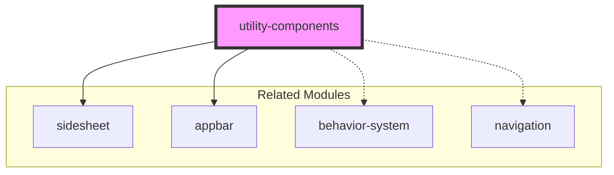
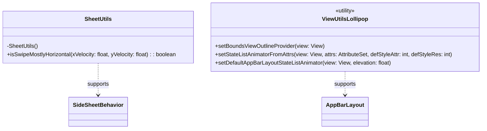
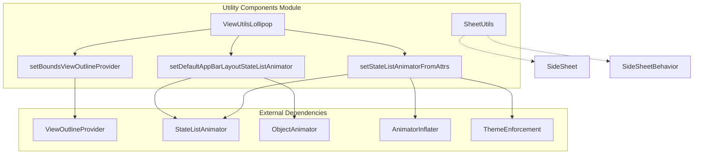
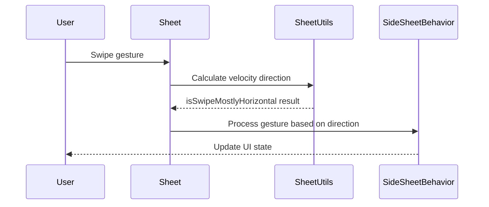
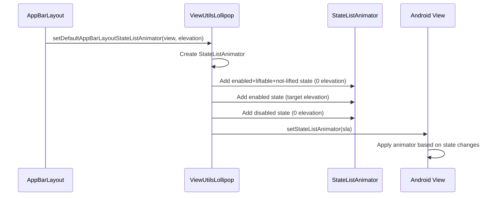
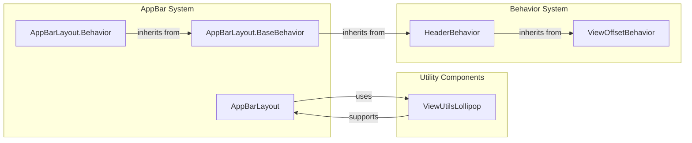
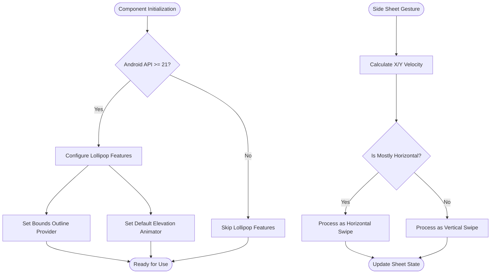
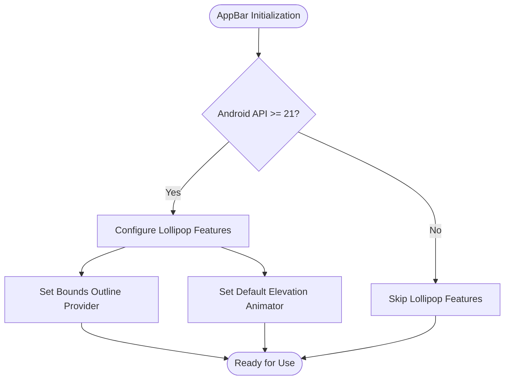

# Utility Components Module

## Introduction

The utility-components module provides essential helper classes and utilities that support the Material Design Components library. This module contains shared functionality used across multiple components, particularly focusing on utility classes for side sheet behavior calculations and view operations on Android API levels.

## Module Overview

The utility-components module serves as a foundational layer within the Material Design Components ecosystem, providing common utilities that enable consistent behavior and calculations across different UI components. The module is designed with a focus on reusability and encapsulation of common operations, featuring components like `SheetUtils` for side sheet calculations and `ViewUtilsLollipop` for API level-specific view operations.

## Core Components

### SheetUtils

**Location**: `lib.java.com.google.android.material.sidesheet.SheetUtils.SheetUtils`

The `SheetUtils` class is a utility class that provides helper methods for calculations related to `Sheet` and related classes. This utility class is essential for the proper functioning of side sheet components within the Material Design system.

#### Key Features:
- **Swipe Detection**: Provides methods to determine swipe directionality, particularly useful for gesture handling in side sheet components
- **Velocity Calculations**: Handles velocity-based calculations for touch interactions
- **Restricted Access**: Marked with `@RestrictTo(Scope.LIBRARY_GROUP)` indicating it's intended for internal library use only

#### Core Method:
```java
static boolean isSwipeMostlyHorizontal(float xVelocity, float yVelocity)
```
This method determines whether a swipe gesture is primarily horizontal by comparing the absolute values of X and Y velocity components. This is crucial for side sheet components that need to distinguish between horizontal swipes (which may dismiss the sheet) and vertical swipes (which may scroll content).

### ViewUtilsLollipop

**Location**: `lib.java.com.google.android.material.appbar.ViewUtilsLollipop.ViewUtilsLollipop`

The `ViewUtilsLollipop` class provides utility methods for view operations specific to Android Lollipop (API 21+) and higher versions. This utility class handles API level-specific functionality for the app bar system, particularly focusing on view outline provider management, state list animator configuration, and elevation-based animations for AppBar layouts.

## Architecture

### Module Dependencies



### Component Structure



### Detailed Architecture



## Component Details

### ViewUtilsLollipop Class

#### Purpose
Provides Lollipop-specific utility methods for view configuration and animation setup, particularly for Material Design AppBar components.

#### Key Methods

##### setBoundsViewOutlineProvider(View view)
- **Purpose**: Sets the view's outline provider to use the view's bounds for shadow rendering
- **Use Case**: Ensures proper shadow casting for Material Design elevation effects
- **Parameters**: `view` - The target view to configure

##### setStateListAnimatorFromAttrs(View, AttributeSet, int, int)
- **Purpose**: Loads and applies a state list animator from XML attributes
- **Use Case**: Enables state-based animations (like elevation changes) defined in XML
- **Parameters**:
  - `view` - Target view
  - `attrs` - XML attributes
  - `defStyleAttr` - Default style attribute
  - `defStyleRes` - Default style resource

##### setDefaultAppBarLayoutStateListAnimator(View, float)
- **Purpose**: Creates and applies a default state list animator for AppBar elevation
- **Use Case**: Implements Material Design's lift-on-scroll behavior
- **Parameters**:
  - `view` - AppBar view
  - `elevation` - Target elevation value

## Integration with Material Design System

### Usage Context

The utility-components module integrates with several key areas of the Material Design Components library:

1. **Side Sheet System**: `SheetUtils` provides essential calculations for the [sidesheet](sidesheet.md) module, enabling proper gesture recognition and behavior
2. **App Bar System**: `ViewUtilsLollipop` supports [appbar](appbar.md) operations, particularly for API level-specific functionality
3. **Behavior Framework**: Utilities in this module support the broader [behavior](behavior.md) system used across Material components

### Data Flow for SheetUtils



### Data Flow for ViewUtilsLollipop



## API Design Principles

### Restricted Access Pattern

The utility-components module follows a restricted access pattern where utility classes are marked with `@RestrictTo(Scope.LIBRARY_GROUP)`. This design choice ensures that:

- **Encapsulation**: Internal implementation details remain hidden from external consumers
- **Stability**: API surface remains stable as internal utilities can change without breaking external code
- **Consistency**: All utility classes follow the same access pattern across the library

### Utility Class Pattern

Components in this module follow the utility class pattern:
- **Final Classes**: All utility classes are marked as `final` to prevent inheritance
- **Private Constructors**: Private constructors prevent instantiation
- **Static Methods**: All functionality is exposed through static methods
- **Stateless Operations**: Methods perform calculations without maintaining internal state

## Integration with AppBar System



## Usage Patterns

### Elevation Animation Setup
The utility is primarily used to establish elevation-based animations that respond to scroll events:

1. **Initialization**: AppBarLayout calls `setDefaultAppBarLayoutStateListAnimator` during setup
2. **State Management**: The created StateListAnimator automatically handles elevation changes
3. **Scroll Response**: As users scroll, the AppBar's state changes trigger appropriate elevation animations

### View Outline Configuration
Ensures proper shadow rendering by setting the outline provider to use view bounds:

```java
// Typical usage within AppBarLayout
ViewUtilsLollipop.setBoundsViewOutlineProvider(this);
```

### Swipe Gesture Detection
SheetUtils provides essential calculations for side sheet gesture handling:

```java
// Determine if swipe is primarily horizontal
boolean isHorizontal = SheetUtils.isSwipeMostlyHorizontal(xVelocity, yVelocity);
```

## Process Flow



## Best Practices

### When to Use Utility Components

1. **Cross-cutting Concerns**: Use when functionality is needed across multiple components
2. **Complex Calculations**: Encapsulate complex mathematical or logical operations
3. **Platform Abstraction**: Provide consistent APIs across different Android API levels
4. **Performance Optimization**: Centralize frequently used calculations

### Integration Guidelines

1. **Internal Use Only**: These utilities are designed for internal library use
2. **Dependency Injection**: Consider dependency injection patterns when utilities need configuration
3. **Testing**: Utility methods should be thoroughly unit tested due to their widespread usage
4. **Documentation**: Maintain clear documentation for utility methods as they serve as building blocks

### Version Checking
Always verify API level before calling Lollipop-specific methods:
```java
if (Build.VERSION.SDK_INT >= Build.VERSION_CODES.LOLLIPOP) {
    ViewUtilsLollipop.setBoundsViewOutlineProvider(view);
}
```

### Resource Management
Properly manage resources and handle animations efficiently:
- Recycle `TypedArray` instances after use
- Use appropriate animation durations for smooth UX
- Ensure view states align with animator configurations

## Dependencies

### Internal Dependencies
- **ThemeEnforcement**: Used for safe attribute retrieval with theme consistency
- **R.integer.app_bar_elevation_anim_duration**: Animation duration resource

### External Dependencies
- **Android Animation Framework**: `ObjectAnimator`, `StateListAnimator`, `AnimatorInflater`
- **Android View System**: `View`, `ViewOutlineProvider`
- **Android Resource System**: `TypedArray`, `AttributeSet`

## Related Documentation

For comprehensive understanding of the utility components integration, refer to:
- [sidesheet.md](sidesheet.md) - For detailed information about side sheet components
- [appbar.md](appbar.md) - For app bar related functionality
- [behavior-system.md](behavior-system.md) - Behavior system that utilizes these utilities
- [material-design-guidelines](https://material.io/components) - Official Material Design specifications

## Version Compatibility

The utility-components module is designed to work across different Android API levels:
- **Minimum API**: 21 (Lollipop) for ViewUtilsLollipop
- **Target API**: Current Material Design specifications
- **Fallback**: Graceful degradation on older API levels

## Performance Considerations

Utility components are optimized for performance:
- **Static Methods**: Avoid object creation overhead
- **Primitive Parameters**: Use primitive types where possible to avoid boxing
- **Minimal Allocations**: Designed to minimize garbage collection pressure
- **Efficient Algorithms**: Mathematical operations are optimized for common use cases

## Conclusion

The utility-components module serves as a critical foundation for implementing Material Design patterns across multiple component types. By encapsulating common functionality like gesture detection and API level-specific view operations, it ensures consistent behavior while maintaining compatibility across Android versions. The module's focused scope and well-defined utility methods make it an essential component of the Material Design component library.
    
    subgraph "Utility Components"
        VUL[ViewUtilsLollipop]
    end
    
    subgraph "Behavior System"
        HB[HeaderBehavior]
        VOB[ViewOffsetBehavior]
    end
    
    ABL -->|uses| VUL
    ABLB -->|inherits from| ABLCB
    ABLCB -->|inherits from| HB
    HB -->|inherits from| VOB
    VUL -->|supports| ABL
```

## Usage Patterns

### Elevation Animation Setup
The utility is primarily used to establish elevation-based animations that respond to scroll events:

1. **Initialization**: AppBarLayout calls `setDefaultAppBarLayoutStateListAnimator` during setup
2. **State Management**: The created StateListAnimator automatically handles elevation changes
3. **Scroll Response**: As users scroll, the AppBar's state changes trigger appropriate elevation animations

### View Outline Configuration
Ensures proper shadow rendering by setting the outline provider to use view bounds:

```java
// Typical usage within AppBarLayout
ViewUtilsLollipop.setBoundsViewOutlineProvider(this);
```

## Process Flow



## Compatibility Considerations

### API Level Requirements
- **Minimum API**: 21 (Lollipop)
- **Target API**: Current Material Design specifications
- **Fallback**: Graceful degradation on older API levels

### Theme Integration
- Respects Material Design theme attributes
- Uses `ThemeEnforcement` for consistent styling
- Supports custom animation durations via resources

## Best Practices

1. **Version Checking**: Always verify API level before calling Lollipop-specific methods
2. **Resource Management**: Properly recycle `TypedArray` instances
3. **Animation Performance**: Use appropriate animation durations for smooth UX
4. **State Consistency**: Ensure view states align with animator configurations

## Related Documentation

For comprehensive understanding of the AppBar system integration, refer to:
- [appbarlayout-core.md](appbarlayout-core.md) - Core AppBarLayout functionality
- [behavior-system.md](behavior-system.md) - Behavior system that utilizes these utilities
- [material-design-guidelines](https://material.io/components/app-bars-top) - Official Material Design specifications

## Conclusion

The utility-components module serves as a critical foundation for implementing Material Design's elevation and animation patterns in AppBar components. By encapsulating Lollipop-specific functionality, it ensures consistent behavior while maintaining compatibility across Android versions. The module's focused scope and well-defined utility methods make it an essential component of the Material Design component library.