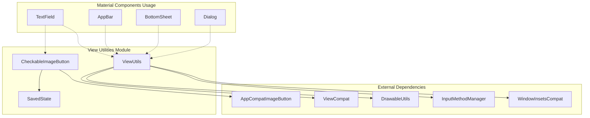
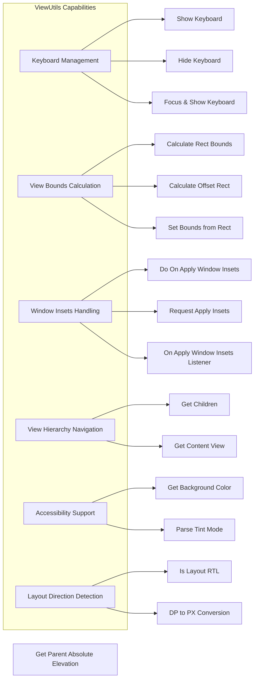
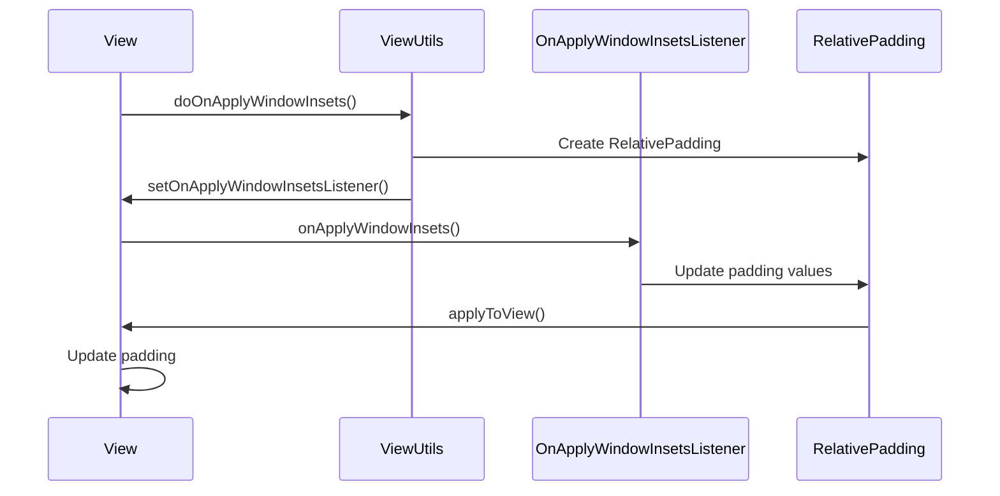
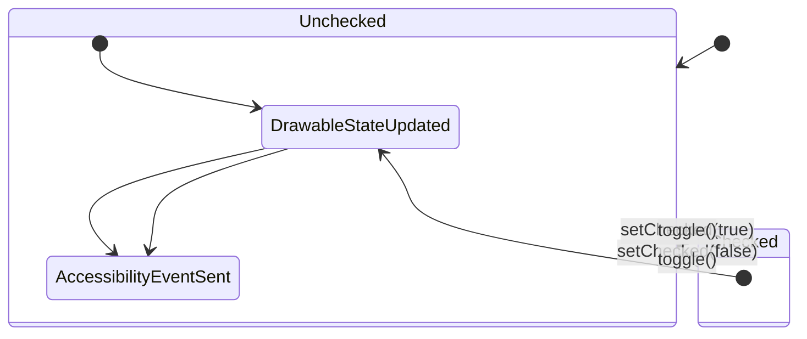
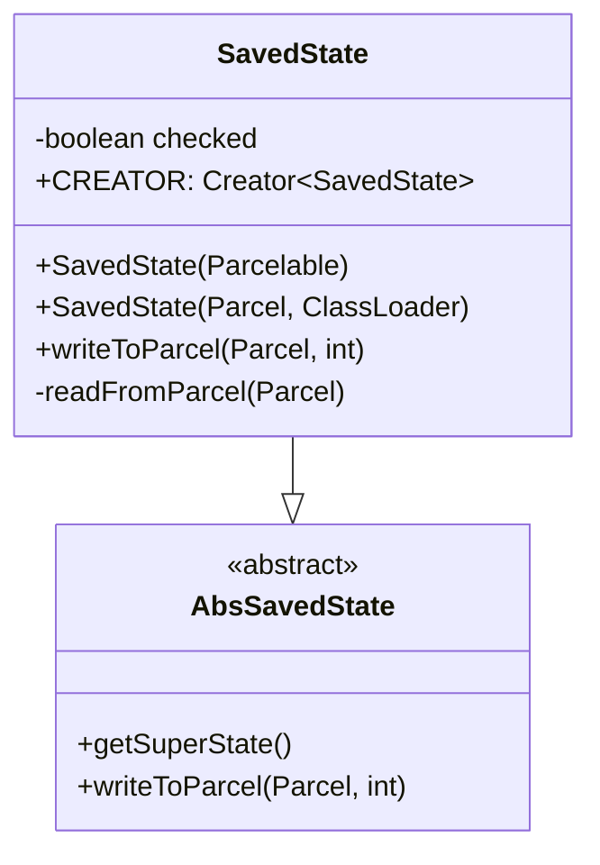
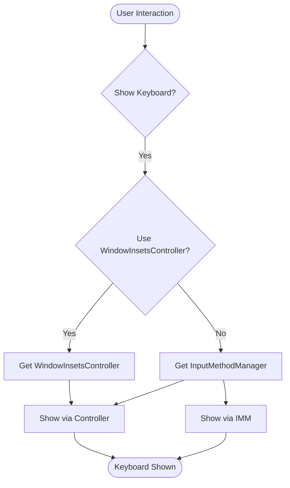

# View Utilities Module

The view-utilities module provides essential utility functions and helper classes for managing Android views within the Material Design Components library. This module serves as a foundational layer that supports view manipulation, keyboard management, window insets handling, and accessibility features across the entire Material Design system.

## Overview

The view-utilities module contains two primary components:

1. **ViewUtils** - A comprehensive utility class providing static methods for common view operations
2. **CheckableImageButton** - A specialized ImageButton that implements checkable functionality with state persistence

These components work together to provide low-level view management capabilities that are used extensively throughout the Material Design Components library.

## Architecture



## Core Components

### ViewUtils

The `ViewUtils` class is a comprehensive utility provider that offers static methods for various view operations. It's designed as a helper class that cannot be instantiated and provides essential functionality for:

- **Keyboard Management**: Show/hide keyboard with support for both legacy and modern WindowInsetsController APIs
- **View Bounds Calculation**: Calculate rectangles, offsets, and positioning for views
- **Window Insets Handling**: Manage system window insets with automatic padding adjustments
- **View Hierarchy Navigation**: Traverse and manipulate view hierarchies
- **Accessibility Support**: Helper methods for accessibility features
- **Layout Direction Detection**: RTL/LTR layout support

#### Key Features



#### Window Insets Management

The module provides sophisticated window insets handling through the `OnApplyWindowInsetsListener` interface and `RelativePadding` class:



### CheckableImageButton

The `CheckableImageButton` extends `AppCompatImageButton` to provide checkable functionality similar to a checkbox or radio button. It maintains state persistence and provides accessibility support.

#### Features

- **Checkable State Management**: Toggle between checked/unchecked states
- **State Persistence**: Save and restore checked state across configuration changes
- **Accessibility Integration**: Proper accessibility events and announcements
- **Drawable State Updates**: Automatic drawable state changes based on checked state
- **Focus Management**: Optional focusable state change notifications

#### State Management



#### SavedState Implementation

The `SavedState` class implements `AbsSavedState` to handle state persistence:



## Data Flow

### Keyboard Management Flow



### Window Insets Application Flow

```mermaid
flowchart LR
    ViewCreated([View Created])
    CheckAttributes[Check XML Attributes]
    CreateListener[Create OnApplyWindowInsetsListener]
    SetListener[Set Listener on View]
    InsetsChanged[System Insets Changed]
    CalculatePadding[Calculate New Padding]
    ApplyPadding[Apply Padding to View]
    
    ViewCreated --> CheckAttributes
    CheckAttributes --> CreateListener
    CreateListener --> SetListener
    SetListener --> InsetsChanged
    InsetsChanged --> CalculatePadding
    CalculatePadding --> ApplyPadding
```



## Integration with Other Modules

The view-utilities module serves as a foundational layer that supports numerous other Material Design Components:

### Text Field Integration
- Uses `CheckableImageButton` for end icon buttons in text fields
- Leverages `ViewUtils` for keyboard management and bounds calculations
- See [text-field.md](text-field.md) for detailed integration

### App Bar Integration  
- Utilizes `ViewUtils` for elevation calculations and view hierarchy navigation
- Window insets handling for edge-to-edge layouts
- See [appbar.md](appbar.md) for detailed integration

### Bottom Sheet Integration
- Keyboard management for bottom sheet interactions
- View bounds calculations for drag handling
- See [bottom-sheet.md](bottom-sheet.md) for detailed integration

### Dialog Integration
- Content view identification for proper overlay management
- Keyboard handling for input fields within dialogs
- See [dialog.md](dialog.md) for detailed integration

## Usage Examples

### Keyboard Management

```java
// Show keyboard with modern API
ViewUtils.showKeyboard(editText);

// Hide keyboard
ViewUtils.hideKeyboard(editText);

// Request focus and show keyboard
ViewUtils.requestFocusAndShowKeyboard(editText);
```

### Window Insets Handling

```java
// Apply window insets automatically based on XML attributes
ViewUtils.doOnApplyWindowInsets(view, attrs, defStyleAttr, defStyleRes);

// Custom window insets handling
ViewUtils.doOnApplyWindowInsets(view, (v, insets, initialPadding) -> {
    // Custom padding logic
    return insets;
});
```

### CheckableImageButton Usage

```java
CheckableImageButton checkableButton = findViewById(R.id.checkable_button);
checkableButton.setCheckable(true);
checkableButton.setChecked(true);
checkableButton.setOnClickListener(v -> {
    checkableButton.toggle();
});
```

## Best Practices

1. **Keyboard Management**: Always use `ViewUtils` methods instead of direct InputMethodManager calls to ensure compatibility across Android versions
2. **Window Insets**: Use the provided window insets utilities for consistent edge-to-edge behavior
3. **State Persistence**: Implement proper state saving/restoring when using CheckableImageButton in configuration-changing scenarios
4. **Accessibility**: Leverage the built-in accessibility features for better user experience
5. **Performance**: Cache view calculations when possible to avoid repeated hierarchy traversals

## Dependencies

The view-utilities module has minimal external dependencies:

- **AndroidX Core**: For compatibility utilities and WindowInsets handling
- **AppCompat**: For the base CheckableImageButton implementation
- **Material Drawable Utils**: For background color extraction

This minimal dependency footprint makes the module suitable for use across all Material Design Components without creating circular dependencies.

## Thread Safety

All methods in `ViewUtils` are thread-safe as they operate on immutable data or use proper synchronization when accessing view state. The `CheckableImageButton` state modifications should be performed on the main UI thread, following Android's view threading requirements.

## Performance Considerations

- View hierarchy traversals in `getParentAbsoluteElevation()` and `getContentView()` are optimized to minimize iterations
- Window insets listeners are automatically cleaned up when views are detached
- SavedState implementations use efficient Parcelable serialization
- Keyboard operations use the most direct API available for the Android version