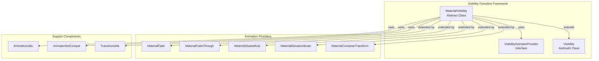
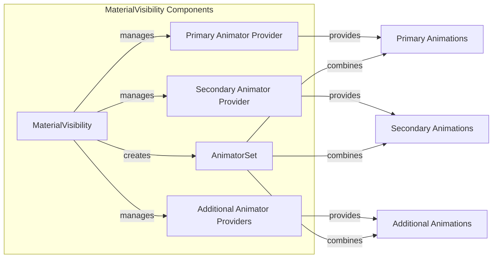
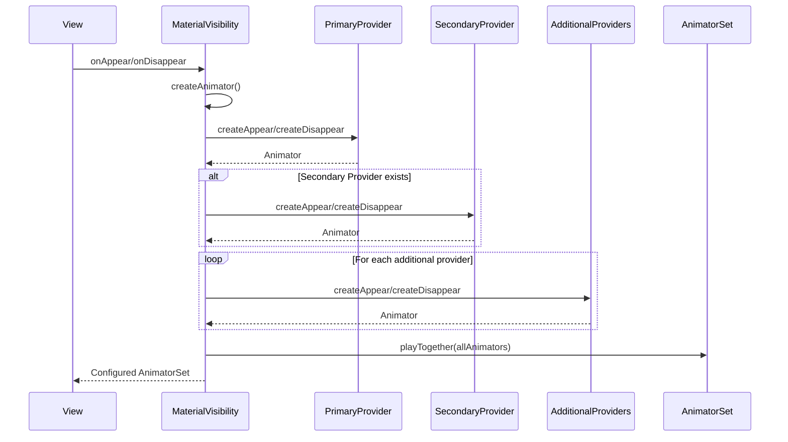
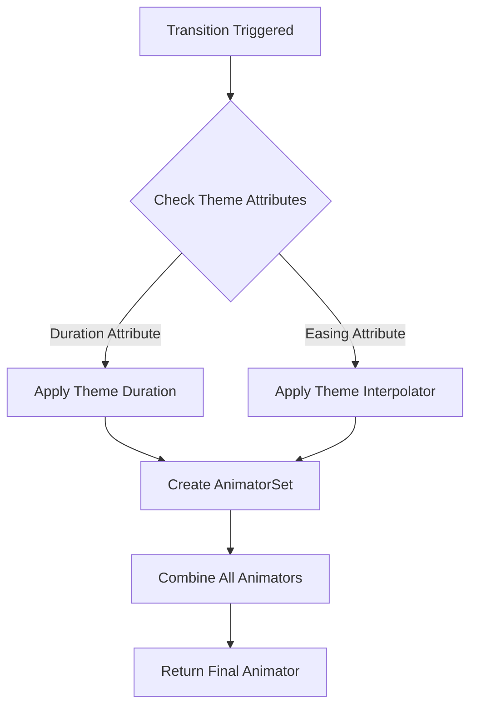
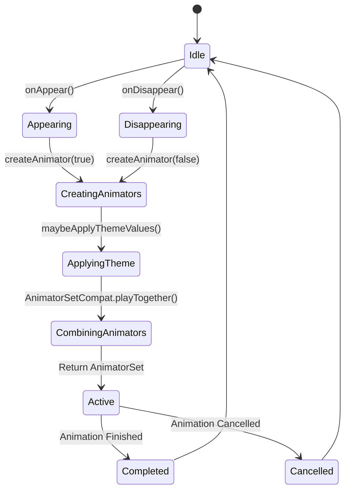
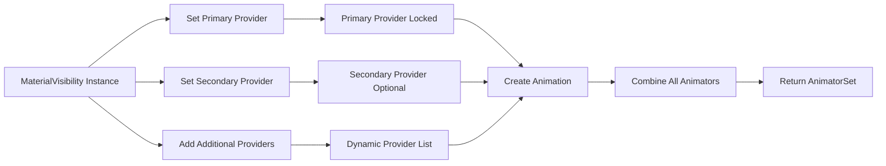

# Visibility Transition Framework

## Introduction

The visibility-transition-framework module provides the foundational architecture for Material Design visibility transitions in Android applications. This module implements the `MaterialVisibility` abstract class, which serves as the base class for all Material Design visibility transitions, enabling smooth and consistent animations when UI elements appear or disappear from the screen.

## Overview

The visibility-transition-framework is a core component of the Material Design transition system, providing a flexible and extensible architecture for creating sophisticated visibility animations. It builds upon Android's Transition framework to deliver Material Design-compliant animations with support for primary, secondary, and additional animator providers.

## Architecture

### Core Architecture



### Component Relationships



## Core Components

### MaterialVisibility Abstract Class

The `MaterialVisibility` class is the cornerstone of the visibility transition framework. It extends AndroidX's `Visibility` transition and provides a sophisticated architecture for managing multiple animation providers.

#### Key Features:

- **Primary Animator Provider**: The main animation provider that cannot be swapped out but can be modified
- **Secondary Animator Provider**: An optional provider that can be completely replaced
- **Additional Animator Providers**: A list of providers that can be dynamically added or removed
- **Theme Integration**: Automatic application of theme-based duration and interpolator values
- **Seeking Support**: Built-in support for animation seeking (for debugging and testing)

#### Generic Type Parameter:

```java
MaterialVisibility<P extends VisibilityAnimatorProvider>
```

The generic type `P` represents the type of the primary animator provider, ensuring type safety while allowing flexibility in implementation.

## Data Flow

### Animation Creation Flow



### Theme Value Application



## Integration with Animation Providers

The framework supports five main animation providers, each extending `MaterialVisibility`:

### 1. MaterialFade
- Provides fade-in/fade-out animations
- Uses opacity transitions for smooth appearance/disappearance

### 2. MaterialFadeThrough
- Implements fade-through transitions between destinations
- Ideal for navigation transitions

### 3. MaterialSharedAxis
- Creates shared axis transitions (X, Y, or Z)
- Perfect for spatial relationships between screens

### 4. MaterialElevationScale
- Combines elevation changes with scale animations
- Emphasizes depth and hierarchy

### 5. MaterialContainerTransform
- Transforms one container into another
- Used for hero element transitions

## Process Flow

### Transition Lifecycle



### Animator Provider Management



## Key Methods

### Public API Methods

- `getPrimaryAnimatorProvider()`: Returns the primary animator provider
- `getSecondaryAnimatorProvider()`: Returns the secondary animator provider (nullable)
- `setSecondaryAnimatorProvider()`: Sets or replaces the secondary provider
- `addAdditionalAnimatorProvider()`: Adds an additional provider
- `removeAdditionalAnimatorProvider()`: Removes an additional provider
- `clearAdditionalAnimatorProvider()`: Clears all additional providers

### Protected Methods

- `getDurationThemeAttrResId()`: Override to provide theme duration attribute
- `getEasingThemeAttrResId()`: Override to provide theme easing attribute
- `getDefaultEasingInterpolator()`: Returns default interpolator (FAST_OUT_SLOW_IN)

## Theme Integration

The framework automatically applies theme values when available:

- **Duration**: Applied from theme attributes when specified
- **Interpolator**: Applied from theme easing attributes
- **Fallback**: Uses Material Design standard interpolators when theme values are unavailable

## Error Handling

The framework includes robust error handling:

- **Null Safety**: All nullable parameters are properly annotated
- **Provider Validation**: Checks for null providers before creating animations
- **Graceful Degradation**: Continues operation even if some providers fail

## Performance Considerations

- **Animator Reuse**: Efficiently manages animator instances
- **Memory Management**: Proper cleanup of animation resources
- **Theme Caching**: Avoids repeated theme lookups

## Dependencies

The visibility-transition-framework depends on several key components:

- **AndroidX Transition Framework**: Base transition functionality
- **Material Animation Utils**: Standard interpolators and animation utilities
- **Transition Utils**: Theme integration and common transition operations

For more information about related modules, see:
- [animation-providers.md](animation-providers.md) - Specific animation provider implementations
- [container-transform-system.md](container-transform-system.md) - Container transform implementation details

## Usage Examples

### Basic Implementation

```java
// Creating a custom visibility transition
public class CustomVisibility extends MaterialVisibility<FadeProvider> {
    public CustomVisibility() {
        super(new FadeProvider(), new ScaleProvider());
    }
}
```

### Adding Additional Providers

```java
MaterialVisibility<?> transition = new MaterialFade();
transition.addAdditionalAnimatorProvider(new CustomAnimatorProvider());
```

### Theme Integration

```java
@Override
int getDurationThemeAttrResId(boolean appearing) {
    return appearing ? R.attr.appearDuration : R.attr.disappearDuration;
}
```

## Best Practices

1. **Primary Provider Selection**: Choose the primary provider based on the main animation effect
2. **Secondary Provider Usage**: Use secondary providers for complementary effects
3. **Additional Providers**: Add providers for complex, multi-layered animations
4. **Theme Integration**: Override theme methods for consistent branding
5. **Performance**: Minimize the number of additional providers for better performance

## Conclusion

The visibility-transition-framework provides a robust, extensible foundation for Material Design visibility transitions. Its flexible architecture allows developers to create sophisticated animations while maintaining consistency with Material Design principles. The framework's integration with the broader transition system ensures seamless interoperability with other Material Design components.