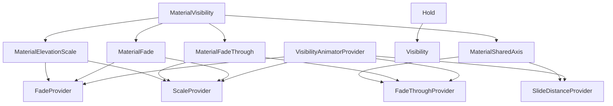
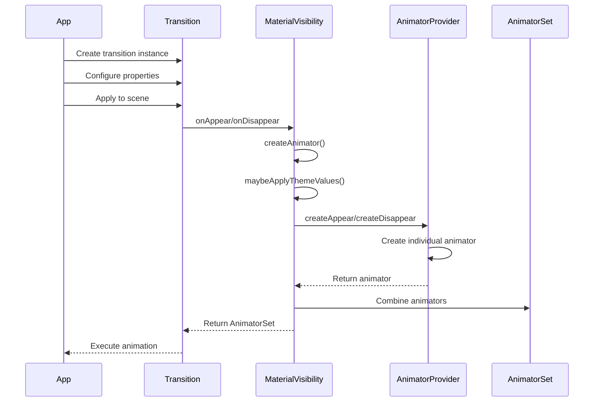
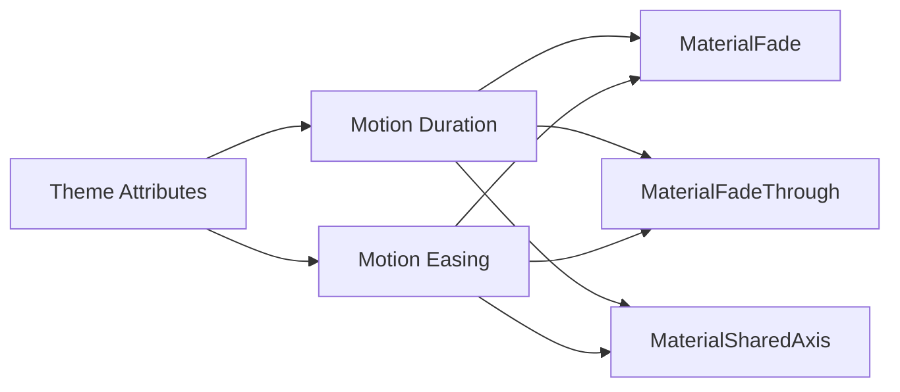
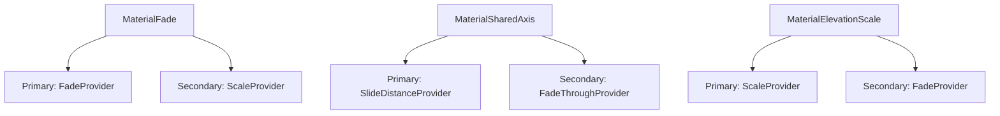
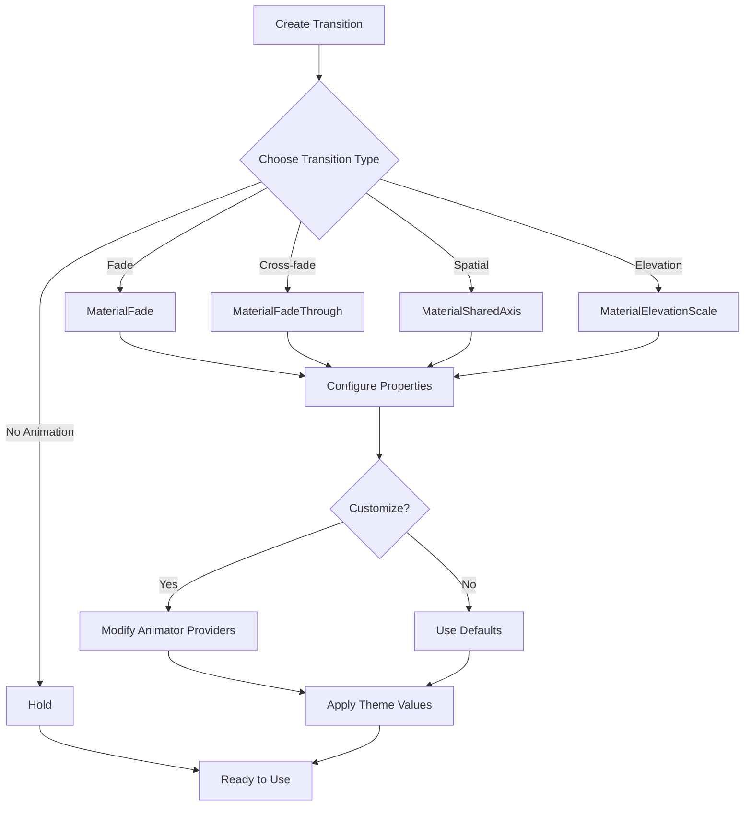
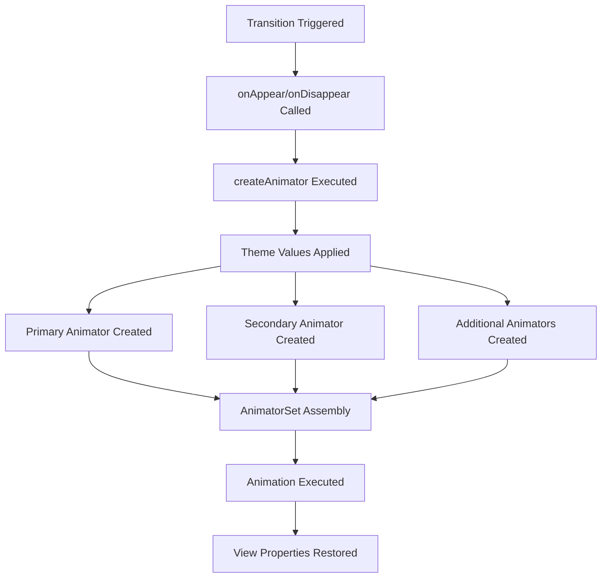

# Visibility Transitions Module

## Introduction

The visibility-transitions module provides a comprehensive set of Material Design-compliant transition animations for Android applications. This module implements the Material Design motion system, offering pre-built transition patterns that create smooth, meaningful animations when UI elements appear or disappear from the screen.

The module is part of the larger Material Design Components library and follows Material Design principles for motion, including appropriate easing curves, durations, and spatial relationships that guide user attention and create cohesive visual experiences.

## Core Functionality

The visibility-transitions module specializes in providing transition animations that handle the appearance and disappearance of UI elements. These transitions are built on top of Android's Transition framework and extend the `MaterialVisibility` base class to provide consistent theming and behavior across all transition types.

### Key Features

- **Theme-aware animations**: All transitions automatically adapt to the application's theme, using appropriate durations and easing curves
- **Composed animations**: Each transition combines primary and secondary animator providers for complex, layered effects
- **Configurable parameters**: Fine-grained control over animation properties like scale, fade thresholds, and slide distances
- **RTL support**: Built-in right-to-left layout support for international applications
- **Performance optimized**: Efficient animator implementations that minimize resource usage

## Architecture

### Component Hierarchy



### Core Components

#### MaterialVisibility (Abstract Base Class)
The foundation class that all Material visibility transitions extend. It provides:
- Primary and secondary animator provider composition
- Theme value application (duration and easing)
- Additional animator provider support for complex animations
- Seeking support for transition control

#### Concrete Transition Implementations

**MaterialFade**: A fade and scale transition where incoming content fades in with scale animation while outgoing content simply fades out. Uses a default start scale of 0.8 and fade end threshold of 0.3.

**MaterialFadeThrough**: A smooth cross-fade transition that scales content during the transition. Provides a fade in with scale out for appearing content and fade out with scale out for disappearing content, using a default start scale of 0.92.

**MaterialSharedAxis**: A spatial transition that moves content along a specified axis (X, Y, or Z). X-axis provides horizontal sliding, Y-axis provides vertical sliding, and Z-axis provides scaling motion. The direction is controlled by a "forward" parameter.

**MaterialElevationScale**: A scale transition designed to emphasize elevation changes, useful for container transforms. Scales surfaces up or down with a default scale factor of 0.85.

**Hold**: A special transition that performs no animation, useful for preserving scene state during fragment transitions.

#### Animator Providers

**FadeProvider**: Handles alpha-based animations with configurable fade end thresholds for staggered effects.

**FadeThroughProvider**: Manages cross-fade animations with a configurable progress threshold (default 0.35) where disappearing content finishes fading out and appearing content begins fading in.

**ScaleProvider**: Controls scale animations with separate configurations for growing/shrinking behavior, incoming/outgoing scales, and optional scaling on disappear.

**SlideDistanceProvider**: Manages translation-based animations along specified edges (LEFT, TOP, RIGHT, BOTTOM, START, END) with configurable slide distances and RTL support.

## Data Flow



## Component Interactions

### Theme Integration
All transitions integrate with the Material theme system to automatically apply appropriate motion values:



### Animator Composition
Each transition combines multiple animator providers to create rich, layered animations:



## Process Flow

### Transition Creation and Configuration



### Animation Execution



## Usage Patterns

### Basic Implementation
```java
// Create and apply a fade transition
MaterialFade fade = new MaterialFade();
TransitionManager.beginDelayedTransition(container, fade);
view.setVisibility(View.VISIBLE);
```

### Advanced Configuration
```java
// Configure a shared axis transition with custom properties
MaterialSharedAxis sharedAxis = new MaterialSharedAxis(MaterialSharedAxis.X, true);
sharedAxis.getPrimaryAnimatorProvider().setSlideDistance(200);
sharedAxis.setSecondaryAnimatorProvider(new FadeProvider());
```

### Theme Customization
The module automatically respects Material theme attributes:
- `motionDurationMedium4`, `motionDurationShort3`, `motionDurationLong1` for timing
- `motionEasingEmphasizedDecelerateInterpolator`, `motionEasingEmphasizedAccelerateInterpolator`, `motionEasingEmphasizedInterpolator` for easing

## Dependencies

The visibility-transitions module has several key dependencies within the Material Design Components library:

- **[Animation Utilities](animation.md)**: Provides core animation utilities and interpolators
- **[Theme System](theme.md)**: Integrates with Material theming for motion attributes
- **[Transition Utilities](transition-utilities.md)**: Shared utilities for transition management

## Integration with Other Modules

### App Bar Integration
Visibility transitions work seamlessly with [App Bar](appbar.md) components to create smooth header animations during content transitions.

### Navigation Integration
Transitions enhance [Navigation](navigation.md) components by providing visual continuity between different navigation states and destinations.

### Bottom Sheet Integration
Works with [Bottom Sheet](bottom-sheet.md) components to create smooth appearance and disappearance animations for modal content.

## Performance Considerations

- **Hardware Acceleration**: All transitions are optimized for hardware acceleration
- **Property Restoration**: View properties are automatically restored after animation completion
- **Memory Efficiency**: Animator providers are reused and properly cleaned up
- **Seeking Support**: Transitions support seeking for gesture-driven animations

## Best Practices

1. **Choose Appropriate Transitions**: Use MaterialFade for simple reveals, MaterialSharedAxis for spatial relationships, and MaterialFadeThrough for content replacement
2. **Respect Theme Values**: Allow transitions to use theme-based durations and easing for consistency
3. **Consider RTL Layouts**: All transitions automatically handle right-to-left layouts
4. **Test Performance**: Monitor animation performance on lower-end devices
5. **Use Hold Strategically**: Employ Hold transitions to maintain visual continuity during complex navigation patterns

## Conclusion

The visibility-transitions module provides a robust, theme-aware foundation for implementing Material Design motion patterns in Android applications. By offering pre-built transition types with extensive customization options, it enables developers to create smooth, meaningful animations that enhance user experience while maintaining consistency with Material Design principles.