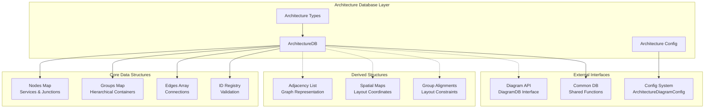
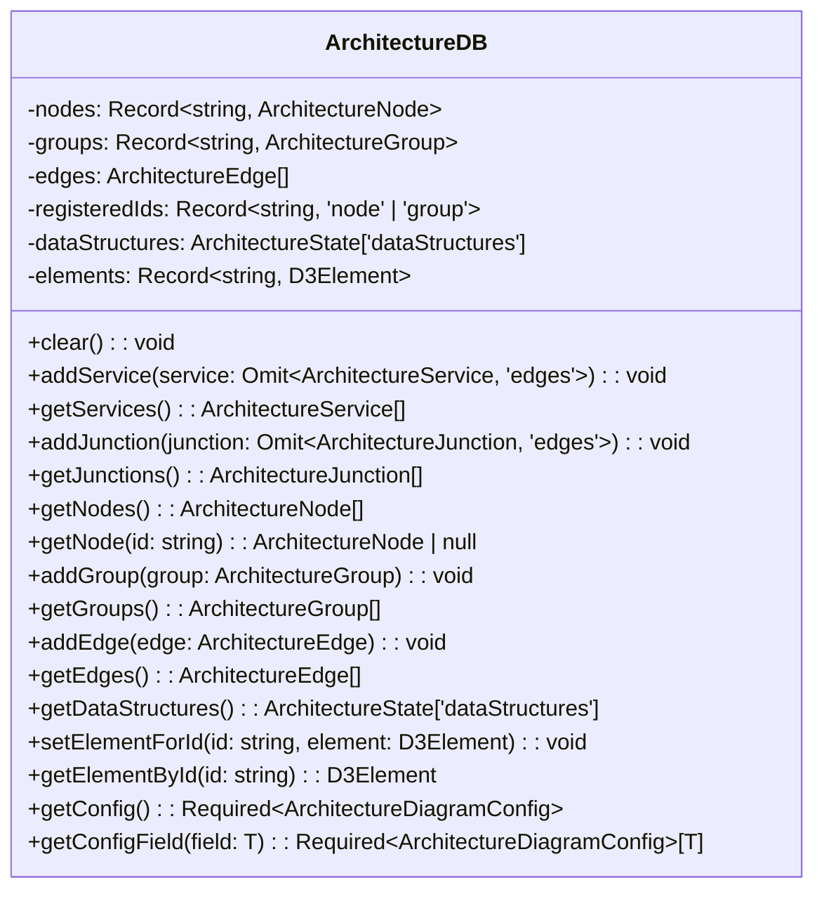
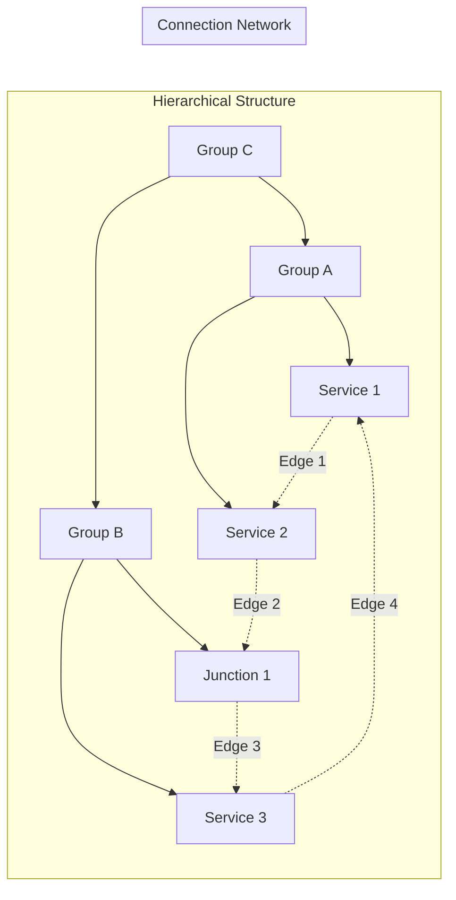
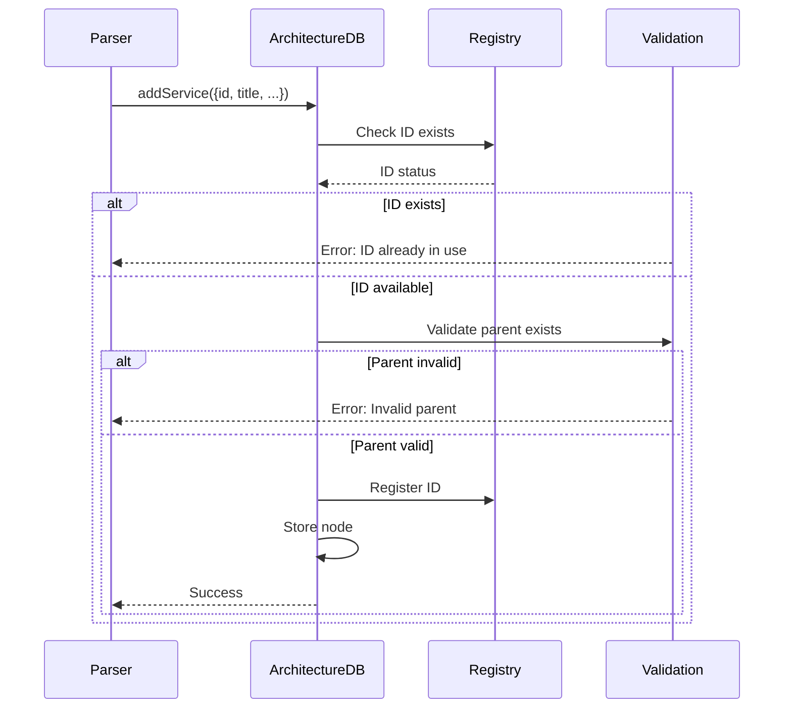
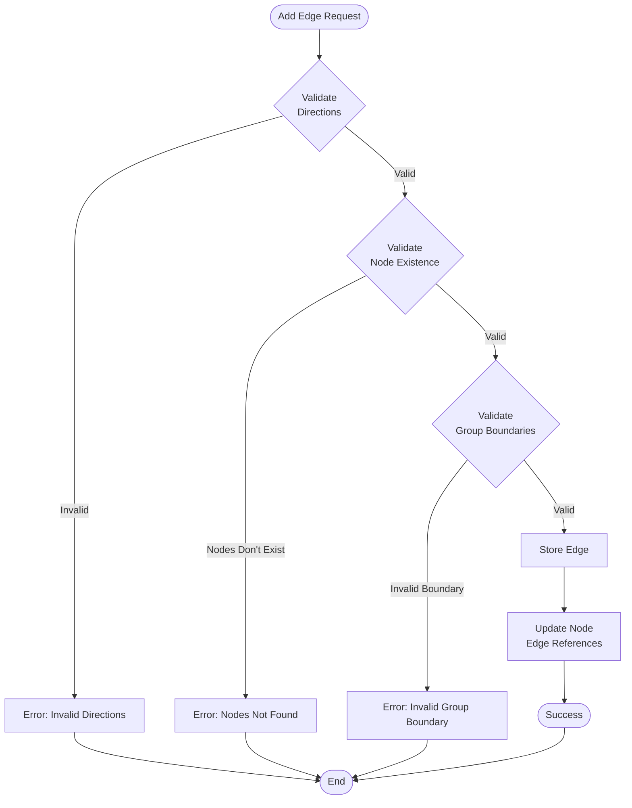
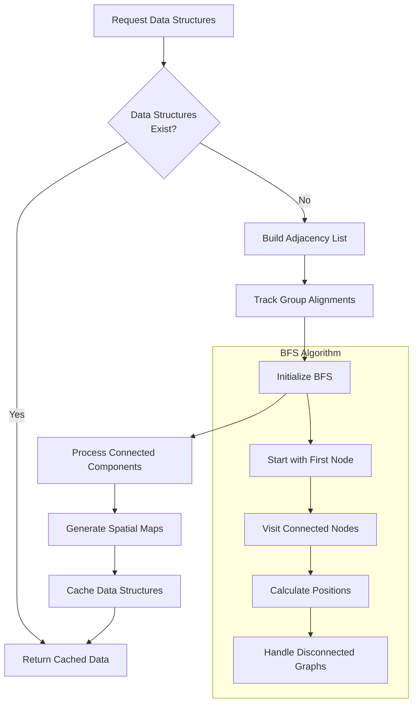
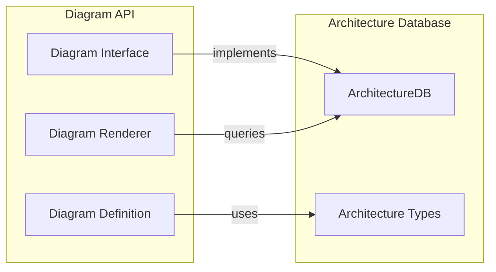

# Architecture Database Module

## Introduction

The architecture-database module is the core data management layer for architecture diagrams in Mermaid. It provides a comprehensive database implementation that handles the storage, validation, and manipulation of architecture diagram elements including services, groups, junctions, and their relationships. This module serves as the single source of truth for architecture diagram state and provides the foundation for rendering and interaction.

## Architecture Overview

The architecture database implements a graph-based data structure that represents system architecture as interconnected nodes (services and junctions) and edges (connections), organized within hierarchical groups. The module provides both immediate data access and derived data structures for spatial layout and rendering optimization.



## Component Architecture

### Core Database Class

The `ArchitectureDB` class implements the `DiagramDB` interface and serves as the central data repository for architecture diagrams. It maintains the complete state of the diagram and provides methods for data manipulation and retrieval.



### Data Structure Relationships

The module maintains complex relationships between different architectural elements:



## Data Flow Architecture

### Element Creation Flow

The module follows a strict validation pattern during element creation to maintain data integrity:



### Edge Creation and Validation

Edge creation involves complex validation to ensure proper connectivity and directionality:



### Spatial Data Generation

The module generates spatial data structures for layout optimization through a multi-step process:



## Key Features

### 1. Hierarchical Organization

The module supports nested group structures, allowing complex architectural hierarchies:

- **Groups** can contain other groups, services, and junctions
- **Services** and **Junctions** must belong to exactly one group or the root level
- **Validation** prevents circular dependencies and invalid nesting

### 2. Graph-Based Connectivity

Architecture diagrams are represented as directed graphs with spatial positioning:

- **Adjacency List** provides efficient graph traversal
- **Spatial Maps** assign 2D coordinates to each node
- **Group Alignments** track how groups connect to each other

### 3. Directional Edge System

Edges support directional connections with precise positioning:

- **Four Directions**: Left (L), Right (R), Top (T), Bottom (B)
- **Direction Pairs** define how nodes connect spatially
- **Group Boundaries** can be traversed with special handling

### 4. Data Integrity

Comprehensive validation ensures diagram consistency:

- **ID Uniqueness** across all element types
- **Parent-Child** relationship validation
- **Edge Connectivity** verification
- **Group Boundary** traversal rules

## Integration Points

### Diagram API Integration

The module implements the [`DiagramDB`](diagram-api.md) interface, providing standardized access to diagram data:



### Configuration System

Integrates with the [`config`](config.md) system for diagram-specific settings:

- **ArchitectureDiagramConfig** provides diagram-specific configuration
- **Default Configuration** merged with user settings
- **Field Access** through typed getter methods

### Common Database Functions

Leverages shared functionality from [`commonDb`](common-types.md):

- **Title Management** for diagram and accessibility titles
- **Description Handling** for accessibility descriptions
- **Clear Operations** for state reset

## Performance Considerations

### Lazy Evaluation

Spatial data structures are generated on-demand and cached:

- **First Request** triggers full graph analysis
- **Subsequent Requests** return cached results
- **Clear Operations** invalidate cached data

### Efficient Lookups

Multiple indexing strategies optimize data access:

- **ID Registry** provides O(1) element lookup
- **Adjacency List** enables efficient graph traversal
- **Spatial Maps** support rapid position-based operations

### Memory Management

Careful memory management for large diagrams:

- **Element References** stored for D3 integration
- **Data Structure Caching** prevents redundant computation
- **Clear Operations** properly release resources

## Error Handling

The module implements comprehensive error handling for various failure scenarios:

### Validation Errors

- **Duplicate IDs**: Prevented during element creation
- **Invalid Parents**: Detected during hierarchical operations
- **Missing Nodes**: Caught during edge creation
- **Invalid Directions**: Validated for all edge operations

### Runtime Errors

- **Circular References**: Prevented in group hierarchies
- **Disconnected Graphs**: Handled in spatial mapping
- **Invalid Group Boundaries**: Detected in edge validation

## Usage Patterns

### Basic Diagram Construction

```typescript
// Initialize database
const db = new ArchitectureDB();

// Create hierarchical structure
db.addGroup({ id: 'system', title: 'System Boundary' });
db.addService({ id: 'api', title: 'API Gateway', in: 'system' });
db.addService({ id: 'db', title: 'Database', in: 'system' });

// Create connections
db.addEdge({
  lhsId: 'api', lhsDir: 'R',
  rhsId: 'db', rhsDir: 'L',
  title: 'Data Access'
});
```

### Spatial Data Access

```typescript
// Get computed spatial information
const { adjList, spatialMaps, groupAlignments } = db.getDataStructures();

// Access node positions
const positions = spatialMaps[0]; // First connected component
const apiPosition = positions['api']; // [x, y] coordinates
```

### Configuration Access

```typescript
// Get diagram configuration
const config = db.getConfig();
const nodeSpacing = db.getConfigField('nodeSpacing');
```

## Dependencies

### Internal Dependencies

- [`config.type`](config.md): ArchitectureDiagramConfig type definitions
- [`diagram-api.types`](diagram-api.md): DiagramDB interface and related types
- [`types`](types.md): Core type definitions including D3Element
- [`utils`](utils.md): Utility functions for configuration merging
- [`common/commonDb`](common-types.md): Shared database functionality

### Type Dependencies

- [`architectureTypes`](architecture-types.md): Architecture-specific type definitions
- [`defaultConfig`](config.md): Default configuration values

## Future Considerations

### Scalability

The current implementation efficiently handles medium-sized diagrams. For very large architectures:

- **Incremental Updates** could optimize spatial recalculation
- **Spatial Indexing** might improve position-based queries
- **Memory Optimization** could reduce overhead for large graphs

### Extensibility

The modular design supports future enhancements:

- **New Element Types** can be added to the node system
- **Additional Constraints** can be integrated into validation
- **Layout Algorithms** can extend the spatial mapping system

### Integration

Potential integration points for future development:

- **Real-time Collaboration** could leverage the centralized state
- **Export Formats** can access the complete graph structure
- **Analysis Tools** can utilize the adjacency relationships