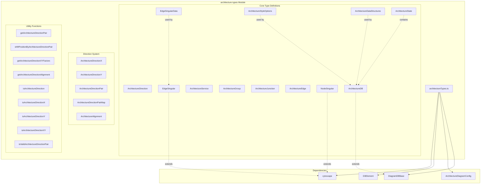
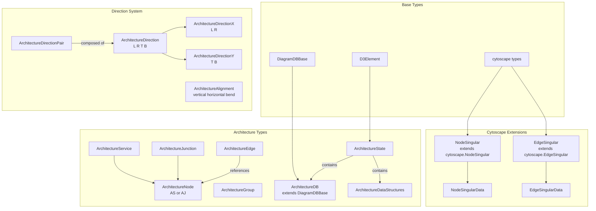
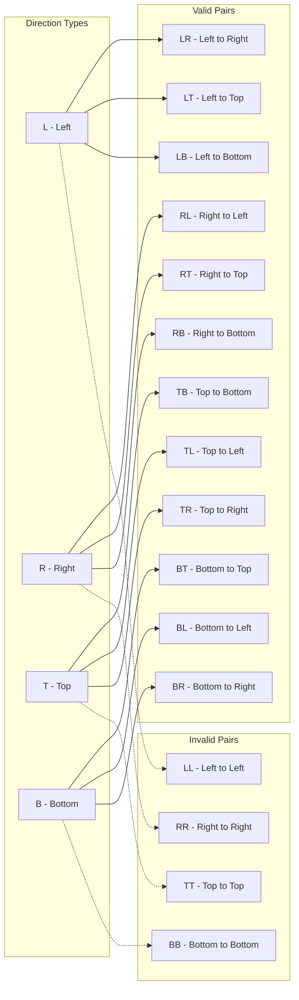
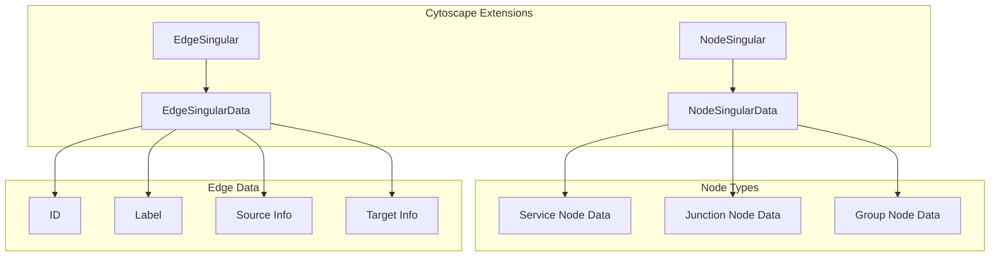
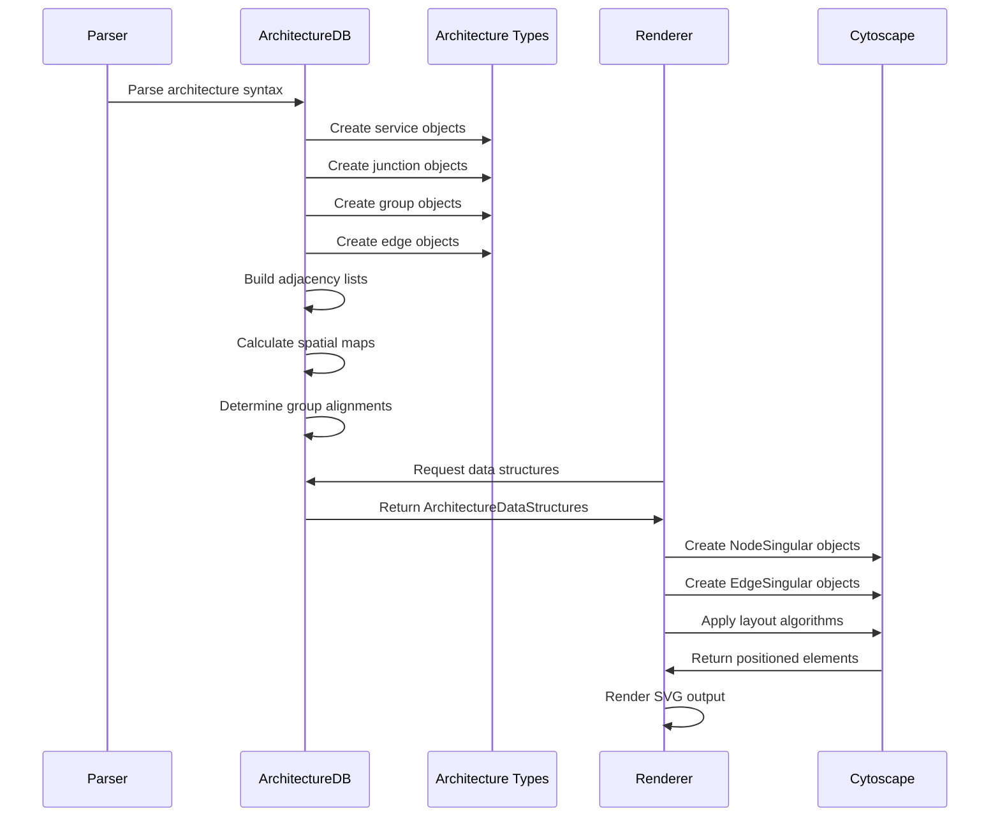
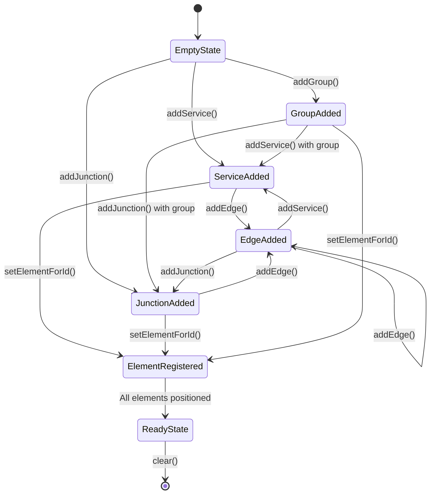
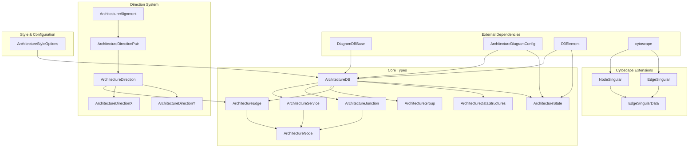

# Architecture Types Module

The architecture-types module defines the core type system for architecture diagrams in Mermaid, providing the foundational data structures and type definitions for creating system architecture visualizations. This module establishes the type safety and structure for representing services, groups, junctions, and their relationships in architectural diagrams.

## Overview

The architecture-types module serves as the type foundation for the architecture diagram implementation in Mermaid. It defines comprehensive TypeScript interfaces and type definitions that enable the creation of system architecture diagrams showing services, their connections, and organizational groupings. The module provides type-safe representations of architectural elements including services, junctions, groups, and edges with directional relationships.

## Architecture

### Module Structure



### Type Hierarchy



## Core Components

### ArchitectureDB

The `ArchitectureDB` interface extends `DiagramDBBase` and serves as the primary database interface for architecture diagrams. It provides methods for managing services, junctions, groups, and edges within the diagram.

**Key Methods:**
- `addService()`: Adds a new service node to the diagram
- `addJunction()`: Adds a junction node for connecting edges
- `addGroup()`: Creates organizational groups for services
- `addEdge()`: Establishes connections between nodes
- `getServices()`, `getJunctions()`, `getGroups()`, `getEdges()`: Retrieval methods
- `setElementForId()`, `getElementById()`: D3 element management

### ArchitectureService

Represents a service component in the architecture diagram with properties for identification, visualization, and connection management.

**Properties:**
- `id`: Unique identifier
- `type`: Always 'service' for type discrimination
- `edges`: Array of connected edges
- `icon`, `iconText`: Visual representation options
- `title`: Display name
- `in`: Group membership identifier
- `width`, `height`: Dimension specifications

### ArchitectureJunction

Special node type used as connection points for edges, enabling complex routing and multiple connections.

**Properties:**
- `id`: Unique identifier
- `type`: Always 'junction' for type discrimination
- `edges`: Array of connected edges
- `in`: Group membership identifier
- `width`, `height`: Dimension specifications

### ArchitectureGroup

Organizational container for grouping related services and junctions in the diagram.

**Properties:**
- `id`: Unique identifier
- `icon`: Optional group icon
- `title`: Group display name
- `in`: Parent group identifier for nested groups

### ArchitectureEdge

Defines connections between nodes with directional information and styling options.

**Properties:**
- `lhsId`, `rhsId`: Source and target node identifiers
- `lhsDir`, `rhsDir`: Connection directions (L, R, T, B)
- `lhsInto`, `rhsInto`: Boolean flags for inward connections
- `lhsGroup`, `rhsGroup`: Boolean flags for group connections
- `title`: Edge label text

### Direction System

The module implements a comprehensive direction system for precise edge routing:



### Cytoscape Integration

The module extends Cytoscape.js types for rendering architecture diagrams:



## Data Flow

### Architecture Diagram Processing Pipeline



### State Management



## Component Relationships

### Type Dependencies



### Integration Points

The architecture-types module integrates with several other Mermaid modules:

- **[config](config.md)**: Uses `ArchitectureDiagramConfig` for configuration management
- **[diagram-api](diagram-api.md)**: Extends `DiagramDBBase` and integrates with diagram API types
- **[types](types.md)**: Utilizes `D3Element` and other core type definitions
- **[architecture-database](architecture-database.md)**: Implements the `ArchitectureDB` interface

## Key Features

### Type Safety

The module provides comprehensive type safety through:
- Discriminated unions for node types (Service vs Junction)
- Direction validation with compile-time checking
- Cytoscape integration with proper type extensions
- Configuration type integration

### Direction System

Advanced direction handling includes:
- Cardinal directions (L, R, T, B)
- Direction pair validation
- XY direction detection for bend routing
- Position shifting algorithms
- Arrow rendering helpers

### Data Structure Management

Efficient data organization through:
- Adjacency lists for connection tracking
- Spatial maps for layout calculations
- Group alignment matrices
- State management for rendering pipeline

## Usage Patterns

### Creating Architecture Elements

```typescript
// Service creation
const service: ArchitectureService = {
  id: 'web-server',
  type: 'service',
  edges: [],
  title: 'Web Server',
  icon: 'server',
  width: 120,
  height: 60
};

// Junction creation
const junction: ArchitectureJunction = {
  id: 'junction-1',
  type: 'junction',
  edges: [],
  width: 20,
  height: 20
};

// Edge creation
const edge: ArchitectureEdge = {
  lhsId: 'web-server',
  lhsDir: 'R',
  rhsId: 'database',
  rhsDir: 'L',
  title: 'HTTP Request'
};
```

### Direction Validation

```typescript
// Validate direction pairs
const pair = getArchitectureDirectionPair('L', 'R'); // Returns 'LR'
const invalidPair = getArchitectureDirectionPair('L', 'L'); // Returns undefined

// Check direction types
if (isArchitectureDirectionX('L')) {
  // Handle horizontal direction
}

if (isArchitectureDirectionXY('L', 'T')) {
  // Handle bend routing
}
```

This comprehensive type system enables the creation of complex, well-structured architecture diagrams while maintaining type safety and providing robust validation mechanisms.