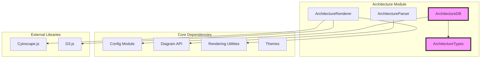
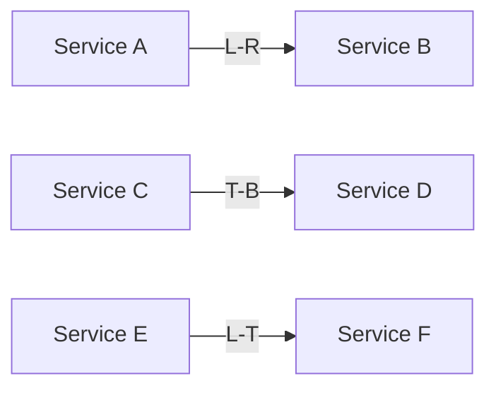
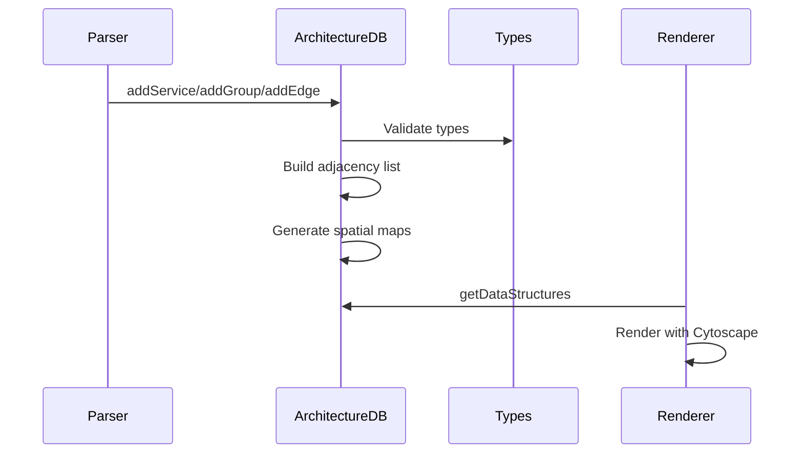
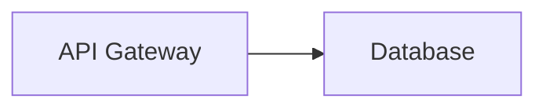
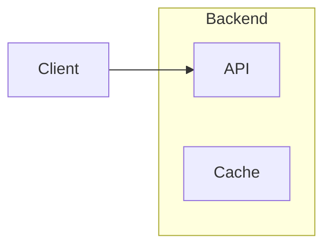
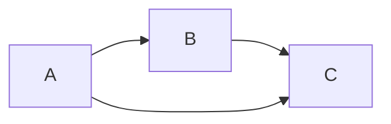

# Architecture Module Documentation

## Overview

The Architecture module is a specialized diagram type within the Mermaid ecosystem designed for creating system architecture diagrams. It provides a comprehensive framework for visualizing system components, their relationships, and hierarchical structures through a declarative syntax.

## Purpose

The Architecture module enables developers and system architects to:
- Create detailed system architecture diagrams
- Represent services, groups, and junctions with directional relationships
- Visualize component hierarchies and dependencies
- Support complex layout algorithms for optimal diagram presentation

## Architecture Overview

## Core Components

### ArchitectureDB (`architectureDb.ts`)
The central database class that manages all architecture diagram data:
- **Node Management**: Handles services, junctions, and groups
- **Edge Management**: Manages directional connections between components
- **Data Structure Generation**: Creates adjacency lists and spatial maps for layout
- **Validation**: Ensures data integrity and relationship validity

### ArchitectureTypes (`architectureTypes.ts`)
Comprehensive type definitions including:
- **Direction System**: L/R/T/B directional constants and utilities
- **Node Types**: Service, Junction, and Group interfaces
- **Edge Types**: Directional connection definitions
- **Cytoscape Integration**: Type overrides for graph rendering

### Key Features

#### Directional System
The module implements a sophisticated directional system using L (Left), R (Right), T (Top), B (Bottom) notation:

#### Hierarchical Structure
Supports nested groups and services:
- Services can be placed within groups
- Groups can contain other groups
- Junctions provide connection points

#### Layout Algorithm
Implements BFS-based spatial mapping:
1. Creates adjacency list from node relationships
2. Generates spatial coordinates for optimal placement
3. Handles disconnected graphs
4. Calculates group alignments

## Data Flow

## Integration with Mermaid Ecosystem

### Configuration
- Extends `ArchitectureDiagramConfig` from config module
- Integrates with theme system for styling
- Supports custom styling options

### Rendering Pipeline
- Utilizes Cytoscape.js for graph rendering
- Integrates with D3.js for advanced visualizations
- Supports theme-based styling

### Parser Integration
- Implements `DiagramDB` interface
- Integrates with Mermaid's parsing framework
- Supports frontmatter metadata

## Sub-modules

The architecture module contains several specialized sub-modules:

### [architecture-database](architecture-database.md)
Manages the core data structures and state for architecture diagrams, including node management, edge relationships, and spatial mapping algorithms.

### [architecture-types](architecture-types.md)
Defines the comprehensive type system for the architecture module, including directional constants, node interfaces, and Cytoscape integration types.

## Usage Examples

### Basic Service Definition

### Group Hierarchy

### Complex Layout

## Related Modules

- [config](config.md) - Configuration management
- [diagram-api](diagram-api.md) - Core diagram interfaces
- [rendering-util](rendering-util.md) - Rendering utilities
- [themes](themes.md) - Styling and theming