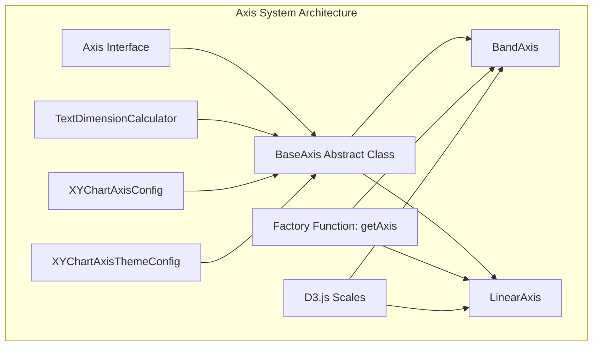
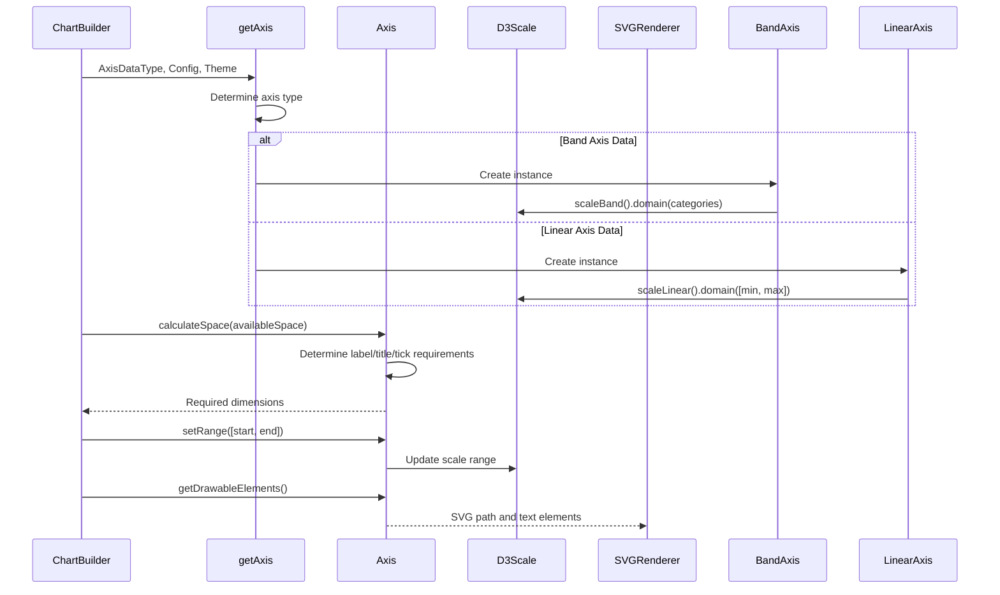
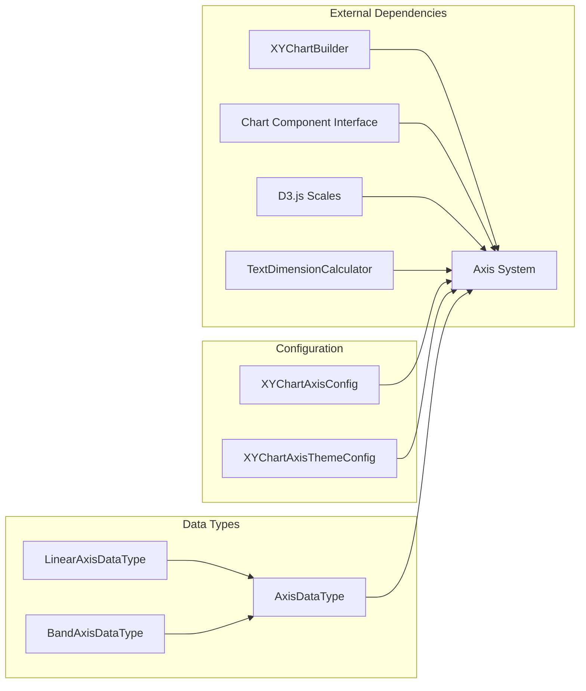
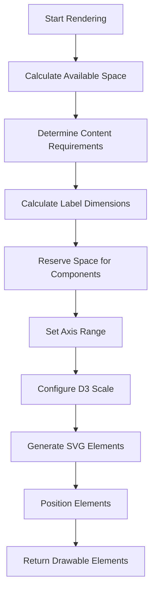

# Axis System Module

## Introduction

The axis-system module is a core component of Mermaid's XY chart rendering engine, responsible for creating, positioning, and rendering chart axes. It provides a flexible architecture that supports both categorical (band) and numerical (linear) axes, enabling the creation of various chart types including bar charts, line charts, and scatter plots.

## Architecture Overview

The axis system follows a hierarchical design pattern with clear separation of concerns:



## Core Components

### 1. Axis Interface (`Axis`)
The primary interface that defines the contract for all axis implementations:

```typescript
interface Axis extends ChartComponent {
  getScaleValue(value: string | number): number;
  setAxisPosition(axisPosition: AxisPosition): void;
  getAxisOuterPadding(): number;
  getTickDistance(): number;
  recalculateOuterPaddingToDrawBar(): void;
  setRange(range: [number, number]): void;
}
```

### 2. BaseAxis Abstract Class
The foundation class that implements common axis functionality:

- **Space Management**: Calculates required space for labels, titles, ticks, and axis lines
- **Position Handling**: Supports four axis positions: 'left', 'right', 'top', 'bottom'
- **Rendering**: Generates SVG drawable elements for different axis orientations
- **Configuration**: Manages axis appearance through `XYChartAxisConfig` and `XYChartAxisThemeConfig`

### 3. BandAxis Class
Specialized axis for categorical data:
- Uses D3's `scaleBand()` for positioning categories
- Supports padding and alignment for bar charts
- Handles string-based tick values

### 4. LinearAxis Class
Specialized axis for numerical data:
- Uses D3's `scaleLinear()` for continuous data
- Automatically generates tick values using D3's tick generator
- Supports domain reversal for proper Y-axis orientation

## Data Flow



## Component Relationships



## Configuration System

### Axis Configuration (`XYChartAxisConfig`)
Controls the visual appearance and behavior of axes:

```typescript
interface XYChartAxisConfig {
  showLabel: boolean;           // Display axis labels
  labelFontSize: number;        // Label font size
  labelPadding: number;         // Padding around labels
  showTitle: boolean;           // Display axis title
  titleFontSize: number;        // Title font size
  titlePadding: number;         // Padding around title
  showTick: boolean;            // Display tick marks
  tickLength: number;           // Tick mark length
  tickWidth: number;            // Tick mark width
  showAxisLine: boolean;        // Display axis line
  axisLineWidth: number;        // Axis line width
}
```

### Theme Configuration (`XYChartAxisThemeConfig`)
Defines color schemes for axis elements:

```typescript
interface XYChartAxisThemeConfig {
  titleColor: string;           // Axis title color
  labelColor: string;           // Label text color
  tickColor: string;            // Tick mark color
  axisLineColor: string;        // Axis line color
}
```

## Rendering Process

The axis rendering follows a multi-step process:

1. **Space Calculation**: Determines required space based on content
2. **Scale Setup**: Configures D3 scales with appropriate domains and ranges
3. **Element Generation**: Creates SVG elements for axis components
4. **Positioning**: Places elements according to axis position



## Integration with Chart System

The axis system integrates with the broader XY chart architecture:

- **[Chart Builder](chart-builder.md)**: Coordinates axis creation and layout
- **[Plot System](plot-system.md)**: Uses axis scales for data positioning
- **[Theme System](theme-system.md)**: Provides consistent visual styling
- **[Rendering Engine](rendering-engine.md)**: Processes drawable elements into final SVG

## Key Features

### 1. Flexible Positioning
Supports all four chart axis positions with appropriate rendering logic for each orientation.

### 2. Intelligent Space Management
Automatically calculates required space based on label length, title size, and tick requirements.

### 3. Scale Integration
Seamlessly integrates with D3's scaling system for accurate data representation.

### 4. Theme Support
Full support for customizable colors and styling through the theme system.

### 5. Bar Chart Optimization
Special handling for bar charts with automatic padding calculations.

## Usage Examples

### Creating a Linear Axis
```typescript
const axis = getAxis(
  { min: 0, max: 100, title: 'Sales ($)' },
  axisConfig,
  themeConfig,
  tmpSVGGroup
);
```

### Creating a Band Axis
```typescript
const axis = getAxis(
  { categories: ['Q1', 'Q2', 'Q3', 'Q4'], title: 'Quarter' },
  axisConfig,
  themeConfig,
  tmpSVGGroup
);
```

## Error Handling

The system includes appropriate error handling:
- Right axis positioning throws a clear error message (not yet implemented)
- Scale value lookups return safe defaults for missing data
- Dimension calculations handle edge cases gracefully

## Performance Considerations

- **Caching**: Text dimensions are calculated once and reused
- **Lazy Evaluation**: Scale recalculation only when necessary
- **Efficient Rendering**: Minimal SVG element generation

## Future Enhancements

Potential areas for expansion:
- Right axis support implementation
- Advanced tick formatting options
- Rotated label support for long category names
- Interactive axis features (zooming, panning)

## Related Documentation

- [Chart Builder](chart-builder.md) - Coordinate axis creation
- [Plot System](plot-system.md) - Data visualization components
- [Theme System](theme-system.md) - Visual styling configuration
- [XY Chart Configuration](xychart-configuration.md) - Chart-level settings