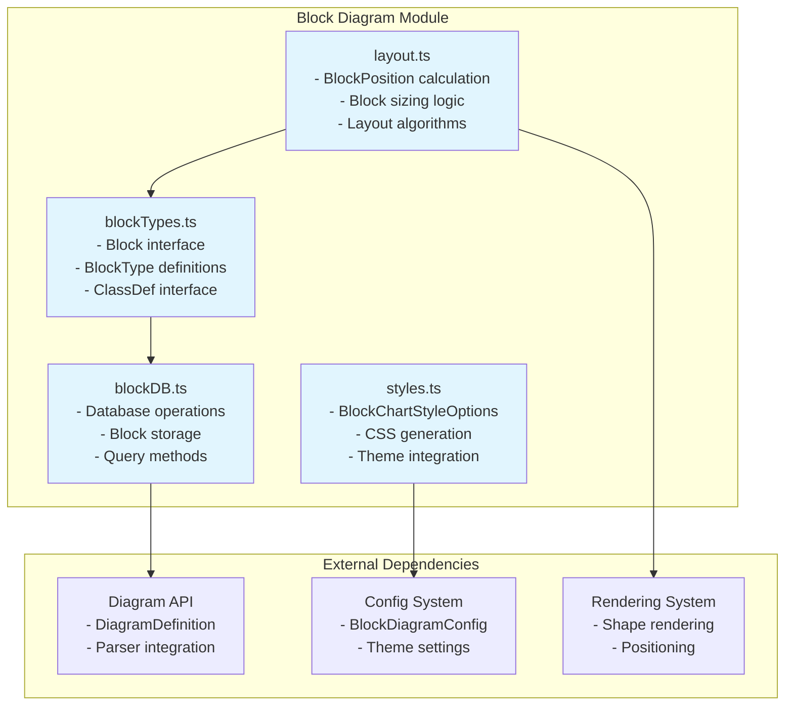
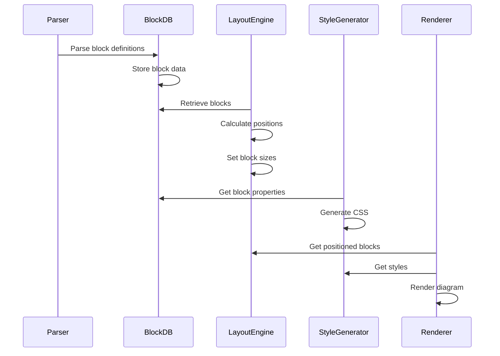

# Block Diagram Module

## Overview

The Block Diagram module is a specialized diagram type within the Mermaid.js library that provides functionality for creating block-based visualizations. This module enables users to create structured diagrams with various block shapes, layouts, and styling options, making it suitable for representing hierarchical data, organizational structures, and component relationships.

## Architecture

The Block Diagram module follows a modular architecture with clear separation of concerns:

## Core Functionality

### Block Types and Shapes

The module supports a comprehensive set of block types, each serving different visualization purposes:

- **Basic Shapes**: `square`, `circle`, `ellipse`, `diamond`, `hexagon`
- **Specialized Shapes**: `stadium`, `cylinder`, `subroutine`, `trapezoid`, `lean_right`, `lean_left`
- **Layout Elements**: `space`, `column-setting`, `group`, `composite`
- **Edge Types**: `edge`, `block_arrow`, `rect_left_inv_arrow`
- **Styling**: `classDef`, `applyClass`, `applyStyles`

### Layout System

The layout system provides sophisticated positioning algorithms:

1. **Grid-based Layout**: Automatic column and row positioning
2. **Hierarchical Layout**: Parent-child relationship management
3. **Dynamic Sizing**: Automatic width and height calculation based on content
4. **Flexible Positioning**: Support for custom positioning and alignment

### Styling and Theming

The module integrates with Mermaid's theming system to provide:

- **Color Schemes**: Configurable colors for blocks, edges, and text
- **Typography**: Font family and text color customization
- **Visual Effects**: Opacity, shadows, and border styling
- **Responsive Design**: Adaptive styling based on diagram context

## Data Flow

## Integration with Mermaid Ecosystem

The Block Diagram module integrates seamlessly with the broader Mermaid.js ecosystem:

- **Configuration System**: Inherits from `BlockDiagramConfig` for consistent theming
- **Parser Integration**: Uses Mermaid's parsing infrastructure for syntax processing
- **Rendering Pipeline**: Leverages shared rendering utilities and shape definitions
- **Theme Support**: Compatible with all Mermaid themes (default, dark, forest, neutral)
- **Common Types**: Utilizes shared type definitions from the [common-types](common-types.md) module for text rendering and boundary calculations

## Sub-modules

The Block Diagram module consists of several specialized sub-modules:

### [blockTypes](blockTypes.md)
Defines the core data structures and type definitions for blocks, including the Block interface and BlockType enumeration.

### [layout](layout.md)
Implements the layout algorithms and positioning logic for arranging blocks in the diagram space.

### [styles](styles.md)
Handles CSS generation and styling options for block diagrams, including theme integration.

### [blockDB](blockDB.md)
Manages block data storage and retrieval operations, providing the database interface for block diagram elements.

## Usage Examples

Block diagrams can represent various structures:

- **Organizational Charts**: Hierarchical company structures
- **System Architectures**: Component relationships and dependencies
- **Process Flows**: Step-by-step workflows with decision points
- **Data Structures**: Tree and graph representations

## Configuration

The module supports extensive configuration through the `BlockDiagramConfig` interface, allowing customization of:

- Layout parameters (padding, spacing, alignment)
- Visual properties (colors, fonts, borders)
- Behavioral settings (auto-sizing, responsive behavior)

## Performance Considerations

The layout engine is optimized for:
- Efficient block positioning with minimal calculations
- Scalable rendering for large diagrams
- Memory-efficient data structures
- Fast style generation and application

## Future Enhancements

Potential areas for expansion include:
- Additional block shapes and styles
- Advanced layout algorithms (force-directed, circular)
- Interactive features (collapsible blocks, tooltips)
- Export capabilities (SVG optimization, PDF generation)