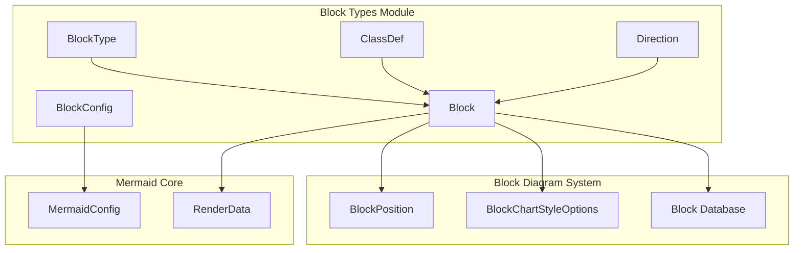
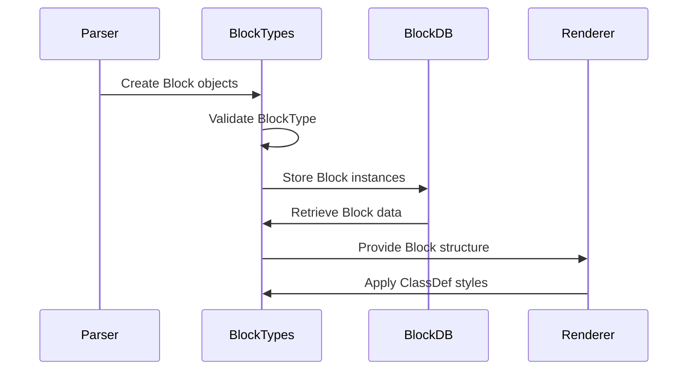
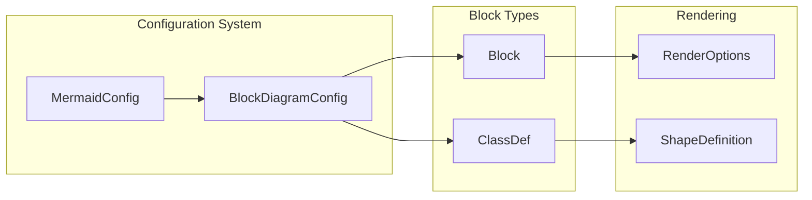

# Block Types Module Documentation

## Introduction

The `blockTypes` module is a core component of the Mermaid block diagram system that defines the fundamental data structures and type definitions for creating and managing block diagrams. This module provides the essential building blocks for representing various types of blocks, their relationships, and styling configurations within block diagram visualizations.

## Module Overview

The blockTypes module serves as the foundation for the block diagram implementation in Mermaid, offering:

- **Type Definitions**: Comprehensive type system for different block shapes and configurations
- **Data Structures**: Core interfaces for blocks, class definitions, and directional relationships
- **Configuration Support**: Integration with Mermaid's configuration system for customizable block diagrams

## Core Components

### Block Interface

The `Block` interface is the central data structure that represents individual elements within a block diagram:

```typescript
interface Block {
  id: string;                    // Unique identifier for the block
  label?: string;                // Display text for the block
  type?: BlockType;              // Shape type (e.g., square, circle, diamond)
  children: Block[];             // Nested child blocks
  parent?: Block;                // Reference to parent block
  
  // Edge-specific properties
  start?: string;                // Source block ID for edges
  end?: string;                  // Target block ID for edges
  arrowTypeEnd?: string;         // Arrow style at end
  arrowTypeStart?: string;       // Arrow style at start
  
  // Layout and positioning
  size?: {                        // Block dimensions and position
    width: number;
    height: number;
    x: number;
    y: number;
  };
  width?: number;                // Block width
  columns?: number;              // Column configuration
  widthInColumns?: number;       // Width in column units
  
  // Styling and appearance
  classes?: string[];            // CSS classes to apply
  css?: string;                  // Inline CSS styles
  styleClass?: string;           // Style class reference
  styles?: string[];             // Style definitions
  stylesStr?: string;            // Style string representation
  
  // Layout direction
  directions?: string[];         // Directional configuration
  intersect?: any;               // Intersection data for layout
  node?: any;                    // Reference to rendered node
}
```

### BlockType Enumeration

The `BlockType` type defines all supported block shapes and special types:

- **Basic Shapes**: `square`, `circle`, `ellipse`, `diamond`, `hexagon`
- **Specialized Shapes**: `stadium`, `subroutine`, `cylinder`, `trapezoid`
- **Directional**: `lean_right`, `lean_left`, `odd`, `odd_right`
- **Arrows**: `block_arrow`, `rect_left_inv_arrow`
- **Layout**: `column-setting`, `space`, `group`
- **Styling**: `classDef`, `applyClass`, `applyStyles`
- **Special**: `composite`, `edge`, `na`

### ClassDef Interface

The `ClassDef` interface manages styling definitions for blocks:

```typescript
interface ClassDef {
  id: string;                    // Unique class identifier
  textStyles: string[];          // Text-specific styles
  styles: string[];              // General CSS styles
}
```

### Direction Type

Defines supported layout directions:
- **Cardinal**: `up`, `down`, `left`, `right`
- **Axes**: `x`, `y`

## Architecture

### Component Relationships



### Data Flow



## Integration with Block Diagram System

The blockTypes module integrates with several other components within the block diagram ecosystem:

### Dependencies

- **[block.md](block.md)**: Parent module that utilizes blockTypes for diagram implementation
- **[block-layout.md](block-layout.md)**: Uses Block interface for positioning calculations
- **[block-styles.md](block-styles.md)**: Applies ClassDef styles to rendered blocks

### Configuration Integration



## Usage Patterns

### Block Creation

```typescript
// Example block structure
const block: Block = {
  id: 'node1',
  type: 'square',
  label: 'Process Start',
  children: [],
  classes: ['primary-block'],
  size: { width: 100, height: 60, x: 50, y: 50 }
};
```

### Class Definition

```typescript
// Example class definition
const classDef: ClassDef = {
  id: 'primary-block',
  textStyles: ['font-weight: bold', 'color: #333'],
  styles: ['fill: #e3f2fd', 'stroke: #1976d2', 'stroke-width: 2px']
};
```

### Edge Configuration

```typescript
// Example edge block
const edgeBlock: Block = {
  id: 'edge1',
  type: 'edge',
  start: 'node1',
  end: 'node2',
  arrowTypeEnd: 'arrow',
  label: 'transitions to'
};
```

## Extension Points

The blockTypes module provides several extension points for customization:

### Custom Block Types

New block shapes can be added by extending the `BlockType` union type, though this requires corresponding renderer support.

### Style Extensions

ClassDef styles can be extended with additional CSS properties and custom style definitions.

### Layout Integration

The Block interface supports custom layout data through the `intersect` and `node` properties, enabling integration with various layout algorithms.

## Best Practices

### Block Design

1. **Unique IDs**: Always provide unique identifiers for blocks
2. **Type Safety**: Use appropriate BlockType values for intended shapes
3. **Hierarchical Structure**: Leverage parent-child relationships for complex diagrams
4. **Style Separation**: Use ClassDef for reusable styling patterns

### Performance Considerations

1. **Minimal Nesting**: Avoid deeply nested block structures when possible
2. **Style Caching**: Reuse ClassDef instances for consistent styling
3. **Size Pre-calculation**: Provide size information when available to optimize layout

### Integration Guidelines

1. **Configuration Consistency**: Align Block properties with BlockDiagramConfig settings
2. **Renderer Compatibility**: Ensure BlockType values are supported by target renderers
3. **Style Inheritance**: Leverage CSS class inheritance for maintainable styling

## Related Documentation

- [Block Diagram Module](block.md) - Main block diagram implementation
- [Block Layout Module](block-layout.md) - Positioning and layout algorithms
- [Block Styles Module](block-styles.md) - Styling and theming
- [Configuration System](config.md) - Mermaid configuration integration
- [Rendering Utilities](rendering-util.md) - Common rendering functionality

## Summary

The blockTypes module provides the essential foundation for block diagram implementation in Mermaid. Through its comprehensive type system and flexible data structures, it enables the creation of diverse block diagrams while maintaining consistency with Mermaid's overall architecture. The module's design supports extensibility while providing clear integration points with the broader Mermaid ecosystem.