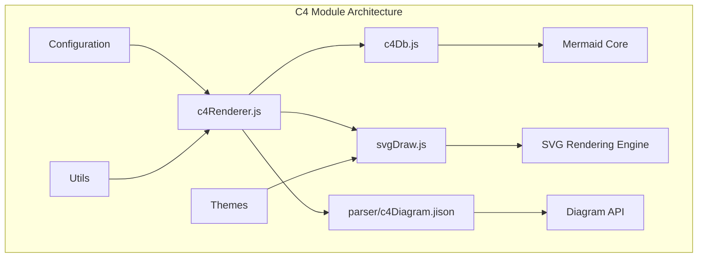
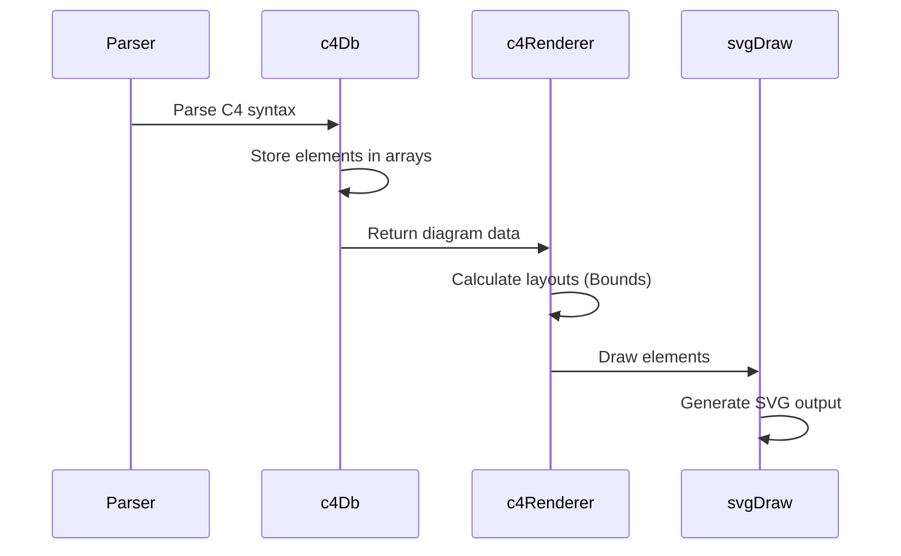
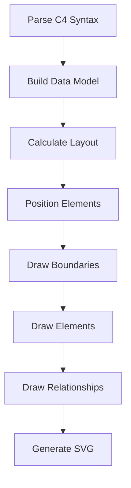
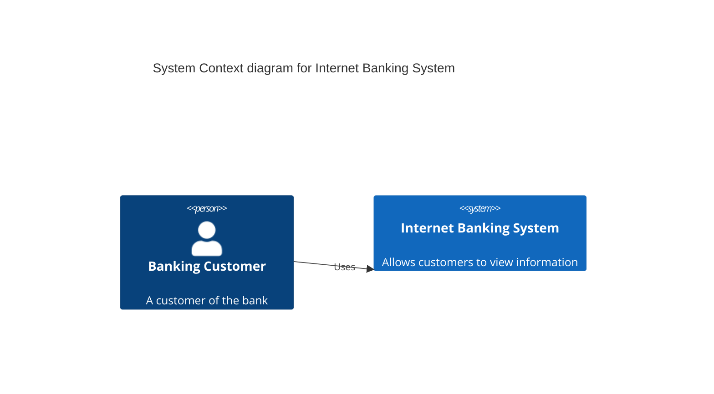
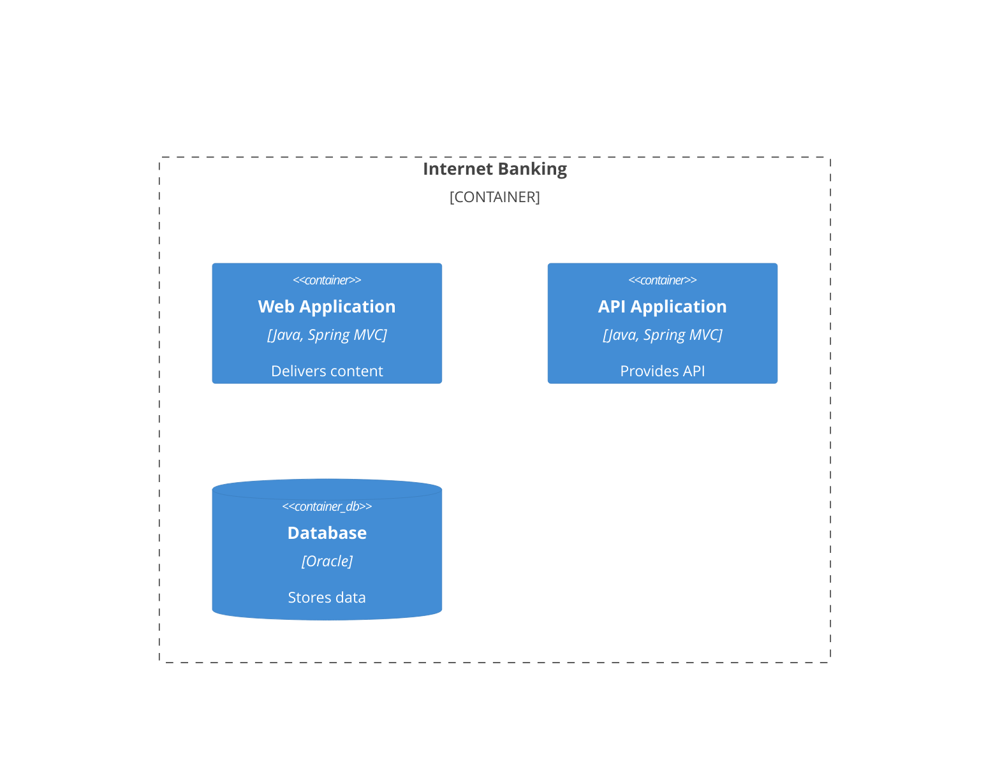

# C4 Module Documentation

## Introduction

The C4 module implements C4 model diagram support in Mermaid, enabling users to create software architecture diagrams using the C4 model notation. C4 (Context, Containers, Components, and Code) is a software architecture model created by Simon Brown that provides a hierarchical way to think about and describe software architecture at different levels of abstraction.

The module provides rendering capabilities for C4 diagrams including person/system elements, containers, components, boundaries, and relationships between them, following the C4 model principles for software architecture visualization.

## Architecture Overview

## Core Components

### 1. C4 Renderer (`c4Renderer.js`)

The main rendering engine that orchestrates the drawing of C4 diagrams. Contains two primary classes:

#### Bounds Class
- **Purpose**: Manages layout boundaries and positioning of C4 elements
- **Key Methods**:
  - `insert(c4Shape)`: Inserts C4 shapes into the layout with automatic positioning
  - `setData(startx, stopx, starty, stopy)`: Sets boundary coordinates
  - `updateVal(obj, key, val, fun)`: Updates boundary values with comparison function
  - `bumpLastMargin(margin)`: Adjusts final boundary margins

#### Point Class
- **Purpose**: Represents 2D coordinates for intersection calculations
- **Constructor**: `Point(x, y)`
- **Usage**: Used for calculating line intersections between elements

#### Key Functions
- `draw(_text, id, _version, diagObj)`: Main entry point for rendering C4 diagrams
- `drawC4ShapeArray(currentBounds, diagram, c4ShapeArray, c4ShapeKeys)`: Renders C4 shapes (persons, systems, containers, components)
- `drawBoundary(diagram, boundary, bounds)`: Renders boundary containers
- `drawRels(diagram, rels, getC4ShapeObj, diagObj)`: Renders relationships between elements
- `drawInsideBoundary(diagram, parentBoundaryAlias, parentBounds, currentBoundaries, diagObj)`: Recursively renders nested boundaries

### 2. C4 Database (`c4Db.js`)

Manages the data model and state for C4 diagrams:

#### Core Data Structures
- `c4ShapeArray`: Array of C4 elements (persons, systems, containers, components)
- `boundaries`: Array of boundary containers with hierarchical structure
- `rels`: Array of relationships between elements
- `boundaryParseStack`: Stack for managing nested boundary parsing

#### Key Functions
- `addPersonOrSystem(typeC4Shape, alias, label, descr, sprite, tags, link)`: Adds person or system elements
- `addContainer(typeC4Shape, alias, label, techn, descr, sprite, tags, link)`: Adds container elements
- `addComponent(typeC4Shape, alias, label, techn, descr, sprite, tags, link)`: Adds component elements
- `addRel(type, from, to, label, techn, descr, sprite, tags, link)`: Adds relationships
- `addPersonOrSystemBoundary(alias, label, type, tags, link)`: Adds system boundaries
- `addContainerBoundary(alias, label, type, tags, link)`: Adds container boundaries
- `addDeploymentNode(nodeType, alias, label, type, descr, sprite, tags, link)`: Adds deployment nodes

### 3. SVG Drawing (`svgDraw.js`)

Handles low-level SVG rendering operations:

#### Key Functions
- `drawRels(elem, rels, conf)`: Renders relationship lines with arrows
- `drawRect(elem, rectData)`: Draws rectangles for elements
- `drawImage(elem, width, height, x, y, link)`: Embeds images (icons, sprites)
- `drawBoundary(elem, boundary, conf)`: Draws boundary containers
- `drawC4Shape(elem, c4Shape, conf)`: Draws individual C4 shapes

## Data Flow

## Configuration

The C4 module supports extensive configuration through the `C4DiagramConfig` interface:

### Layout Configuration
- `diagramMarginX/Y`: Overall diagram margins
- `c4ShapeMargin`: Margin between C4 shapes
- `c4ShapePadding`: Padding within shapes
- `c4ShapeInRow`: Number of shapes per row
- `c4BoundaryInRow`: Number of boundaries per row

### Styling Configuration
- `width/height`: Default dimensions for person boxes
- `personFontSize/Family/Weight`: Font settings for person elements
- `systemFontSize/Family/Weight`: Font settings for system elements
- `external_personFontSize/Family/Weight`: Font settings for external persons
- `boundaryFontSize/Family/Weight`: Font settings for boundaries
- `messageFontSize/Family/Weight`: Font settings for relationship messages

## Element Types

### C4 Elements
1. **Person**: Represents users or actors
2. **System**: Represents software systems
3. **Container**: Represents deployable units (applications, databases)
4. **Component**: Represents modular parts within containers
5. **External Person/System**: External entities outside the system boundary

### Boundaries
1. **System Boundary**: Contains systems and persons
2. **Container Boundary**: Contains containers within systems
3. **Deployment Node**: Represents deployment environments

### Relationships
- **Directed relationships**: `rel`, `rel_b`, `rel_u`, `rel_d`, `rel_l`, `rel_r`
- **Bidirectional relationships**: `birel`
- **Custom routing**: Support for curved lines and custom positioning

## Layout Algorithm

The C4 module uses a sophisticated layout algorithm:

1. **Hierarchical Layout**: Elements are arranged within their parent boundaries
2. **Grid-based Positioning**: Elements are placed in rows and columns
3. **Automatic Sizing**: Text content determines element dimensions
4. **Intersection Calculation**: Smart line routing between elements
5. **Boundary Management**: Nested boundaries are properly contained

## Integration with Mermaid

The C4 module integrates with the broader Mermaid ecosystem:

### Dependencies
- **Diagram API**: Uses Mermaid's diagram registration system
- **Configuration System**: Inherits from Mermaid's config framework
- **Theme System**: Supports Mermaid themes for consistent styling
- **Rendering Utilities**: Uses shared rendering utilities for text, icons, etc.
- **Parser Framework**: Integrates with Mermaid's parsing infrastructure

### External References
- [Core Mermaid Module](core-mermaid.md): Base diagram functionality
- [Configuration System](config.md): Configuration management
- [Diagram API](diagram-api.md): Diagram registration and lifecycle
- [Rendering Utilities](rendering-util.md): Shared rendering functions
- [Themes](themes.md): Styling and theming system

## Usage Examples

### Basic C4 Context Diagram

### C4 Container Diagram

## Advanced Features

### Text Wrapping
- Automatic text wrapping based on element width
- Configurable wrapping behavior
- Support for multi-line text

### Custom Styling
- Element-specific styling (colors, fonts, borders)
- Relationship styling (colors, line styles)
- Boundary styling

### Icon Support
- Built-in icons for common element types
- Custom sprite support
- Image embedding

### Interactive Features
- Click handlers for elements
- Link support
- Tooltip support

## Performance Considerations

- Efficient layout calculation with minimal reflows
- Optimized SVG generation
- Memory management for large diagrams
- Scalable rendering for complex architectures

## Error Handling

- Graceful handling of malformed syntax
- Validation of element relationships
- Fallback rendering for unsupported features
- Comprehensive error reporting

This documentation provides a comprehensive overview of the C4 module's architecture, functionality, and integration within the Mermaid ecosystem.