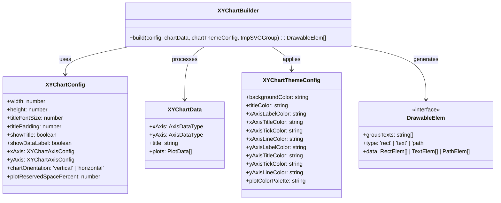
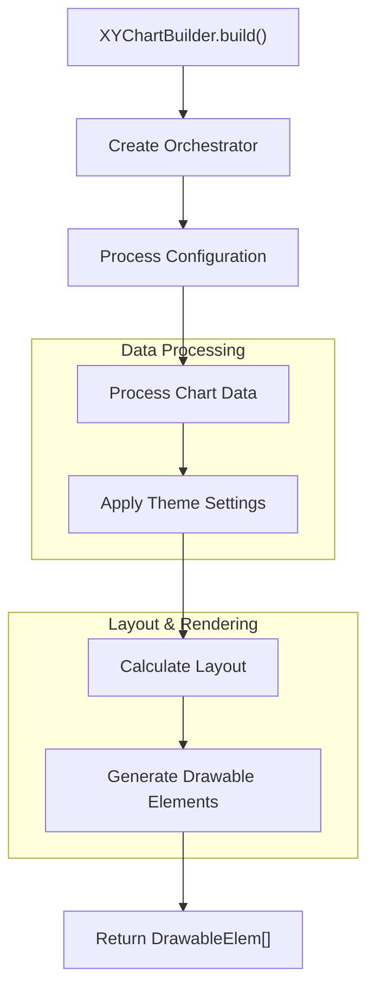
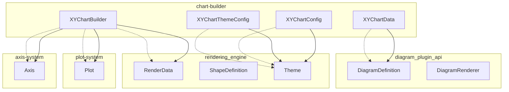
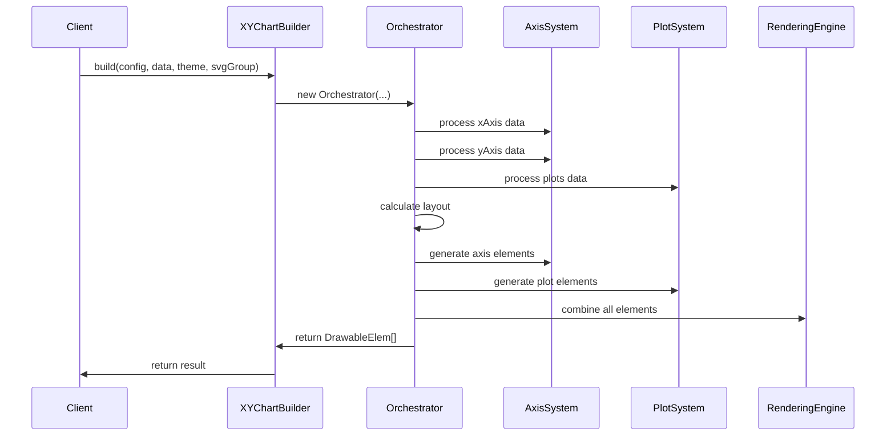

# Chart Builder Module Documentation

## Introduction

The chart-builder module is a core component of the Mermaid XY Chart diagram system, responsible for constructing and rendering XY charts (line charts and bar charts) from parsed diagram data. It serves as the central orchestration layer that coordinates between data processing, layout calculation, and rendering to produce the final chart visualization.

## Module Overview

The chart-builder module provides a streamlined API for building XY charts through the `XYChartBuilder` class, which acts as the main entry point. It processes chart configuration, data, and theme settings to generate drawable elements that can be rendered to SVG. The module supports both line and bar plot types with configurable axes, titles, and styling options.

## Architecture

### Core Components



### Data Flow Architecture



## Component Relationships

### Integration with XY Chart Module



**Relationship Legend:**
- Solid arrows (-->) represent direct dependencies
- Dotted arrows (.->) represent data flow/integration points

## Data Types and Interfaces

### Chart Configuration

The module defines comprehensive configuration interfaces that control chart appearance and behavior:

- **XYChartConfig**: Main configuration object containing dimensions, title settings, axis configurations, and layout parameters
- **XYChartAxisConfig**: Detailed axis-specific settings for labels, titles, ticks, and axis lines
- **XYChartThemeConfig**: Visual styling configuration including colors for all chart elements

### Data Structures

- **XYChartData**: Container for chart data including axes definitions, title, and plot data
- **AxisDataType**: Union type supporting both band (categorical) and linear (numerical) axes
- **PlotData**: Union type for line plots and bar plots with associated styling

### Rendering Elements

- **DrawableElem**: The output format consisting of grouped geometric primitives (rectangles, text, paths)
- **Dimension/Point/BoundingRect**: Geometric primitives for layout calculations
- **RectElem/TextElem/PathElem**: Specific drawable element types with styling attributes

## Process Flow

### Chart Building Process



## Key Features

### 1. Flexible Axis Support
- **Band Axes**: Categorical data support with custom categories
- **Linear Axes**: Numerical data support with min/max range definition
- **Mixed Axes**: Support for band-linear and linear-band combinations

### 2. Multiple Plot Types
- **Line Plots**: Configurable stroke color and width
- **Bar Plots**: Customizable fill colors
- **Multi-plot Support**: Multiple plots on a single chart

### 3. Comprehensive Theming
- **Color Customization**: Individual colors for all chart elements
- **Typography Control**: Font sizes and padding for titles and labels
- **Layout Options**: Chart orientation and space reservation

### 4. Layout Management
- **Automatic Sizing**: Intelligent space calculation for chart elements
- **Responsive Design**: Configurable reserved space percentages
- **Bounding Box Management**: Precise positioning of all elements

## Dependencies

### Internal Dependencies
- **[axis-system](axis-system.md)**: Provides axis rendering components
- **[plot-system](plot-system.md)**: Provides plot rendering components
- **[diagram_plugin_api](diagram_plugin_api.md)**: Integrates with Mermaid's diagram system
- **[rendering_engine](rendering_engine.md)**: Utilizes rendering utilities and themes

### External Dependencies
- **SVGGroup**: From Mermaid's diagram API for SVG manipulation
- **Orchestrator**: Internal orchestration class (implementation not shown in core components)

## Usage Patterns

### Basic Chart Building
```typescript
const chartBuilder = XYChartBuilder;
const drawableElements = chartBuilder.build(
  config,        // XYChartConfig
  chartData,     // XYChartData  
  themeConfig,   // XYChartThemeConfig
  svgGroup       // SVGGroup
);
```

### Configuration Structure
The module expects well-formed configuration objects that define:
- Chart dimensions and layout
- Axis types and settings
- Plot data and styling
- Theme colors and typography

## Extension Points

### Custom Plot Types
The `PlotData` union type can be extended to support additional plot types beyond line and bar charts.

### Theme Customization
The `XYChartThemeConfig` interface provides a comprehensive theming system that can be extended for additional visual properties.

### Axis Enhancements
The `AxisDataType` union supports extension for specialized axis types (logarithmic, time-series, etc.).

## Error Handling

The module implements type guards (`isBarPlot`, `isBandAxisData`, `isLinearAxisData`) to ensure type safety when processing heterogeneous data structures. This prevents runtime errors and provides clear validation of input data.

## Performance Considerations

- **Lazy Evaluation**: Elements are calculated only when needed
- **Efficient Layout**: Single-pass layout calculation
- **Minimal Memory Footprint**: Streamlined data structures
- **Optimized Rendering**: Grouped drawable elements for efficient SVG generation

This documentation provides a comprehensive overview of the chart-builder module's architecture, functionality, and integration within the Mermaid diagram system. The module serves as a critical component in the XY chart rendering pipeline, providing a clean API for transforming chart data into renderable elements.