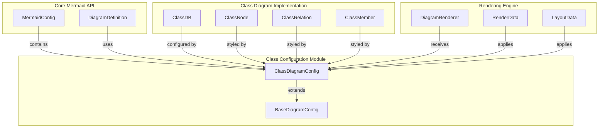
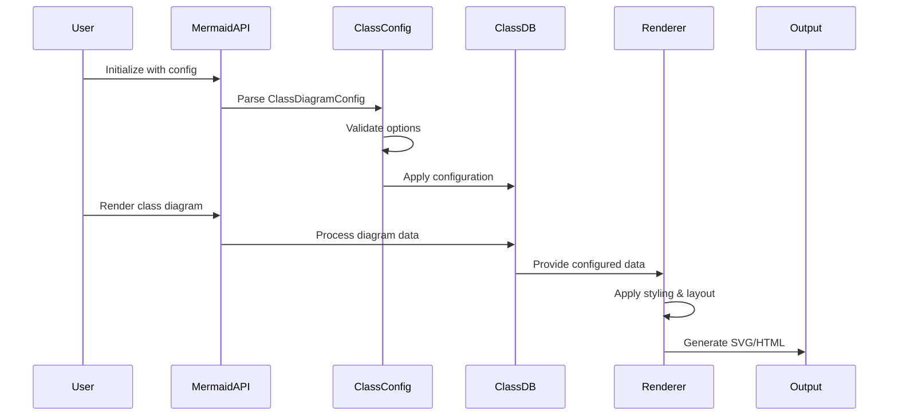
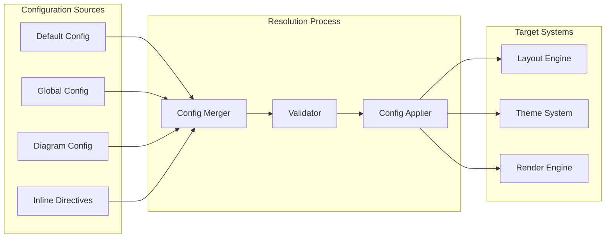

# Class Configuration Module Documentation

## Introduction

The class-configuration module is a specialized configuration subsystem within the Mermaid diagramming library that handles configuration management for class diagrams. It provides a comprehensive set of options for customizing the appearance, layout, and behavior of class diagrams, extending the base diagram configuration with class-specific settings.

## Overview

The class-configuration module is built around the `ClassDiagramConfig` interface, which defines all configurable aspects of class diagram rendering. This module serves as the configuration bridge between the core Mermaid engine and the class diagram implementation, ensuring consistent behavior while allowing diagram-specific customization.

## Architecture

### Core Components

The module's architecture centers on the `ClassDiagramConfig` interface, which extends `BaseDiagramConfig` to provide class-specific configuration options:

```typescript
export interface ClassDiagramConfig extends BaseDiagramConfig {
  titleTopMargin?: number;
  arrowMarkerAbsolute?: boolean;
  dividerMargin?: number;
  padding?: number;
  textHeight?: number;
  defaultRenderer?: 'dagre-d3' | 'dagre-wrapper' | 'elk';
  nodeSpacing?: number;
  rankSpacing?: number;
  diagramPadding?: number;
  htmlLabels?: boolean;
  hideEmptyMembersBox?: boolean;
}
```

### Module Relationships

The class-configuration module integrates with several other system components:



## Configuration Options

### Layout and Spacing

The class-configuration module provides fine-grained control over diagram layout:

- **`nodeSpacing`** - Controls horizontal spacing between nodes on the same level
- **`rankSpacing`** - Controls vertical spacing between nodes on different levels  
- **`diagramPadding`** - Sets overall padding around the entire diagram
- **`padding`** - Controls internal padding within class boxes
- **`dividerMargin`** - Sets margin around dividers between class sections

### Rendering Options

Multiple rendering engines are supported:

- **`defaultRenderer`** - Choose between 'dagre-d3', 'dagre-wrapper', or 'elk' rendering engines
- **`htmlLabels`** - Enable/disable HTML label rendering
- **`textHeight`** - Set the height of text elements
- **`hideEmptyMembersBox`** - Control visibility of empty member sections

### Visual Styling

Appearance customization options:

- **`titleTopMargin`** - Set margin above diagram titles
- **`arrowMarkerAbsolute`** - Control arrow marker path resolution for base tag compatibility

## Data Flow

### Configuration Application Process



### Configuration Resolution



## Integration Points

### With Core Mermaid API

The class-configuration module integrates with the main Mermaid configuration system through the `MermaidConfig` interface, which contains a `class` property of type `ClassDiagramConfig`.

### With Class Diagram Types

Configuration options directly affect the rendering of:
- `ClassNode` - Class representation elements
- `ClassRelation` - Relationship arrows and connections  
- `ClassMember` - Class attributes and methods
- `ClassDB` - The diagram database that stores parsed class information

### With Rendering Engine

The configuration influences:
- Layout algorithms through spacing and positioning options
- Visual styling through theme and appearance settings
- Rendering behavior through engine selection and label options

## Usage Patterns

### Basic Configuration

```javascript
mermaid.initialize({
  class: {
    defaultRenderer: 'elk',
    nodeSpacing: 50,
    rankSpacing: 80,
    hideEmptyMembersBox: true
  }
});
```

### Advanced Layout Control

```javascript
mermaid.initialize({
  class: {
    diagramPadding: 20,
    padding: 15,
    dividerMargin: 10,
    nodeSpacing: 60,
    rankSpacing: 100,
    defaultRenderer: 'dagre-wrapper'
  }
});
```

### Visual Customization

```javascript
mermaid.initialize({
  class: {
    htmlLabels: true,
    textHeight: 20,
    titleTopMargin: 30,
    arrowMarkerAbsolute: false
  }
});
```

## Dependencies

The class-configuration module depends on:

- **[mermaid-core-api](mermaid-core-api.md)** - Provides base configuration interfaces and main configuration system
- **[diagram-class](diagram-class.md)** - The class diagram implementation that consumes these configurations
- **[rendering-engine](rendering-engine.md)** - Applies configuration to rendering processes

## Extension Points

### Custom Renderers

The module supports custom rendering engines through the `defaultRenderer` configuration option, allowing integration of specialized layout algorithms.

### Theme Integration

Configuration options work in conjunction with the theme system to provide consistent visual styling across all diagram types.

### Font Management

The module integrates with Mermaid's font management system through the base configuration, supporting custom font families, sizes, and weights.

## Best Practices

### Performance Optimization

- Use appropriate `nodeSpacing` and `rankSpacing` values to balance readability and compactness
- Select the most suitable renderer for your specific diagram complexity
- Consider `hideEmptyMembersBox` for cleaner diagrams with many empty classes

### Consistency

- Maintain consistent padding and spacing values across related diagrams
- Use `diagramPadding` to ensure adequate margins for embedded diagrams
- Apply consistent text height settings for uniform appearance

### Compatibility

- Set `arrowMarkerAbsolute` appropriately based on your deployment environment and base tag usage
- Test `htmlLabels` setting across different browsers if targeting multiple platforms
- Consider renderer compatibility when choosing `defaultRenderer` options

## Troubleshooting

### Common Issues

1. **Overlapping Elements** - Adjust `nodeSpacing` and `rankSpacing` values
2. **Poor Layout** - Try different `defaultRenderer` options
3. **Text Clipping** - Increase `padding` and `textHeight` values
4. **Arrow Display Issues** - Check `arrowMarkerAbsolute` setting

### Configuration Validation

The module validates configuration options during initialization, providing error messages for invalid values. Check browser console for configuration-related warnings or errors.

## Related Documentation

- [Mermaid Core API](mermaid-core-api.md) - Main configuration system and core interfaces
- [Diagram Class](diagram-class.md) - Class diagram implementation details
- [Rendering Engine](rendering-engine.md) - Rendering system that applies configurations
- [Theme System](theme-system.md) - Visual styling and theme integration