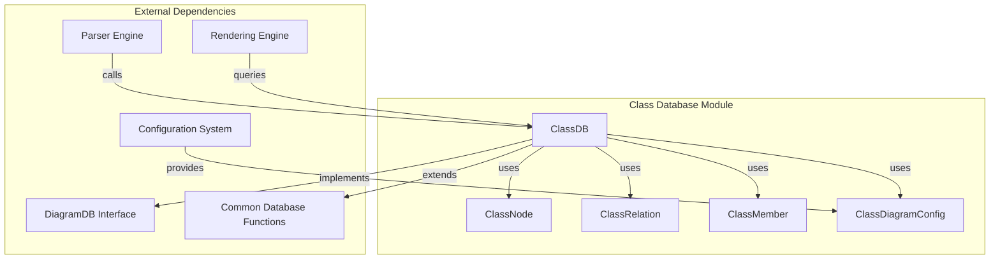
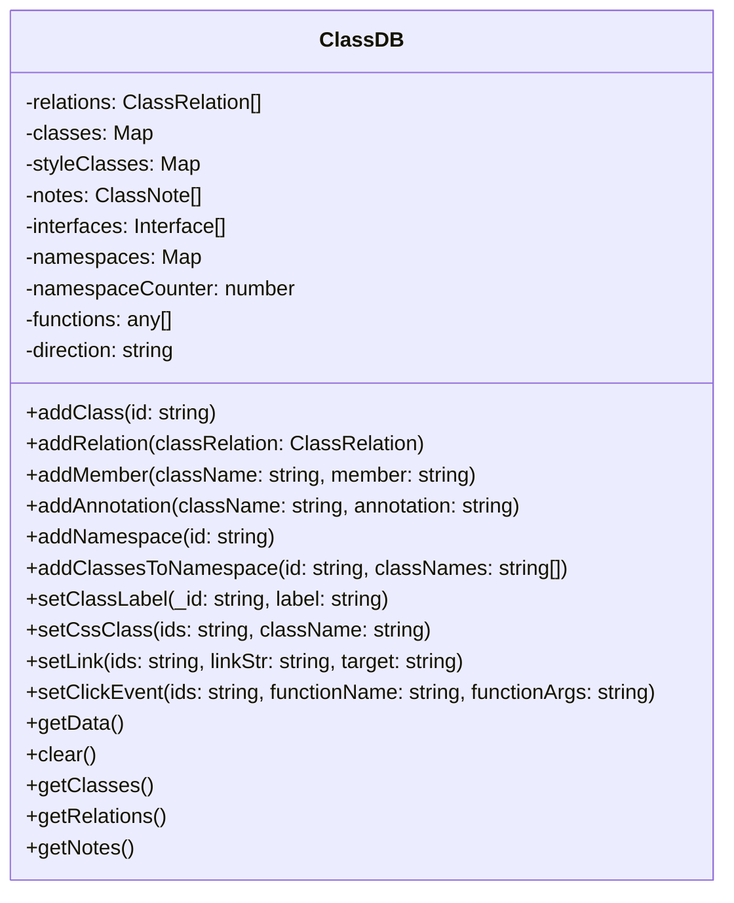
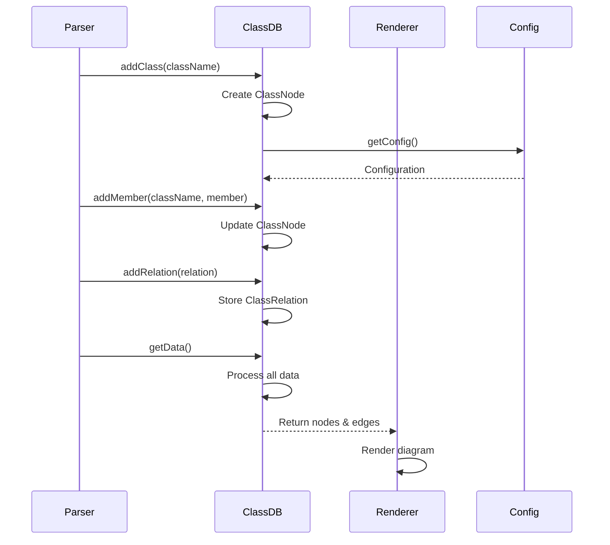
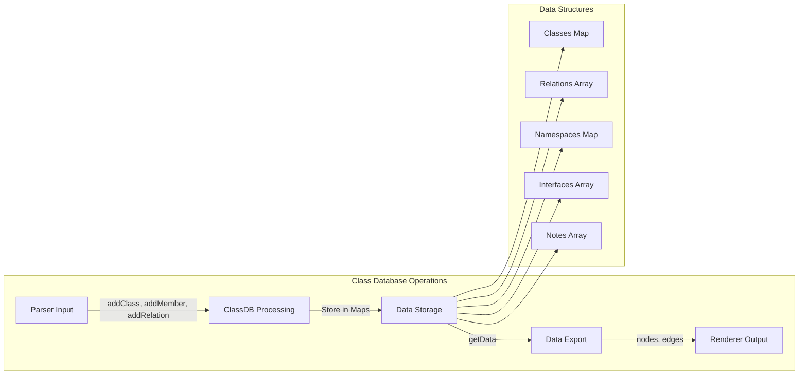

# Class Database Module Documentation

## Introduction

The class-database module is a core component of the Mermaid class diagram system, providing the data management layer for class diagrams. It implements the `ClassDB` class, which serves as the central repository for storing, managing, and retrieving class diagram elements including classes, interfaces, relationships, namespaces, and annotations.

## Architecture Overview

The class-database module operates as the data persistence layer within the class diagram system, interfacing with the parser, renderer, and configuration components to provide a complete class diagram solution.



## Core Components

### ClassDB Class

The `ClassDB` class is the primary component that implements the `DiagramDB` interface, providing comprehensive data management capabilities for class diagrams.



### Data Structures

#### ClassNode
Represents a single class in the diagram with its properties, methods, and metadata.

#### ClassRelation
Defines relationships between classes, including association, aggregation, composition, dependency, and extension.

#### ClassMember
Represents class members (attributes and methods) with visibility modifiers and type information.

#### ClassDiagramConfig
Configuration interface for class diagram-specific settings including spacing, padding, and rendering options.

## Data Flow Architecture



## Key Features

### 1. Class Management
- **Dynamic Class Creation**: Automatically creates classes when referenced
- **Generic Type Support**: Handles classes with generic type parameters (e.g., `Class~T~`)
- **Class Labeling**: Supports custom labels and text formatting
- **Namespace Organization**: Groups classes into logical namespaces

### 2. Member Management
- **Attribute and Method Parsing**: Automatically distinguishes between attributes and methods
- **Visibility Modifiers**: Supports public (+), private (-), protected (#), and package (~) visibility
- **Classifier Support**: Handles static ($) and abstract (*) classifiers
- **Generic Type Parsing**: Processes generic types in method signatures

### 3. Relationship Management
- **Multiple Relationship Types**: Supports aggregation, composition, dependency, extension, and lollipop relationships
- **Bidirectional Relationships**: Handles relationships with different types at each end
- **Relationship Labels**: Supports custom labels and titles for relationships
- **Interface Handling**: Automatically creates interface nodes for lollipop relationships

### 4. Styling and Interaction
- **CSS Class Assignment**: Applies custom CSS classes to diagram elements
- **Link Integration**: Supports clickable links with target specifications
- **Click Event Handling**: Enables interactive click events with custom functions
- **Tooltip Support**: Provides hover tooltips for diagram elements

### 5. Data Export
- **Node Generation**: Converts internal data structures to rendering nodes
- **Edge Generation**: Creates edges for relationships and notes
- **Configuration Integration**: Applies diagram-specific configuration settings
- **Direction Support**: Supports different layout directions (TB, BT, LR, RL)

## Component Interactions



## Configuration Integration

The class-database module integrates with the broader configuration system through the `ClassDiagramConfig` interface, which provides diagram-specific settings:

- **Layout Control**: Node spacing, rank spacing, and diagram padding
- **Rendering Options**: Default renderer selection and HTML label support
- **Visual Styling**: Text height, divider margins, and title positioning
- **Arrow Configuration**: Arrow marker settings for relationship lines

## Error Handling and Validation

The module implements several validation mechanisms:

- **Class Existence Checks**: Verifies class existence before operations
- **Name Sanitization**: Cleans and validates input strings
- **DOM ID Management**: Ensures unique DOM identifiers
- **Security Level Compliance**: Adheres to configured security levels for interactive features

## Performance Considerations

- **Efficient Data Structures**: Uses Maps for O(1) class lookups
- **Lazy Initialization**: Creates classes only when needed
- **Batch Operations**: Supports bulk member additions
- **Memory Management**: Provides clear methods for data cleanup

## Integration with Other Modules

The class-database module serves as the data layer for the broader class diagram system:

- **[diagram_class](diagram_class.md)**: Parent module providing the complete class diagram implementation
- **[diagram_plugin_api](diagram_plugin_api.md)**: Implements the DiagramDB interface for plugin compatibility
- **[rendering_engine](rendering_engine.md)**: Provides data for rendering operations
- **[parser_engine](parser_engine.md)**: Receives parsed data from the parser

## Usage Examples

### Basic Class Definition
```
classDiagram
    class Animal {
        +String name
        +int age
        +makeSound()
    }
```

### Relationships
```
classDiagram
    Animal <|-- Dog : inheritance
    Dog *-- Paw : composition
    Dog .. Food : dependency
```

### Namespaces
```
classDiagram
    namespace Animals {
        class Dog
        class Cat
    }
```

This comprehensive data management system enables the creation of complex, interactive class diagrams while maintaining clean separation between data storage, parsing, and rendering concerns.