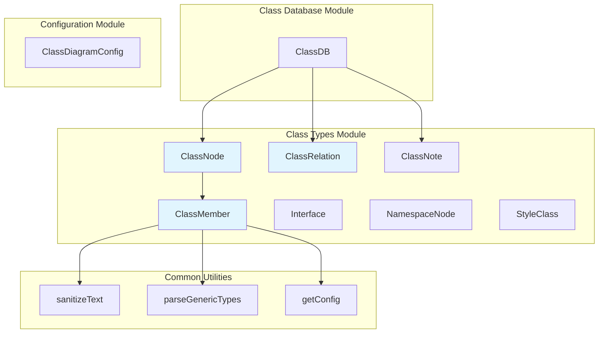
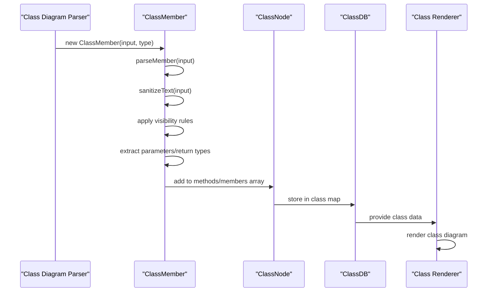
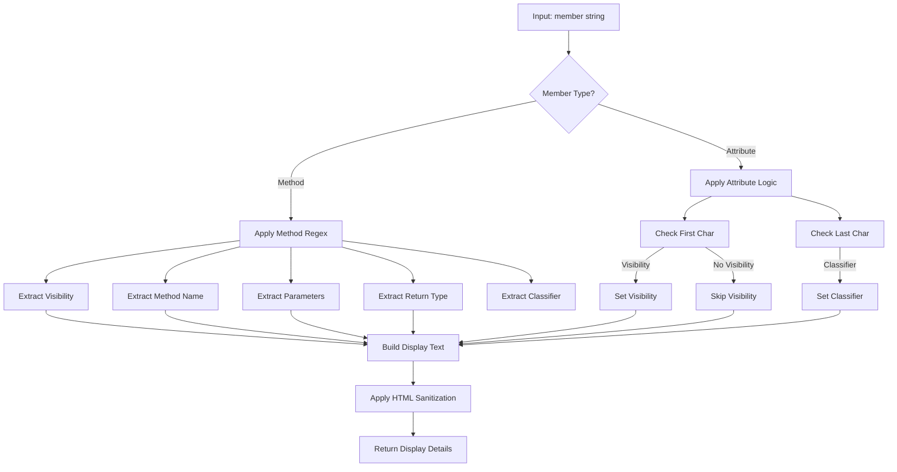
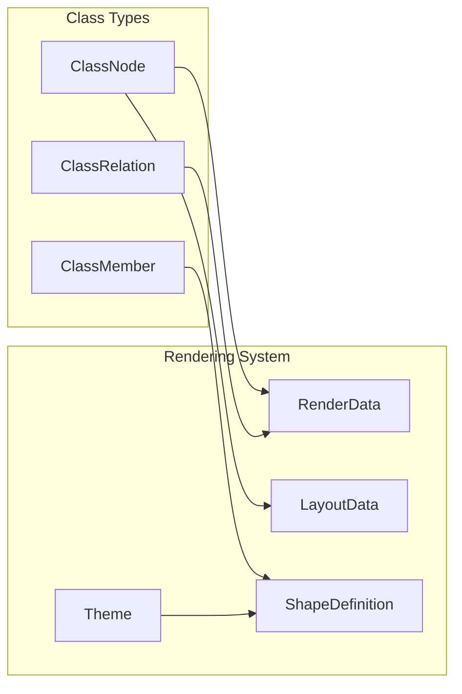

# Class Types Module Documentation

## Introduction

The class-types module is a core component of the Mermaid class diagram system, providing the fundamental type definitions and parsing logic for representing UML class diagrams. This module defines the data structures that represent classes, their members (methods and attributes), relationships, and other class diagram elements.

## Core Components

### ClassNode
The `ClassNode` interface represents a class in a UML class diagram. It contains all the visual and structural information needed to render a class, including its members, methods, styling, and relationships.

### ClassMember
The `ClassMember` class is a sophisticated parser and data structure that handles both method and attribute definitions in class diagrams. It supports UML visibility modifiers, generic types, static/classifier indicators, and proper text sanitization.

### ClassRelation
The `ClassRelation` interface defines relationships between classes, including association, inheritance, dependency, and other UML relationship types.

## Architecture



## Data Flow



## Component Details

### ClassMember Class

The `ClassMember` class is the most complex component in this module, providing sophisticated parsing capabilities for UML class members.

#### Key Features:
- **Visibility Parsing**: Supports UML visibility modifiers (`+` public, `-` private, `#` protected, `~` package)
- **Method Parsing**: Handles method signatures with parameters and return types
- **Attribute Parsing**: Processes attribute definitions with visibility and classifiers
- **Generic Type Support**: Integrates with `parseGenericTypes` for generic type handling
- **Classifier Support**: Handles static (`$`) and abstract (`*`) classifiers
- **Text Sanitization**: Ensures safe rendering of member text

#### Parsing Logic:



### ClassNode Interface

The `ClassNode` interface represents a complete class with all its visual and structural properties:

- **Identity**: `id`, `label`, `domId` for unique identification
- **Content**: `methods`, `members`, `annotations` for class content
- **Styling**: `cssClasses`, `styles`, `shape`, `look` for visual appearance
- **Navigation**: `link`, `linkTarget`, `tooltip` for interactive features
- **Hierarchy**: `parent` for namespace containment

### ClassRelation Interface

Defines relationships between classes with:
- **Endpoints**: `id1`, `id2` for connected classes
- **Titles**: `relationTitle1`, `relationTitle2` for relationship labels
- **Type Information**: `type`, `relation` for UML relationship semantics
- **Styling**: `style`, `text` for visual representation

## Dependencies

The class-types module has several key dependencies:

- **[class-database.md](class-database.md)**: Uses `ClassNode` and `ClassRelation` for storing class diagram data
- **[class-configuration.md](class-configuration.md)**: Provides configuration options that affect parsing and rendering
- **[common-utilities.md](common-utilities.md)**: Uses `sanitizeText` and `parseGenericTypes` functions
- **[diagram-api.md](diagram-api.md)**: Integrates with the main diagram API for configuration access

## Usage Patterns

### Creating Class Members

```typescript
// Method example
const method = new ClassMember("+getName() : string", "method");
const methodDetails = method.getDisplayDetails();
// Result: displayText: "+getName() : string", cssStyle: ""

// Attribute example  
const attribute = new ClassMember("-age : int", "attribute");
const attributeDetails = attribute.getDisplayDetails();
// Result: displayText: "-age : int", cssStyle: ""

// Static method example
const staticMethod = new ClassMember("+createInstance()$ : MyClass", "method");
const staticDetails = staticMethod.getDisplayDetails();
// Result: displayText: "+createInstance()", cssStyle: "text-decoration:underline;"
```

### Building Class Relationships

```typescript
const relation: ClassRelation = {
  id1: "ClassA",
  id2: "ClassB", 
  relationTitle1: "",
  relationTitle2: "",
  type: "inheritance",
  title: "",
  text: "",
  style: [],
  relation: {
    type1: 1, // inheritance arrow
    type2: 0,
    lineType: 1 // solid line
  }
};
```

## Integration with Rendering System

The class-types module integrates with the rendering system through:

1. **Data Provision**: `ClassNode` and `ClassRelation` objects are passed to renderers
2. **Style Information**: CSS classes and styles are applied during rendering
3. **Layout Data**: Position and size information is added during layout phase
4. **Shape Definitions**: Visual representation is handled by the shape system



## Extension Points

The module provides several extension points:

- **Custom Visibility**: The `Visibility` type can be extended with new visibility modifiers
- **Classifier Support**: Additional classifiers can be added to the parsing logic
- **Style Classes**: New CSS styles can be defined for different member types
- **Relationship Types**: New relationship types can be defined in `ClassRelation`

## Best Practices

1. **Text Sanitization**: Always use `sanitizeText` for user input to prevent XSS attacks
2. **Generic Type Handling**: Use `parseGenericTypes` for consistent generic type rendering
3. **Visibility Validation**: Use the `visibilityValues` array for validating visibility modifiers
4. **Classifier Consistency**: Maintain consistent classifier usage across the application
5. **ID Generation**: Use proper ID generation for DOM elements to avoid conflicts

## Related Documentation

- [Class Database](class-database.md) - Data storage and management for class diagrams
- [Class Configuration](class-configuration.md) - Configuration options for class diagrams
- [Rendering Types](rendering-types.md) - Core rendering data structures
- [Shape System](shape-system.md) - Visual representation of diagram elements
- [Theme System](theme-system.md) - Styling and theming capabilities