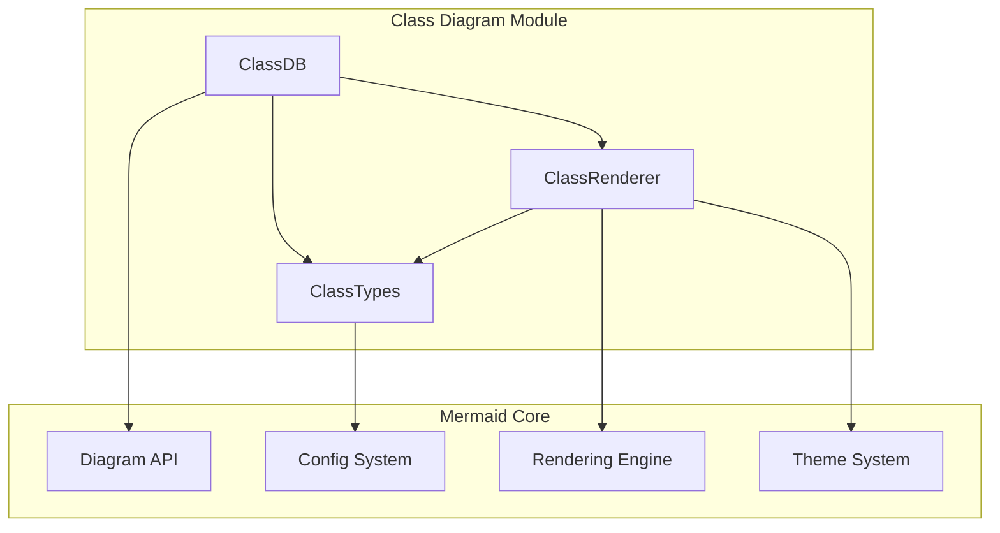
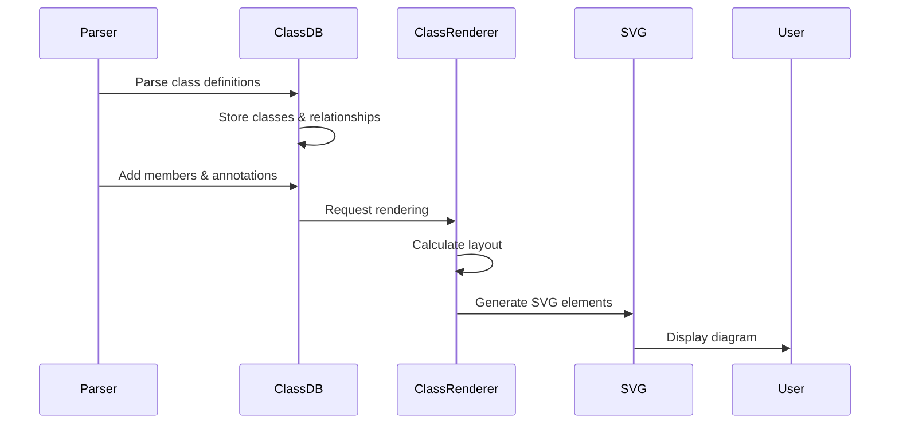
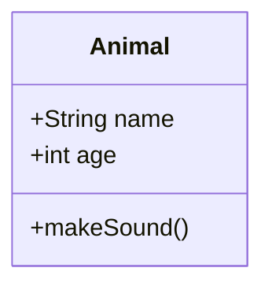
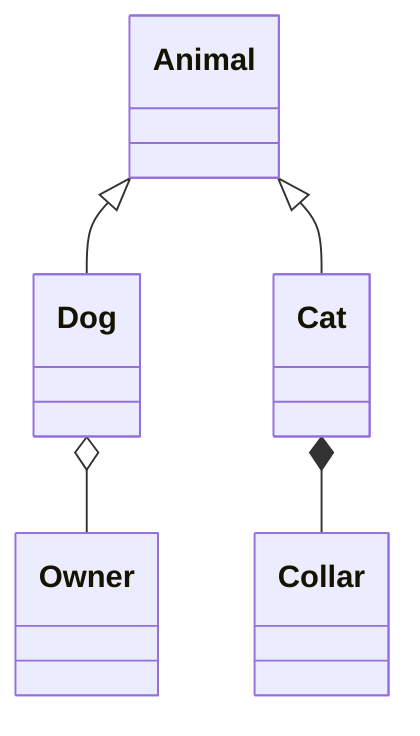

# Class Diagram Module

## Overview

The Class Diagram module is a core component of the Mermaid.js library that enables the creation and rendering of UML class diagrams. This module provides comprehensive support for representing object-oriented structures, including classes, interfaces, relationships, namespaces, and annotations.

## Purpose

The Class Diagram module serves as a specialized diagram type within the Mermaid ecosystem, allowing users to:
- Define classes with members, methods, and annotations
- Establish various types of relationships between classes (aggregation, composition, inheritance, dependency)
- Organize classes into namespaces for better structure
- Add notes and annotations to classes
- Apply custom styling and themes
- Support interactive features like tooltips and click events

## Architecture

## Core Components

### 1. ClassDB (`classDb.ts`)
The central database component that manages all class diagram data, including:
- Class definitions and properties
- Relationships between classes
- Namespaces and organizational structure
- Notes and annotations
- Styling and interaction data

### 2. ClassTypes (`classTypes.ts`)
Defines the type system and data structures for:
- Class nodes with members and methods
- Relationship definitions
- Interface representations
- Namespace structures
- Style classes and member parsing

### 3. ClassRenderer (`classRenderer-v2.ts`)
Handles the visual rendering of class diagrams using:
- D3.js for SVG manipulation
- Dagre for layout algorithms
- Custom shape definitions for class boxes
- Relationship line rendering with appropriate arrowheads

## Data Flow

## Key Features

### Class Definition
- Support for class names with generic types (using `~` syntax)
- Member variables with visibility modifiers (+, -, #, ~)
- Method definitions with parameters and return types
- Annotations for special class properties
- CSS class assignment for styling

### Relationship Types
- **Aggregation** (empty diamond): Whole-part relationship
- **Composition** (filled diamond): Strong whole-part relationship
- **Inheritance/Extension** (triangle): IS-A relationship
- **Dependency** (dashed line): Uses relationship
- **Lollipop** (circle): Interface implementation

### Namespace Support
- Hierarchical organization of classes
- Visual grouping with container boxes
- Parent-child relationships between namespaces

### Interactive Features
- Click events with custom functions
- Tooltips on hover
- Hyperlink support with target options
- Security level compliance

## Integration with Mermaid Ecosystem

The Class Diagram module integrates with other Mermaid components:

- **Configuration System**: Inherits global settings while providing diagram-specific options
- **Theme System**: Supports all Mermaid themes with appropriate color schemes
- **Rendering Utilities**: Uses shared rendering components for consistency
- **Parser Framework**: Integrates with the common parsing infrastructure

## Configuration Options

The module supports various configuration options:
- `padding`: Spacing within class boxes
- `nodeSpacing`: Distance between nodes
- `rankSpacing`: Vertical spacing between ranks
- `curve`: Line curvature for relationships
- `htmlLabels`: Use HTML or text labels

## Usage Examples

Basic class definition:

With relationships:

## Related Documentation

- [Configuration Module](config.md) - For diagram configuration options
- [Rendering Utilities](rendering-util.md) - For shared rendering components
- [Diagram API](diagram-api.md) - For integration with the diagram system
- [Themes](themes.md) - For styling and theming options

## Sub-modules

For detailed information about specific components, see:
- [classDb Documentation](classDb.md) - Database and data management
- [classTypes Documentation](classTypes.md) - Type definitions and structures
- [classRenderer Documentation](classRenderer.md) - Rendering and visualization