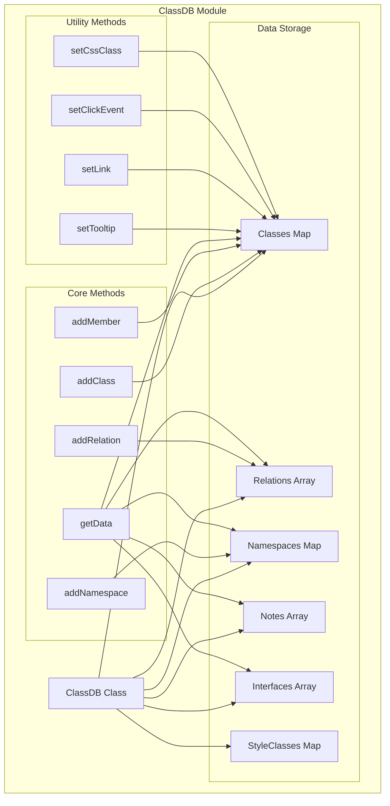
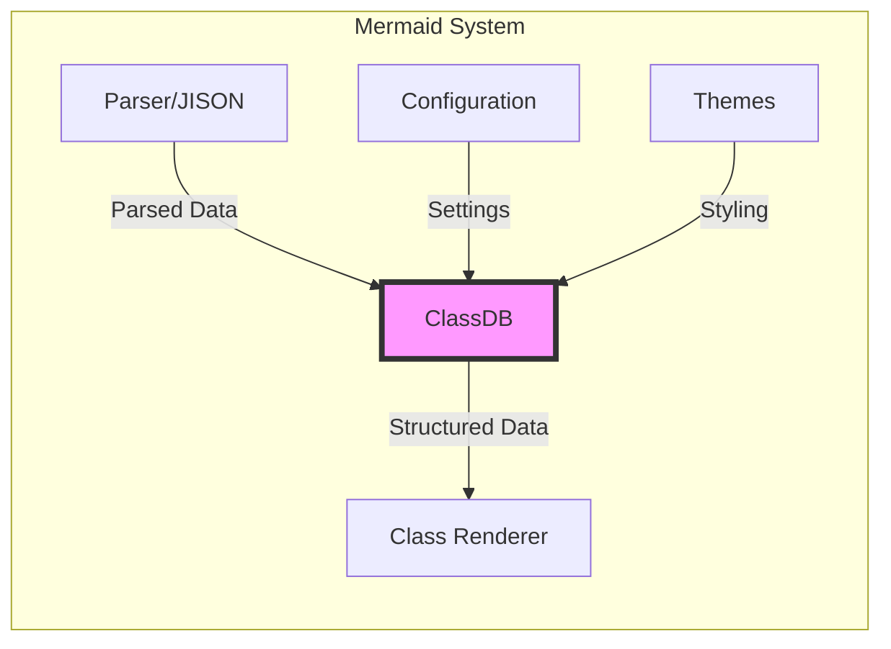
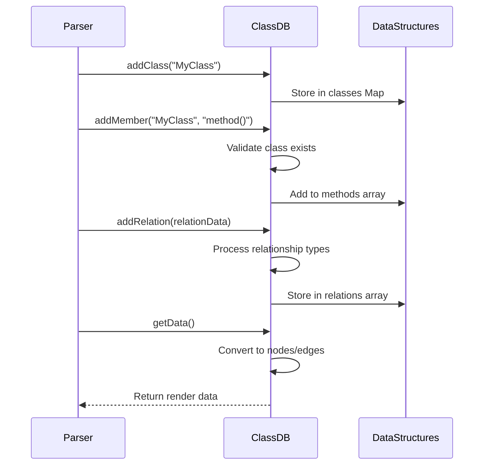
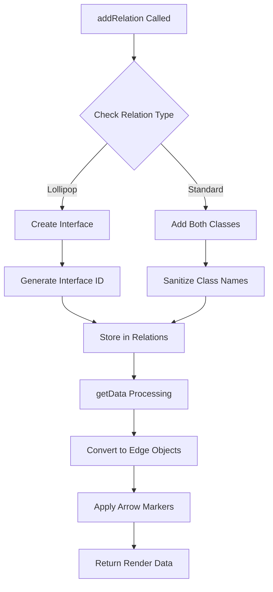
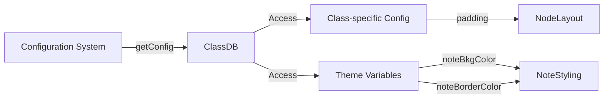

# ClassDB Module Documentation

## Overview

The `classDb` module is a core component of Mermaid's class diagram functionality, providing the database layer for managing class diagram data structures. It implements the `DiagramDB` interface and serves as the central repository for storing, managing, and retrieving class diagram elements including classes, interfaces, relationships, namespaces, and notes.

## Purpose and Core Functionality

The ClassDB module acts as the data management layer for Mermaid's class diagrams, responsible for:

- **Class Management**: Storing and managing class definitions, including their properties, methods, and annotations
- **Relationship Handling**: Managing various types of relationships between classes (aggregation, composition, inheritance, dependency, lollipop)
- **Namespace Organization**: Supporting hierarchical organization of classes within namespaces
- **Interface Support**: Handling interface definitions and their relationships with classes
- **Styling and Interaction**: Managing CSS classes, tooltips, click events, and visual styling
- **Data Export**: Providing structured data for rendering engines

## Architecture

### Component Structure



### Integration with Mermaid Ecosystem



## Core Components

### ClassDB Class

The main class that implements the `DiagramDB` interface and provides comprehensive data management for class diagrams.

**Key Properties:**
- `relations: ClassRelation[]` - Array of class relationships
- `classes: Map<string, ClassNode>` - Map of class definitions
- `namespaces: Map<string, NamespaceNode>` - Map of namespace definitions
- `notes: ClassNote[]` - Array of notes attached to classes
- `interfaces: Interface[]` - Array of interface definitions
- `styleClasses: Map<string, StyleClass>` - Map of CSS style classes

**Key Methods:**
- `addClass(id: string)` - Adds a new class to the diagram
- `addRelation(classRelation: ClassRelation)` - Adds a relationship between classes
- `addMember(className: string, member: string)` - Adds members (methods/attributes) to a class
- `getData()` - Exports data for rendering
- `clear()` - Resets all data structures

## Data Flow

### Input Processing Flow



### Relationship Processing



## Key Features

### 1. Class Management
- **Generic Type Support**: Handles classes with generic types using `~` separator
- **Member Classification**: Automatically categorizes members as methods (ending with `)`) or attributes
- **Annotation Support**: Supports special annotations enclosed in `<<>>`
- **Hierarchical Organization**: Classes can be organized within namespaces

### 2. Relationship Types
The module supports six types of relationships:
- **AGGREGATION** (0): Whole-part relationship with hollow diamond
- **EXTENSION** (1): Inheritance relationship with hollow triangle
- **COMPOSITION** (2): Strong whole-part relationship with filled diamond
- **DEPENDENCY** (3): Usage dependency with dashed arrow
- **LOLLIPOP** (4): Interface implementation with lollipop notation

### 3. Interactive Features
- **Tooltips**: Support for hover tooltips on classes
- **Click Events**: Configurable click handlers with function calls
- **Hyperlinks**: URL linking with target configuration
- **CSS Styling**: Custom CSS class and style application

### 4. Namespace Support
- **Hierarchical Structure**: Classes can be grouped in namespaces
- **Parent-Child Relationships**: Maintains parent namespace references
- **Visual Grouping**: Namespaces are rendered as grouped elements

## Dependencies

### Internal Dependencies
- **[diagram-api-types](diagram-api-types.md)**: Implements `DiagramDB` interface
- **[classTypes](classTypes.md)**: Uses `ClassNode`, `ClassRelation`, `ClassNote`, `Interface`, `NamespaceNode`, `StyleClass` types
- **[rendering-util-types](rendering-util-types.md)**: Exports data as `Node` and `Edge` types
- **[common](common.md)**: Uses text sanitization and common utilities
- **[config](config.md)**: Accesses configuration settings

### External Dependencies
- **D3.js**: Used for DOM manipulation and tooltip functionality
- **Logger**: For debugging and error reporting

## Configuration Integration



## Data Export Format

The `getData()` method returns a structured object containing:

```typescript
{
  nodes: Node[],      // Array of node objects for rendering
  edges: Edge[],      // Array of edge objects for relationships
  other: {},          // Additional data (currently empty)
  config: MermaidConfig, // Configuration object
  direction: string   // Layout direction (TB, BT, LR, RL)
}
```

### Node Types Generated
- **Class Nodes**: Represent classes with their properties
- **Namespace Nodes**: Group classes hierarchically
- **Note Nodes**: Attached annotations to classes
- **Interface Nodes**: Interface definitions (often hidden)

### Edge Types Generated
- **Relationship Edges**: Connect classes with appropriate arrow markers
- **Note Edges**: Connect notes to their associated classes

## Error Handling

The module implements several safety measures:
- **Class Existence Validation**: Checks before adding members or relationships
- **Text Sanitization**: All user input is sanitized using `common.sanitizeText()`
- **Namespace Validation**: Verifies namespace existence before adding classes
- **DOM ID Management**: Prevents ID conflicts with prefix system

## Security Considerations

- **Security Level Compliance**: Respects Mermaid's security level settings
- **Sandbox Mode**: Adjusts link targets based on security configuration
- **Input Sanitization**: All text content is sanitized before storage
- **Event Handler Restrictions**: Click events are only bound in 'loose' security mode

## Usage Examples

### Basic Class Definition
```javascript
const classDB = new ClassDB();
classDB.addClass("User");
classDB.addMember("User", "+name: String");
classDB.addMember("User", "+getName(): String");
```

### Relationship Definition
```javascript
classDB.addRelation({
  id1: "User",
  id2: "Address",
  relation: { type1: 0, type2: 3, lineType: 0 } // Aggregation with dependency
});
```

### Namespace Organization
```javascript
classDB.addNamespace("Models");
classDB.addClassesToNamespace("Models", ["User", "Address"]);
```

## Performance Considerations

- **Map-based Storage**: Uses Maps for O(1) class and namespace lookups
- **Lazy Initialization**: Classes are only created when needed
- **Efficient ID Generation**: Counter-based system for unique identifiers
- **Memory Management**: Clear method resets all data structures

## Extension Points

The module is designed for extensibility:
- **New Relationship Types**: Can be added to the relationType enum
- **Additional Node Properties**: Can be extended in the ClassNode type
- **Custom Styling**: Style classes can be dynamically defined
- **New Interaction Types**: Function binding system supports custom events

This comprehensive data management system forms the backbone of Mermaid's class diagram functionality, providing a robust foundation for parsing, storing, and rendering complex class relationships and structures.