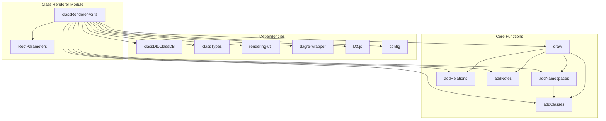
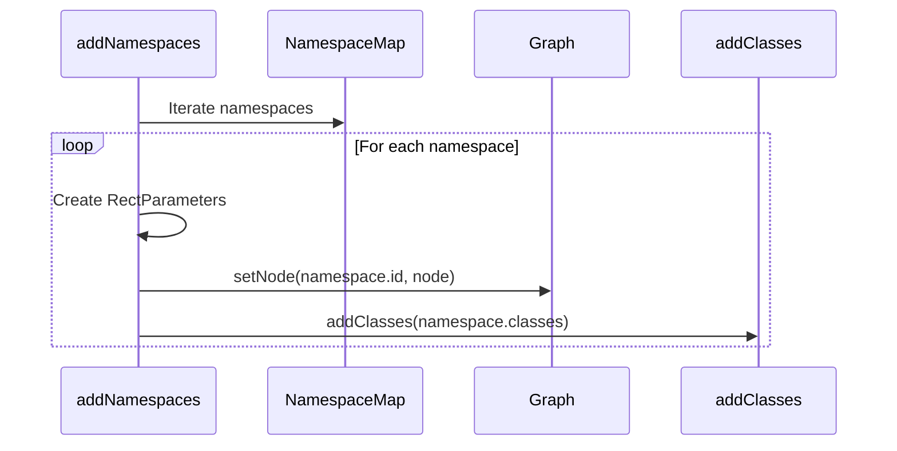
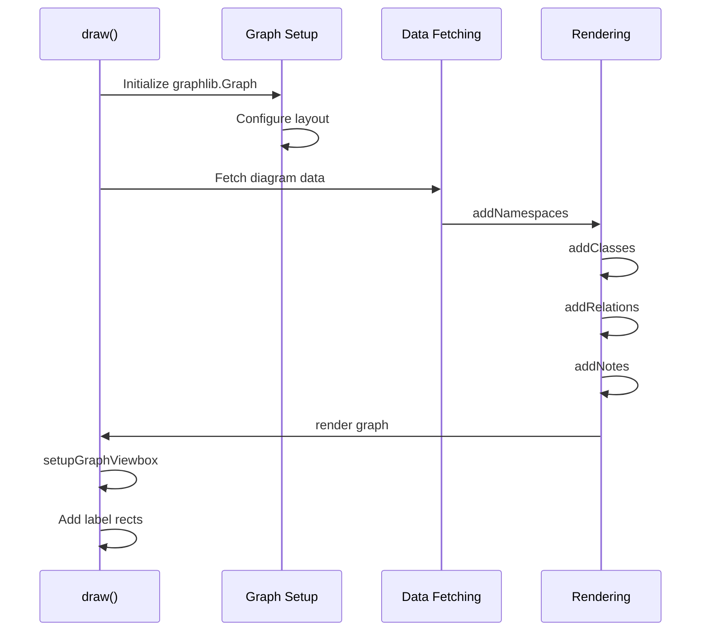
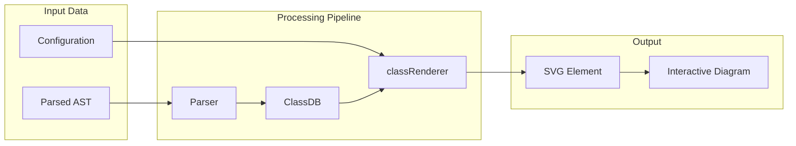

# Class Renderer Module Documentation

## Introduction

The classRenderer module is a core component of Mermaid's class diagram functionality, responsible for rendering UML class diagrams from parsed diagram definitions into visual representations. This module handles the transformation of abstract syntax tree (AST) data into interactive SVG graphics, managing the layout, styling, and positioning of classes, namespaces, relationships, and notes within class diagrams.

## Architecture Overview

The classRenderer module operates as part of Mermaid's diagram rendering pipeline, working in conjunction with the class diagram parser, database, and type definitions to produce visual class diagrams. It leverages D3.js for DOM manipulation and Dagre for graph layout algorithms.



## Core Components

### RectParameters Interface

The `RectParameters` interface defines the structure for rectangular shape parameters used in namespace rendering:

```typescript
interface RectParameters {
  id: string;
  shape: 'rect';
  labelStyle: string;
  domId: string;
  labelText: string;
  padding: number | undefined;
  style?: string;
}
```

This interface is used to configure the visual appearance and positioning of namespace containers within class diagrams.

## Key Functions

### addNamespaces()

Processes namespace definitions and adds them to the rendering graph. Namespaces serve as containers for organizing related classes and interfaces.

**Parameters:**
- `namespaces: NamespaceMap` - Collection of namespace definitions
- `g: graphlib.Graph` - The target graph for rendering
- `_id: string` - Diagram identifier
- `diagObj: any` - Diagram object containing configuration

**Process Flow:**


### addClasses()

Renders individual class definitions within namespaces or at the root level, handling class styling, labels, and metadata.

**Key Features:**
- CSS class application
- Style inheritance and customization
- Tooltip generation
- Link handling for interactive elements
- Parent-child relationships with namespaces

### addRelations()

Processes UML relationships between classes, including inheritance, association, aggregation, composition, and dependency relationships.

**Relationship Types Supported:**
- Aggregation (dashed lines with diamond markers)
- Extension/Generalization (solid lines with arrowheads)
- Composition (solid lines with filled diamond markers)
- Dependency (dashed lines with arrowheads)
- Lollipop interfaces (circle markers)

### addNotes()

Handles the rendering of UML notes that can be attached to classes, providing additional documentation or comments within the diagram.

### draw()

The main rendering orchestrator that coordinates the entire class diagram rendering process.

**Process Flow:**


## Data Flow Architecture



## Configuration Integration

The classRenderer module integrates with Mermaid's configuration system to support customizable rendering options:

- **Node Spacing**: Controls the minimum distance between nodes
- **Rank Spacing**: Manages vertical spacing between hierarchical levels
- **Padding**: Internal spacing within class boxes and namespaces
- **Curve Style**: Defines the curvature of relationship lines
- **HTML Labels**: Enables/disables HTML rendering for labels
- **Security Level**: Determines sandboxing requirements

## Relationship with Other Modules

### classDb Integration
The renderer depends on [classDb](classDb.md) for accessing parsed diagram data:
- `getNamespaces()` - Retrieves namespace definitions
- `getClasses()` - Obtains class definitions
- `getRelations()` - Fetches relationship data
- `getNotes()` - Gets note definitions
- `getDirection()` - Determines diagram layout direction

### classTypes Dependency
Utilizes type definitions from [classTypes](classTypes.md) for type safety:
- `ClassRelation` - Relationship structure
- `ClassNote` - Note definition
- `ClassMap` - Class collection type
- `NamespaceMap` - Namespace collection type

### Rendering Utilities
Leverages [rendering-util](rendering-util.md) for common rendering operations:
- Graph layout algorithms
- Shape definitions
- Text rendering utilities
- Icon loading capabilities

## Security Considerations

The module implements security measures based on Mermaid's security configuration:

- **Sandbox Mode**: When enabled, renders within isolated iframe contexts
- **Text Sanitization**: All user-provided text is sanitized before rendering
- **HTML Label Control**: Configurable HTML rendering to prevent XSS attacks

## Performance Optimization

The renderer includes several performance optimizations:

- **Lazy Loading**: Icons and resources loaded on-demand
- **Efficient Layout**: Uses Dagre's optimized graph layout algorithms
- **Minimal DOM Manipulation**: Batched DOM updates for better performance
- **Memory Management**: Proper cleanup of temporary objects and references

## Error Handling

The module implements comprehensive error handling:

- **Graceful Degradation**: Continues rendering even with malformed input
- **Logging**: Detailed logging for debugging and troubleshooting
- **Validation**: Input validation before processing
- **Fallback Rendering**: Default styles and layouts when configuration is missing

## Extension Points

The classRenderer module provides several extension points for customization:

- **Custom Shapes**: Ability to register custom shape definitions
- **Style Injection**: CSS class and style customization
- **Layout Algorithms**: Pluggable layout strategies
- **Relationship Types**: Extensible relationship rendering

## Usage Examples

The renderer is typically invoked through Mermaid's main API:

```javascript
// Configuration setup
const config = {
  class: {
    htmlLabels: true,
    nodeSpacing: 50,
    rankSpacing: 50
  }
};

// Diagram rendering
mermaid.render('diagram-id', classDiagramDefinition, config);
```

This triggers the complete rendering pipeline, resulting in an interactive SVG class diagram that can be embedded in web applications or exported as static images.