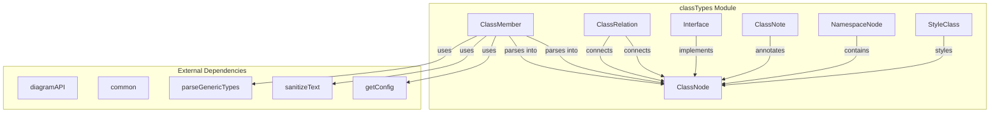
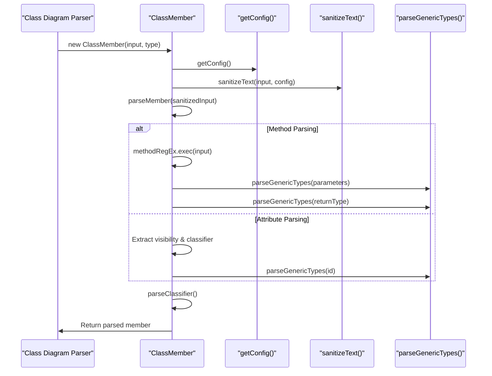
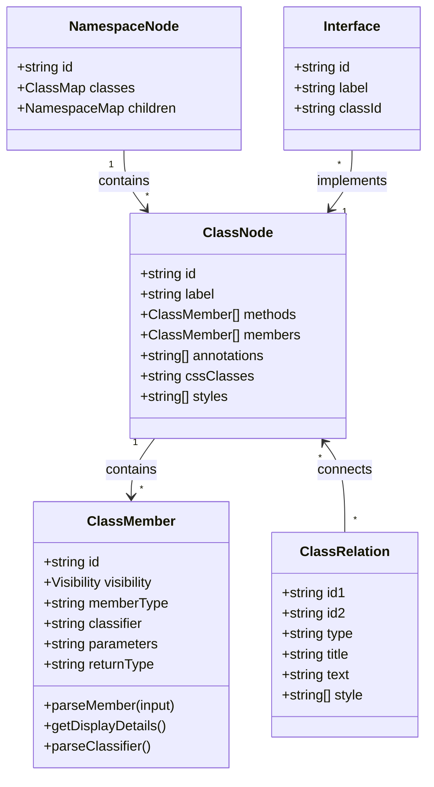
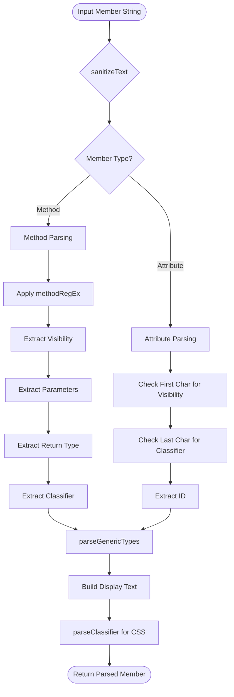
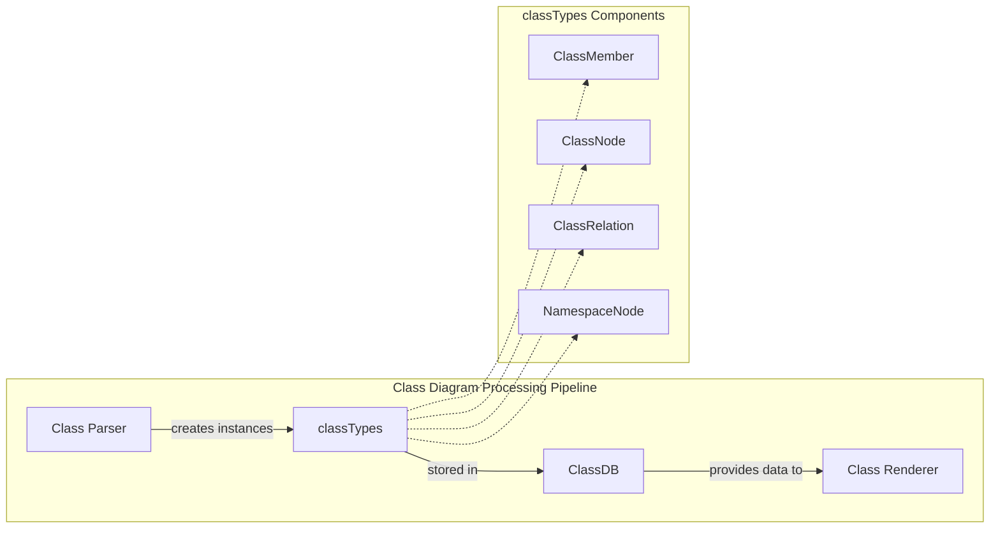

# classTypes Module Documentation

## Introduction

The `classTypes` module is a core component of Mermaid's class diagram functionality, providing the fundamental type definitions and parsing logic for representing object-oriented structures. This module defines the data structures that model classes, interfaces, relationships, and their members in UML class diagrams.

## Module Purpose

The primary purpose of the classTypes module is to:
- Define TypeScript interfaces and types for class diagram elements
- Provide parsing logic for class members (methods and attributes)
- Handle visibility modifiers and classifiers (static, abstract)
- Support namespace organization and styling capabilities

## Core Components

### ClassNode Interface
The central interface representing a class in the diagram:
```typescript
interface ClassNode {
  id: string;
  type: string;
  label: string;
  shape: string;
  text: string;
  cssClasses: string;
  methods: ClassMember[];
  members: ClassMember[];
  annotations: string[];
  domId: string;
  styles: string[];
  parent?: string;
  link?: string;
  linkTarget?: string;
  haveCallback?: boolean;
  tooltip?: string;
  look?: string;
}
```

### ClassMember Class
A comprehensive parser for class members (methods and attributes):
- **Visibility Support**: Handles UML visibility modifiers (`+` public, `-` private, `#` protected, `~` package)
- **Classifier Support**: Manages static (`$`) and abstract (`*`) modifiers
- **Method Parsing**: Extracts parameters and return types using regex patterns
- **Attribute Parsing**: Processes attribute declarations with proper visibility
- **Generic Type Support**: Integrates with `parseGenericTypes` for template/generic handling

### ClassRelation Interface
Defines relationships between classes:
```typescript
interface ClassRelation {
  id1: string;           // Source class ID
  id2: string;           // Target class ID
  relationTitle1: string;
  relationTitle2: string;
  type: string;
  title: string;
  text: string;
  style: string[];
  relation: {
    type1: number;
    type2: number;
    lineType: number;
  };
}
```

### Supporting Interfaces
- **Interface**: Represents interface implementations
- **ClassNote**: Handles annotations and comments on classes
- **NamespaceNode**: Manages namespace hierarchies
- **StyleClass**: Defines custom styling for diagram elements

## Architecture



## Data Flow



## Component Relationships



## Process Flow

### Member Parsing Process


## Dependencies

The classTypes module has the following key dependencies:

- **[diagramAPI](../diagram-api.md)**: Provides configuration access via `getConfig()`
- **[common](../common-types.md)**: Supplies text sanitization and generic type parsing utilities
- **[config](../config.md)**: Configuration types for diagram styling and behavior

## Integration with Class Diagram System



## Key Features

### 1. UML Compliance
- Supports standard UML visibility modifiers
- Handles method signatures with parameters and return types
- Manages classifiers for static and abstract members

### 2. Flexible Parsing
- Regex-based parsing for method signatures
- Character-based parsing for attributes
- Generic type support through `parseGenericTypes`

### 3. Styling Support
- CSS class assignment based on classifiers
- Custom style properties for individual elements
- Integration with theme system

### 4. Namespace Organization
- Hierarchical namespace support
- Class grouping and organization
- Parent-child relationships

## Usage Examples

The classTypes module is primarily used internally by the class diagram parser and renderer. The `ClassMember` class automatically handles parsing when instantiated:

```typescript
// Method parsing
const method = new ClassMember('+getName() : string', 'method');
// Results in: visibility='+', id='getName', parameters='', returnType='string'

// Attribute parsing  
const attribute = new ClassMember('-age : int', 'attribute');
// Results in: visibility='-', id='age', classifier=''

// Static method
const staticMethod = new ClassMethod('$getInstance() : ClassName', 'method');
// Results in: classifier='$', cssStyle='text-decoration:underline;'
```

## Related Documentation

- [classDb Module](classDb.md) - Database operations for class diagrams
- [classRenderer Module](classRenderer.md) - Rendering logic for class diagrams
- [config Module](config.md) - Configuration management
- [diagram-api Module](diagram-api.md) - Core diagram API functionality