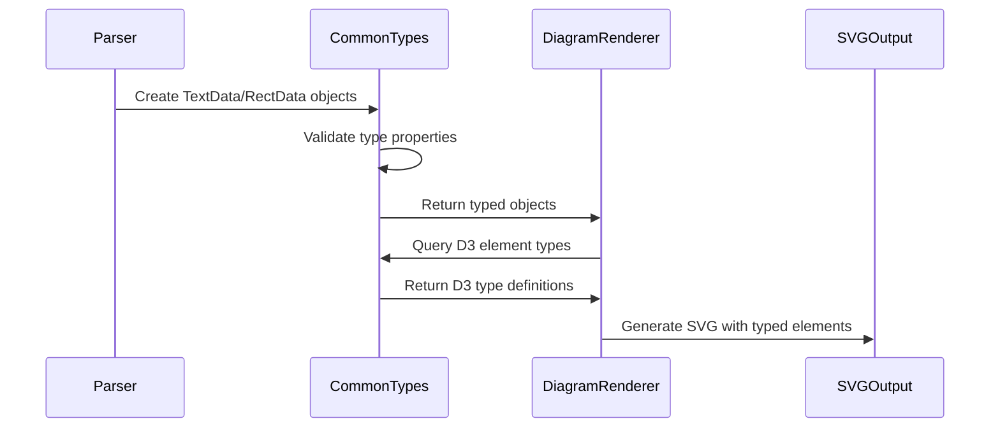
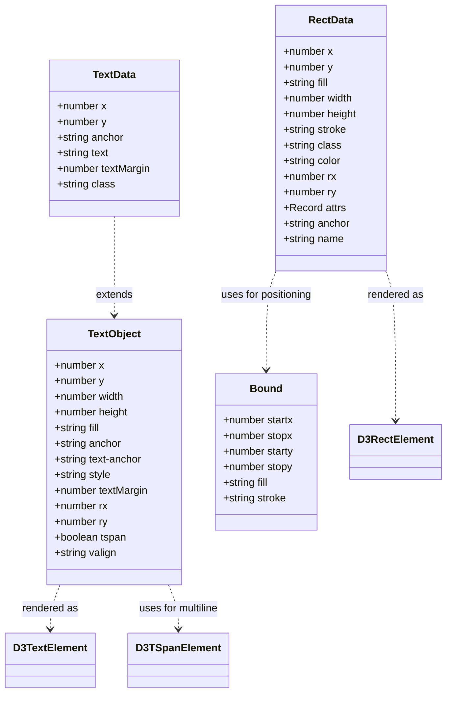
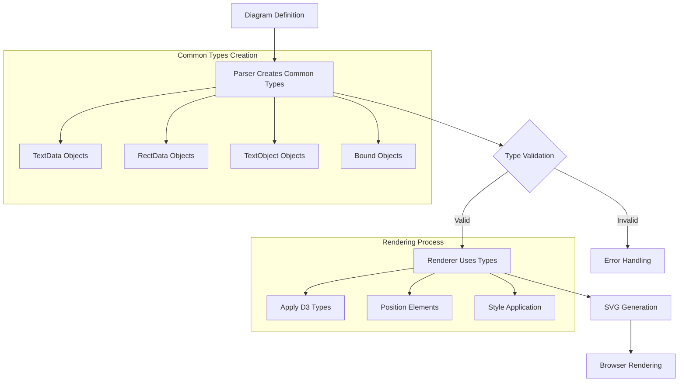

# Common Types Module Documentation

## Introduction

The common-types module provides fundamental type definitions and interfaces that are shared across multiple diagram types in the Mermaid.js library. These types serve as the building blocks for rendering text, rectangles, and other visual elements consistently across different diagram implementations.

## Core Components

### TextData
- **Purpose**: Defines the basic data structure for text elements in diagrams
- **Key Properties**:
  - `x`, `y`: Position coordinates
  - `anchor`: Text alignment (start, middle, end)
  - `text`: The actual text content
  - `textMargin`: Margin around the text
  - `class`: Optional CSS class for styling

### TextObject
- **Purpose**: Extended text representation with additional styling and positioning properties
- **Key Properties**:
  - `x`, `y`, `width`, `height`: Position and dimensions
  - `fill`: Background color
  - `anchor`, `text-anchor`: Text alignment properties
  - `style`: CSS style string
  - `textMargin`: Margin around text
  - `rx`, `ry`: Border radius for rounded corners
  - `tspan`: Whether to use SVG tspan elements
  - `valign`: Vertical alignment

### RectData
- **Purpose**: Defines rectangle element properties for diagram shapes
- **Key Properties**:
  - `x`, `y`: Position coordinates
  - `width`, `height`: Dimensions
  - `fill`: Fill color
  - `stroke`: Border color
  - `rx`, `ry`: Border radius
  - `attrs`: Additional SVG attributes
  - `anchor`: Position anchor point
  - `name`: Optional identifier

### Bound
- **Purpose**: Defines boundary coordinates for diagram elements
- **Key Properties**:
  - `startx`, `stopx`, `starty`, `stopy`: Boundary coordinates
  - `fill`: Fill color
  - `stroke`: Border color

### D3 Element Types
The module also exports type definitions for D3.js selections of various SVG elements:
- `D3RectElement`: SVG rectangle elements
- `D3UseElement`: SVG use elements (for reusing elements)
- `D3ImageElement`: SVG image elements
- `D3TextElement`: SVG text elements
- `D3TSpanElement`: SVG tspan elements (for multi-line text)

## Architecture

```mermaid
graph TB
    subgraph "Common Types Module"
        TextData[TextData Interface]
        TextObject[TextObject Interface]
        RectData[RectData Interface]
        Bound[Bound Interface]
        D3Types[D3 Element Types]
    end
    
    subgraph "Diagram Modules"
        Flowchart[Flowchart Diagram]
        Sequence[Sequence Diagram]
        Class[Class Diagram]
        State[State Diagram]
        ER[ER Diagram]
        Git[Git Graph]
        Pie[Pie Chart]
        Mindmap[Mindmap]
        Quadrant[Quadrant Chart]
        Radar[Radar Chart]
        Sankey[Sankey Diagram]
        Timeline[Timeline]
        Treemap[Treemap]
        XYChart[XY Chart]
        Architecture[Architecture Diagram]
        Block[Block Diagram]
        Packet[Packet Diagram]
        Requirement[Requirement Diagram]
    end
    
    TextData --> Flowchart
    TextData --> Sequence
    TextData --> Class
    TextData --> State
    TextData --> ER
    TextData --> Git
    TextData --> Pie
    TextData --> Mindmap
    TextData --> Quadrant
    TextData --> Radar
    TextData --> Sankey
    TextData --> Timeline
    TextData --> Treemap
    TextData --> XYChart
    TextData --> Architecture
    TextData --> Block
    TextData --> Packet
    TextData --> Requirement
    
    TextObject --> Flowchart
    TextObject --> Sequence
    TextObject --> Class
    TextObject --> State
    TextObject --> ER
    TextObject --> Git
    TextObject --> Pie
    TextObject --> Mindmap
    TextObject --> Quadrant
    TextObject --> Radar
    TextObject --> Sankey
    TextObject --> Timeline
    TextObject --> Treemap
    TextObject --> XYChart
    TextObject --> Architecture
    TextObject --> Block
    TextObject --> Packet
    TextObject --> Requirement
    
    RectData --> Flowchart
    RectData --> Sequence
    RectData --> Class
    RectData --> State
    RectData --> ER
    RectData --> Git
    RectData --> Pie
    RectData --> Mindmap
    RectData --> Quadrant
    RectData --> Radar
    RectData --> Sankey
    RectData --> Timeline
    RectData --> Treemap
    RectData --> XYChart
    RectData --> Architecture
    RectData --> Block
    RectData --> Packet
    RectData --> Requirement
    
    Bound --> Flowchart
    Bound --> Sequence
    Bound --> Class
    Bound --> State
    Bound --> ER
    Bound --> Git
    Bound --> Pie
    Bound --> Mindmap
    Bound --> Quadrant
    Bound --> Radar
    Bound --> Sankey
    Bound --> Timeline
    Bound --> Treemap
    Bound --> XYChart
    Bound --> Architecture
    Bound --> Block
    Bound --> Packet
    Bound --> Requirement
    
    D3Types --> Flowchart
    D3Types --> Sequence
    D3Types --> Class
    D3Types --> State
    D3Types --> ER
    D3Types --> Git
    D3Types --> Pie
    D3Types --> Mindmap
    D3Types --> Quadrant
    D3Types --> Radar
    D3Types --> Sankey
    D3Types --> Timeline
    D3Types --> Treemap
    D3Types --> XYChart
    D3Types --> Architecture
    D3Types --> Block
    D3Types --> Packet
    D3Types --> Requirement
```



## Data Flow



## Component Relationships



## Process Flow



## Integration with Other Modules

The common-types module serves as a foundation for several other modules in the Mermaid ecosystem:

### [Rendering Utilities](rendering-util.md)
- Uses `TextData` and `RectData` for shape rendering
- Extends `Bound` for layout calculations
- Integrates with D3 element types for SVG manipulation

### [Diagram API](diagram-api.md)
- References common types in diagram definitions
- Uses `TextData` for metadata rendering
- Leverages `RectData` for diagram boundaries

### [Configuration](config.md)
- Common types are used in theme configurations
- Text styling properties reference `TextObject` properties
- Layout configurations use `Bound` for positioning

### Individual Diagram Types
Each diagram type module imports and uses common types:
- **Flowchart**: Uses `RectData` for node shapes, `TextData` for labels
- **Sequence**: Uses `TextData` for actor names and messages
- **Class**: Uses `RectData` for class boxes, `TextObject` for method text
- **State**: Uses `RectData` for state boxes, `Bound` for diagram boundaries
- **ER**: Uses `RectData` for entity boxes, `TextData` for attribute text
- **Git**: Uses `TextData` for commit messages, `RectData` for branch indicators
- **Pie**: Uses `TextData` for slice labels
- **Mindmap**: Uses `TextData` for node text, `RectData` for node shapes
- **Quadrant**: Uses `TextData` for axis labels, `RectData` for quadrant boundaries
- **Radar**: Uses `TextData` for axis labels, `Bound` for chart area
- **Sankey**: Uses `TextData` for node labels, `RectData` for node rectangles
- **Timeline**: Uses `TextData` for event text
- **Treemap**: Uses `RectData` for tree nodes, `TextData` for node labels
- **XYChart**: Uses `TextData` for axis labels, `RectData` for plot areas
- **Architecture**: Uses `TextData` for service names, `RectData` for component boxes
- **Block**: Uses `RectData` for block shapes, `TextData` for block text
- **Packet**: Uses `RectData` for packet representations
- **Requirement**: Uses `TextData` for requirement text, `RectData` for requirement boxes

## Usage Examples

### Creating Text Elements
```typescript
import { TextData, TextObject } from './commonTypes';

const textData: TextData = {
  x: 100,
  y: 50,
  anchor: 'middle',
  text: 'Hello World',
  textMargin: 5,
  class: 'diagram-text'
};

const textObject: TextObject = {
  x: 100,
  y: 50,
  width: 200,
  height: 30,
  fill: '#ffffff',
  anchor: 'middle',
  'text-anchor': 'middle',
  style: 'font-size: 14px; font-family: Arial;',
  textMargin: 5,
  rx: 3,
  ry: 3,
  tspan: true
};
```

### Creating Rectangle Elements
```typescript
import { RectData, Bound } from './commonTypes';

const rectData: RectData = {
  x: 50,
  y: 50,
  width: 200,
  height: 100,
  fill: '#e1f5fe',
  stroke: '#01579b',
  rx: 5,
  ry: 5,
  class: 'diagram-rect'
};

const bound: Bound = {
  startx: 0,
  stopx: 300,
  starty: 0,
  stopy: 200,
  fill: '#f5f5f5',
  stroke: '#333333'
};
```

## Best Practices

1. **Type Safety**: Always use the common types instead of creating ad-hoc interfaces
2. **Consistency**: Maintain consistent property naming across different diagram types
3. **Extensibility**: Extend common types rather than modifying them directly
4. **Documentation**: Document any custom extensions to common types
5. **Validation**: Validate type properties before rendering

## Future Considerations

- Potential addition of more geometric shape types (circle, ellipse, polygon)
- Enhanced text styling options
- Support for responsive design properties
- Integration with CSS custom properties for theming
- Performance optimizations for large datasets

## Related Documentation

- [Core Mermaid](core-mermaid.md) - Main Mermaid.js functionality
- [Rendering Utilities](rendering-util.md) - SVG rendering utilities
- [Configuration](config.md) - Configuration system
- [Diagram API](diagram-api.md) - Diagram definition API
- [Themes](themes.md) - Theme system integration