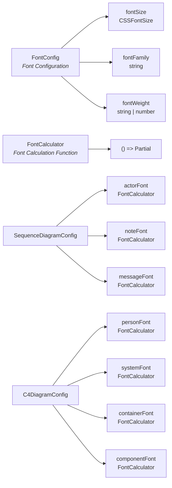
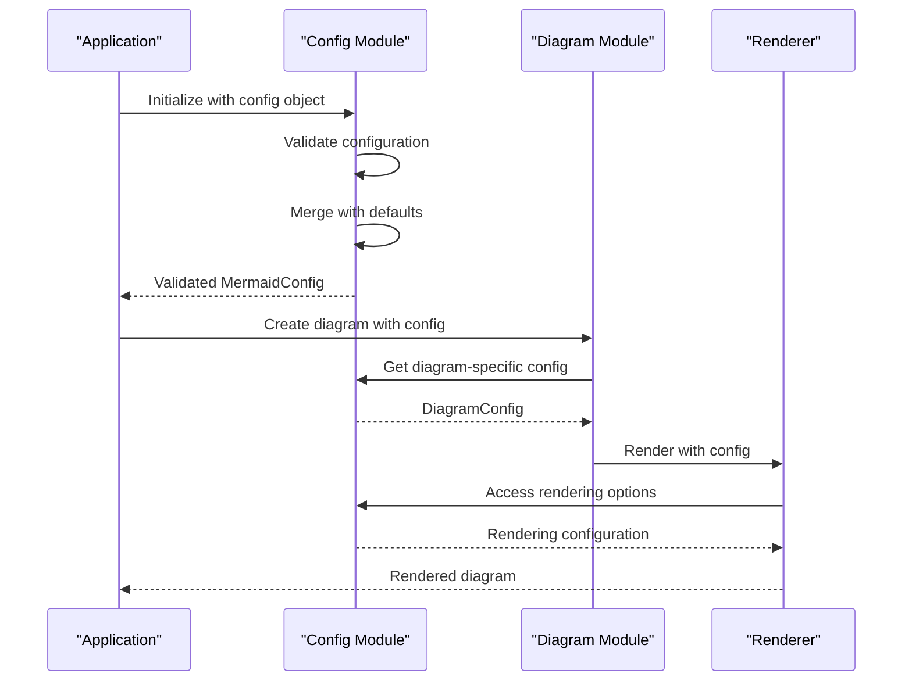
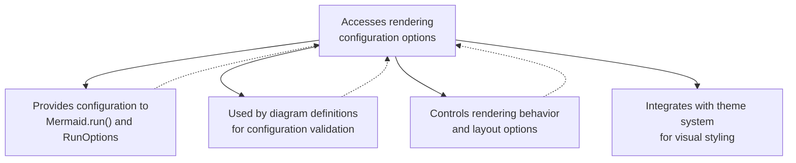
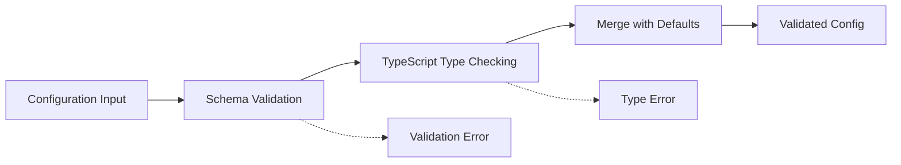
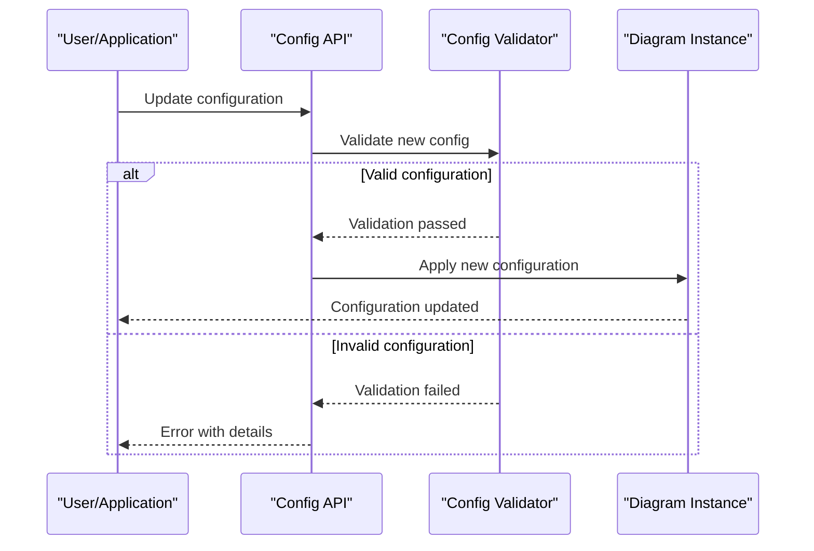
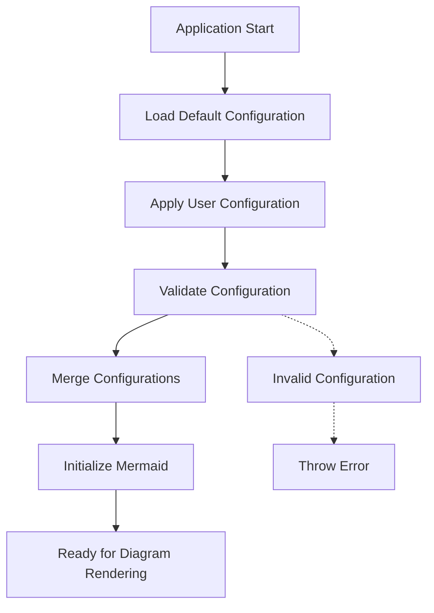
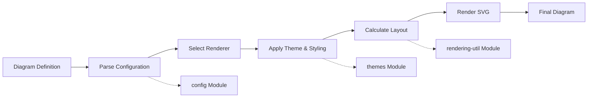

# Config Module Documentation

## Overview

The config module is the central configuration management system for Mermaid.js, providing a comprehensive type-safe configuration interface for all diagram types. It defines the structure and validation for global settings, diagram-specific configurations, and rendering options that control how diagrams are parsed, rendered, and displayed.

## Purpose and Core Functionality

The config module serves as the single source of truth for all configuration options in Mermaid.js, offering:

- **Global Configuration Management**: Centralized settings that apply across all diagram types
- **Diagram-Specific Configurations**: Tailored configuration interfaces for each supported diagram type
- **Type Safety**: TypeScript interfaces ensuring configuration validity at compile time
- **Runtime Validation**: Schema-based validation for configuration objects
- **Theme Integration**: Configuration support for visual themes and styling
- **Rendering Control**: Fine-grained control over layout algorithms, spacing, and visual presentation

## Architecture

### Core Configuration Hierarchy

```mermaid
graph TD
    MermaidConfig["MermaidConfig<br/><i>Root Configuration Interface</i>"]
    BaseDiagramConfig["BaseDiagramConfig<br/><i>Base Configuration for All Diagrams</i>"]
    
    MermaidConfig --> GlobalSettings["Global Settings<br/>• theme<br/>• fontFamily<br/>• securityLevel<br/>• maxTextSize<br/>• logLevel"]
    MermaidConfig --> DiagramSpecific["Diagram-Specific Configurations"]
    MermaidConfig --> RenderingOptions["Rendering Options<br/>• layout<br/>• look<br/>• htmlLabels"]
    MermaidConfig --> SecuritySettings["Security Settings<br/>• securityLevel<br/>• secure<br/>• dompurifyConfig"]
    
    BaseDiagramConfig --> UseWidth["useWidth<br/>useMaxWidth"]
    
    DiagramSpecific --> FlowchartConfig["flowchart<br/>FlowchartDiagramConfig"]
    DiagramSpecific --> SequenceConfig["sequence<br/>SequenceDiagramConfig"]
    DiagramSpecific --> ClassConfig["class<br/>ClassDiagramConfig"]
    DiagramSpecific --> StateConfig["state<br/>StateDiagramConfig"]
    DiagramSpecific --> ErConfig["er<br/>ErDiagramConfig"]
    DiagramSpecific --> GanttConfig["gantt<br/>GanttDiagramConfig"]
    DiagramSpecific --> JourneyConfig["journey<br/>JourneyDiagramConfig"]
    DiagramSpecific --> PieConfig["pie<br/>PieDiagramConfig"]
    DiagramSpecific --> QuadrantConfig["quadrantChart<br/>QuadrantChartConfig"]
    DiagramSpecific --> XYConfig["xyChart<br/>XYChartConfig"]
    DiagramSpecific --> RadarConfig["radar<br/>RadarDiagramConfig"]
    DiagramSpecific --> MindmapConfig["mindmap<br/>MindmapDiagramConfig"]
    DiagramSpecific --> TimelineConfig["timeline<br/>TimelineDiagramConfig"]
    DiagramSpecific --> SankeyConfig["sankey<br/>SankeyDiagramConfig"]
    DiagramSpecific --> ArchitectureConfig["architecture<br/>ArchitectureDiagramConfig"]
    DiagramSpecific --> C4Config["c4<br/>C4DiagramConfig"]
    DiagramSpecific --> BlockConfig["block<br/>BlockDiagramConfig"]
    DiagramSpecific --> PacketConfig["packet<br/>PacketDiagramConfig"]
    DiagramSpecific --> KanbanConfig["kanban<br/>KanbanDiagramConfig"]
    DiagramSpecific --> RequirementConfig["requirement<br/>RequirementDiagramConfig"]
    DiagramSpecific --> GitConfig["gitGraph<br/>GitGraphDiagramConfig"]
```



### Configuration Type System



## Component Relationships

### Configuration Flow



### Integration with Other Modules



## Configuration Categories

### Global Configuration Options

| Category | Options | Description |
|----------|---------|-------------|
| **Theme & Styling** | `theme`, `themeVariables`, `themeCSS`, `look`, `handDrawnSeed` | Controls visual appearance and styling |
| **Layout & Rendering** | `layout`, `htmlLabels`, `fontFamily`, `fontSize` | Manages layout algorithms and text rendering |
| **Security** | `securityLevel`, `secure`, `dompurifyConfig` | Handles security and sanitization |
| **Performance** | `maxTextSize`, `maxEdges`, `deterministicIds` | Controls resource usage and performance |
| **Behavior** | `startOnLoad`, `arrowMarkerAbsolute`, `wrap` | Modifies diagram behavior and interaction |

### Diagram-Specific Configurations

Each diagram type has its own configuration interface that extends `BaseDiagramConfig`:

#### Flowchart Configuration (`FlowchartDiagramConfig`)
- **Layout Control**: `nodeSpacing`, `rankSpacing`, `curve`, `defaultRenderer`
- **Text Handling**: `htmlLabels`, `wrappingWidth`, `padding`
- **Visual Styling**: `diagramPadding`, `titleTopMargin`

#### Sequence Diagram Configuration (`SequenceDiagramConfig`)
- **Actor Management**: `actorMargin`, `width`, `height`, `mirrorActors`
- **Message Control**: `messageMargin`, `messageAlign`, `activationWidth`
- **Font Configuration**: `actorFont`, `noteFont`, `messageFont` (using `FontCalculator`)

#### C4 Diagram Configuration (`C4DiagramConfig`)
- **Shape Management**: `c4ShapeMargin`, `c4ShapePadding`, `c4ShapeInRow`
- **Font Configuration**: Extensive font calculators for different element types
- **Color Scheme**: Background and border colors for all element types

### Advanced Configuration Features

#### Font Configuration System

```typescript
interface FontConfig {
  fontSize?: CSSFontSize;
  fontFamily?: string;
  fontWeight?: string | number;
}

type FontCalculator = () => Partial<FontConfig>;
```

The font system uses calculator functions that dynamically compute font properties based on other configuration values, enabling flexible and context-aware typography.

#### Layout Engine Configuration

```typescript
interface MermaidConfig {
  layout?: string;
  elk?: {
    mergeEdges?: boolean;
    nodePlacementStrategy?: 'SIMPLE' | 'NETWORK_SIMPLEX' | 'LINEAR_SEGMENTS' | 'BRANDES_KOEPF';
    cycleBreakingStrategy?: 'GREEDY' | 'DEPTH_FIRST' | 'INTERACTIVE' | 'MODEL_ORDER' | 'GREEDY_MODEL_ORDER';
    forceNodeModelOrder?: boolean;
    considerModelOrder?: 'NONE' | 'NODES_AND_EDGES' | 'PREFER_EDGES' | 'PREFER_NODES';
  };
}
```

The configuration supports multiple layout engines with engine-specific options, particularly for the ELK (Eclipse Layout Kernel) layout algorithm.

## Data Flow

### Configuration Validation and Processing



### Runtime Configuration Updates



## Process Flows

### Initialization Process



### Diagram Rendering with Configuration



## Key Features

### 1. Type Safety
- Comprehensive TypeScript interfaces for all configuration options
- Compile-time validation of configuration objects
- IntelliSense support in IDEs

### 2. Schema-Based Validation
- JSON Schema generation from TypeScript interfaces
- Runtime validation of configuration objects
- Detailed error messages for invalid configurations

### 3. Hierarchical Configuration
- Global settings that apply to all diagrams
- Diagram-specific overrides
- Inheritance from base configurations

### 4. Dynamic Font Management
- Font calculator functions for context-aware typography
- Consistent font handling across all diagram types
- Support for custom font configurations

### 5. Security Integration
- Security level controls for different deployment scenarios
- DOMPurify integration for XSS protection
- Configurable sanitization options

## Integration Points

### With Core Module
The config module is essential for the [core-mermaid](core-mermaid.md) module, providing the configuration structure used by `Mermaid.run()` and `RunOptions`.

### With Diagram Modules
Each diagram module (e.g., [flowchart](flowchart.md), [sequence](sequence.md), [class](class.md)) utilizes its specific configuration interface from the config module to control rendering behavior.

### With Rendering Module
The [rendering-util](rendering-util.md) module depends on configuration options for layout algorithms, spacing, and visual styling parameters.

### With Themes Module
The [themes](themes.md) module integrates with the config module's theme system, providing visual styling that can be controlled through configuration.

## Best Practices

1. **Use TypeScript**: Leverage the type system for compile-time validation
2. **Start with Defaults**: Begin with default configurations and customize as needed
3. **Validate Early**: Validate configurations before passing to Mermaid
4. **Secure Configuration**: Use appropriate security levels for production environments
5. **Performance Considerations**: Adjust `maxTextSize` and `maxEdges` based on expected diagram complexity
6. **Theme Consistency**: Maintain consistent theming across all diagrams in an application

## Configuration Examples

### Basic Configuration
```typescript
const config: MermaidConfig = {
  theme: 'dark',
  fontFamily: 'Arial, sans-serif',
  fontSize: 14,
  securityLevel: 'strict'
};
```

### Diagram-Specific Configuration
```typescript
const config: MermaidConfig = {
  theme: 'default',
  flowchart: {
    curve: 'basis',
    nodeSpacing: 50,
    rankSpacing: 80,
    defaultRenderer: 'elk'
  },
  sequence: {
    diagramMarginX: 50,
    diagramMarginY: 10,
    actorMargin: 50,
    width: 150,
    height: 65
  }
};
```

### Advanced Layout Configuration
```typescript
const config: MermaidConfig = {
  layout: 'elk',
  elk: {
    mergeEdges: true,
    nodePlacementStrategy: 'NETWORK_SIMPLEX',
    cycleBreakingStrategy: 'GREEDY',
    considerModelOrder: 'NODES_AND_EDGES'
  }
};
```

This comprehensive configuration system ensures that Mermaid.js can be finely tuned for various use cases while maintaining type safety and providing excellent developer experience.