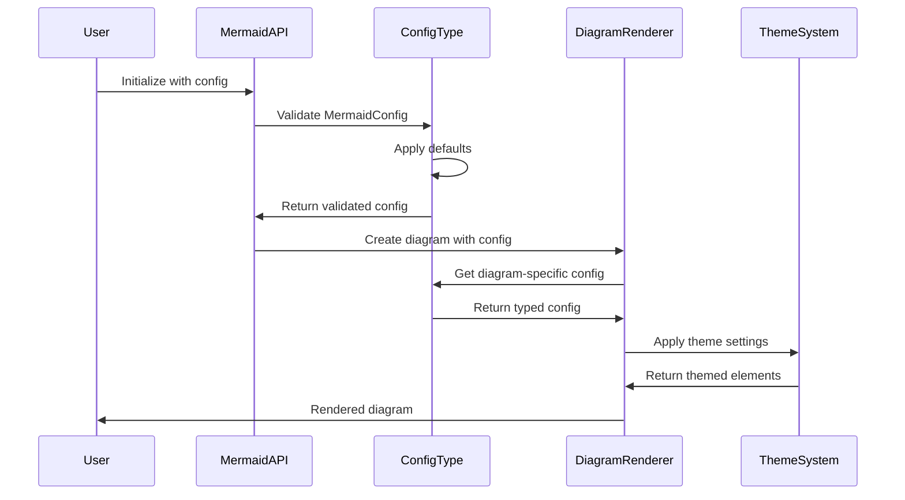
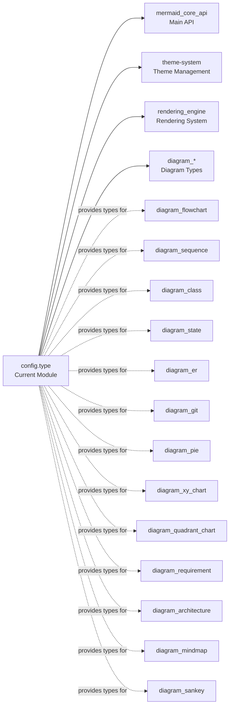

# config.type Module Documentation

## Introduction

The `config.type` module serves as the central configuration system for Mermaid, providing TypeScript type definitions for all diagram-specific and global configuration options. This module defines the complete configuration schema that controls how Mermaid diagrams are rendered, styled, and behave across the entire system.

## Overview

The configuration system is built around the `MermaidConfig` interface, which serves as the master configuration object containing both global settings and diagram-specific configurations. The module provides a comprehensive type-safe way to configure every aspect of Mermaid diagram rendering, from themes and fonts to diagram-specific layout algorithms.

## Architecture

### Core Configuration Structure

```mermaid
graph TB
    MermaidConfig[MermaidConfig<br/>Master Configuration]
    
    subgraph "Global Configuration"
        Theme[theme<br/>themeVariables<br/>themeCSS]
        Look[look<br/>handDrawnSeed]
        Layout[layout<br/>maxTextSize<br/>maxEdges]
        Security[securityLevel<br/>secure<br/>dompurifyConfig]
        Font[fontFamily<br/>fontSize<br/>altFontFamily]
        Behavior[darkMode<br/>htmlLabels<br/>startOnLoad]
    end
    
    subgraph "Diagram-Specific Configurations"
        FlowchartConfig[FlowchartDiagramConfig]
        SequenceConfig[SequenceDiagramConfig]
        ClassConfig[ClassDiagramConfig]
        StateConfig[StateDiagramConfig]
        ERConfig[ErDiagramConfig]
        PieConfig[PieDiagramConfig]
        GitConfig[GitGraphDiagramConfig]
        C4Config[C4DiagramConfig]
        SankeyConfig[SankeyDiagramConfig]
        XYConfig[XYChartConfig]
        QuadrantConfig[QuadrantChartConfig]
        RequirementConfig[RequirementDiagramConfig]
        ArchitectureConfig[ArchitectureDiagramConfig]
        MindmapConfig[MindmapDiagramConfig]
        GanttConfig[GanttDiagramConfig]
        JourneyConfig[JourneyDiagramConfig]
        TimelineConfig[TimelineDiagramConfig]
        PacketConfig[PacketDiagramConfig]
        BlockConfig[BlockDiagramConfig]
        RadarConfig[RadarDiagramConfig]
    end
    
    MermaidConfig --> Theme
    MermaidConfig --> Look
    MermaidConfig --> Layout
    MermaidConfig --> Security
    MermaidConfig --> Font
    MermaidConfig --> Behavior
    
    MermaidConfig --> FlowchartConfig
    MermaidConfig --> SequenceConfig
    MermaidConfig --> ClassConfig
    MermaidConfig --> StateConfig
    MermaidConfig --> ERConfig
    MermaidConfig --> PieConfig
    MermaidConfig --> GitConfig
    MermaidConfig --> C4Config
    MermaidConfig --> SankeyConfig
    MermaidConfig --> XYConfig
    MermaidConfig --> QuadrantConfig
    MermaidConfig --> RequirementConfig
    MermaidConfig --> ArchitectureConfig
    MermaidConfig --> MindmapConfig
    MermaidConfig --> GanttConfig
    MermaidConfig --> JourneyConfig
    MermaidConfig --> TimelineConfig
    MermaidConfig --> PacketConfig
    MermaidConfig --> BlockConfig
    MermaidConfig --> RadarConfig
```



### Configuration Inheritance Hierarchy

```mermaid
graph TD
    BaseDiagramConfig[BaseDiagramConfig<br/>Base Configuration]
    
    BaseDiagramConfig --> FlowchartDiagramConfig
    BaseDiagramConfig --> SequenceDiagramConfig
    BaseDiagramConfig --> ClassDiagramConfig
    BaseDiagramConfig --> StateDiagramConfig
    BaseDiagramConfig --> ErDiagramConfig
    BaseDiagramConfig --> PieDiagramConfig
    BaseDiagramConfig --> GitGraphDiagramConfig
    BaseDiagramConfig --> C4DiagramConfig
    BaseDiagramConfig --> SankeyDiagramConfig
    BaseDiagramConfig --> XYChartConfig
    BaseDiagramConfig --> QuadrantChartConfig
    BaseDiagramConfig --> RequirementDiagramConfig
    BaseDiagramConfig --> ArchitectureDiagramConfig
    BaseDiagramConfig --> MindmapDiagramConfig
    BaseDiagramConfig --> GanttDiagramConfig
    BaseDiagramConfig --> JourneyDiagramConfig
    BaseDiagramConfig --> TimelineDiagramConfig
    BaseDiagramConfig --> PacketDiagramConfig
    BaseDiagramConfig --> BlockDiagramConfig
    BaseDiagramConfig --> RadarDiagramConfig
    
    BaseDiagramConfig --> useWidth[useWidth]
    BaseDiagramConfig --> useMaxWidth[useMaxWidth]
```



## Component Relationships

### Configuration Flow



### Integration with Other Modules



## Key Components

### MermaidConfig Interface

The central configuration interface that contains all global and diagram-specific settings:

- **Theme Configuration**: Controls visual appearance and styling
- **Layout Configuration**: Manages diagram layout algorithms and constraints
- **Security Configuration**: Handles security levels and sanitization
- **Font Configuration**: Global font settings
- **Behavior Configuration**: Controls runtime behavior
- **Diagram-Specific Configs**: Individual configuration objects for each diagram type

### BaseDiagramConfig Interface

The foundational interface that all diagram-specific configurations extend:

```typescript
interface BaseDiagramConfig {
  useWidth?: number;           // Fixed width for diagrams
  useMaxWidth?: boolean;       // Whether to use maximum available width
}
```

### Font Configuration System

A sophisticated font management system with font calculators:

```typescript
type FontCalculator = () => Partial<FontConfig>;

interface FontConfig {
  fontSize?: CSSFontSize;
  fontFamily?: string;
  fontWeight?: string | number;
}
```

## Configuration Categories

### 1. Global Visual Settings
- **Theme Control**: `theme`, `themeVariables`, `themeCSS`
- **Appearance**: `look`, `handDrawnSeed`, `darkMode`
- **Layout Engine**: `layout`, `elk` (ELK-specific settings)

### 2. Security and Safety
- **Security Levels**: `securityLevel` (strict, loose, antiscript, sandbox)
- **Secure Keys**: `secure` array for protected configuration keys
- **Sanitization**: `dompurifyConfig` for HTML sanitization

### 3. Text and Font Management
- **Global Fonts**: `fontFamily`, `altFontFamily`, `fontSize`
- **Font Calculators**: Dynamic font configuration functions
- **Text Handling**: `htmlLabels`, `wrap`, `markdownAutoWrap`

### 4. Performance and Constraints
- **Size Limits**: `maxTextSize`, `maxEdges`
- **Rendering Control**: `deterministicIds`, `deterministicIDSeed`
- **Error Handling**: `suppressErrorRendering`

### 5. Diagram-Specific Features
Each diagram type has its own configuration interface extending `BaseDiagramConfig` with specialized options for:
- Node spacing and layout
- Font customization per element type
- Color schemes and styling
- Rendering algorithms
- Interactive features

## Usage Patterns

### Configuration Validation
The module provides type safety for configuration objects, ensuring that:
- Only valid configuration keys are used
- Configuration values match expected types
- Diagram-specific configurations are properly structured

### Runtime Configuration
Configuration can be modified at runtime through:
- Global initialization: `mermaid.initialize(config)`
- Per-diagram configuration: Configuration passed to individual diagram renderers
- Dynamic updates: Configuration changes applied during diagram lifecycle

### Theme Integration
The configuration system integrates with the [theme-system](theme-system.md) to provide:
- Theme variable resolution
- CSS generation from configuration
- Dynamic theme switching
- Custom theme application

## Dependencies

The config.type module is a foundational component that:
- **Is Used By**: All other Mermaid modules for configuration
- **Integrates With**: [mermaid_core_api](mermaid_core_api.md) for main API functionality
- **Supports**: All diagram type modules (diagram_*, rendering_engine, etc.)
- **References**: External libraries like DOMPurify for security configuration

## Best Practices

1. **Type Safety**: Always use the provided TypeScript interfaces for configuration
2. **Validation**: Validate configuration objects before passing to Mermaid
3. **Defaults**: Rely on sensible defaults for unspecified options
4. **Security**: Use appropriate security levels based on your use case
5. **Performance**: Configure size limits and constraints appropriately for your application
6. **Theming**: Leverage theme variables for consistent styling across diagrams

## Configuration Examples

### Basic Configuration
```typescript
const config: MermaidConfig = {
  theme: 'dark',
  themeVariables: {
    primaryColor: '#BB2528',
    primaryTextColor: '#fff',
    primaryBorderColor: '#7C0000',
    lineColor: '#F8B229',
    secondaryColor: '#006100',
    tertiaryColor: '#fff'
  },
  flowchart: {
    useMaxWidth: true,
    htmlLabels: true,
    curve: 'basis'
  }
};
```

### Advanced Security Configuration
```typescript
const secureConfig: MermaidConfig = {
  securityLevel: 'strict',
  secure: ['securityLevel', 'startOnLoad', 'maxTextSize'],
  dompurifyConfig: {
    ADD_TAGS: ['foreignObject'],
    ADD_ATTR: ['dominant-baseline']
  }
};
```

This configuration system provides the foundation for all Mermaid diagram rendering, offering both flexibility and type safety for developers integrating Mermaid into their applications.