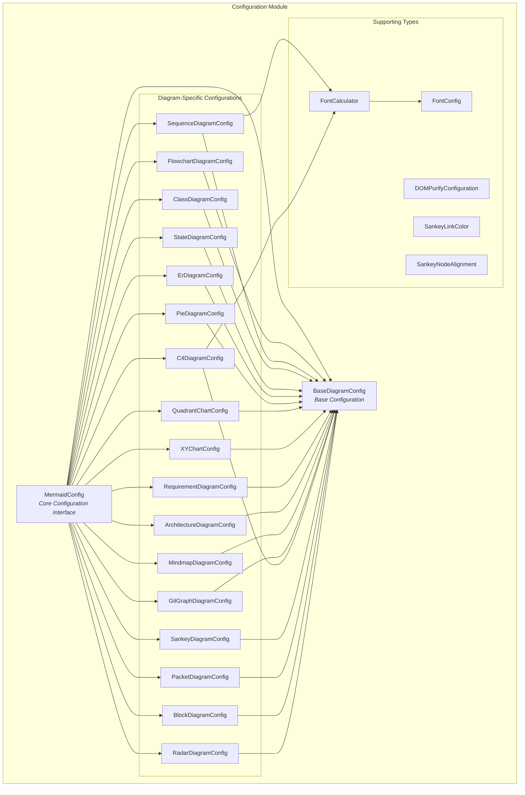
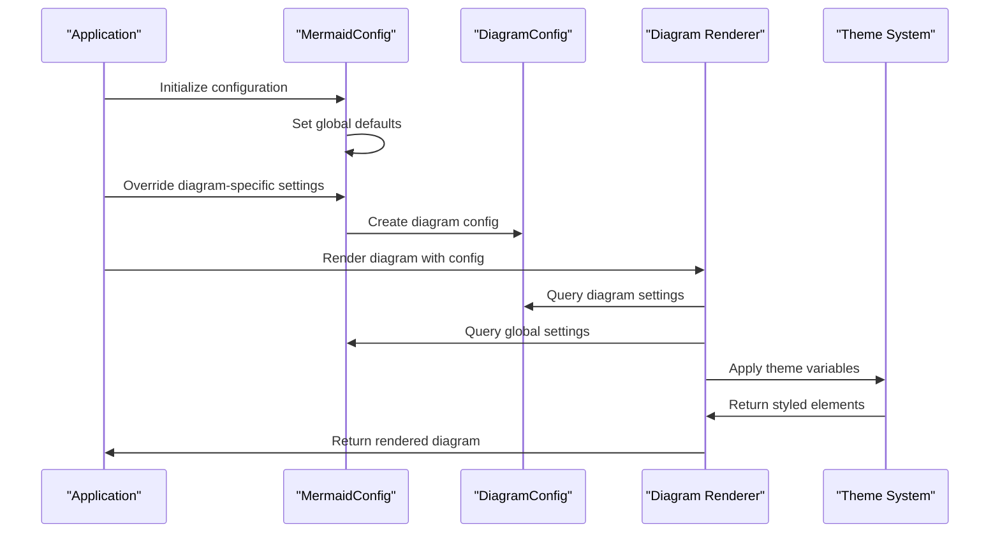
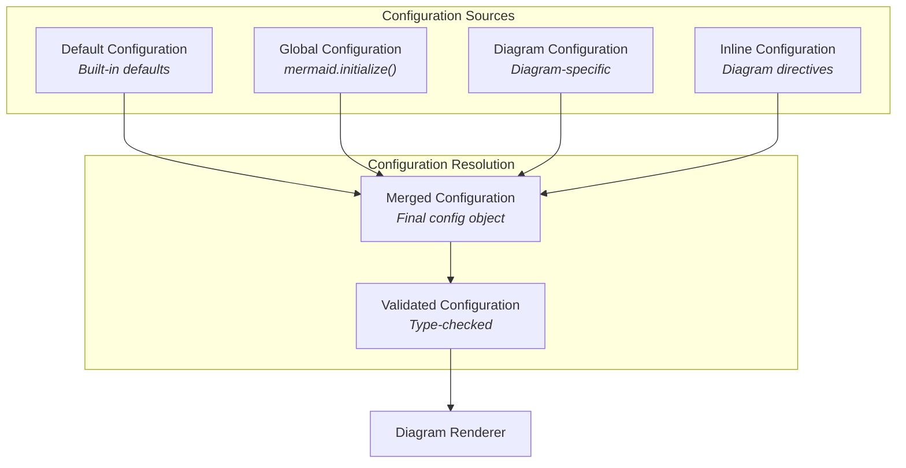

# Configuration Module Documentation

## Overview

The Configuration module is the central configuration management system for the Mermaid diagramming library. It provides a comprehensive type-safe configuration interface that controls the behavior, appearance, and rendering of all diagram types supported by Mermaid. The module defines the core `MermaidConfig` interface and specialized configuration interfaces for each diagram type, enabling fine-grained control over diagram rendering, styling, and behavior.

## Architecture



## Core Components

### MermaidConfig Interface

The `MermaidConfig` interface serves as the central configuration object that controls global Mermaid behavior and diagram-specific settings. It provides a hierarchical configuration system where global settings can be overridden by diagram-specific configurations.

**Key Features:**
- **Theme Management**: Controls visual themes (`default`, `base`, `dark`, `forest`, `neutral`)
- **Layout Control**: Configures rendering engines and layout algorithms
- **Security Settings**: Manages security levels and sanitization
- **Font Configuration**: Global font settings for all diagrams
- **ELK Integration**: Advanced layout options for the ELK layout engine
- **Error Handling**: Controls error rendering and suppression

### BaseDiagramConfig Interface

The foundation interface for all diagram-specific configurations, providing common properties like `useWidth` and `useMaxWidth` that control diagram sizing behavior.

### Diagram-Specific Configurations

Each diagram type has its own specialized configuration interface that extends `BaseDiagramConfig`:

#### FlowchartDiagramConfig
Controls flowchart-specific settings including:
- Node spacing and ranking
- Curve interpolation methods
- HTML label rendering
- Subgraph behavior
- Renderer selection (`dagre-d3`, `dagre-wrapper`, `elk`)

#### SequenceDiagramConfig
Manages sequence diagram properties:
- Actor dimensions and margins
- Message spacing and alignment
- Font configurations for actors, notes, and messages
- Activation box styling
- Mirror actors and sequence numbers

#### ClassDiagramConfig
Handles class diagram configuration:
- Node spacing and padding
- HTML label support
- Renderer selection
- Member visibility controls

## Data Flow



## Configuration Hierarchy



## Integration Points

### Theme System Integration
The configuration module integrates with the [theme system](theme-system.md) through:
- `theme` property for theme selection
- `themeVariables` for custom theme variables
- `themeCSS` for custom CSS injection

### Rendering Engine Integration
Configuration controls rendering behavior through:
- `layout` property for layout algorithm selection
- `defaultRenderer` for diagram-specific renderer choice
- ELK-specific configuration options

### Security Integration
Security configuration includes:
- `securityLevel` for trust levels (`strict`, `loose`, `antiscript`, `sandbox`)
- `dompurifyConfig` for HTML sanitization
- `secure` array for protected configuration keys

## Usage Patterns

### Basic Configuration
```typescript
const config: MermaidConfig = {
  theme: 'dark',
  fontFamily: 'Arial, sans-serif',
  fontSize: 14,
  flowchart: {
    curve: 'basis',
    nodeSpacing: 50
  }
};
```

### Advanced Configuration
```typescript
const config: MermaidConfig = {
  theme: 'base',
  themeVariables: {
    primaryColor: '#ff0000',
    primaryTextColor: '#ffffff'
  },
  elk: {
    mergeEdges: true,
    nodePlacementStrategy: 'NETWORK_SIMPLEX'
  },
  securityLevel: 'strict',
  deterministicIds: true,
  sequence: {
    actorFontSize: 16,
    messageFontSize: 14,
    noteFontSize: 12
  }
};
```

## Configuration Validation

The configuration system includes built-in validation through TypeScript types, ensuring:
- Type safety for all configuration options
- Valid value ranges for numeric properties
- Proper enum values for categorical options
- Font calculator function signatures

## Dependencies

The configuration module has dependencies on:
- **External Libraries**: `dompurify` for HTML sanitization
- **Theme System**: For theme variable resolution
- **Rendering Engines**: For renderer-specific configuration
- **Font System**: For font configuration management

## Best Practices

1. **Use TypeScript**: Leverage TypeScript types for configuration validation
2. **Theme Consistency**: Maintain consistent theming across all diagram types
3. **Security First**: Use appropriate security levels for your use case
4. **Performance**: Consider `deterministicIds` for version control scenarios
5. **Testing**: Use `handDrawnSeed` for consistent testing outputs

## Related Documentation

- [Theme System](theme-system.md) - For theme configuration details
- [Rendering Engine](rendering_engine.md) - For renderer-specific options
- [Diagram Types](diagram_flowchart.md) - For diagram-specific configurations
- [Security](mermaid_core_api.md) - For security configuration options