# Core Mermaid Module Documentation

## Introduction

The core-mermaid module serves as the main entry point and orchestration layer for the Mermaid diagramming library. It provides the primary API surface for users to render diagrams, manage configurations, and handle the complete diagram lifecycle from text parsing to SVG rendering. This module acts as the facade that coordinates between various specialized subsystems including diagram detection, parsing, rendering, and configuration management.

## Architecture Overview

The core-mermaid module follows a layered architecture pattern with clear separation of concerns:


## Core Components

### Mermaid Class

The `Mermaid` class is the primary interface exposed to users, providing a comprehensive set of methods for diagram processing:


### RunOptions Interface

The `RunOptions` interface defines configuration options for the diagram rendering process:


## Data Flow Architecture

### Diagram Processing Pipeline

The core processing pipeline follows a sequential flow from text input to rendered SVG:


### Configuration Flow

Configuration management follows a hierarchical approach:


## Component Interactions

### Execution Queue Management

The core module implements a sophisticated execution queue to handle concurrent rendering requests:


### Error Handling Flow

Comprehensive error handling ensures graceful degradation:


## Integration Points

### External Diagram Registration

The module supports dynamic registration of external diagram types:


### DOM Integration

Automatic DOM processing on page load:


## Configuration Management

### Hierarchical Configuration System

The configuration system supports multiple levels of customization:

```mermaid
graph TD
    subgraph "Configuration Levels"
        A1[Global Site Config]
        A2[Diagram Type Config]
        A3[Instance Config]
        A4[Render Options]
    end
    
    B[User Input] --> C[initialize]
    C --> D[updateSiteConfig]
    D --> A1
    A1 --> A2
    A2 --> A3
    A3 --> A4
    A4 --> E[Final Render]
```



## Key Features

### 1. Multi-Diagram Support
Supports 20+ diagram types through a unified API:
- Flowcharts, Sequence diagrams, Class diagrams
- State diagrams, ER diagrams, Git graphs
- Pie charts, Mind maps, Quadrant charts
- Radar charts, Sankey diagrams, Timeline diagrams
- And many more specialized diagram types

### 2. Theme System
Comprehensive theming with built-in themes:
- Default, Dark, Forest, Neutral themes
- Customizable color schemes and styling
- Per-diagram theme overrides

### 3. Layout Algorithms
Flexible layout system supporting:
- Multiple layout algorithms (dagre, elk, etc.)
- Custom layout loaders
- Automatic layout selection based on diagram type

### 4. Error Handling
Robust error management:
- Detailed error reporting with context
- Graceful degradation options
- Custom error handlers
- Parse error callbacks

## Dependencies

The core-mermaid module orchestrates multiple specialized modules:

- **[config](config.md)**: Configuration management and type definitions
- **[diagram-api](diagram-api.md)**: Diagram detection and API abstraction
- **[rendering-util](rendering-util.md)**: Rendering utilities and layout management
- **[themes](themes.md)**: Theme system and styling
- **[types](types.md)**: Common type definitions
- **[utils](utils.md)**: Utility functions and helpers

## Usage Patterns

### Basic Usage
```javascript
// Initialize with configuration
mermaid.initialize({
  startOnLoad: true,
  theme: 'dark'
});

// Render specific diagram
const { svg } = await mermaid.render('diagram-id', 'graph TD; A-->B;');
```

### Advanced Usage
```javascript
// Register custom diagrams
await mermaid.registerExternalDiagrams([customDiagram]);

// Custom error handling
mermaid.setParseErrorHandler((err, hash) => {
  console.error('Parse error:', err);
});

// Batch processing
await mermaid.run({
  querySelector: '.my-diagrams',
  postRenderCallback: (id) => console.log(`Rendered: ${id}`)
});
```

## Performance Considerations

### Execution Queue
- Serializes concurrent render requests
- Prevents race conditions
- Maintains consistent state

### Lazy Loading
- Diagrams loaded on-demand
- Reduces initial bundle size
- Improves startup performance

### Caching
- Processed elements marked with data-processed
- Prevents duplicate processing
- Efficient DOM querying

## Security Considerations

### Content Sanitization
- HTML entity decoding
- XSS prevention measures
- Safe DOM manipulation

### Configuration Validation
- Type-safe configuration
- Runtime validation
- Secure defaults

This documentation provides a comprehensive overview of the core-mermaid module's architecture, functionality, and integration points. For detailed information about specific diagram types, configuration options, or rendering utilities, refer to the respective module documentation.