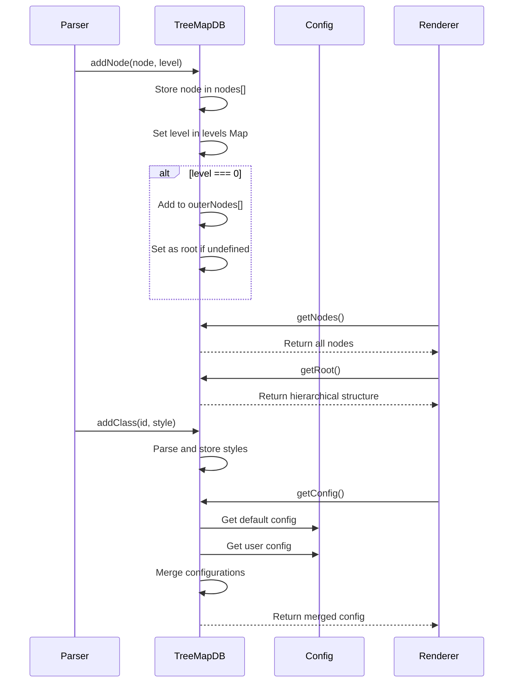
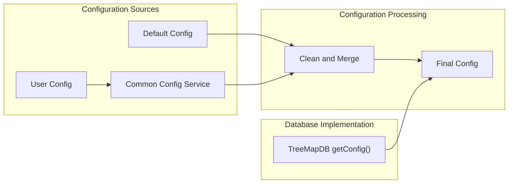
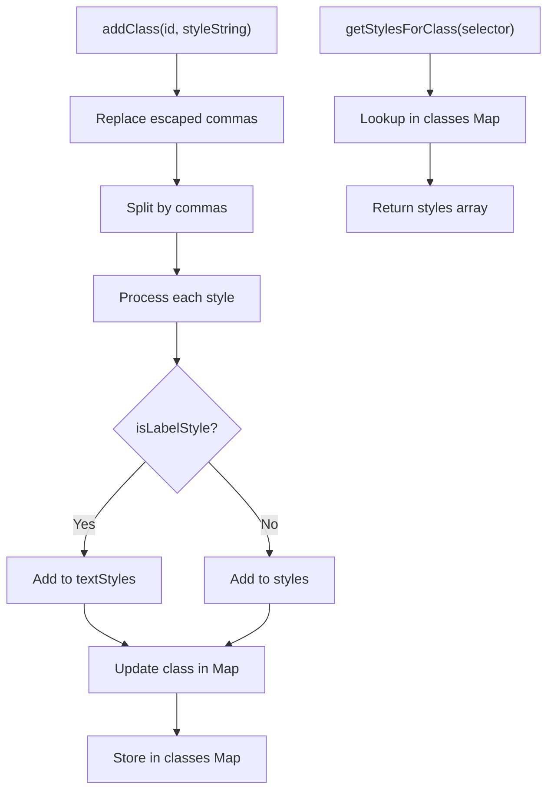
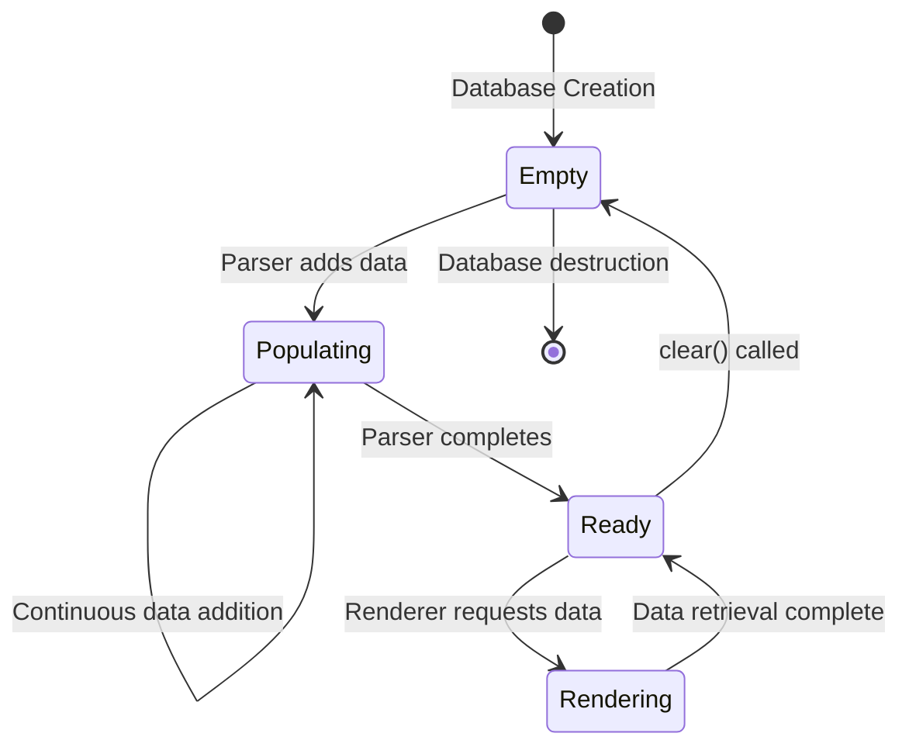

# Database Management Module

The database-management module provides the core data storage and management functionality for Mermaid diagrams. It implements the `DiagramDB` interface and serves as the central repository for diagram data, configuration, and styling across multiple diagram types including architecture, treemap, and other specialized diagrams.

## Introduction

The database management system is built around the `DiagramDB` interface, which provides a standardized contract for all diagram databases. Each diagram type implements this interface to manage its specific data structures while maintaining consistency across the system. The module handles data persistence, validation, configuration management, and provides the foundation for rendering operations.

## Architecture Overview

```mermaid
graph TB
    subgraph "Database Management Layer"
        DB[DiagramDB Interface]
        TreeMapDB[TreeMapDB]
        ArchDB[ArchitectureDB]
        FlowDB[FlowDB]
        SequenceDB[SequenceDB]
        ClassDB[ClassDB]
        StateDB[StateDB]
        ERDB[ErDB]
        GitDB[GitGraphDB]
        PieDB[PieDB]
        XYDB[XYChartBuilder]
        ReqDB[RequirementDB]
        MindDB[MindmapDB]
        SankeyDB[SankeyNode/SankeyLink]
        QuadDB[QuadrantBuilder]
    end
    
    subgraph "Common Services"
        Config[Configuration Service]
        CommonDB[CommonDB Functions]
        Style[Style Management]
    end
    
    DB --> TreeMapDB
    DB --> ArchDB
    DB --> FlowDB
    DB --> SequenceDB
    DB --> ClassDB
    DB --> StateDB
    DB --> ERDB
    DB --> GitDB
    DB --> PieDB
    DB --> XYDB
    DB --> ReqDB
    DB --> MindDB
    DB --> SankeyDB
    DB --> QuadDB
    
    TreeMapDB --> Config
    ArchDB --> Config
    FlowDB --> Config
    SequenceDB --> Config
    ClassDB --> Config
    StateDB --> Config
    ERDB --> Config
    GitDB --> Config
    PieDB --> Config
    XYDB --> Config
    ReqDB --> Config
    MindDB --> Config
    SankeyDB --> Config
    QuadDB --> Config
    
    TreeMapDB --> CommonDB
    ArchDB --> CommonDB
    FlowDB --> CommonDB
    SequenceDB --> CommonDB
    ClassDB --> CommonDB
    StateDB --> CommonDB
    ERDB --> CommonDB
    GitDB --> CommonDB
    PieDB --> CommonDB
    XYDB --> CommonDB
    ReqDB --> CommonDB
    MindDB --> CommonDB
    SankeyDB --> CommonDB
    QuadDB --> CommonDB
    
    TreeMapDB --> Style
    ArchDB --> Style
    FlowDB --> Style
    SequenceDB --> Style
    ClassDB --> Style
    StateDB --> Style
    ERDB --> Style
    GitDB --> Style
    PieDB --> Style
    XYDB --> Style
    ReqDB --> Style
    MindDB --> Style
    SankeyDB --> Style
    QuadDB --> Style
```

## Core Components

### TreeMapDB Implementation

The `TreeMapDB` class demonstrates the standard implementation pattern for diagram databases. It manages hierarchical node structures with level-based organization and comprehensive styling support.

**Key Features:**
- Hierarchical node management with level-based organization
- Root node detection and outer node tracking
- CSS class and style management with label style support
- Configuration merging with user preferences
- Accessibility support (titles and descriptions)

**Data Flow:**

### ArchitectureDB Implementation

The `ArchitectureDB` provides specialized data management for architecture diagrams with advanced spatial mapping and relationship validation.

**Advanced Features:**
- Spatial mapping algorithms for automatic layout generation
- Group alignment tracking for hierarchical structures
- Comprehensive validation system for component relationships
- Support for disconnected graph components
- Edge direction validation and group boundary enforcement

## Configuration Management

The database management module integrates with Mermaid's configuration system to provide diagram-specific settings while maintaining consistency with global configuration.

## Style Management

The module provides comprehensive style management capabilities, supporting both regular styles and label-specific text styles.

**Style Processing Flow:**

## Common Database Functions

All diagram databases inherit common functionality for accessibility and metadata management:

- **Title Management**: `setDiagramTitle`, `getDiagramTitle`
- **Accessibility Support**: `setAccTitle`, `getAccTitle`, `setAccDescription`, `getAccDescription`
- **Cleanup**: `clear` method for resetting database state
- **Configuration**: `getConfig` for retrieving merged configuration

## Database Implementations by Diagram Type

### Hierarchical Diagrams
- **TreeMapDB**: Manages tree-structured data with level-based organization
- **MindmapDB**: Handles mind map node relationships and hierarchies

### Relationship Diagrams
- **FlowDB**: Manages flowchart nodes and connections
- **SequenceDB**: Handles actor and message relationships
- **ClassDB**: Manages class hierarchies and relationships
- **ERDB**: Handles entity-relationship structures

### State and Process Diagrams
- **StateDB**: Manages state nodes and transitions
- **GitDB**: Handles commit and branch relationships

### Data Visualization Diagrams
- **PieDB**: Manages pie chart segments and data
- **XYDB**: Handles chart data and axis configuration
- **SankeyDB**: Manages flow data and node relationships
- **QuadDB**: Handles quadrant data points and positioning

## Integration with Other Modules

The database management module serves as the data foundation for multiple diagram types and integrates with various system components:

### Dependencies
- **[diagram_plugin_api](diagram_plugin_api.md)**: Implements `DiagramDB` interface
- **[rendering_engine](rendering_engine.md)**: Provides data for rendering
- **[parser_engine](parser_engine.md)**: Receives parsed data from parsers

### Dependent Modules
- **[diagram_architecture](diagram_architecture.md)**: Uses ArchitectureDB
- **[diagram_treemap](diagram_treemap.md)**: Uses TreeMapDB
- **[diagram_flowchart](diagram_flowchart.md)**: Uses FlowDB
- **[diagram_sequence](diagram_sequence.md)**: Uses SequenceDB
- **[diagram_class](diagram_class.md)**: Uses ClassDB
- **[diagram_state](diagram_state.md)**: Uses StateDB
- **[diagram_er](diagram_er.md)**: Uses ErDB
- **[diagram_git](diagram_git.md)**: Uses GitGraphDB
- **[diagram_pie](diagram_pie.md)**: Uses PieDB
- **[diagram_xy_chart](diagram_xy_chart.md)**: Uses XYChartBuilder
- **[diagram_requirement](diagram_requirement.md)**: Uses RequirementDB
- **[diagram_mindmap](diagram_mindmap.md)**: Uses MindmapDB
- **[diagram_sankey](diagram_sankey.md)**: Uses SankeyDB
- **[diagram_quadrant_chart](diagram_quadrant_chart.md)**: Uses QuadrantBuilder

## Data Lifecycle

## Error Handling and Validation

The database management module implements several validation and error handling mechanisms:

1. **Configuration Validation**: Ensures merged configurations maintain required properties
2. **Style Parsing**: Handles escaped characters and malformed style strings
3. **Node Validation**: Validates node structure before storage
4. **Level Consistency**: Maintains proper hierarchical relationships
5. **ID Uniqueness**: Prevents duplicate component IDs
6. **Relationship Validation**: Ensures valid connections between components

## Performance Considerations

- **Efficient Lookups**: Uses Maps for O(1) node and class lookups
- **Memory Management**: Implements clear methods for proper cleanup
- **Lazy Initialization**: Complex data structures computed on demand
- **Minimal Cloning**: Reuses data structures where possible
- **Spatial Algorithms**: Optimized BFS for layout generation

## Extension Points

The modular design allows for easy extension:

1. **New Diagram Types**: Implement `DiagramDB` interface for new diagram types
2. **Custom Configuration**: Extend configuration types for diagram-specific settings
3. **Style Processors**: Add custom style validation and processing
4. **Data Validators**: Implement custom validation logic for specific diagram requirements
5. **Spatial Algorithms**: Extend layout generation for specialized positioning needs

This architecture ensures that the database management module remains flexible while providing consistent data management across all Mermaid diagram types.