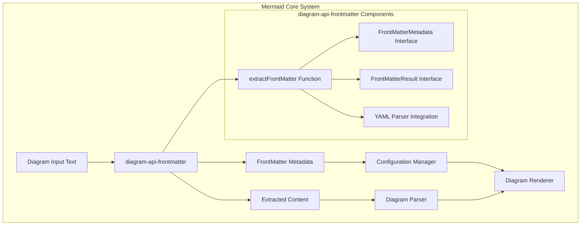
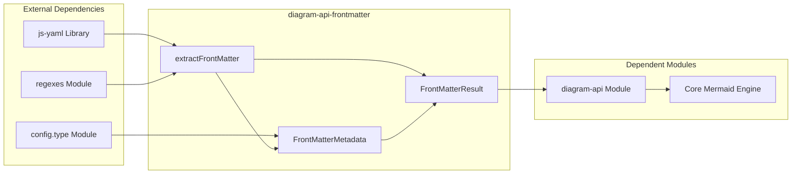
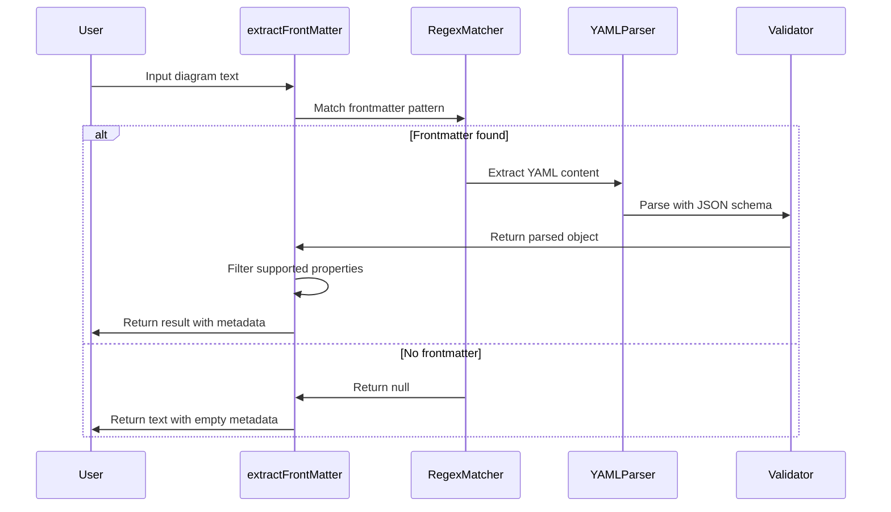
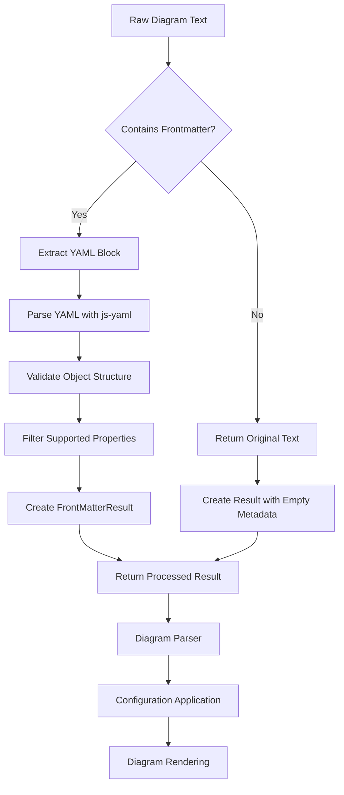
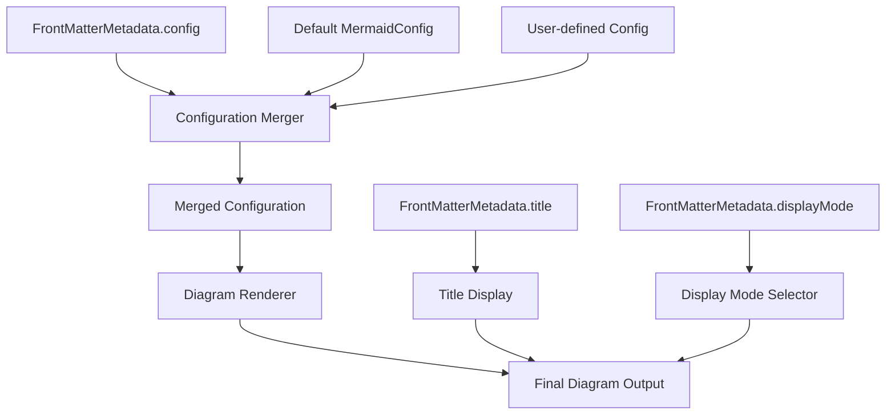
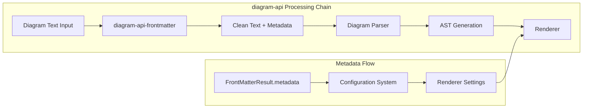
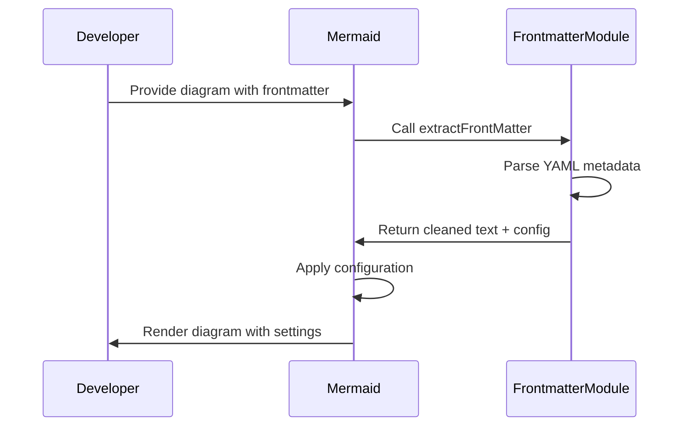

# diagram-api-frontmatter Module Documentation

## Introduction

The `diagram-api-frontmatter` module is a specialized component within the Mermaid diagramming library that handles YAML frontmatter parsing and extraction from diagram definitions. This module provides the functionality to parse metadata embedded at the beginning of Mermaid diagrams, allowing users to specify configuration options, titles, and display modes that affect how diagrams are rendered.

Frontmatter is a common pattern in markup languages where metadata is placed at the beginning of a document, typically separated from the main content by delimiters. In Mermaid, this allows users to configure diagram behavior and appearance without modifying the core diagram syntax.

## Architecture Overview

### Module Position in System Architecture

The `diagram-api-frontmatter` module sits at the intersection of diagram parsing and configuration management within the Mermaid ecosystem. It acts as a preprocessing layer that extracts metadata before the main diagram content is parsed and rendered.



### Component Relationships



## Core Components

### FrontMatterMetadata Interface

The `FrontMatterMetadata` interface defines the structure of metadata that can be extracted from YAML frontmatter in Mermaid diagrams.

```typescript
interface FrontMatterMetadata {
  title?: string;
  displayMode?: GanttDiagramConfig['displayMode'];
  config?: MermaidConfig;
}
```

**Properties:**
- `title` (optional): A string that specifies the diagram title
- `displayMode` (optional): Controls display modes, currently used for compact mode in Gantt charts
- `config` (optional): Contains [MermaidConfig](config.md) settings that override default configuration

### FrontMatterResult Interface

The `FrontMatterResult` interface represents the output of the frontmatter extraction process.

```typescript
interface FrontMatterResult {
  text: string;
  metadata: FrontMatterMetadata;
}
```

**Properties:**
- `text`: The diagram content with frontmatter removed
- `metadata`: Parsed frontmatter data following the `FrontMatterMetadata` structure

### extractFrontMatter Function

The core function that processes diagram text to extract and parse YAML frontmatter.

```typescript
export function extractFrontMatter(text: string): FrontMatterResult
```

**Parameters:**
- `text`: The complete diagram text that may contain YAML frontmatter

**Returns:**
- `FrontMatterResult`: Object containing the cleaned text and parsed metadata

**Process Flow:**



## Data Flow

### Frontmatter Processing Pipeline



### Configuration Integration

The extracted frontmatter metadata integrates with the broader configuration system:



## Integration Points

### Relationship with diagram-api Module

The `diagram-api-frontmatter` module is tightly integrated with the [diagram-api](diagram-api.md) module, which uses the frontmatter extraction as a preprocessing step before diagram parsing.



### Configuration System Integration

The module interfaces with the [config](config.md) module to provide type-safe configuration options:

- `MermaidConfig`: Base configuration interface for all Mermaid settings
- `GanttDiagramConfig`: Specific configuration for Gantt chart display modes
- Type safety ensures only valid configuration options are accepted

## Usage Patterns

### Basic Frontmatter Structure

```yaml
---
title: My Diagram Title
config:
  theme: dark
  fontFamily: Arial
displayMode: compact
---
graph TD
    A[Start] --> B[End]
```

### Processing Example



## Error Handling and Validation

### YAML Parsing Safety

The module implements several safety measures:

1. **Schema Validation**: Uses JSON_SCHEMA to ensure predictable parsing
2. **Type Checking**: Validates that parsed data is an object (not array or primitive)
3. **Property Filtering**: Only extracts explicitly supported properties
4. **Graceful Degradation**: Returns empty metadata if parsing fails

### Runtime Type Safety

```typescript
// Ensure parsed data is a valid object
parsed = typeof parsed === 'object' && !Array.isArray(parsed) ? parsed : {};

// Only add properties that are explicitly supported
if (parsed.displayMode) {
  metadata.displayMode = parsed.displayMode.toString() as GanttDiagramConfig['displayMode'];
}
```

## Dependencies

### External Libraries

- **js-yaml**: YAML parsing library for extracting metadata from frontmatter blocks
- Uses JSON_SCHEMA for predictable parsing behavior

### Internal Dependencies

- **config.type**: Provides type definitions for configuration objects
- **regexes**: Contains the `frontMatterRegex` pattern for identifying frontmatter blocks

### Dependent Modules

- **diagram-api**: Uses frontmatter extraction for preprocessing diagram text
- **Core Mermaid Engine**: Integrates frontmatter metadata into the rendering pipeline

## Extension Points

### Adding New Metadata Properties

To extend the frontmatter capabilities:

1. Update the `FrontMatterMetadata` interface with new optional properties
2. Add validation logic in the `extractFrontMatter` function
3. Ensure new properties integrate with relevant configuration systems

### Custom YAML Schemas

The module can be extended to support custom YAML schemas beyond JSON_SCHEMA for specialized use cases.

## Best Practices

### For Developers

1. **Always validate** frontmatter structure before using metadata
2. **Use type guards** when accessing optional properties
3. **Document supported** frontmatter options for your diagrams
4. **Handle gracefully** when frontmatter is missing or invalid

### For Users

1. **Keep frontmatter minimal** - only include necessary configuration
2. **Use consistent formatting** for better maintainability
3. **Test configurations** across different diagram types
4. **Document custom settings** for team collaboration

## Performance Considerations

The frontmatter extraction process is designed to be lightweight:

- **Regex matching** is fast and only processes the beginning of the text
- **YAML parsing** only occurs when frontmatter is detected
- **Property filtering** prevents unnecessary data processing
- **Early returns** minimize processing for diagrams without frontmatter

This ensures minimal impact on diagram rendering performance, especially for large diagrams or batch processing scenarios.