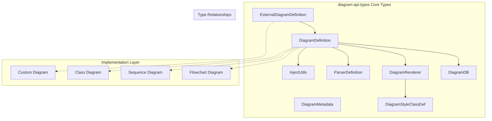
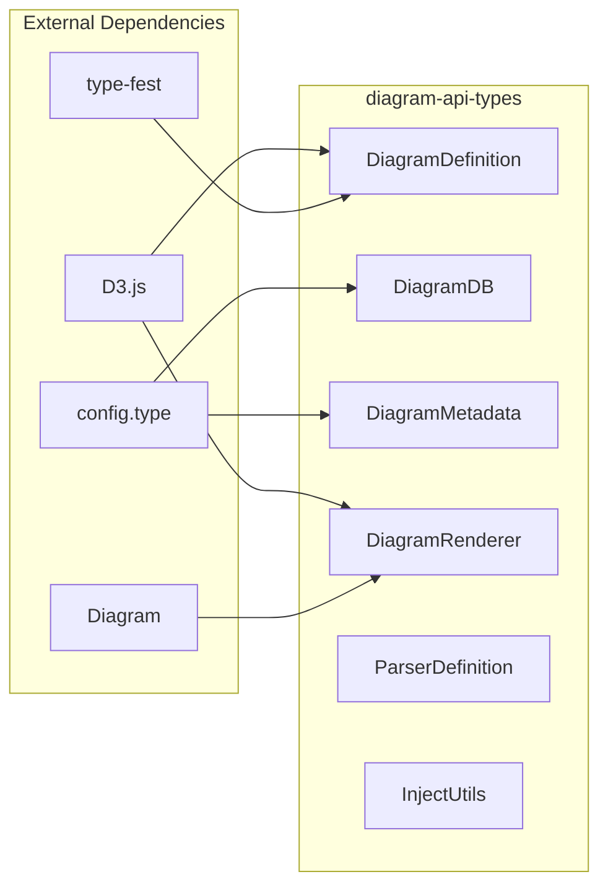
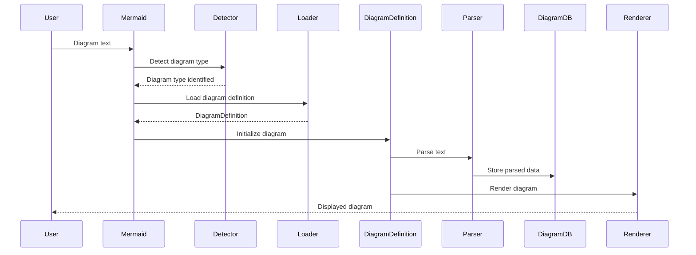
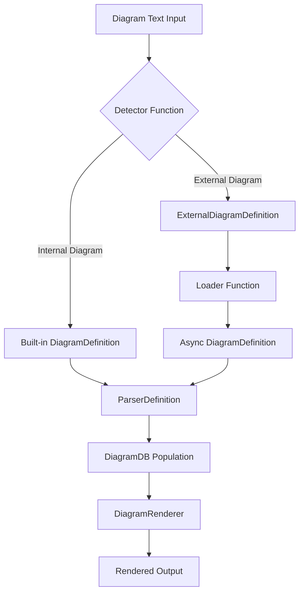

# diagram-api-types Module Documentation

## Overview

The `diagram-api-types` module serves as the foundational type system for Mermaid's diagram architecture. It defines the core interfaces and type definitions that enable the creation, registration, and rendering of various diagram types within the Mermaid ecosystem. This module establishes the contract between different diagram implementations and the core Mermaid engine, ensuring consistency and extensibility across all supported diagram types.

## Purpose and Core Functionality

The primary purpose of this module is to provide a standardized type system that:

1. **Defines the structure** for diagram definitions, ensuring all diagram types conform to a common interface
2. **Establishes the contract** between diagram parsers, databases, and renderers
3. **Enables extensibility** by providing types for external diagram definitions
4. **Standardizes utility injection** for cross-cutting concerns like logging and configuration
5. **Provides type safety** throughout the diagram lifecycle from parsing to rendering

## Architecture

### Core Type System Architecture



### Component Dependencies



## Core Components

### DiagramDefinition

The central interface that defines the structure of any diagram implementation. It serves as the contract that all diagram types must fulfill to be compatible with the Mermaid system.

**Key Properties:**
- `db`: Database interface for managing diagram data
- `renderer`: Rendering engine for drawing the diagram
- `parser`: Text parsing logic for diagram syntax
- `styles`: Optional styling information
- `init`: Initialization function for diagram setup
- `injectUtils`: Utility injection for cross-cutting concerns

### DiagramDB

Provides the database interface for diagram data management. The generic `DiagramDB` interface offers optional methods, while `DiagramDBBase<T>` enforces required methods for new diagram implementations.

**Core Methods:**
- Configuration management (`getConfig`)
- Data clearing (`clear`)
- Title and accessibility management
- Display mode settings
- Function binding for interactivity

### DiagramRenderer

Defines the rendering contract for drawing diagrams. Each diagram type implements this interface to provide its specific rendering logic.

**Key Methods:**
- `draw`: Main drawing function that renders the diagram
- `getClasses`: Optional method for retrieving style class definitions

### ParserDefinition

Standardizes the parsing interface for diagram text input. Ensures consistent parsing behavior across all diagram types.

**Core Methods:**
- `parse`: Main parsing function for diagram text
- `parser`: Optional parser object with database reference

### ExternalDiagramDefinition

Enables the registration of external diagram types that are not built into the core Mermaid library. This facilitates plugin architecture and custom diagram development.

**Components:**
- `id`: Unique identifier for the diagram type
- `detector`: Function to identify diagram type from text
- `loader`: Asynchronous loader for diagram definition

### InjectUtils

Provides a standardized way to inject utility functions into diagram implementations. This ensures consistent behavior for logging, configuration, text sanitization, and other cross-cutting concerns.

**Utility Functions:**
- Logging and log level management
- Configuration retrieval
- Text sanitization
- Graph viewbox setup
- Common database operations
- Directive parsing (deprecated)

## Data Flow

### Diagram Registration and Rendering Flow



### Type Instantiation Flow



## Integration with Mermaid Ecosystem

### Relationship with Core Mermaid

The diagram-api-types module serves as the type foundation for the [core-mermaid](core-mermaid.md) module. The `Mermaid` class in core-mermaid uses these types to manage diagram registration, parsing, and rendering processes.

### Configuration Integration

Diagram types defined using these interfaces integrate with the [config](config.md) module's type system. The `MermaidConfig` and specific diagram configuration types (like `FlowchartDiagramConfig`) work in conjunction with the `DiagramDB` interface to provide type-safe configuration management.

### Rendering Pipeline Integration

The `DiagramRenderer` interface defined in this module connects with the [rendering-util](rendering-util.md) module's rendering infrastructure. The `DrawDefinition` type ensures consistent signature across all diagram rendering functions.

### Parser Integration

The `ParserDefinition` interface works with the [parser-common](parser-common.md) module to provide consistent parsing behavior. The `DiagramDB` interface serves as the bridge between parsing results and diagram data storage.

## Usage Examples

### Basic Diagram Definition Structure

```typescript
const myDiagram: DiagramDefinition = {
  db: myDiagramDB,
  renderer: myDiagramRenderer,
  parser: myDiagramParser,
  styles: myDiagramStyles,
  init: (config: MermaidConfig) => {
    // Initialize diagram with config
  },
  injectUtils: (log, setLogLevel, getConfig, sanitizeText, setupGraphViewbox, commonDb, parseDirective) => {
    // Inject utility functions
  }
};
```

### External Diagram Registration

```typescript
const externalDiagram: ExternalDiagramDefinition = {
  id: 'customDiagram',
  detector: (text: string, config?: MermaidConfig) => {
    return text.startsWith('customDiagram');
  },
  loader: async () => {
    const diagram = await import('./custom-diagram');
    return { id: 'customDiagram', diagram: diagram.default };
  }
};
```

## Extension Points

### Custom Diagram Types

Developers can create new diagram types by implementing the `DiagramDefinition` interface. This involves:

1. Implementing `DiagramDB` for data management
2. Creating a `ParserDefinition` for syntax parsing
3. Developing a `DiagramRenderer` for visual output
4. Optionally providing styling and initialization logic

### External Diagram Plugins

The `ExternalDiagramDefinition` interface enables plugin architecture, allowing third-party developers to create diagram types that can be dynamically loaded into Mermaid applications.

### Utility Injection

The `InjectUtils` interface provides hooks for customizing utility behavior, enabling advanced scenarios like custom logging, configuration management, or text processing.

## Best Practices

### Type Safety

Always use the strongly-typed `DiagramDBBase<T>` interface for new diagram implementations to ensure all required methods are implemented.

### Error Handling

Implement proper error handling in parser and renderer methods, as these are called during the critical path of diagram processing.

### Performance

Consider the asynchronous nature of external diagram loading and implement appropriate caching strategies for frequently used diagram types.

### Accessibility

Ensure all diagram implementations properly implement accessibility methods (`getAccTitle`, `getAccDescription`) for inclusive user experiences.

## Related Documentation

- [core-mermaid](core-mermaid.md) - Core Mermaid engine that uses these types
- [config](config.md) - Configuration system that integrates with diagram types
- [rendering-util](rendering-util.md) - Rendering infrastructure that works with DiagramRenderer
- [parser-common](parser-common.md) - Parser system that integrates with ParserDefinition
- [diagram-api](diagram-api.md) - Parent module containing additional diagram API components